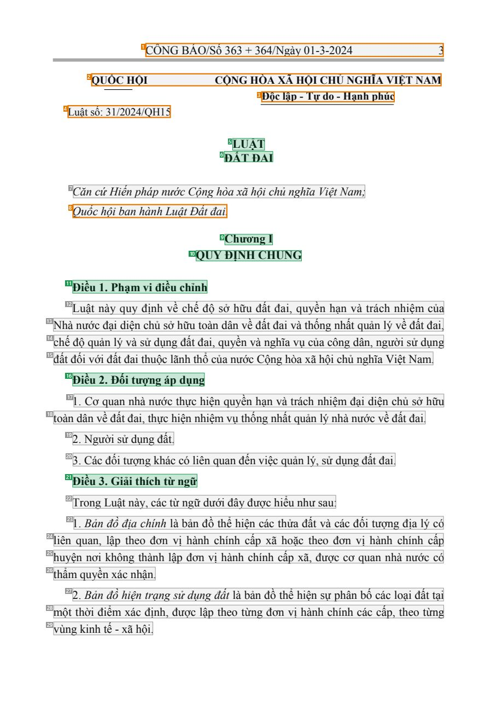
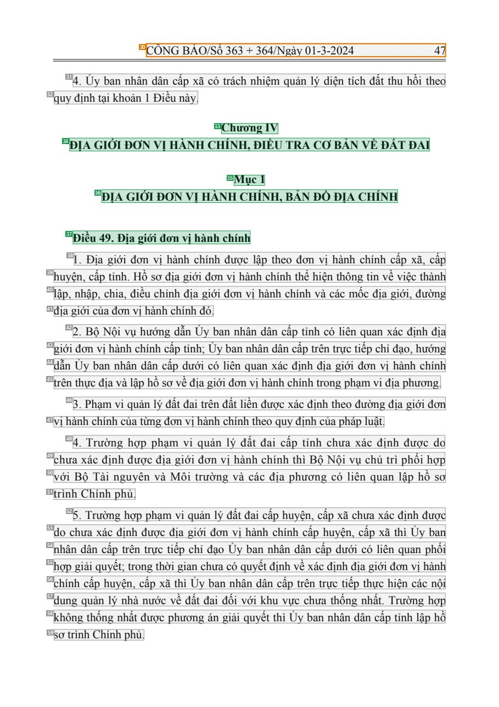
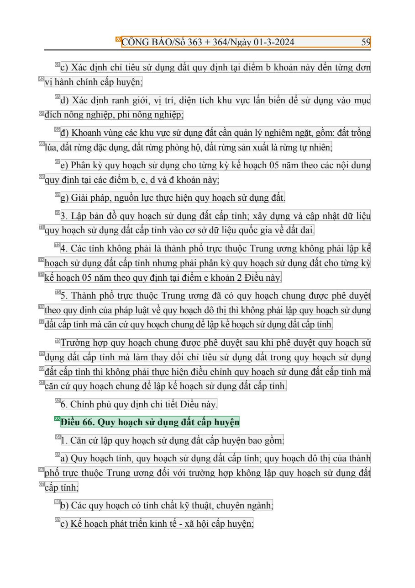

# 006 — `todo10_8/heading_corpus_100/01_phap_quy/006_Luat_Dat_dai_31-2024-QH15.pdf`

Draft status: `DRAFT_REVIEWER_A_NOT_APPROVED`. Source sha256 `2558044082ee768192a311aee548eb9fae4daada546013aa5181eb91c8842637`. [Back to index](README.md)

## Page 1 (FIRST)

| # | alias | text | font | draft | flag | rationale |
|---:|---|---|---|---|---|---|
| 1 | L0000:S0 | C&#212;NG B&#193;O/Số 363 + 364/Ng&#224;y 01-3-2024 3 | 14 | **OTHER** | REVIEW_FOCUS | Official Gazette running header &quot;C&#212;NG B&#193;O/Số .../Ng&#224;y ... 3&quot; (page furniture) |
| 2 | L0001:S0 | QUỐC HỘI CỘNG H&#210;A X&#195; HỘI CHỦ NGHĨA VIỆT NAM | 13 B | **OTHER** | REVIEW_FOCUS | Issuer QUỐC HỘI merged with national name; letterhead |
| 3 | L0002:S0 | Độc lập - Tự do - Hạnh ph&#250;c | 13 B | **OTHER** | REVIEW_FOCUS | National motto |
| 4 | L0003:S0 | Luật số: 3 1/2024/QH15 | 13 | **OTHER** | REVIEW_FOCUS | Law number |
| 5 | L0004:S0 | LUẬT | 14 B | **ESTABLISHES** |  | Document type title LUẬT (bold 14, centred) |
| 6 | L0005:S0 | ĐẤT ĐAI | 14 B | **ESTABLISHES** |  | Document title ĐẤT ĐAI (bold 14, centred under LUẬT) |
| 7 | L0006:S0 | Căn cứHiến ph&#225;p nước Cộng h&#242;a x&#227; hội chủ nghĩa Việt Nam; | 14 I | **OTHER** |  | Default: body text, list item, table cell, page number or other non-heading content on this page |
| 8 | L0007:S0 | Quốc hội ban h&#224;nh Luật Đất đai. | 14 I | **OTHER** | REVIEW_FOCUS | Enactment formula &quot;Quốc hội ban h&#224;nh Luật Đất đai.&quot; (prose, not a heading) |
| 9 | L0008:S0 | Chương I | 14 B | **ESTABLISHES** |  | Chapter label &quot;Chương I&quot; |
| 10 | L0009:S0 | QUY ĐỊNH CHUNG | 14 B | **ESTABLISHES** |  | Chapter title QUY ĐỊNH CHUNG |
| 11 | L0010:S0 | Điều 1. Phạm vi điều chỉnh | 14 B | **ESTABLISHES** |  | Article heading &quot;Điều 1. Phạm vi điều chỉnh&quot; (bold) |
| 12 | L0011:S0 | Luật n&#224;y quy định về chế độ sở hữu đất đai, quyền hạn v&#224; tr&#225;ch nhiệm của | 14 | **OTHER** |  | Default: body text, list item, table cell, page number or other non-heading content on this page |
| 13 | L0012:S0 | Nh&#224; nước đại diện chủ sở hữu to&#224;n d&#226;n về đất đai v&#224; thống nhất quản l&#253; về đất đai, | 14 | **OTHER** |  | Default: body text, list item, table cell, page number or other non-heading content on this page |
| 14 | L0013:S0 | chế độ quản l&#253; v&#224; sử dụng đất đai, quyền v&#224; nghĩa vụ của c&#244;ng d&#226;n, người sử dụng | 14 | **OTHER** |  | Default: body text, list item, table cell, page number or other non-heading content on this page |
| 15 | L0014:S0 | đất đối với đất đai thuộc l&#227;nh thổ của nước Cộng h&#242;a x&#227; hội chủ nghĩa Việt Nam. | 14 | **OTHER** |  | Default: body text, list item, table cell, page number or other non-heading content on this page |
| 16 | L0015:S0 | Điều 2. Đối tượng &#225;p dụng | 14 B | **ESTABLISHES** |  | Article heading &quot;Điều 2. Đối tượng &#225;p dụng&quot; |
| 17 | L0016:S0 | 1 . Cơ quan nh&#224; nước thực hiện quyền hạn v&#224; tr&#225;ch nhiệm đại diện chủ sở hữu | 14 | **OTHER** |  | Default: body text, list item, table cell, page number or other non-heading content on this page |
| 18 | L0017:S0 | to&#224;n d&#226;n về đất đai, thực hiện nhiệm vụ thống nhất quản l&#253; nh&#224; nước về đất đai. | 14 | **OTHER** |  | Default: body text, list item, table cell, page number or other non-heading content on this page |
| 19 | L0018:S0 | 2. Người sử dụng đất. | 14 | **OTHER** |  | Default: body text, list item, table cell, page number or other non-heading content on this page |
| 20 | L0019:S0 | 3. C&#225;c đối tượng kh&#225;c c&#243; li&#234;n quan đến việc quản l&#253;, sử dụng đất đai. | 14 | **OTHER** |  | Default: body text, list item, table cell, page number or other non-heading content on this page |
| 21 | L0020:S0 | Điều 3. Giải th&#237;ch từ ngữ | 14 B | **ESTABLISHES** |  | Article heading &quot;Điều 3. Giải th&#237;ch từ ngữ&quot; |
| 22 | L0021:S0 | Trong Luật n&#224;y, c&#225;c từ ngữ dưới đ&#226;y được hiểu như sau: | 14 | **OTHER** |  | Default: body text, list item, table cell, page number or other non-heading content on this page |
| 23 | L0022:S0 | 1 . Bản đồ địa ch&#237;nh l&#224; bản đồ thể hiện c&#225;c thửa đất v&#224; c&#225;c đối tượng địa l&#253; c&#243; | 14 | **OTHER** |  | Default: body text, list item, table cell, page number or other non-heading content on this page |
| 24 | L0023:S0 | li&#234;n quan, lập theo đơn vị h&#224;nh ch&#237;nh cấp x&#227; hoặc theo đơn vị h&#224;nh ch&#237;nh cấp | 14 | **OTHER** |  | Default: body text, list item, table cell, page number or other non-heading content on this page |
| 25 | L0024:S0 | huyện nơi kh&#244;ng th&#224;nh lập đơn vị h&#224;nh ch&#237;nh cấp x&#227;, được cơ quan nh&#224; nước c&#243; | 14 | **OTHER** |  | Default: body text, list item, table cell, page number or other non-heading content on this page |
| 26 | L0025:S0 | thẩm quyền x&#225;c nhận. | 14 | **OTHER** |  | Default: body text, list item, table cell, page number or other non-heading content on this page |
| 27 | L0026:S0 | 2. Bản đồ hiện trạng sử dụng đất l&#224; bản đồ thể hiện sự ph&#226;n bố c&#225;c loại đất tại | 14 | **OTHER** |  | Default: body text, list item, table cell, page number or other non-heading content on this page |
| 28 | L0027:S0 | một thời điểm x&#225;c định, được lập theo từng đơn vị h&#224;nh ch&#237;nh c&#225;c cấp, theo từng | 14 | **OTHER** |  | Default: body text, list item, table cell, page number or other non-heading content on this page |
| 29 | L0028:S0 | v&#249;ng kinh tế - x&#227; hội. | 14 | **OTHER** |  | Default: body text, list item, table cell, page number or other non-heading content on this page |

## Page 45 (SEEDED_INTERIOR)

| # | alias | text | font | draft | flag | rationale |
|---:|---|---|---|---|---|---|
| 30 | L1353:S0 | C&#212;NG B&#193;O/Số 363 + 364/Ng&#224;y 01-3-2024 47 | 14 | **OTHER** | REVIEW_FOCUS | Official Gazette running header (page furniture) |
| 31 | L1354:S0 | 4. Ủy ban nh&#226;n d&#226;n cấp x&#227; c&#243; tr&#225;ch nhiệm quản l&#253; diện t&#237;ch đất thu hồi theo | 14 | **OTHER** |  | Default: body text, list item, table cell, page number or other non-heading content on this page |
| 32 | L1355:S0 | quy định tại khoản 1 Điều n&#224;y. | 14 | **OTHER** |  | Default: body text, list item, table cell, page number or other non-heading content on this page |
| 33 | L1356:S0 | Chương IV | 14 B | **ESTABLISHES** |  | Chapter label &quot;Chương IV&quot; |
| 34 | L1357:S0 | ĐỊA GIỚI ĐƠN VỊ H&#192;NH CH&#205;NH, ĐIỀU TRA CƠ BẢN VỀ ĐẤT ĐAI | 14 B | **ESTABLISHES** |  | Chapter title (bold caps) |
| 35 | L1358:S0 | Mục 1 | 14 B | **ESTABLISHES** |  | Section label &quot;Mục 1&quot; |
| 36 | L1359:S0 | ĐỊA GIỚI ĐƠN VỊ H&#192;NH CH&#205;NH, BẢN ĐỒ ĐỊA CH&#205;NH | 14 B | **ESTABLISHES** |  | Section title (bold caps) |
| 37 | L1360:S0 | Điều 49. Địa giới đơn vị h&#224;nh ch&#237;nh | 14 B | **ESTABLISHES** |  | Article heading &quot;Điều 49. Địa giới đơn vị h&#224;nh ch&#237;nh&quot; |
| 38 | L1361:S0 | 1 . Địa giới đơn vị h&#224;nh ch&#237;nh được lập theo đơn vị h&#224;nh ch&#237;nh cấp x&#227;, cấp | 14 | **OTHER** |  | Default: body text, list item, table cell, page number or other non-heading content on this page |
| 39 | L1362:S0 | huyện, cấp tỉnh. Hồ sơ địa giới đơn vị h&#224;nh ch&#237;nh thể hiện th&#244;ng tin về việc th&#224;nh | 14 | **OTHER** |  | Default: body text, list item, table cell, page number or other non-heading content on this page |
| 40 | L1363:S0 | lập, nhập, chia, điều chỉnh địa giới đơn vị h&#224;nh ch&#237;nh v&#224; c&#225;c mốc địa giới, đường | 14 | **OTHER** |  | Default: body text, list item, table cell, page number or other non-heading content on this page |
| 41 | L1364:S0 | địa giới của đơn vị h&#224;nh ch&#237;nh đ&#243;. | 14 | **OTHER** |  | Default: body text, list item, table cell, page number or other non-heading content on this page |
| 42 | L1365:S0 | 2. Bộ Nội vụ hướng dẫn Ủy ban nh&#226;n d&#226;n cấp tỉnh c&#243; li&#234;n quan x&#225;c định địa | 14 | **OTHER** |  | Default: body text, list item, table cell, page number or other non-heading content on this page |
| 43 | L1366:S0 | giới đơn vị h&#224;nh ch&#237;nh cấp tỉnh; Ủy ban nh&#226;n d&#226;n cấp tr&#234;n trực tiếp chỉ đạo, hướng | 14 | **OTHER** |  | Default: body text, list item, table cell, page number or other non-heading content on this page |
| 44 | L1367:S0 | dẫn Ủy ban nh&#226;n d&#226;n cấp dưới c&#243; li&#234;n quan x&#225;c định địa giới đơn vị h&#224;nh ch&#237;nh | 14 | **OTHER** |  | Default: body text, list item, table cell, page number or other non-heading content on this page |
| 45 | L1368:S0 | tr&#234;n thực địa v&#224; lập hồ sơ về địa giới đơn vị h&#224;nh ch&#237;nh trong phạm vi địa phương. | 14 | **OTHER** |  | Default: body text, list item, table cell, page number or other non-heading content on this page |
| 46 | L1369:S0 | 3. Phạm vi quản l&#253; đất đai tr&#234;n đất liền được x&#225;c định theo đường địa giới đơn | 14 | **OTHER** |  | Default: body text, list item, table cell, page number or other non-heading content on this page |
| 47 | L1370:S0 | vị h&#224;nh ch&#237;nh của từng đơn vị h&#224;nh ch&#237;nh theo quy định của ph&#225;p luật. | 14 | **OTHER** |  | Default: body text, list item, table cell, page number or other non-heading content on this page |
| 48 | L1371:S0 | 4. Trường hợp phạm vi quản l&#253; đất đai cấp tỉnh chưa x&#225;c định được do | 14 | **OTHER** |  | Default: body text, list item, table cell, page number or other non-heading content on this page |
| 49 | L1372:S0 | chưa x&#225;c định được địa giới đơn vị h&#224;nh ch&#237;nh th&#236; Bộ Nội vụ chủ tr&#236; phối hợp | 14 | **OTHER** |  | Default: body text, list item, table cell, page number or other non-heading content on this page |
| 50 | L1373:S0 | với Bộ T&#224;i nguy&#234;n v&#224; M&#244;i trường v&#224; c&#225;c địa phương c&#243; li&#234;n quan lập hồ sơ | 14 | **OTHER** |  | Default: body text, list item, table cell, page number or other non-heading content on this page |
| 51 | L1374:S0 | tr&#236;nh Ch&#237;nh phủ. | 14 | **OTHER** |  | Default: body text, list item, table cell, page number or other non-heading content on this page |
| 52 | L1375:S0 | 5. Trường hợp phạm vi quản l&#253; đất đai cấp huyện, cấp x&#227; chưa x&#225;c định được | 14 | **OTHER** |  | Default: body text, list item, table cell, page number or other non-heading content on this page |
| 53 | L1376:S0 | do chưa x&#225;c định được địa giới đơn vị h&#224;nh ch&#237;nh cấp huyện, cấp x&#227; th&#236; Ủy ban | 14 | **OTHER** |  | Default: body text, list item, table cell, page number or other non-heading content on this page |
| 54 | L1377:S0 | nh&#226;n d&#226;n cấp tr&#234;n trực tiếp chỉ đạo Ủy ban nh&#226;n d&#226;n cấp dưới c&#243; li&#234;n quan phối | 14 | **OTHER** |  | Default: body text, list item, table cell, page number or other non-heading content on this page |
| 55 | L1378:S0 | hợp giải quyết; trong thời gian chưa c&#243; quyết định về x&#225;c định địa giới đơn vị h&#224;nh | 14 | **OTHER** |  | Default: body text, list item, table cell, page number or other non-heading content on this page |
| 56 | L1379:S0 | ch&#237;nh cấp huyện, cấp x&#227; th&#236; Ủy ban nh&#226;n d&#226;n cấp tr&#234;n trực tiếp thực hiện c&#225;c nội | 14 | **OTHER** |  | Default: body text, list item, table cell, page number or other non-heading content on this page |
| 57 | L1380:S0 | dung quản l&#253; nh&#224; nước về đất đai đối với khu vực chưa thống nhất. Trường hợp | 14 | **OTHER** |  | Default: body text, list item, table cell, page number or other non-heading content on this page |
| 58 | L1381:S0 | kh&#244;ng thống nhất được phương &#225;n giải quyết th&#236; Ủy ban nh&#226;n d&#226;n cấp tỉnh lập hồ | 14 | **OTHER** |  | Default: body text, list item, table cell, page number or other non-heading content on this page |
| 59 | L1382:S0 | sơ tr&#236;nh Ch&#237;nh phủ. | 14 | **OTHER** |  | Default: body text, list item, table cell, page number or other non-heading content on this page |

## Page 57 (SEEDED_INTERIOR)

| # | alias | text | font | draft | flag | rationale |
|---:|---|---|---|---|---|---|
| 60 | L1714:S0 | C&#212;NG B&#193;O/Số 363 + 364/Ng&#224;y 01-3-2024 59 | 14 | **OTHER** | REVIEW_FOCUS | Official Gazette running header (page furniture) |
| 61 | L1715:S0 | c) X&#225;c định chỉ ti&#234;u sử dụng đất quy định tại điểm b khoản n&#224;y đến từng đơn | 14 | **OTHER** |  | Default: body text, list item, table cell, page number or other non-heading content on this page |
| 62 | L1716:S0 | vị h&#224;nh ch&#237;nh cấp huyện; | 14 | **OTHER** |  | Default: body text, list item, table cell, page number or other non-heading content on this page |
| 63 | L1717:S0 | d) X&#225;c định ranh giới, vị tr&#237;, diện t&#237;ch khu vực lấn biển để sử dụng v&#224;o mục | 14 | **OTHER** |  | Default: body text, list item, table cell, page number or other non-heading content on this page |
| 64 | L1718:S0 | đ&#237;ch n&#244;ng nghiệp, phi n&#244;ng nghiệp; | 14 | **OTHER** |  | Default: body text, list item, table cell, page number or other non-heading content on this page |
| 65 | L1719:S0 | đ) Khoanh v&#249;ng c&#225;c khu vực sử dụng đất cần quản l&#253;nghi&#234;m ngặt, gồm: đất trồng | 14 | **OTHER** |  | Default: body text, list item, table cell, page number or other non-heading content on this page |
| 66 | L1720:S0 | l&#250;a, đất rừng đặc dụng, đất rừng ph&#242;ng hộ, đất rừng sản xuất l&#224; rừng tự nhi&#234;n; | 14 | **OTHER** |  | Default: body text, list item, table cell, page number or other non-heading content on this page |
| 67 | L1721:S0 | e) Ph&#226;n kỳ quy hoạch sử dụng cho từng kỳ kế hoạch 05 năm theo c&#225;c nội dung | 14 | **OTHER** |  | Default: body text, list item, table cell, page number or other non-heading content on this page |
| 68 | L1722:S0 | quy định tại c&#225;c điểm b, c, d v&#224; đ khoản n&#224;y; | 14 | **OTHER** |  | Default: body text, list item, table cell, page number or other non-heading content on this page |
| 69 | L1723:S0 | g) Giải ph&#225;p, nguồn lực thực hiện quy hoạch sử dụng đất. | 14 | **OTHER** |  | Default: body text, list item, table cell, page number or other non-heading content on this page |
| 70 | L1724:S0 | 3. Lập bản đồ quy hoạch sử dụng đất cấp tỉnh; x&#226;y dựng v&#224; cập nhật dữ liệu | 14 | **OTHER** |  | Default: body text, list item, table cell, page number or other non-heading content on this page |
| 71 | L1725:S0 | quy hoạch sử dụng đất cấp tỉnh v&#224;o cơ sở dữ liệu quốc gia về đất đai. | 14 | **OTHER** |  | Default: body text, list item, table cell, page number or other non-heading content on this page |
| 72 | L1726:S0 | 4. C&#225;c tỉnh kh&#244;ng phải l&#224; th&#224;nh phố trực thuộc Trung ương kh&#244;ng phải lập kế | 14 | **OTHER** |  | Default: body text, list item, table cell, page number or other non-heading content on this page |
| 73 | L1727:S0 | hoạch sử dụng đất cấp tỉnh nhưng phải ph&#226;n kỳ quy hoạch sử dụng đất cho từng kỳ | 14 | **OTHER** |  | Default: body text, list item, table cell, page number or other non-heading content on this page |
| 74 | L1728:S0 | kế hoạch 05 năm theo quy định tại điểm e khoản 2 Điều n&#224;y. | 14 | **OTHER** |  | Default: body text, list item, table cell, page number or other non-heading content on this page |
| 75 | L1729:S0 | 5. Th&#224;nh phố trực thuộc Trung ương đ&#227; c&#243; quy hoạch chung được ph&#234; duyệt | 14 | **OTHER** |  | Default: body text, list item, table cell, page number or other non-heading content on this page |
| 76 | L1730:S0 | theo quy định của ph&#225;p luật về quy hoạch đ&#244; thị th&#236; kh&#244;ng phải lập quy hoạch sử dụng | 14 | **OTHER** |  | Default: body text, list item, table cell, page number or other non-heading content on this page |
| 77 | L1731:S0 | đất cấp tỉnh m&#224; căn cứ quy hoạch chung để lập kếhoạch sử dụng đất cấp tỉnh. | 14 | **OTHER** |  | Default: body text, list item, table cell, page number or other non-heading content on this page |
| 78 | L1732:S0 | Trường hợp quy hoạch chung được ph&#234; duyệt sau khi ph&#234; duyệt quy hoạch sử | 14 | **OTHER** |  | Default: body text, list item, table cell, page number or other non-heading content on this page |
| 79 | L1733:S0 | dụng đất cấp tỉnh m&#224; l&#224;m thay đổi chỉ ti&#234;u sử dụng đất trong quy hoạch sử dụng | 14 | **OTHER** |  | Default: body text, list item, table cell, page number or other non-heading content on this page |
| 80 | L1734:S0 | đất cấp tỉnh th&#236; kh&#244;ng phải thực hiện điều chỉnh quy hoạch sử dụng đất cấp tỉnh m&#224; | 14 | **OTHER** |  | Default: body text, list item, table cell, page number or other non-heading content on this page |
| 81 | L1735:S0 | căn cứ quy hoạch chung để lập kế hoạch sử dụng đất cấp tỉnh. | 14 | **OTHER** |  | Default: body text, list item, table cell, page number or other non-heading content on this page |
| 82 | L1736:S0 | 6. Ch&#237;nh phủ quy định chi tiết Điều n&#224;y. | 14 | **OTHER** |  | Default: body text, list item, table cell, page number or other non-heading content on this page |
| 83 | L1737:S0 | Điều 66. Quy hoạch sử dụng đất cấp huyện | 14 B | **ESTABLISHES** |  | Article heading &quot;Điều 66. Quy hoạch sử dụng đất cấp huyện&quot; |
| 84 | L1738:S0 | 1 . Căn cứ lập quy hoạch sử dụng đất cấp huyện bao gồm: | 14 | **OTHER** |  | Default: body text, list item, table cell, page number or other non-heading content on this page |
| 85 | L1739:S0 | a) Quy hoạch tỉnh, quy hoạch sử dụng đất cấp tỉnh; quy hoạch đ&#244; thị của th&#224;nh | 14 | **OTHER** |  | Default: body text, list item, table cell, page number or other non-heading content on this page |
| 86 | L1740:S0 | phố trực thuộc Trung ương đối với trường hợp kh&#244;ng lập quy hoạch sử dụng đất | 14 | **OTHER** |  | Default: body text, list item, table cell, page number or other non-heading content on this page |
| 87 | L1741:S0 | cấp tỉnh; | 14 | **OTHER** |  | Default: body text, list item, table cell, page number or other non-heading content on this page |
| 88 | L1742:S0 | b) C&#225;c quy hoạch c&#243; t&#237;nh chất kỹ thuật, chuy&#234;n ng&#224;nh; | 14 | **OTHER** |  | Default: body text, list item, table cell, page number or other non-heading content on this page |
| 89 | L1743:S0 | c) Kế hoạch ph&#225;t triển kinh tế - x&#227; hội cấp huyện; | 14 | **OTHER** |  | Default: body text, list item, table cell, page number or other non-heading content on this page |
