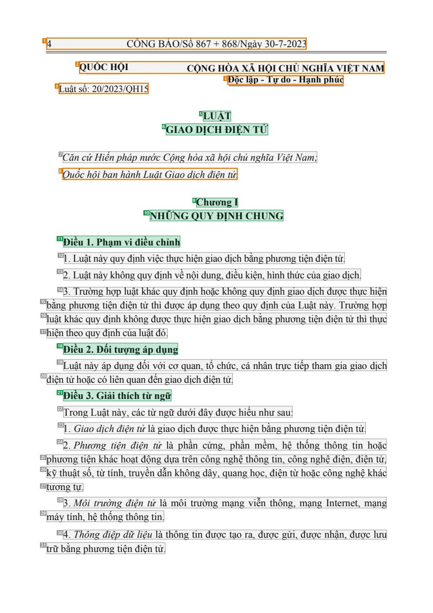
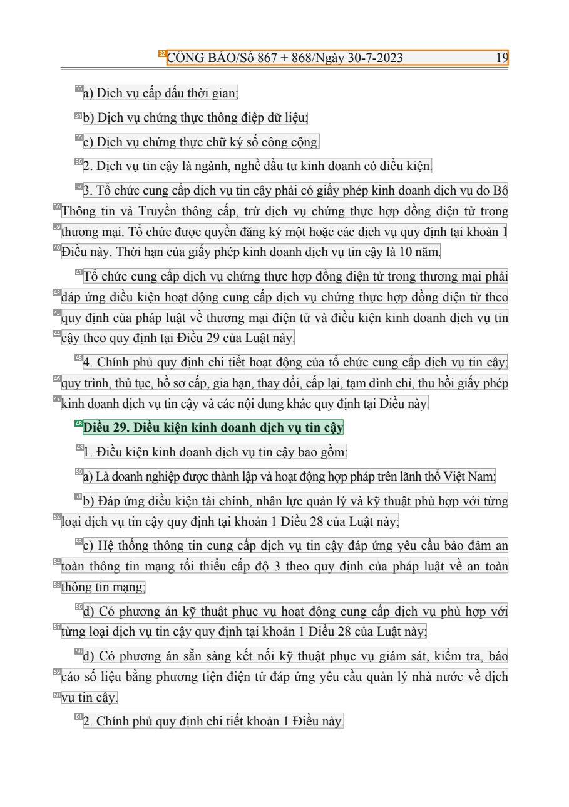
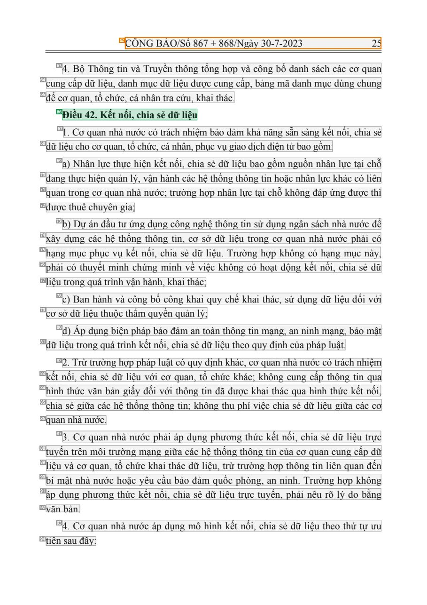

# 009 — `todo10_8/heading_corpus_100/01_phap_quy/009_Luat_Giao_dich_dien_tu_20-2023-QH15.pdf`

Draft status: `DRAFT_REVIEWER_A_NOT_APPROVED`. Source sha256 `2458d01d6453cd11ab7aaddbae36e988110754bcb53a59eda729987a63882914`. [Back to index](README.md)

## Page 1 (FIRST)

| # | alias | text | font | draft | flag | rationale |
|---:|---|---|---|---|---|---|
| 1 | L0000:S0 | 4 C&#212;NG B&#193;O/Số 867 + 868/Ng&#224;y 30-7-2023 | 14 | **OTHER** | REVIEW_FOCUS | Official Gazette running header (page furniture) |
| 2 | L0001:S0 | QUỐC HỘI CỘNG H&#210;A X&#195; HỘI CHỦ NGHĨA VIỆT NAM | 13 B | **OTHER** | REVIEW_FOCUS | Issuer merged with national name; letterhead |
| 3 | L0002:S0 | Độc lập - Tự do - Hạnh ph&#250;c | 13 B | **OTHER** | REVIEW_FOCUS | National motto |
| 4 | L0003:S0 | Luật số: 20/2023/QH15 | 13 | **OTHER** | REVIEW_FOCUS | Law number |
| 5 | L0004:S0 | LUẬT | 14 B | **ESTABLISHES** |  | Document type title LUẬT |
| 6 | L0005:S0 | GIAO DỊCH ĐIỆN TỬ | 14 B | **ESTABLISHES** |  | Document title GIAO DỊCH ĐIỆN TỬ |
| 7 | L0006:S0 | Căn cứHiến ph&#225;p nước Cộng h&#242;a x&#227; hội chủ nghĩa Việt Nam; | 14 I | **OTHER** |  | Default: body text, list item, table cell, page number or other non-heading content on this page |
| 8 | L0007:S0 | Quốc hội ban h&#224;nh Luật Giao dịch điện tử. | 14 I | **OTHER** | REVIEW_FOCUS | Enactment formula (prose) |
| 9 | L0008:S0 | Chương I | 14 B | **ESTABLISHES** |  | Chapter label &quot;Chương I&quot; |
| 10 | L0009:S0 | NHỮNG QUY ĐỊNH CHUNG | 14 B | **ESTABLISHES** |  | Chapter title NHỮNG QUY ĐỊNH CHUNG |
| 11 | L0010:S0 | Điều 1. Phạm vi điều chỉnh | 14 B | **ESTABLISHES** |  | Article heading &quot;Điều 1. Phạm vi điều chỉnh&quot; |
| 12 | L0011:S0 | 1. Luật n&#224;y quy định việc thực hiện giao dịch bằng phương tiện điện tử. | 14 | **OTHER** |  | Default: body text, list item, table cell, page number or other non-heading content on this page |
| 13 | L0012:S0 | 2. Luật n&#224;y kh&#244;ng quy định về nội dung, điều kiện, h&#236;nh thức của giao dịch. | 14 | **OTHER** |  | Default: body text, list item, table cell, page number or other non-heading content on this page |
| 14 | L0013:S0 | 3. Trường hợp luật kh&#225;c quy định hoặc kh&#244;ng quy định giao dịch được thực hiện | 14 | **OTHER** |  | Default: body text, list item, table cell, page number or other non-heading content on this page |
| 15 | L0014:S0 | bằng phương tiện điện tử th&#236; được &#225;p dụng theo quy định của Luật n&#224;y. Trường hợp | 14 | **OTHER** |  | Default: body text, list item, table cell, page number or other non-heading content on this page |
| 16 | L0015:S0 | luật kh&#225;c quy định kh&#244;ng được thực hiện giao dịch bằng phương tiện điện tử th&#236; thực | 14 | **OTHER** |  | Default: body text, list item, table cell, page number or other non-heading content on this page |
| 17 | L0016:S0 | hiện theo quy định của luật đ&#243;. | 14 | **OTHER** |  | Default: body text, list item, table cell, page number or other non-heading content on this page |
| 18 | L0017:S0 | Điều 2. Đối tượng &#225;p dụng | 14 B | **ESTABLISHES** |  | Article heading &quot;Điều 2. Đối tượng &#225;p dụng&quot; |
| 19 | L0018:S0 | Luật n&#224;y &#225;p dụng đối với cơ quan, tổ chức, c&#225; nh&#226;n trực tiếp tham gia giao dịch | 14 | **OTHER** |  | Default: body text, list item, table cell, page number or other non-heading content on this page |
| 20 | L0019:S0 | điện tử hoặc c&#243; li&#234;n quan đến giao dịch điện tử. | 14 | **OTHER** |  | Default: body text, list item, table cell, page number or other non-heading content on this page |
| 21 | L0020:S0 | Điều 3. Giải th&#237;ch từ ngữ | 14 B | **ESTABLISHES** |  | Article heading &quot;Điều 3. Giải th&#237;ch từ ngữ&quot; |
| 22 | L0021:S0 | Trong Luật n&#224;y, c&#225;c từ ngữ dưới đ&#226;y được hiểu như sau: | 14 | **OTHER** |  | Default: body text, list item, table cell, page number or other non-heading content on this page |
| 23 | L0022:S0 | 1 . Giao dịch điện tử l&#224; giao dịch được thực hiện bằng phương tiện điện tử. | 14 | **OTHER** |  | Default: body text, list item, table cell, page number or other non-heading content on this page |
| 24 | L0023:S0 | 2. Phương tiện điện tử l&#224; phần cứng, phần mềm, hệ thống th&#244;ng tin hoặc | 14 | **OTHER** |  | Default: body text, list item, table cell, page number or other non-heading content on this page |
| 25 | L0024:S0 | phương tiện kh&#225;c hoạt động dựa tr&#234;n c&#244;ng nghệ th&#244;ng tin, c&#244;ng nghệ điện, điện tử, | 14 | **OTHER** |  | Default: body text, list item, table cell, page number or other non-heading content on this page |
| 26 | L0025:S0 | kỹ thuật số, từ t&#237;nh, truyền dẫn kh&#244;ng d&#226;y, quang học, điện từ hoặc c&#244;ng nghệ kh&#225;c | 14 | **OTHER** |  | Default: body text, list item, table cell, page number or other non-heading content on this page |
| 27 | L0026:S0 | tương tự. | 14 | **OTHER** |  | Default: body text, list item, table cell, page number or other non-heading content on this page |
| 28 | L0027:S0 | 3. M&#244;i trường điện tử l&#224; m&#244;i trường mạng viễn th&#244;ng, mạng Internet, mạng | 14 | **OTHER** |  | Default: body text, list item, table cell, page number or other non-heading content on this page |
| 29 | L0028:S0 | m&#225;y t&#237;nh, hệ thống th&#244;ng tin. | 14 | **OTHER** |  | Default: body text, list item, table cell, page number or other non-heading content on this page |
| 30 | L0029:S0 | 4. Th&#244;ng điệp dữ liệu l&#224; th&#244;ng tin được tạo ra, được gửi, được nhận, được lưu | 14 | **OTHER** |  | Default: body text, list item, table cell, page number or other non-heading content on this page |
| 31 | L0030:S0 | trữ bằng phương tiện điện tử. | 14 | **OTHER** |  | Default: body text, list item, table cell, page number or other non-heading content on this page |

## Page 16 (SEEDED_INTERIOR)

| # | alias | text | font | draft | flag | rationale |
|---:|---|---|---|---|---|---|
| 32 | L0469:S0 | C&#212;NG B&#193;O/Số 867 + 868/Ng&#224;y 30-7-2023 19 | 14 | **OTHER** | REVIEW_FOCUS | Official Gazette running header (page furniture) |
| 33 | L0470:S0 | a) Dịch vụ cấp dấu thời gian; | 14 | **OTHER** |  | Default: body text, list item, table cell, page number or other non-heading content on this page |
| 34 | L0471:S0 | b) Dịch vụ chứng thực th&#244;ng điệp dữ liệu; | 14 | **OTHER** |  | Default: body text, list item, table cell, page number or other non-heading content on this page |
| 35 | L0472:S0 | c) Dịch vụ chứng thực chữ k&#253; số c&#244;ng cộng. | 14 | **OTHER** |  | Default: body text, list item, table cell, page number or other non-heading content on this page |
| 36 | L0473:S0 | 2. Dịch vụ tin cậy l&#224; ng&#224;nh, nghề đầu tư kinh doanh c&#243; điều kiện. | 14 | **OTHER** |  | Default: body text, list item, table cell, page number or other non-heading content on this page |
| 37 | L0474:S0 | 3. Tổ chức cung cấp dịch vụ tin cậy phải c&#243; giấy ph&#233;p kinh doanh dịch vụ do Bộ | 14 | **OTHER** |  | Default: body text, list item, table cell, page number or other non-heading content on this page |
| 38 | L0475:S0 | Th&#244;ng tin v&#224; Truyền th&#244;ng cấp, trừ dịch vụ chứng thực hợp đồng điện tử trong | 14 | **OTHER** |  | Default: body text, list item, table cell, page number or other non-heading content on this page |
| 39 | L0476:S0 | thương mại. Tổ chức được quyền đăng k&#253; một hoặc c&#225;c dịch vụ quy định tại khoản 1 | 14 | **OTHER** |  | Default: body text, list item, table cell, page number or other non-heading content on this page |
| 40 | L0477:S0 | Điều n&#224;y. Thời hạn của giấy ph&#233;p kinh doanh dịch vụ tin cậy l&#224; 10 năm. | 14 | **OTHER** |  | Default: body text, list item, table cell, page number or other non-heading content on this page |
| 41 | L0478:S0 | Tổ chức cung cấp dịch vụ chứng thực hợp đồng điện tử trong thương mại phải | 14 | **OTHER** |  | Default: body text, list item, table cell, page number or other non-heading content on this page |
| 42 | L0479:S0 | đ&#225;p ứng điều kiện hoạt động cung cấp dịch vụ chứng thực hợp đồng điện tử theo | 14 | **OTHER** |  | Default: body text, list item, table cell, page number or other non-heading content on this page |
| 43 | L0480:S0 | quy định của ph&#225;p luật về thương mại điện tử v&#224; điều kiện kinh doanh dịch vụ tin | 14 | **OTHER** |  | Default: body text, list item, table cell, page number or other non-heading content on this page |
| 44 | L0481:S0 | cậy theo quy định tại Điều 29 của Luật n&#224;y. | 14 | **OTHER** |  | Default: body text, list item, table cell, page number or other non-heading content on this page |
| 45 | L0482:S0 | 4. Ch&#237;nh phủ quy định chi tiết hoạt động của tổ chức cung cấp dịch vụ tin cậy; | 14 | **OTHER** |  | Default: body text, list item, table cell, page number or other non-heading content on this page |
| 46 | L0483:S0 | quy tr&#236;nh, thủ tục, hồ sơ cấp, gia hạn, thay đổi, cấp lại, tạm đ&#236;nh chỉ, thu hồi giấy ph&#233;p | 14 | **OTHER** |  | Default: body text, list item, table cell, page number or other non-heading content on this page |
| 47 | L0484:S0 | kinh doanh dịch vụ tin cậy v&#224; c&#225;c nội dung kh&#225;c quy định tại Điều n&#224;y. | 14 | **OTHER** |  | Default: body text, list item, table cell, page number or other non-heading content on this page |
| 48 | L0485:S0 | Điều 29. Điều kiện kinh doanh dịch vụ tin cậy | 14 B | **ESTABLISHES** |  | Article heading &quot;Điều 29. ...&quot; |
| 49 | L0486:S0 | 1 . Điều kiện kinh doanh dịch vụ tin cậy bao gồm: | 14 | **OTHER** |  | Default: body text, list item, table cell, page number or other non-heading content on this page |
| 50 | L0487:S0 | a) L&#224; doanh nghiệp được th&#224;nh lập v&#224; hoạt động hợp ph&#225;p tr&#234;n l&#227;nh thổViệt Nam; | 14 | **OTHER** |  | Default: body text, list item, table cell, page number or other non-heading content on this page |
| 51 | L0488:S0 | b) Đ&#225;p ứng điều kiện t&#224;i ch&#237;nh, nh&#226;n lực quản l&#253; v&#224; kỹ thuật ph&#249; hợp với từng | 14 | **OTHER** |  | Default: body text, list item, table cell, page number or other non-heading content on this page |
| 52 | L0489:S0 | loại dịch vụ tin cậy quy định tại khoản 1 Điều 28 của Luật n&#224;y; | 14 | **OTHER** |  | Default: body text, list item, table cell, page number or other non-heading content on this page |
| 53 | L0490:S0 | c) Hệ thống th&#244;ng tin cung cấp dịch vụ tin cậy đ&#225;p ứng y&#234;u cầu bảo đảm an | 14 | **OTHER** |  | Default: body text, list item, table cell, page number or other non-heading content on this page |
| 54 | L0491:S0 | to&#224;n th&#244;ng tin mạng tối thiểu cấp độ 3 theo quy định của ph&#225;p luật về an to&#224;n | 14 | **OTHER** |  | Default: body text, list item, table cell, page number or other non-heading content on this page |
| 55 | L0492:S0 | th&#244;ng tin mạng; | 14 | **OTHER** |  | Default: body text, list item, table cell, page number or other non-heading content on this page |
| 56 | L0493:S0 | d) C&#243; phương &#225;n kỹ thuật phục vụ hoạt động cung cấp dịch vụ ph&#249; hợp với | 14 | **OTHER** |  | Default: body text, list item, table cell, page number or other non-heading content on this page |
| 57 | L0494:S0 | từng loại dịch vụ tin cậy quy định tại khoản 1 Điều 28 của Luật n&#224;y; | 14 | **OTHER** |  | Default: body text, list item, table cell, page number or other non-heading content on this page |
| 58 | L0495:S0 | đ) C&#243; phương &#225;n sẵn s&#224;ng kết nối kỹ thuật phục vụ gi&#225;m s&#225;t, kiểm tra, b&#225;o | 14 | **OTHER** |  | Default: body text, list item, table cell, page number or other non-heading content on this page |
| 59 | L0496:S0 | c&#225;o số liệu bằng phương tiện điện tử đ&#225;p ứng y&#234;u cầu quản l&#253; nh&#224; nước về dịch | 14 | **OTHER** |  | Default: body text, list item, table cell, page number or other non-heading content on this page |
| 60 | L0497:S0 | vụ tin cậy. | 14 | **OTHER** |  | Default: body text, list item, table cell, page number or other non-heading content on this page |
| 61 | L0498:S0 | 2. Ch&#237;nh phủ quy định chi tiết khoản 1 Điều n&#224;y. | 14 | **OTHER** |  | Default: body text, list item, table cell, page number or other non-heading content on this page |

## Page 22 (SEEDED_INTERIOR)

| # | alias | text | font | draft | flag | rationale |
|---:|---|---|---|---|---|---|
| 62 | L0651:S0 | C&#212;NG B&#193;O/Số 867 + 868/Ng&#224;y 30-7-2023 25 | 14 | **OTHER** | REVIEW_FOCUS | Official Gazette running header (page furniture) |
| 63 | L0652:S0 | 4. Bộ Th&#244;ng tin v&#224; Truyền th&#244;ng tổng hợp v&#224; c&#244;ng bố danh s&#225;ch c&#225;c cơ quan | 14 | **OTHER** |  | Default: body text, list item, table cell, page number or other non-heading content on this page |
| 64 | L0653:S0 | cung cấp dữ liệu, danh mục dữ liệu được cung cấp, bảng m&#227; danh mục d&#249;ng chung | 14 | **OTHER** |  | Default: body text, list item, table cell, page number or other non-heading content on this page |
| 65 | L0654:S0 | để cơ quan, tổ chức, c&#225; nh&#226;n tra cứu, khai th&#225;c. | 14 | **OTHER** |  | Default: body text, list item, table cell, page number or other non-heading content on this page |
| 66 | L0655:S0 | Điều 42. Kết nối, chia sẻ dữ liệu | 14 B | **ESTABLISHES** |  | Article heading &quot;Điều 42. Kết nối, chia sẻ dữ liệu&quot; |
| 67 | L0656:S0 | 1. Cơ quan nh&#224; nước c&#243; tr&#225;ch nhiệm bảo đảm khả năng sẵn s&#224;ng kết nối, chia sẻ | 14 | **OTHER** |  | Default: body text, list item, table cell, page number or other non-heading content on this page |
| 68 | L0657:S0 | dữ liệu cho cơ quan, tổ chức, c&#225; nh&#226;n, phục vụ giao dịch điện tử bao gồm: | 14 | **OTHER** |  | Default: body text, list item, table cell, page number or other non-heading content on this page |
| 69 | L0658:S0 | a) Nh&#226;n lực thực hiện kết nối, chia sẻ dữ liệu bao gồm nguồn nh&#226;n lực tại chỗ | 14 | **OTHER** |  | Default: body text, list item, table cell, page number or other non-heading content on this page |
| 70 | L0659:S0 | đang thực hiện quản l&#253;, vận h&#224;nh c&#225;c hệ thống th&#244;ng tin hoặc nh&#226;n lực kh&#225;c c&#243; li&#234… | 14 | **OTHER** |  | Default: body text, list item, table cell, page number or other non-heading content on this page |
| 71 | L0660:S0 | quan trong cơ quan nh&#224; nước; trường hợp nh&#226;n lực tại chỗ kh&#244;ng đ&#225;p ứng được th&#236; | 14 | **OTHER** |  | Default: body text, list item, table cell, page number or other non-heading content on this page |
| 72 | L0661:S0 | được thu&#234; chuy&#234;n gia; | 14 | **OTHER** |  | Default: body text, list item, table cell, page number or other non-heading content on this page |
| 73 | L0662:S0 | b) Dự &#225;n đầu tư ứng dụng c&#244;ng nghệ th&#244;ng tin sử dụng ng&#226;n s&#225;ch nh&#224; nước để | 14 | **OTHER** |  | Default: body text, list item, table cell, page number or other non-heading content on this page |
| 74 | L0663:S0 | x&#226;y dựng c&#225;c hệ thống th&#244;ng tin, cơ sở dữ liệu trong cơ quan nh&#224; nước phải c&#243; | 14 | **OTHER** |  | Default: body text, list item, table cell, page number or other non-heading content on this page |
| 75 | L0664:S0 | hạng mục phục vụ kết nối, chia sẻ dữ liệu. Trường hợp kh&#244;ng c&#243; hạng mục n&#224;y, | 14 | **OTHER** |  | Default: body text, list item, table cell, page number or other non-heading content on this page |
| 76 | L0665:S0 | phải c&#243; thuyết minh chứng minh về việc kh&#244;ng c&#243; hoạt động kết nối, chia sẻ dữ | 14 | **OTHER** |  | Default: body text, list item, table cell, page number or other non-heading content on this page |
| 77 | L0666:S0 | liệu trong qu&#225; tr&#236;nh vận h&#224;nh, khai th&#225;c; | 14 | **OTHER** |  | Default: body text, list item, table cell, page number or other non-heading content on this page |
| 78 | L0667:S0 | c) Ban h&#224;nh v&#224; c&#244;ng bố c&#244;ng khai quy chế khai th&#225;c, sử dụng dữ liệu đối với | 14 | **OTHER** |  | Default: body text, list item, table cell, page number or other non-heading content on this page |
| 79 | L0668:S0 | cơ sở dữ liệu thuộc thẩm quyền quản l&#253;; | 14 | **OTHER** |  | Default: body text, list item, table cell, page number or other non-heading content on this page |
| 80 | L0669:S0 | d) &#193;p dụng biện ph&#225;p bảo đảm an to&#224;n th&#244;ng tin mạng, an ninh mạng, bảo mật | 14 | **OTHER** |  | Default: body text, list item, table cell, page number or other non-heading content on this page |
| 81 | L0670:S0 | dữ liệu trong qu&#225; tr&#236;nh kết nối, chia sẻ dữ liệu theo quy định của ph&#225;p luật. | 14 | **OTHER** |  | Default: body text, list item, table cell, page number or other non-heading content on this page |
| 82 | L0671:S0 | 2. Trừ trường hợp ph&#225;p luật c&#243; quy định kh&#225;c, cơ quan nh&#224; nước c&#243; tr&#225;ch nhiệm | 14 | **OTHER** |  | Default: body text, list item, table cell, page number or other non-heading content on this page |
| 83 | L0672:S0 | kết nối, chia sẻ dữ liệu với cơ quan, tổ chức kh&#225;c; kh&#244;ng cung cấp th&#244;ng tin qua | 14 | **OTHER** |  | Default: body text, list item, table cell, page number or other non-heading content on this page |
| 84 | L0673:S0 | h&#236;nh thức văn bản giấy đối với th&#244;ng tin đ&#227; được khai th&#225;c qua h&#236;nh thức kết nối, | 14 | **OTHER** |  | Default: body text, list item, table cell, page number or other non-heading content on this page |
| 85 | L0674:S0 | chia sẻ giữa c&#225;c hệ thống th&#244;ng tin; kh&#244;ng thu ph&#237; việc chia sẻ dữ liệu giữa c&#225;c cơ | 14 | **OTHER** |  | Default: body text, list item, table cell, page number or other non-heading content on this page |
| 86 | L0675:S0 | quan nh&#224; nước. | 14 | **OTHER** |  | Default: body text, list item, table cell, page number or other non-heading content on this page |
| 87 | L0676:S0 | 3. Cơ quan nh&#224; nước phải &#225;p dụng phương thức kết nối, chia sẻ dữ liệu trực | 14 | **OTHER** |  | Default: body text, list item, table cell, page number or other non-heading content on this page |
| 88 | L0677:S0 | tuyến tr&#234;n m&#244;i trường mạng giữa c&#225;c hệ thống th&#244;ng tin của cơ quan cung cấp dữ | 14 | **OTHER** |  | Default: body text, list item, table cell, page number or other non-heading content on this page |
| 89 | L0678:S0 | liệu v&#224; cơ quan, tổ chức khai th&#225;c dữ liệu, trừ trường hợp th&#244;ng tin li&#234;n quan đến | 14 | **OTHER** |  | Default: body text, list item, table cell, page number or other non-heading content on this page |
| 90 | L0679:S0 | b&#237; mật nh&#224; nước hoặc y&#234;u cầu bảo đảm quốc ph&#242;ng, an ninh. Trường hợp kh&#244;ng | 14 | **OTHER** |  | Default: body text, list item, table cell, page number or other non-heading content on this page |
| 91 | L0680:S0 | &#225;p dụng phương thức kết nối, chia sẻ dữ liệu trực tuyến, phải n&#234;u r&#245; l&#253; do bằng | 14 | **OTHER** |  | Default: body text, list item, table cell, page number or other non-heading content on this page |
| 92 | L0681:S0 | văn bản. | 14 | **OTHER** |  | Default: body text, list item, table cell, page number or other non-heading content on this page |
| 93 | L0682:S0 | 4. Cơ quan nh&#224; nước &#225;p dụng m&#244; h&#236;nh kết nối, chia sẻ dữ liệu theo thứ tự ưu | 14 | **OTHER** |  | Default: body text, list item, table cell, page number or other non-heading content on this page |
| 94 | L0683:S0 | ti&#234;n sau đ&#226;y: | 14 | **OTHER** |  | Default: body text, list item, table cell, page number or other non-heading content on this page |
