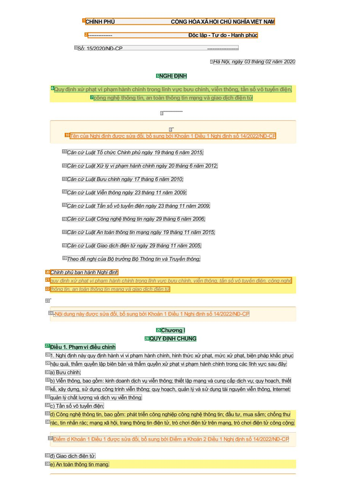
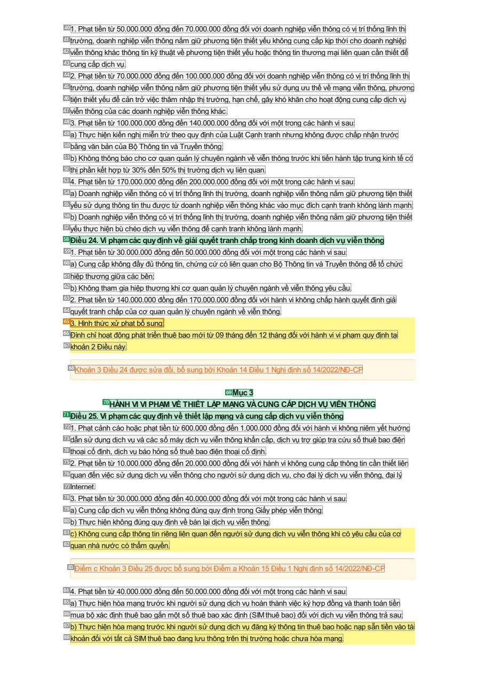
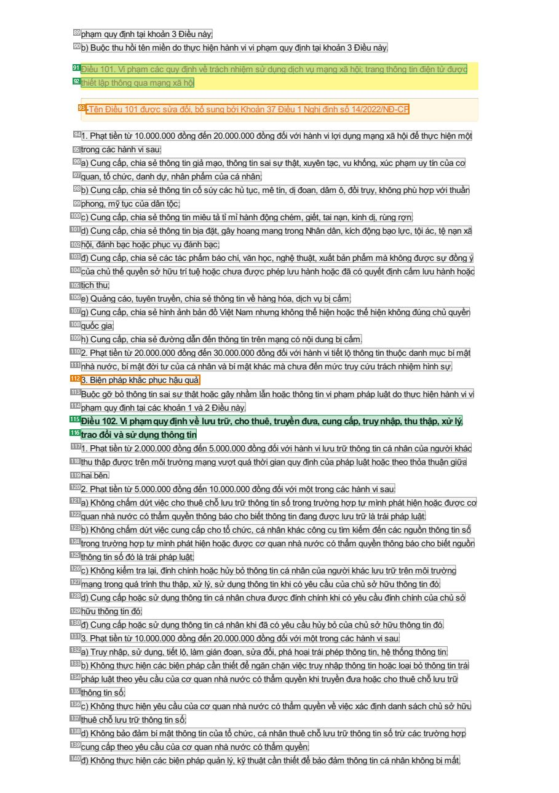

# 024 — `todo10_8/heading_corpus_100/01_phap_quy/024_ND_15-2020_Xu_phat_BC_VT_CNTT.pdf`

Draft status: `DRAFT_REVIEWER_A_NOT_APPROVED`. Source sha256 `c3e1e732d195f7b6d3d931360babaab49e18ea26d91dd4dfff6d18c0724aef41`. [Back to index](README.md)

## Page 1 (FIRST)

| # | alias | text | font | draft | flag | rationale |
|---:|---|---|---|---|---|---|
| 1 | L0000:S0 | CH&#205;NHPHỦ CỘNGH&#210;AX&#195;HỘICHỦNGHĨAVIỆTNAM | 10.8 B | **OTHER** | REVIEW_FOCUS | Issuer CH&#205;NH PHỦ merged with national name; letterhead, not a heading |
| 2 | L0001:S0 | -------------- Độclập-Tựdo-Hạnhph&#250;c | 10.8 B | **OTHER** | REVIEW_FOCUS | Separator merged with the national motto; letterhead |
| 3 | L0002:S0 | Số:15/2020/NĐ-CP ------------------ | 10.2 B | **OTHER** |  | Default: body text, list item, table cell, page number or other non-heading content on this page |
| 4 | L0003:S0 | H&#224;Nội,ng&#224;y03th&#225;ng02năm2020 | 10.2 B | **OTHER** |  | Default: body text, list item, table cell, page number or other non-heading content on this page |
| 5 | L0004:S0 | NGHỊĐỊNH | 10.8 B | **ESTABLISHES** |  | Document type title NGHỊ ĐỊNH, centred under the issuer/date block |
| 6 | L0005:S0 | Quyđịnhxửphạtviphạmh&#224;nhch&#237;nhtronglĩnhvựcbưuch&#237;nh,viễnth&#244;ng,tầnsốv&#244;tuyếnđiện, | 10.8 B | **ESTABLISHES** |  | Document title wording (line 1 of the decree title) |
| 7 | L0006:S0 | c&#244;ngnghệth&#244;ngtin,anto&#224;nth&#244;ngtinmạngv&#224;giaodịchđiệntử | 10.8 B | **ESTABLISHES** |  | Document title wording (line 2 of the decree title) |
| 8 | L0007:S0 | ----------- | 10.2 B | **OTHER** |  | Default: body text, list item, table cell, page number or other non-heading content on this page |
| 9 | L0008:S0 | - | 10.2 B | **OTHER** |  | Default: body text, list item, table cell, page number or other non-heading content on this page |
| 10 | L0009:S0 | T&#234;ncủaNghịđịnhđượcsửađổi,bổsungbởiKhoản1Điều1Nghịđịnhsố14/2022/NĐ-CP | 10.2 B | **OTHER** | REVIEW_FOCUS | Editorial note that the decree title was amended; refers to the title, not a heading |
| 11 | L0010:S0 | CăncứLuậtTổchứcCh&#237;nhphủng&#224;y19th&#225;ng6năm2015; | 10.2 B | **OTHER** |  | Default: body text, list item, table cell, page number or other non-heading content on this page |
| 12 | L0011:S0 | CăncứLuậtXửl&#253;viphạmh&#224;nhch&#237;nhng&#224;y20th&#225;ng6năm2012; | 10.2 B | **OTHER** |  | Default: body text, list item, table cell, page number or other non-heading content on this page |
| 13 | L0012:S0 | CăncứLuậtBưuch&#237;nhng&#224;y17th&#225;ng6năm2010; | 10.2 B | **OTHER** |  | Default: body text, list item, table cell, page number or other non-heading content on this page |
| 14 | L0013:S0 | CăncứLuậtViễnth&#244;ngng&#224;y23th&#225;ng11năm2009; | 10.2 B | **OTHER** |  | Default: body text, list item, table cell, page number or other non-heading content on this page |
| 15 | L0014:S0 | CăncứLuậtTầnsốv&#244;tuyếnđiệnng&#224;y23th&#225;ng11năm2009; | 10.2 B | **OTHER** |  | Default: body text, list item, table cell, page number or other non-heading content on this page |
| 16 | L0015:S0 | CăncứLuậtC&#244;ngnghệth&#244;ngtinng&#224;y29th&#225;ng6năm2006; | 10.2 B | **OTHER** |  | Default: body text, list item, table cell, page number or other non-heading content on this page |
| 17 | L0016:S0 | CăncứLuậtAnto&#224;nth&#244;ngtinmạngng&#224;y19th&#225;ng11năm2015; | 10.2 B | **OTHER** |  | Default: body text, list item, table cell, page number or other non-heading content on this page |
| 18 | L0017:S0 | CăncứLuậtGiaodịchđiệntửng&#224;y29th&#225;ng11năm2005; | 10.2 B | **OTHER** |  | Default: body text, list item, table cell, page number or other non-heading content on this page |
| 19 | L0018:S0 | TheođềnghịcủaBộtrưởngBộTh&#244;ngtinv&#224;Truyềnth&#244;ng; | 10.2 B | **OTHER** |  | Default: body text, list item, table cell, page number or other non-heading content on this page |
| 20 | L0019:S0 | Ch&#237;nhphủbanh&#224;nhNghịđịnh | 10.2 B | **OTHER** | REVIEW_FOCUS | Enactment formula &quot;Ch&#237;nh phủ ban h&#224;nh Nghị định&quot; (prose restating the title) |
| 21 | L0020:S0 | quyđịnhxửphạtviphạmh&#224;nhch&#237;nhtronglĩnhvựcbưuch&#237;nh,viễnth&#244;ng,tầnsốv&#244;tuyếnđiện,c&#244;ngnghệ | 10.2 B | **OTHER** | REVIEW_FOCUS | Enactment formula continuation restating the title in prose |
| 22 | L0021:S0 | th&#244;ngtin,anto&#224;nth&#244;ngtinmạngv&#224;giaodịchđiệntử | 10.2 B | **OTHER** | REVIEW_FOCUS | Enactment formula continuation |
| 23 | L0022:S0 | . | 10.2 B | **OTHER** |  | Default: body text, list item, table cell, page number or other non-heading content on this page |
| 24 | L0023:S0 | -Nộidungn&#224;yđượcsửađổi,bổsungbởiKhoản1Điều1Nghịđịnhsố14/2022/NĐ-CP | 10.2 B | **OTHER** |  | Default: body text, list item, table cell, page number or other non-heading content on this page |
| 25 | L0024:S0 | ChươngI | 10.8 B | **ESTABLISHES** |  | Chapter label &quot;Chương I&quot; introducing chapter content |
| 26 | L0025:S0 | QUYĐỊNHCHUNG | 10.8 B | **ESTABLISHES** |  | Chapter title QUY ĐỊNH CHUNG (part of the chapter heading) |
| 27 | L0026:S0 | Điều1.Phạmviđiềuchỉnh | 10.8 B | **ESTABLISHES** |  | Article heading &quot;Điều 1. Phạm vi điều chỉnh&quot; |
| 28 | L0027:S0 | 1.Nghịđịnhn&#224;yquyđịnhh&#224;nhviviphạmh&#224;nhch&#237;nh,h&#236;nhthứcxửphạt,mứcxửphạt,biệnph&#225;pkhắcphục | 10.2 B | **OTHER** |  | Default: body text, list item, table cell, page number or other non-heading content on this page |
| 29 | L0028:S0 | hậuquả,thẩmquyềnlậpbi&#234;nbảnv&#224;thẩmquyềnxửphạtviphạmh&#224;nhch&#237;nhtrongc&#225;clĩnhvựcsauđ&#226;y: | 10.2 B | **OTHER** |  | Default: body text, list item, table cell, page number or other non-heading content on this page |
| 30 | L0029:S0 | a)Bưuch&#237;nh; | 10.2 B | **OTHER** |  | Default: body text, list item, table cell, page number or other non-heading content on this page |
| 31 | L0030:S0 | b)Viễnth&#244;ng,baogồm:kinhdoanhdịchvụviễnth&#244;ng;thiếtlậpmạngv&#224;cungcấpdịchvụ;quyhoạch,thiết | 10.2 B | **OTHER** |  | Default: body text, list item, table cell, page number or other non-heading content on this page |
| 32 | L0031:S0 | kế,x&#226;ydựng,sửdụngc&#244;ngtr&#236;nhviễnth&#244;ng;quyhoạch,quảnl&#253;v&#224;sửdụngt&#224;inguy&#234;nviễnth&#244;… | 10.2 B | **OTHER** |  | Default: body text, list item, table cell, page number or other non-heading content on this page |
| 33 | L0032:S0 | quảnl&#253;chấtlượngv&#224;dịchvụviễnth&#244;ng; | 10.2 B | **OTHER** |  | Default: body text, list item, table cell, page number or other non-heading content on this page |
| 34 | L0033:S0 | c)Tầnsốv&#244;tuyếnđiện; | 10.2 B | **OTHER** |  | Default: body text, list item, table cell, page number or other non-heading content on this page |
| 35 | L0034:S0 | d)C&#244;ngnghệth&#244;ngtin,baogồm:ph&#225;ttriểnc&#244;ngnghiệpc&#244;ngnghệth&#244;ngtin;đầutư,muasắm;chốngthư | 10.2 B | **OTHER** |  | Default: body text, list item, table cell, page number or other non-heading content on this page |
| 36 | L0035:S0 | r&#225;c,tinnhắnr&#225;c;mạngx&#227;hội,trangth&#244;ngtinđiệntử,tr&#242;chơiđiệntửtr&#234;nmạng,tr&#242;chơiđiệntửc&#24… | 10.2 B | **OTHER** |  | Default: body text, list item, table cell, page number or other non-heading content on this page |
| 37 | L0036:S0 | ĐiểmdKhoản1Điều1đượcsửađổi,bổsungbởiĐiểmaKhoản2Điều1Nghịđịnhsố14/2022/NĐ-CP | 10.2 B | **OTHER** |  | Default: body text, list item, table cell, page number or other non-heading content on this page |
| 38 | L0037:S0 | đ)Giaodịchđiệntử. | 10.2 B | **OTHER** |  | Default: body text, list item, table cell, page number or other non-heading content on this page |
| 39 | L0038:S0 | e)Anto&#224;nth&#244;ngtinmạng. | 10.2 B | **OTHER** |  | Default: body text, list item, table cell, page number or other non-heading content on this page |

## Page 15 (SEEDED_INTERIOR)

| # | alias | text | font | draft | flag | rationale |
|---:|---|---|---|---|---|---|
| 40 | L0653:S0 | 1.Phạttiềntừ50.000.000đồngđến70.000.000đồngđốivớidoanhnghiệpviễnth&#244;ngc&#243;vịtr&#237;thốnglĩnhthị | 10.2 B | **OTHER** |  | Default: body text, list item, table cell, page number or other non-heading content on this page |
| 41 | L0654:S0 | trường,doanhnghiệpviễnth&#244;ngnắmgiữphươngtiệnthiếtyếukh&#244;ngcungcấpkịpthờichodoanhnghiệp | 10.2 B | **OTHER** |  | Default: body text, list item, table cell, page number or other non-heading content on this page |
| 42 | L0655:S0 | viễnth&#244;ngkh&#225;cth&#244;ngtinkỹthuậtvềphươngtiệnthiếtyếuhoặcth&#244;ngtinthươngmạili&#234;nquancầnthiếtđể | 10.2 B | **OTHER** |  | Default: body text, list item, table cell, page number or other non-heading content on this page |
| 43 | L0656:S0 | cungcấpdịchvụ. | 10.2 B | **OTHER** |  | Default: body text, list item, table cell, page number or other non-heading content on this page |
| 44 | L0657:S0 | 2.Phạttiềntừ70.000.000đồngđến100.000.000đồngđốivớidoanhnghiệpviễnth&#244;ngc&#243;vịtr&#237;thốnglĩnhthị | 10.2 B | **OTHER** |  | Default: body text, list item, table cell, page number or other non-heading content on this page |
| 45 | L0658:S0 | trường,doanhnghiệpviễnth&#244;ngnắmgiữphươngtiệnthiếtyếusửdụngưuthếvềmạngviễnth&#244;ng,phương | 10.2 B | **OTHER** |  | Default: body text, list item, table cell, page number or other non-heading content on this page |
| 46 | L0659:S0 | tiệnthiếtyếuđểcảntrởviệcth&#226;mnhậpthịtrường,hạnchế,g&#226;ykh&#243;khănchohoạtđộngcungcấpdịchvụ | 10.2 B | **OTHER** |  | Default: body text, list item, table cell, page number or other non-heading content on this page |
| 47 | L0660:S0 | viễnth&#244;ngcủac&#225;cdoanhnghiệpviễnth&#244;ngkh&#225;c. | 10.2 B | **OTHER** |  | Default: body text, list item, table cell, page number or other non-heading content on this page |
| 48 | L0661:S0 | 3.Phạttiềntừ100.000.000đồngđến140.000.000đồngđốivớimộttrongc&#225;ch&#224;nhvisau: | 10.2 B | **OTHER** |  | Default: body text, list item, table cell, page number or other non-heading content on this page |
| 49 | L0662:S0 | a)ThựchiệnkiếnnghịmiễntrừtheoquyđịnhcủaLuậtCạnhtranhnhưngkh&#244;ngđượcchấpnhậntrước | 10.2 B | **OTHER** |  | Default: body text, list item, table cell, page number or other non-heading content on this page |
| 50 | L0663:S0 | bằngvănbảncủaBộTh&#244;ngtinv&#224;Truyềnth&#244;ng; | 10.2 B | **OTHER** |  | Default: body text, list item, table cell, page number or other non-heading content on this page |
| 51 | L0664:S0 | b)Kh&#244;ngth&#244;ngb&#225;ochocơquanquảnl&#253;chuy&#234;nng&#224;nhvềviễnth&#244;ngtrướckhitiếnh&#224;nhtậptrungkinh… | 10.2 B | **OTHER** |  | Default: body text, list item, table cell, page number or other non-heading content on this page |
| 52 | L0665:S0 | thịphầnkếthợptừ30%đến50%thịtrườngdịchvụli&#234;nquan. | 10.2 B | **OTHER** |  | Default: body text, list item, table cell, page number or other non-heading content on this page |
| 53 | L0666:S0 | 4.Phạttiềntừ170.000.000đồngđến200.000.000đồngđốivớimộttrongc&#225;ch&#224;nhvisau: | 10.2 B | **OTHER** |  | Default: body text, list item, table cell, page number or other non-heading content on this page |
| 54 | L0667:S0 | a)Doanhnghiệpviễnth&#244;ngc&#243;vịtr&#237;thốnglĩnhthịtrường,doanhnghiệpviễnth&#244;ngnắmgiữphươngtiệnthiết | 10.2 B | **OTHER** |  | Default: body text, list item, table cell, page number or other non-heading content on this page |
| 55 | L0668:S0 | yếusửdụngth&#244;ngtinthuđượctừdoanhnghiệpviễnth&#244;ngkh&#225;cv&#224;omụcđ&#237;chcạnhtranhkh&#244;ngl&#224;nhmạnh; | 10.2 B | **OTHER** |  | Default: body text, list item, table cell, page number or other non-heading content on this page |
| 56 | L0669:S0 | b)Doanhnghiệpviễnth&#244;ngc&#243;vịtr&#237;thốnglĩnhthịtrường,doanhnghiệpviễnth&#244;ngnắmgiữphươngtiệnthiết | 10.2 B | **OTHER** |  | Default: body text, list item, table cell, page number or other non-heading content on this page |
| 57 | L0670:S0 | yếuthựchiệnb&#249;ch&#233;odịchvụviễnth&#244;ngđểcạnhtranhkh&#244;ngl&#224;nhmạnh. | 10.2 B | **OTHER** |  | Default: body text, list item, table cell, page number or other non-heading content on this page |
| 58 | L0671:S0 | Điều24.Viphạmc&#225;cquyđịnhvềgiảiquyếttranhchấptrongkinhdoanhdịchvụviễnth&#244;ng | 10.8 B | **ESTABLISHES** |  | Article heading &quot;Điều 24 ...&quot; |
| 59 | L0672:S0 | 1.Phạttiềntừ30.000.000đồngđến50.000.000đồngđốivớimộttrongc&#225;ch&#224;nhvisau: | 10.2 B | **OTHER** |  | Default: body text, list item, table cell, page number or other non-heading content on this page |
| 60 | L0673:S0 | a)Cungcấpkh&#244;ngđầyđủth&#244;ngtin,chứngcức&#243;li&#234;nquanchoBộTh&#244;ngtinv&#224;Truyềnth&#244;ngđểtổchức | 10.2 B | **OTHER** |  | Default: body text, list item, table cell, page number or other non-heading content on this page |
| 61 | L0674:S0 | hiệpthươnggiữac&#225;cb&#234;n; | 10.2 B | **OTHER** |  | Default: body text, list item, table cell, page number or other non-heading content on this page |
| 62 | L0675:S0 | b)Kh&#244;ngthamgiahiệpthươngkhicơquanquảnl&#253;chuy&#234;nng&#224;nhvềviễnth&#244;ngy&#234;ucầu. | 10.2 B | **OTHER** |  | Default: body text, list item, table cell, page number or other non-heading content on this page |
| 63 | L0676:S0 | 2.Phạttiềntừ140.000.000đồngđến170.000.000đồngđốivớih&#224;nhvikh&#244;ngchấph&#224;nhquyếtđịnhgiải | 10.2 B | **OTHER** |  | Default: body text, list item, table cell, page number or other non-heading content on this page |
| 64 | L0677:S0 | quyếttranhchấpcủacơquanquảnl&#253;chuy&#234;nng&#224;nhvềviễnth&#244;ng. | 10.2 B | **OTHER** |  | Default: body text, list item, table cell, page number or other non-heading content on this page |
| 65 | L0678:S0 | 3.H&#236;nhthứcxửphạtbổsung: | 10.2 B | **OTHER** | REVIEW_FOCUS | Numbered clause lead &quot;3. H&#236;nh thức xử phạt bổ sung:&quot; inside an article, not a heading |
| 66 | L0679:S0 | Đ&#236;nhchỉhoạtđộngph&#225;ttriểnthu&#234;baomớitừ09th&#225;ngđến12th&#225;ngđốivớih&#224;nhviviphạmquyđịnhtại | 10.2 B | **OTHER** |  | Default: body text, list item, table cell, page number or other non-heading content on this page |
| 67 | L0680:S0 | khoản2Điềun&#224;y. | 10.2 B | **OTHER** |  | Default: body text, list item, table cell, page number or other non-heading content on this page |
| 68 | L0681:S0 | Khoản3Điều24đượcsửađổi,bổsungbởiKhoản14Điều1Nghịđịnhsố14/2022/NĐ-CP | 10.2 B | **OTHER** |  | Default: body text, list item, table cell, page number or other non-heading content on this page |
| 69 | L0682:S0 | Mục3 | 10.8 B | **ESTABLISHES** |  | Section label &quot;Mục 3&quot; |
| 70 | L0683:S0 | H&#192;NHVIVIPHẠMVỀTHIẾTLẬPMẠNGV&#192;CUNGCẤPDỊCHVỤVIỄNTH&#212;NG | 10.8 B | **ESTABLISHES** |  | Section title (part of the Mục 3 heading) |
| 71 | L0684:S0 | Điều25.Viphạmc&#225;cquyđịnhvềthiếtlậpmạngv&#224;cungcấpdịchvụviễnth&#244;ng | 10.8 B | **ESTABLISHES** |  | Article heading &quot;Điều 25 ...&quot; |
| 72 | L0685:S0 | 1.Phạtcảnhc&#225;ohoặcphạttiềntừ600.000đồngđến1.000.000đồngđốivớih&#224;nhvikh&#244;ngni&#234;myếthướng | 10.2 B | **OTHER** |  | Default: body text, list item, table cell, page number or other non-heading content on this page |
| 73 | L0686:S0 | dẫnsửdụngdịchvụv&#224;c&#225;csốm&#225;ydịchvụviễnth&#244;ngkhẩncấp,dịchvụtrợgi&#250;ptracứusốthu&#234;baođiện | 10.2 B | **OTHER** |  | Default: body text, list item, table cell, page number or other non-heading content on this page |
| 74 | L0687:S0 | thoạicốđịnh,dịchvụb&#225;ohỏngsốthu&#234;baođiệnthoạicốđịnh. | 10.2 B | **OTHER** |  | Default: body text, list item, table cell, page number or other non-heading content on this page |
| 75 | L0688:S0 | 2.Phạttiềntừ10.000.000đồngđến20.000.000đồngđốivớih&#224;nhvikh&#244;ngcungcấpth&#244;ngtincầnthiếtli&#234;n | 10.2 B | **OTHER** |  | Default: body text, list item, table cell, page number or other non-heading content on this page |
| 76 | L0689:S0 | quanđếnviệcsửdụngdịchvụviễnth&#244;ngchongườisửdụngdịchvụ,chođạil&#253;dịchvụviễnth&#244;ng,đạil&#253; | 10.2 B | **OTHER** |  | Default: body text, list item, table cell, page number or other non-heading content on this page |
| 77 | L0690:S0 | Internet. | 10.2 B | **OTHER** |  | Default: body text, list item, table cell, page number or other non-heading content on this page |
| 78 | L0691:S0 | 3.Phạttiềntừ30.000.000đồngđến40.000.000đồngđốivớimộttrongc&#225;ch&#224;nhvisau: | 10.2 B | **OTHER** |  | Default: body text, list item, table cell, page number or other non-heading content on this page |
| 79 | L0692:S0 | a)Cungcấpdịchvụviễnth&#244;ngkh&#244;ngđ&#250;ngquyđịnhtrongGiấyph&#233;pviễnth&#244;ng; | 10.2 B | **OTHER** |  | Default: body text, list item, table cell, page number or other non-heading content on this page |
| 80 | L0693:S0 | b)Thựchiệnkh&#244;ngđ&#250;ngquyđịnhvềb&#225;nlạidịchvụviễnth&#244;ng. | 10.2 B | **OTHER** |  | Default: body text, list item, table cell, page number or other non-heading content on this page |
| 81 | L0694:S0 | c)Kh&#244;ngcungcấpth&#244;ngtinri&#234;ngli&#234;nquanđếnngườisửdụngdịchvụviễnth&#244;ngkhic&#243;y&#234;ucầucủacơ | 10.2 B | **OTHER** |  | Default: body text, list item, table cell, page number or other non-heading content on this page |
| 82 | L0695:S0 | quannh&#224;nướcc&#243;thẩmquyền. | 10.2 B | **OTHER** |  | Default: body text, list item, table cell, page number or other non-heading content on this page |
| 83 | L0696:S0 | ĐiểmcKhoản3Điều25đượcbổsungbởiĐiểmaKhoản15Điều1Nghịđịnhsố14/2022/NĐ-CP | 10.2 B | **OTHER** |  | Default: body text, list item, table cell, page number or other non-heading content on this page |
| 84 | L0697:S0 | 4.Phạttiềntừ40.000.000đồngđến50.000.000đồngđốivớimộttrongc&#225;ch&#224;nhvisau: | 10.2 B | **OTHER** |  | Default: body text, list item, table cell, page number or other non-heading content on this page |
| 85 | L0698:S0 | a)Thựchiệnh&#242;amạngtrướckhingườisửdụngdịchvụho&#224;nth&#224;nhviệck&#253;hợpđồngv&#224;thanhto&#225;ntiền | 10.2 B | **OTHER** |  | Default: body text, list item, table cell, page number or other non-heading content on this page |
| 86 | L0699:S0 | muabộx&#225;cđịnhthu&#234;baogắnmộtsốthu&#234;baox&#225;cđịnh(SIMthu&#234;bao)đốivớidịchvụviễnth&#244;ngtrảsau; | 10.2 B | **OTHER** |  | Default: body text, list item, table cell, page number or other non-heading content on this page |
| 87 | L0700:S0 | b)Thựchiệnh&#242;amạngtrướckhingườisửdụngdịchvụđăngk&#253;th&#244;ngtinthu&#234;baohoặcnạpsẵntiềnv&#224;ot&#224;i | 10.2 B | **OTHER** |  | Default: body text, list item, table cell, page number or other non-heading content on this page |
| 88 | L0701:S0 | khoảnđốivớitấtcảSIMthu&#234;baođanglưuth&#244;ngtr&#234;nthịtrườnghoặcchưah&#242;amạng. | 10.2 B | **OTHER** |  | Default: body text, list item, table cell, page number or other non-heading content on this page |

## Page 67 (SEEDED_INTERIOR)

| # | alias | text | font | draft | flag | rationale |
|---:|---|---|---|---|---|---|
| 89 | L3242:S0 | phạmquyđịnhtạikhoản3Điềun&#224;y; | 10.2 B | **OTHER** |  | Default: body text, list item, table cell, page number or other non-heading content on this page |
| 90 | L3243:S0 | b)Buộcthuhồit&#234;nmiềndothựchiệnh&#224;nhviviphạmquyđịnhtạikhoản3Điềun&#224;y. | 10.2 B | **OTHER** |  | Default: body text, list item, table cell, page number or other non-heading content on this page |
| 91 | L3244:S0 | Điều101.Viphạmc&#225;cquyđịnhvềtr&#225;chnhiệmsửdụngdịchvụmạngx&#227;hội;trangth&#244;ngtinđiệntửđược | 10.2 B | **ESTABLISHES** |  | Article heading &quot;Điều 101 ...&quot; (line 1) |
| 92 | L3245:S0 | thiếtlậpth&#244;ngquamạngx&#227;hội | 10.2 B | **ESTABLISHES** |  | Article heading &quot;Điều 101 ...&quot; (line 2, title continuation) |
| 93 | L3246:S0 | -T&#234;nĐiều101đượcsửađổi,bổsungbởiKhoản37Điều1Nghịđịnhsố14/2022/NĐ-CP | 10.2 B | **OTHER** | REVIEW_FOCUS | Editorial note that the Article 101 name was amended |
| 94 | L3247:S0 | 1.Phạttiềntừ10.000.000đồngđến20.000.000đồngđốivớih&#224;nhvilợidụngmạngx&#227;hộiđểthựchiệnmột | 10.2 B | **OTHER** |  | Default: body text, list item, table cell, page number or other non-heading content on this page |
| 95 | L3248:S0 | trongc&#225;ch&#224;nhvisau: | 10.2 B | **OTHER** |  | Default: body text, list item, table cell, page number or other non-heading content on this page |
| 96 | L3249:S0 | a)Cungcấp,chiasẻth&#244;ngtingiảmạo,th&#244;ngtinsaisựthật,xuy&#234;ntạc,vukhống,x&#250;cphạmuyt&#237;ncủacơ | 10.2 B | **OTHER** |  | Default: body text, list item, table cell, page number or other non-heading content on this page |
| 97 | L3250:S0 | quan,tổchức,danhdự,nh&#226;nphẩmcủac&#225;nh&#226;n; | 10.2 B | **OTHER** |  | Default: body text, list item, table cell, page number or other non-heading content on this page |
| 98 | L3251:S0 | b)Cungcấp,chiasẻth&#244;ngtincổs&#250;yc&#225;chủtục,m&#234;t&#237;n,dịđoan,d&#226;m&#244;,đồitrụy,kh&#244;ngph&#249;hợp… | 10.2 B | **OTHER** |  | Default: body text, list item, table cell, page number or other non-heading content on this page |
| 99 | L3252:S0 | phong,mỹtụccủad&#226;ntộc; | 10.2 B | **OTHER** |  | Default: body text, list item, table cell, page number or other non-heading content on this page |
| 100 | L3253:S0 | c)Cungcấp,chiasẻth&#244;ngtinmi&#234;utảtỉmỉh&#224;nhđộngch&#233;m,giết,tainạn,kinhdị,r&#249;ngrợn; | 10.2 B | **OTHER** |  | Default: body text, list item, table cell, page number or other non-heading content on this page |
| 101 | L3254:S0 | d)Cungcấp,chiasẻth&#244;ngtinbịađặt,g&#226;yhoangmangtrongNh&#226;nd&#226;n,k&#237;chđộngbạolực,tội&#225;c,tệnạnx&#227; | 10.2 B | **OTHER** |  | Default: body text, list item, table cell, page number or other non-heading content on this page |
| 102 | L3255:S0 | hội,đ&#225;nhbạchoặcphụcvụđ&#225;nhbạc; | 10.2 B | **OTHER** |  | Default: body text, list item, table cell, page number or other non-heading content on this page |
| 103 | L3256:S0 | đ)Cungcấp,chiasẻc&#225;ct&#225;cphẩmb&#225;och&#237;,vănhọc,nghệthuật,xuấtbảnphẩmm&#224;kh&#244;ngđượcsựđồng&#253; | 10.2 B | **OTHER** |  | Default: body text, list item, table cell, page number or other non-heading content on this page |
| 104 | L3257:S0 | củachủthểquyềnsởhữutr&#237;tuệhoặcchưađượcph&#233;plưuh&#224;nhhoặcđ&#227;c&#243;quyếtđịnhcấmlưuh&#224;nhhoặc | 10.2 B | **OTHER** |  | Default: body text, list item, table cell, page number or other non-heading content on this page |
| 105 | L3258:S0 | tịchthu; | 10.2 B | **OTHER** |  | Default: body text, list item, table cell, page number or other non-heading content on this page |
| 106 | L3259:S0 | e)Quảngc&#225;o,tuy&#234;ntruyền,chiasẻth&#244;ngtinvềh&#224;ngh&#243;a,dịchvụbịcấm; | 10.2 B | **OTHER** |  | Default: body text, list item, table cell, page number or other non-heading content on this page |
| 107 | L3260:S0 | g)Cungcấp,chiasẻh&#236;nhảnhbảnđồViệtNamnhưngkh&#244;ngthểhiệnhoặcthểhiệnkh&#244;ngđ&#250;ngchủquyền | 10.2 B | **OTHER** |  | Default: body text, list item, table cell, page number or other non-heading content on this page |
| 108 | L3261:S0 | quốcgia; | 10.2 B | **OTHER** |  | Default: body text, list item, table cell, page number or other non-heading content on this page |
| 109 | L3262:S0 | h)Cungcấp,chiasẻđườngdẫnđếnth&#244;ngtintr&#234;nmạngc&#243;nộidungbịcấm. | 10.2 B | **OTHER** |  | Default: body text, list item, table cell, page number or other non-heading content on this page |
| 110 | L3263:S0 | 2.Phạttiềntừ20.000.000đồngđến30.000.000đồngđốivớih&#224;nhvitiếtlộth&#244;ngtinthuộcdanhmụcb&#237;mật | 10.2 B | **OTHER** |  | Default: body text, list item, table cell, page number or other non-heading content on this page |
| 111 | L3264:S0 | nh&#224;nước,b&#237;mậtđờitưcủac&#225;nh&#226;nv&#224;b&#237;mậtkh&#225;cm&#224;chưađếnmứctruycứutr&#225;chnhiệmh&#236;n… | 10.2 B | **OTHER** |  | Default: body text, list item, table cell, page number or other non-heading content on this page |
| 112 | L3265:S0 | 3.Biệnph&#225;pkhắcphụchậuquả: | 10.2 B | **OTHER** | REVIEW_FOCUS | Numbered clause lead &quot;3. Biện ph&#225;p khắc phục hậu quả:&quot; inside an article |
| 113 | L3266:S0 | Buộcgỡbỏth&#244;ngtinsaisựthậthoặcg&#226;ynhầmlẫnhoặcth&#244;ngtinviphạmph&#225;pluậtdothựchiệnh&#224;nhvivi | 10.2 B | **OTHER** |  | Default: body text, list item, table cell, page number or other non-heading content on this page |
| 114 | L3267:S0 | phạmquyđịnhtạic&#225;ckhoản1v&#224;2Điềun&#224;y. | 10.2 B | **OTHER** |  | Default: body text, list item, table cell, page number or other non-heading content on this page |
| 115 | L3268:S0 | Điều102.Viphạmquyđịnhvềlưutrữ,chothu&#234;,truyềnđưa,cungcấp,truynhập,thuthập,xửl&#253;, | 10.8 B | **ESTABLISHES** |  | Article heading &quot;Điều 102 ...&quot; (line 1) |
| 116 | L3269:S0 | traođổiv&#224;sửdụngth&#244;ngtin | 10.8 B | **ESTABLISHES** |  | Article heading &quot;Điều 102 ...&quot; (line 2, title continuation) |
| 117 | L3270:S0 | 1.Phạttiềntừ2.000.000đồngđến5.000.000đồngđốivớih&#224;nhvilưutrữth&#244;ngtinc&#225;nh&#226;ncủangườikh&#225;c | 10.2 B | **OTHER** |  | Default: body text, list item, table cell, page number or other non-heading content on this page |
| 118 | L3271:S0 | thuthậpđượctr&#234;nm&#244;itrườngmạngvượtqu&#225;thờigianquyđịnhcủaph&#225;pluậthoặctheothỏathuậngiữa | 10.2 B | **OTHER** |  | Default: body text, list item, table cell, page number or other non-heading content on this page |
| 119 | L3272:S0 | haib&#234;n. | 10.2 B | **OTHER** |  | Default: body text, list item, table cell, page number or other non-heading content on this page |
| 120 | L3273:S0 | 2.Phạttiềntừ5.000.000đồngđến10.000.000đồngđốivớimộttrongc&#225;ch&#224;nhvisau: | 10.2 B | **OTHER** |  | Default: body text, list item, table cell, page number or other non-heading content on this page |
| 121 | L3274:S0 | a)Kh&#244;ngchấmdứtviệcchothu&#234;chỗlưutrữth&#244;ngtinsốtrongtrườnghợptựm&#236;nhph&#225;thiệnhoặcđượccơ | 10.2 B | **OTHER** |  | Default: body text, list item, table cell, page number or other non-heading content on this page |
| 122 | L3275:S0 | quannh&#224;nướcc&#243;thẩmquyềnth&#244;ngb&#225;ochobiếtth&#244;ngtinđangđượclưutrữl&#224;tr&#225;iph&#225;pluật; | 10.2 B | **OTHER** |  | Default: body text, list item, table cell, page number or other non-heading content on this page |
| 123 | L3276:S0 | b)Kh&#244;ngchấmdứtviệccungcấpchotổchức,c&#225;nh&#226;nkh&#225;cc&#244;ngcụt&#236;mkiếmđếnc&#225;cnguồnth&#244;ngtinsố | 10.2 B | **OTHER** |  | Default: body text, list item, table cell, page number or other non-heading content on this page |
| 124 | L3277:S0 | trongtrườnghợptựm&#236;nhph&#225;thiệnhoặcđượccơquannh&#224;nướcc&#243;thẩmquyềnth&#244;ngb&#225;ochobiếtnguồn | 10.2 B | **OTHER** |  | Default: body text, list item, table cell, page number or other non-heading content on this page |
| 125 | L3278:S0 | th&#244;ngtinsốđ&#243;l&#224;tr&#225;iph&#225;pluật; | 10.2 B | **OTHER** |  | Default: body text, list item, table cell, page number or other non-heading content on this page |
| 126 | L3279:S0 | c)Kh&#244;ngkiểmtralại,đ&#237;nhch&#237;nhhoặchủybỏth&#244;ngtinc&#225;nh&#226;ncủangườikh&#225;clưutrữtr&#234;nm&#244;i… | 10.2 B | **OTHER** |  | Default: body text, list item, table cell, page number or other non-heading content on this page |
| 127 | L3280:S0 | mạngtrongqu&#225;tr&#236;nhthuthập,xửl&#253;,sửdụngth&#244;ngtinkhic&#243;y&#234;ucầucủachủsởhữuth&#244;ngtinđ&#243;; | 10.2 B | **OTHER** |  | Default: body text, list item, table cell, page number or other non-heading content on this page |
| 128 | L3281:S0 | d)Cungcấphoặcsửdụngth&#244;ngtinc&#225;nh&#226;nchưađượcđ&#237;nhch&#237;nhkhic&#243;y&#234;ucầuđ&#237;nhch&#237;nhcủach… | 10.2 B | **OTHER** |  | Default: body text, list item, table cell, page number or other non-heading content on this page |
| 129 | L3282:S0 | hữuth&#244;ngtinđ&#243;; | 10.2 B | **OTHER** |  | Default: body text, list item, table cell, page number or other non-heading content on this page |
| 130 | L3283:S0 | đ)Cungcấphoặcsửdụngth&#244;ngtinc&#225;nh&#226;nkhiđ&#227;c&#243;y&#234;ucầuhủybỏcủachủsởhữuth&#244;ngtinđ&#243;. | 10.2 B | **OTHER** |  | Default: body text, list item, table cell, page number or other non-heading content on this page |
| 131 | L3284:S0 | 3.Phạttiềntừ10.000.000đồngđến20.000.000đồngđốivớimộttrongc&#225;ch&#224;nhvisau: | 10.2 B | **OTHER** |  | Default: body text, list item, table cell, page number or other non-heading content on this page |
| 132 | L3285:S0 | a)Truynhập,sửdụng,tiếtlộ,l&#224;mgi&#225;nđoạn,sửađổi,ph&#225;hoạitr&#225;iph&#233;pth&#244;ngtin,hệthốngth&#244;ngtin; | 10.2 B | **OTHER** |  | Default: body text, list item, table cell, page number or other non-heading content on this page |
| 133 | L3286:S0 | b)Kh&#244;ngthựchiệnc&#225;cbiệnph&#225;pcầnthiếtđểngănchặnviệctruynhậpth&#244;ngtinhoặcloạibỏth&#244;ngtintr&#225;i | 10.2 B | **OTHER** |  | Default: body text, list item, table cell, page number or other non-heading content on this page |
| 134 | L3287:S0 | ph&#225;pluậttheoy&#234;ucầucủacơquannh&#224;nướcc&#243;thẩmquyềnkhitruyềnđưahoặcchothu&#234;chỗlưutrữ | 10.2 B | **OTHER** |  | Default: body text, list item, table cell, page number or other non-heading content on this page |
| 135 | L3288:S0 | th&#244;ngtinsố; | 10.2 B | **OTHER** |  | Default: body text, list item, table cell, page number or other non-heading content on this page |
| 136 | L3289:S0 | c)Kh&#244;ngthựchiệny&#234;ucầucủacơquannh&#224;nướcc&#243;thẩmquyềnvềviệcx&#225;cđịnhdanhs&#225;chchủsởhữu | 10.2 B | **OTHER** |  | Default: body text, list item, table cell, page number or other non-heading content on this page |
| 137 | L3290:S0 | thu&#234;chỗlưutrữth&#244;ngtinsố; | 10.2 B | **OTHER** |  | Default: body text, list item, table cell, page number or other non-heading content on this page |
| 138 | L3291:S0 | d)Kh&#244;ngbảođảmb&#237;mậtth&#244;ngtincủatổchức,c&#225;nh&#226;nthu&#234;chỗlưutrữth&#244;ngtinsốtrừc&#225;ctrườnghợp | 10.2 B | **OTHER** |  | Default: body text, list item, table cell, page number or other non-heading content on this page |
| 139 | L3292:S0 | cungcấptheoy&#234;ucầucủacơquannh&#224;nướcc&#243;thẩmquyền; | 10.2 B | **OTHER** |  | Default: body text, list item, table cell, page number or other non-heading content on this page |
| 140 | L3293:S0 | đ)Kh&#244;ngthựchiệnc&#225;cbiệnph&#225;pquảnl&#253;,kỹthuậtcầnthiếtđểbảođảmth&#244;ngtinc&#225;nh&#226;nkh&#244;ngbịmất… | 10.2 B | **OTHER** |  | Default: body text, list item, table cell, page number or other non-heading content on this page |
