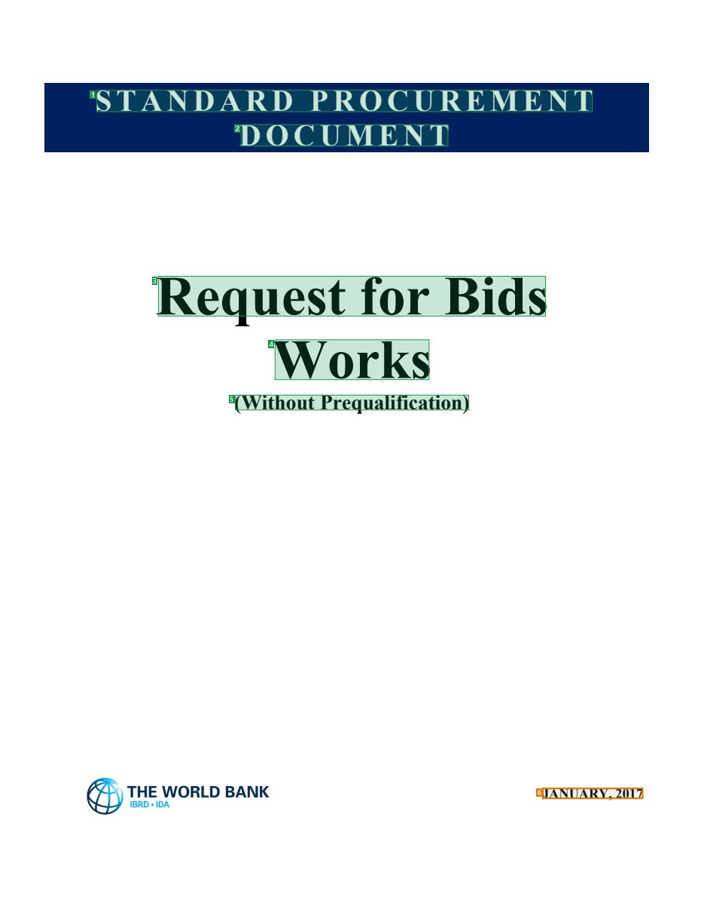
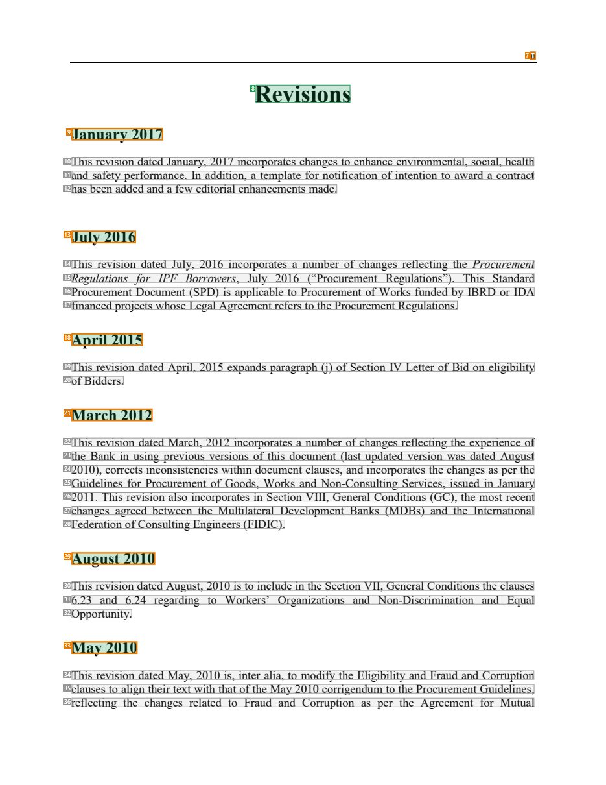
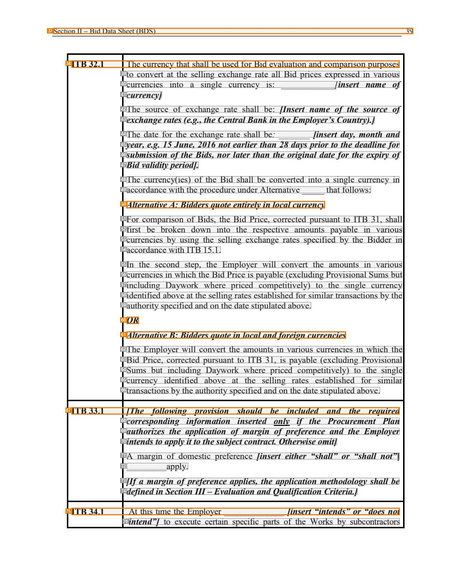
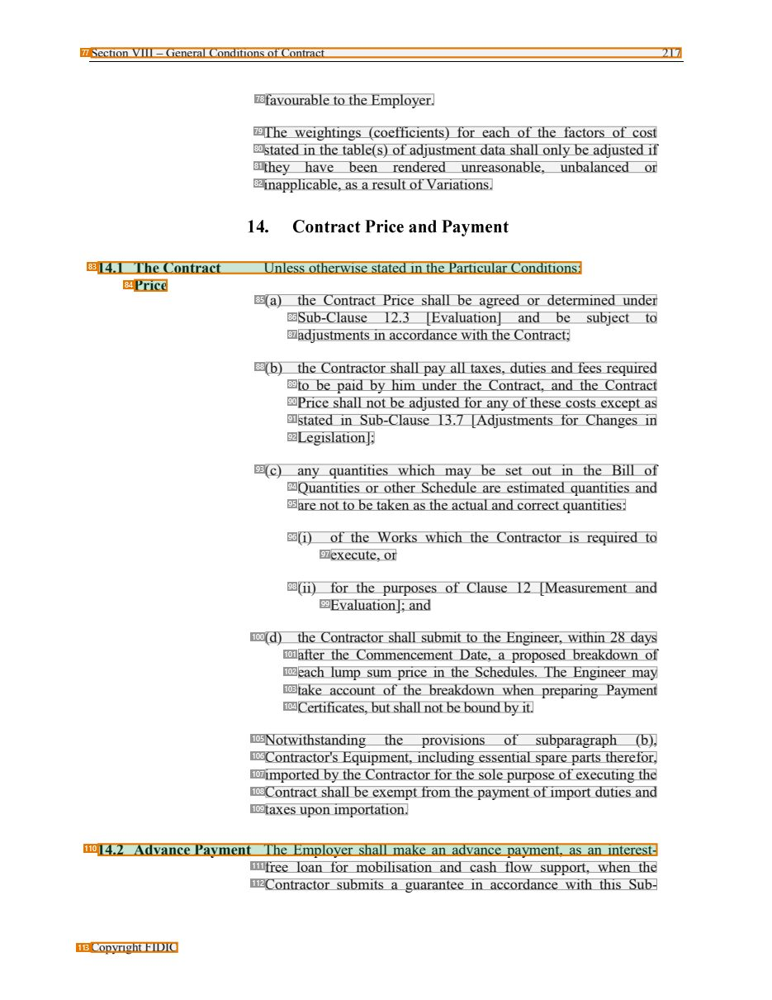

# 028 — `todo10_8/heading_corpus_100/02_hop_dong_mua_sam/028_WB_RFB_Works_Without_Prequal_2017.pdf`

Draft status: `DRAFT_REVIEWER_A_NOT_APPROVED`. Source sha256 `2dea390e45f4c07bc90d834be616cdbfc804db8c42e90b506d87bca037b29027`. [Back to index](README.md)

## Page 1 (FIRST)

| # | alias | text | font | draft | flag | rationale |
|---:|---|---|---|---|---|---|
| 1 | L0000:S0 | STANDARD PROCUREMENT | 26 B | **ESTABLISHES** |  | Cover title wording &quot;STANDARD PROCUREMENT&quot; (bold 26) |
| 2 | L0001:S0 | DOCUMENT | 26 B | **ESTABLISHES** |  | Cover title wording &quot;DOCUMENT&quot; |
| 3 | L0002:S0 | Request for Bids | 48 B | **ESTABLISHES** |  | Cover title &quot;Request for Bids&quot; (bold 48) |
| 4 | L0003:S0 | Works | 48 B | **ESTABLISHES** |  | Cover title &quot;Works&quot; (bold 48) |
| 5 | L0004:S0 | (Without Prequalification) | 18 B | **ESTABLISHES** |  | Cover subtitle &quot;(Without Prequalification)&quot; (bold 18, centred) |
| 6 | L0005:S0 | JANUARY, 2017 | 12 B | **OTHER** | REVIEW_FOCUS | Cover date |

## Page 4 (TARGETED_STRUCTURE)

| # | alias | text | font | draft | flag | rationale |
|---:|---|---|---|---|---|---|
| 7 | L0011:S0 | ii | 10 | **OTHER** | REVIEW_FOCUS | Page number &quot;ii&quot; |
| 8 | L0012:S0 | Revisions | 24 B | **ESTABLISHES** |  | Section heading &quot;Revisions&quot; (bold 24, centred) |
| 9 | L0013:S0 | January 2017 | 16 B | **ESTABLISHES** | REVIEW_FOCUS | Dated revision subheading &quot;January 2017&quot; (bold 16) introducing its revision note |
| 10 | L0014:S0 | This revision dated January, 2017 incorporates changes to enhance environmental, social, health | 12 | **OTHER** |  | Default: body text, list item, table cell, page number or other non-heading content on this page |
| 11 | L0015:S0 | and safety performance. In addition, a template for notification of intention to award a contract | 12 | **OTHER** |  | Default: body text, list item, table cell, page number or other non-heading content on this page |
| 12 | L0016:S0 | has been added and a few editorial enhancements made. | 12 | **OTHER** |  | Default: body text, list item, table cell, page number or other non-heading content on this page |
| 13 | L0017:S0 | July 2016 | 16 B | **ESTABLISHES** | REVIEW_FOCUS | Dated revision subheading &quot;July 2016&quot; |
| 14 | L0018:S0 | This revision dated July, 2016 incorporates a number of changes reflecting the Procurement | 12 | **OTHER** |  | Default: body text, list item, table cell, page number or other non-heading content on this page |
| 15 | L0019:S0 | Regulations for IPF Borrowers, July 2016 (“Procurement Regulations”). This Standard | 12 | **OTHER** |  | Default: body text, list item, table cell, page number or other non-heading content on this page |
| 16 | L0020:S0 | Procurement Document (SPD) is applicable to Procurement of Works funded by IBRD or IDA | 12 | **OTHER** |  | Default: body text, list item, table cell, page number or other non-heading content on this page |
| 17 | L0021:S0 | financed projects whose Legal Agreement refers to the Procurement Regulations. | 12 | **OTHER** |  | Default: body text, list item, table cell, page number or other non-heading content on this page |
| 18 | L0022:S0 | April 2015 | 16 B | **ESTABLISHES** | REVIEW_FOCUS | Dated revision subheading &quot;April 2015&quot; |
| 19 | L0023:S0 | This revision dated April, 2015 expands paragraph (j) of Section IV Letter of Bid on eligibility | 12 | **OTHER** |  | Default: body text, list item, table cell, page number or other non-heading content on this page |
| 20 | L0024:S0 | of Bidders. | 12 | **OTHER** |  | Default: body text, list item, table cell, page number or other non-heading content on this page |
| 21 | L0025:S0 | March 2012 | 16 B | **ESTABLISHES** | REVIEW_FOCUS | Dated revision subheading &quot;March 2012&quot; |
| 22 | L0026:S0 | This revision dated March, 2012 incorporates a number of changes reflecting the experience of | 12 | **OTHER** |  | Default: body text, list item, table cell, page number or other non-heading content on this page |
| 23 | L0027:S0 | the Bank in using previous versions of this document (last updated version was dated August | 12 | **OTHER** |  | Default: body text, list item, table cell, page number or other non-heading content on this page |
| 24 | L0028:S0 | 2010), corrects inconsistencies within document clauses, and incorporates the changes as per the | 12 | **OTHER** |  | Default: body text, list item, table cell, page number or other non-heading content on this page |
| 25 | L0029:S0 | Guidelines for Procurement of Goods, Works and Non-Consulting Services, issued in January | 12 | **OTHER** |  | Default: body text, list item, table cell, page number or other non-heading content on this page |
| 26 | L0030:S0 | 2011. This revision also incorporates in Section VIII, General Conditions (GC), the most recent | 12 | **OTHER** |  | Default: body text, list item, table cell, page number or other non-heading content on this page |
| 27 | L0031:S0 | changes agreed between the Multilateral Development Banks (MDBs) and the International | 12 | **OTHER** |  | Default: body text, list item, table cell, page number or other non-heading content on this page |
| 28 | L0032:S0 | Federation of Consulting Engineers (FIDIC). | 12 | **OTHER** |  | Default: body text, list item, table cell, page number or other non-heading content on this page |
| 29 | L0033:S0 | August 2010 | 16 B | **ESTABLISHES** | REVIEW_FOCUS | Dated revision subheading &quot;August 2010&quot; |
| 30 | L0034:S0 | This revision dated August, 2010 is to include in the Section VII, General Conditions the clauses | 12 | **OTHER** |  | Default: body text, list item, table cell, page number or other non-heading content on this page |
| 31 | L0035:S0 | 6.23 and 6.24 regarding to Workers’ Organizations and Non-Discrimination and Equal | 12 | **OTHER** |  | Default: body text, list item, table cell, page number or other non-heading content on this page |
| 32 | L0036:S0 | Opportunity. | 12 | **OTHER** |  | Default: body text, list item, table cell, page number or other non-heading content on this page |
| 33 | L0037:S0 | May 2010 | 16 B | **ESTABLISHES** | REVIEW_FOCUS | Dated revision subheading &quot;May 2010&quot; |
| 34 | L0038:S0 | This revision dated May, 2010 is, inter alia, to modify the Eligibility and Fraud and Corruption | 12 | **OTHER** |  | Default: body text, list item, table cell, page number or other non-heading content on this page |
| 35 | L0039:S0 | clauses to align their text with that of the May 2010 corrigendum to the Procurement Guidelines, | 12 | **OTHER** |  | Default: body text, list item, table cell, page number or other non-heading content on this page |
| 36 | L0040:S0 | reflecting the changes related to Fraud and Corruption as per the Agreement for Mutual | 12 | **OTHER** |  | Default: body text, list item, table cell, page number or other non-heading content on this page |

## Page 51 (SEEDED_INTERIOR)

| # | alias | text | font | draft | flag | rationale |
|---:|---|---|---|---|---|---|
| 37 | L1578:S0 | Section II – Bid Data Sheet (BDS) 39 | 10 | **OTHER** | REVIEW_FOCUS | Running header &quot;Section II – Bid Data Sheet (BDS) 39&quot; (page furniture) |
| 38 | L1579:S0 | ITB 32.1 The currency that shall be used for Bid evaluation and comparison purposes | 12 | **OTHER** | REVIEW_FOCUS | Bid Data Sheet entry &quot;ITB 32.1 ...&quot; (data-sheet row, not a heading) |
| 39 | L1580:S0 | to convert at the selling exchange rate all Bid prices expressed in various | 12 | **OTHER** |  | Default: body text, list item, table cell, page number or other non-heading content on this page |
| 40 | L1581:S0 | currencies into a single currency is: ____________[insert name of | 12 | **OTHER** |  | Default: body text, list item, table cell, page number or other non-heading content on this page |
| 41 | L1582:S0 | currency] | 12 B I | **OTHER** |  | Default: body text, list item, table cell, page number or other non-heading content on this page |
| 42 | L1583:S0 | The source of exchange rate shall be: [Insert name of the source of | 12 | **OTHER** |  | Default: body text, list item, table cell, page number or other non-heading content on this page |
| 43 | L1584:S0 | exchange rates (e.g., the Central Bank in the Employer’s Country).] | 12 B I | **OTHER** |  | Default: body text, list item, table cell, page number or other non-heading content on this page |
| 44 | L1585:S0 | The date for the exchange rate shall be: _______ [insert day, month and | 12 I | **OTHER** |  | Default: body text, list item, table cell, page number or other non-heading content on this page |
| 45 | L1586:S0 | year, e.g. 15 June, 2016 not earlier than 28 days prior to the deadline for | 12 B I | **OTHER** |  | Default: body text, list item, table cell, page number or other non-heading content on this page |
| 46 | L1587:S0 | submission of the Bids, nor later than the original date for the expiry of | 12 B I | **OTHER** |  | Default: body text, list item, table cell, page number or other non-heading content on this page |
| 47 | L1588:S0 | Bid validity period]. | 12 B I | **OTHER** |  | Default: body text, list item, table cell, page number or other non-heading content on this page |
| 48 | L1589:S0 | The currency(ies) of the Bid shall be converted into a single currency in | 12 | **OTHER** |  | Default: body text, list item, table cell, page number or other non-heading content on this page |
| 49 | L1590:S0 | accordance with the procedure under Alternative _____ that follows: | 12 | **OTHER** |  | Default: body text, list item, table cell, page number or other non-heading content on this page |
| 50 | L1591:S0 | Alternative A: Bidders quote entirely in local currency | 12 B I | **OTHER** | REVIEW_FOCUS | Option label &quot;Alternative A: ...&quot; inside a data-sheet entry |
| 51 | L1592:S0 | For comparison of Bids, the Bid Price, corrected pursuant to ITB 31, shall | 12 | **OTHER** |  | Default: body text, list item, table cell, page number or other non-heading content on this page |
| 52 | L1593:S0 | first be broken down into the respective amounts payable in various | 12 | **OTHER** |  | Default: body text, list item, table cell, page number or other non-heading content on this page |
| 53 | L1594:S0 | currencies by using the selling exchange rates specified by the Bidder in | 12 | **OTHER** |  | Default: body text, list item, table cell, page number or other non-heading content on this page |
| 54 | L1595:S0 | accordance with ITB 15.1. | 12 | **OTHER** |  | Default: body text, list item, table cell, page number or other non-heading content on this page |
| 55 | L1596:S0 | In the second step, the Employer will convert the amounts in various | 12 | **OTHER** |  | Default: body text, list item, table cell, page number or other non-heading content on this page |
| 56 | L1597:S0 | currencies in which the Bid Price is payable (excluding Provisional Sums but | 12 | **OTHER** |  | Default: body text, list item, table cell, page number or other non-heading content on this page |
| 57 | L1598:S0 | including Daywork where priced competitively) to the single currency | 12 | **OTHER** |  | Default: body text, list item, table cell, page number or other non-heading content on this page |
| 58 | L1599:S0 | identified above at the selling rates established for similar transactions by the | 12 | **OTHER** |  | Default: body text, list item, table cell, page number or other non-heading content on this page |
| 59 | L1600:S0 | authority specified and on the date stipulated above. | 12 | **OTHER** |  | Default: body text, list item, table cell, page number or other non-heading content on this page |
| 60 | L1601:S0 | OR | 12 B I | **OTHER** | REVIEW_FOCUS | &quot;OR&quot; between alternatives |
| 61 | L1602:S0 | Alternative B: Bidders quote in local and foreign currencies | 12 B I | **OTHER** | REVIEW_FOCUS | Option label &quot;Alternative B: ...&quot; inside a data-sheet entry |
| 62 | L1603:S0 | The Employer will convert the amounts in various currencies in which the | 12 | **OTHER** |  | Default: body text, list item, table cell, page number or other non-heading content on this page |
| 63 | L1604:S0 | Bid Price, corrected pursuant to ITB 31, is payable (excluding Provisional | 12 | **OTHER** |  | Default: body text, list item, table cell, page number or other non-heading content on this page |
| 64 | L1605:S0 | Sums but including Daywork where priced competitively) to the single | 12 | **OTHER** |  | Default: body text, list item, table cell, page number or other non-heading content on this page |
| 65 | L1606:S0 | currency identified above at the selling rates established for similar | 12 | **OTHER** |  | Default: body text, list item, table cell, page number or other non-heading content on this page |
| 66 | L1607:S0 | transactions by the authority specified and on the date stipulated above. | 12 | **OTHER** |  | Default: body text, list item, table cell, page number or other non-heading content on this page |
| 67 | L1608:S0 | ITB 33.1 [The following provision should be included and the required | 12 B I | **OTHER** | REVIEW_FOCUS | Data-sheet entry &quot;ITB 33.1 [...]&quot; with drafting instruction |
| 68 | L1609:S0 | corresponding information inserted only if the Procurement Plan | 12 B I | **OTHER** |  | Default: body text, list item, table cell, page number or other non-heading content on this page |
| 69 | L1610:S0 | authorizes the application of margin of preference and the Employer | 12 B I | **OTHER** |  | Default: body text, list item, table cell, page number or other non-heading content on this page |
| 70 | L1611:S0 | intends to apply it to the subject contract. Otherwise omit] | 12 B I | **OTHER** |  | Default: body text, list item, table cell, page number or other non-heading content on this page |
| 71 | L1612:S0 | A margin of domestic preference [insert either “shall” or “shall not”] | 12 B I | **OTHER** |  | Default: body text, list item, table cell, page number or other non-heading content on this page |
| 72 | L1613:S0 | _________apply. | 12 I | **OTHER** |  | Default: body text, list item, table cell, page number or other non-heading content on this page |
| 73 | L1614:S0 | [If a margin of preference applies, the application methodology shall be | 12 B I | **OTHER** |  | Default: body text, list item, table cell, page number or other non-heading content on this page |
| 74 | L1615:S0 | defined in Section III – Evaluation and Qualification Criteria.] | 12 B I | **OTHER** |  | Default: body text, list item, table cell, page number or other non-heading content on this page |
| 75 | L1616:S0 | ITB 34.1 At this time the Employer ______________ [insert “intends” or “does not | 12 B I | **OTHER** | REVIEW_FOCUS | Data-sheet entry &quot;ITB 34.1 ...&quot; |
| 76 | L1617:S0 | intend”] to execute certain specific parts of the Works by subcontractors | 12 | **OTHER** |  | Default: body text, list item, table cell, page number or other non-heading content on this page |

## Page 229 (SEEDED_INTERIOR)

| # | alias | text | font | draft | flag | rationale |
|---:|---|---|---|---|---|---|
| 77 | L6552:S0 | Section VIII – General Conditions of Contract 217 | 10 | **OTHER** | REVIEW_FOCUS | Running header &quot;Section VIII – General Conditions of Contract 217&quot; |
| 78 | L6553:S0 | favourable to the Employer. | 12 | **OTHER** |  | Default: body text, list item, table cell, page number or other non-heading content on this page |
| 79 | L6554:S0 | The weightings (coefficients) for each of the factors of cost | 12 | **OTHER** |  | Default: body text, list item, table cell, page number or other non-heading content on this page |
| 80 | L6555:S0 | stated in the table(s) of adjustment data shall only be adjusted if | 12 | **OTHER** |  | Default: body text, list item, table cell, page number or other non-heading content on this page |
| 81 | L6556:S0 | they have been rendered unreasonable, unbalanced or | 12 | **OTHER** |  | Default: body text, list item, table cell, page number or other non-heading content on this page |
| 82 | L6557:S0 | inapplicable, as a result of Variations. | 12 | **OTHER** |  | Default: body text, list item, table cell, page number or other non-heading content on this page |
| 83 | L6558:S0 | 14.1 The Contract Unless otherwise stated in the Particular Conditions: | 12 | **ESTABLISHES** | REVIEW_FOCUS | Sub-clause heading &quot;14.1 The Contract [Price]&quot; merged by the parser with the clause&#39;s first words; contributes heading wording |
| 84 | L6559:S0 | Price | 12 B | **ESTABLISHES** | REVIEW_FOCUS | Continuation &quot;Price&quot; of sub-clause heading 14.1 (bold, left column) |
| 85 | L6560:S0 | (a) the Contract Price shall be agreed or determined under | 12 | **OTHER** |  | Default: body text, list item, table cell, page number or other non-heading content on this page |
| 86 | L6561:S0 | Sub-Clause 12.3 [Evaluation] and be subject to | 12 | **OTHER** |  | Default: body text, list item, table cell, page number or other non-heading content on this page |
| 87 | L6562:S0 | adjustments in accordance with the Contract; | 12 | **OTHER** |  | Default: body text, list item, table cell, page number or other non-heading content on this page |
| 88 | L6563:S0 | (b) the Contractor shall pay all taxes, duties and fees required | 12 | **OTHER** |  | Default: body text, list item, table cell, page number or other non-heading content on this page |
| 89 | L6564:S0 | to be paid by him under the Contract, and the Contract | 12 | **OTHER** |  | Default: body text, list item, table cell, page number or other non-heading content on this page |
| 90 | L6565:S0 | Price shall not be adjusted for any of these costs except as | 12 | **OTHER** |  | Default: body text, list item, table cell, page number or other non-heading content on this page |
| 91 | L6566:S0 | stated in Sub-Clause 13.7 [Adjustments for Changes in | 12 | **OTHER** |  | Default: body text, list item, table cell, page number or other non-heading content on this page |
| 92 | L6567:S0 | Legislation]; | 12 | **OTHER** |  | Default: body text, list item, table cell, page number or other non-heading content on this page |
| 93 | L6568:S0 | (c) any quantities which may be set out in the Bill of | 12 | **OTHER** |  | Default: body text, list item, table cell, page number or other non-heading content on this page |
| 94 | L6569:S0 | Quantities or other Schedule are estimated quantities and | 12 | **OTHER** |  | Default: body text, list item, table cell, page number or other non-heading content on this page |
| 95 | L6570:S0 | are not to be taken as the actual and correct quantities: | 12 | **OTHER** |  | Default: body text, list item, table cell, page number or other non-heading content on this page |
| 96 | L6571:S0 | (i) of the Works which the Contractor is required to | 12 | **OTHER** |  | Default: body text, list item, table cell, page number or other non-heading content on this page |
| 97 | L6572:S0 | execute, or | 12 | **OTHER** |  | Default: body text, list item, table cell, page number or other non-heading content on this page |
| 98 | L6573:S0 | (ii) for the purposes of Clause 12 [Measurement and | 12 | **OTHER** |  | Default: body text, list item, table cell, page number or other non-heading content on this page |
| 99 | L6574:S0 | Evaluation]; and | 12 | **OTHER** |  | Default: body text, list item, table cell, page number or other non-heading content on this page |
| 100 | L6575:S0 | (d) the Contractor shall submit to the Engineer, within 28 days | 12 | **OTHER** |  | Default: body text, list item, table cell, page number or other non-heading content on this page |
| 101 | L6576:S0 | after the Commencement Date, a proposed breakdown of | 12 | **OTHER** |  | Default: body text, list item, table cell, page number or other non-heading content on this page |
| 102 | L6577:S0 | each lump sum price in the Schedules. The Engineer may | 12 | **OTHER** |  | Default: body text, list item, table cell, page number or other non-heading content on this page |
| 103 | L6578:S0 | take account of the breakdown when preparing Payment | 12 | **OTHER** |  | Default: body text, list item, table cell, page number or other non-heading content on this page |
| 104 | L6579:S0 | Certificates, but shall not be bound by it. | 12 | **OTHER** |  | Default: body text, list item, table cell, page number or other non-heading content on this page |
| 105 | L6580:S0 | Notwithstanding the provisions of subparagraph (b), | 12 | **OTHER** |  | Default: body text, list item, table cell, page number or other non-heading content on this page |
| 106 | L6581:S0 | Contractor&#39;s Equipment, including essential spare parts therefor, | 12 | **OTHER** |  | Default: body text, list item, table cell, page number or other non-heading content on this page |
| 107 | L6582:S0 | imported by the Contractor for the sole purpose of executing the | 12 | **OTHER** |  | Default: body text, list item, table cell, page number or other non-heading content on this page |
| 108 | L6583:S0 | Contract shall be exempt from the payment of import duties and | 12 | **OTHER** |  | Default: body text, list item, table cell, page number or other non-heading content on this page |
| 109 | L6584:S0 | taxes upon importation. | 12 | **OTHER** |  | Default: body text, list item, table cell, page number or other non-heading content on this page |
| 110 | L6585:S0 | 14.2 Advance Payment The Employer shall make an advance payment, as an interest- | 12 | **ESTABLISHES** | REVIEW_FOCUS | Sub-clause heading &quot;14.2 Advance Payment&quot; merged with the clause&#39;s first words; contributes heading wording |
| 111 | L6586:S0 | free loan for mobilisation and cash flow support, when the | 12 | **OTHER** |  | Default: body text, list item, table cell, page number or other non-heading content on this page |
| 112 | L6587:S0 | Contractor submits a guarantee in accordance with this Sub- | 12 | **OTHER** |  | Default: body text, list item, table cell, page number or other non-heading content on this page |
| 113 | L6588:S0 | Copyright FIDIC | 10 | **OTHER** | REVIEW_FOCUS | Footer &quot;Copyright FIDIC&quot; |
