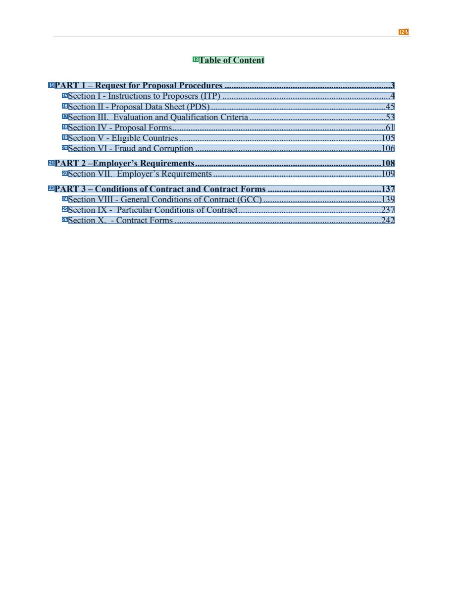
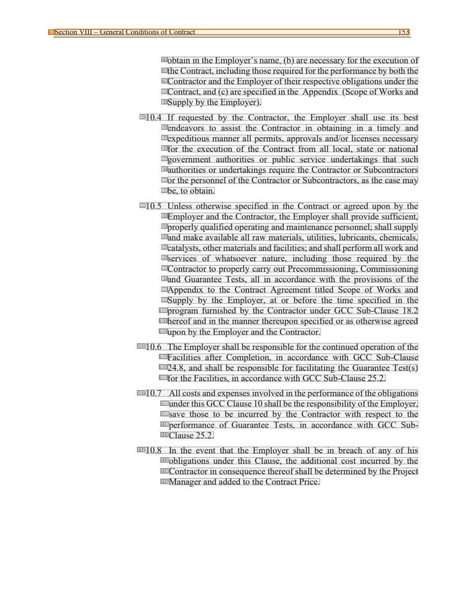

# 032 — `todo10_8/heading_corpus_100/02_hop_dong_mua_sam/032_WB_Plant_TwoStage_2020.pdf`

Draft status: `DRAFT_REVIEWER_A_NOT_APPROVED`. Source sha256 `5c9fe5ebe4a283233cfb1fb2438b87d7d7ea209062ce9d49db79c52d3183223c`. [Back to index](README.md)

## Page 1 (FIRST)

| # | alias | text | font | draft | flag | rationale |
|---:|---|---|---|---|---|---|
| 1 | L0000:S0 | STANDARD PROCUREMENT | 26 B | **ESTABLISHES** |  | Cover title wording &quot;STANDARD PROCUREMENT&quot; |
| 2 | L0001:S0 | DOCUMENT | 26 B | **ESTABLISHES** |  | Cover title wording &quot;DOCUMENT&quot; |
| 3 | L0002:S0 | Request for Proposals | 42 B | **ESTABLISHES** |  | Cover title &quot;Request for Proposals&quot; |
| 4 | L0003:S0 | Plant | 42 B | **ESTABLISHES** |  | Cover title &quot;Plant&quot; |
| 5 | L0004:S0 | Design, Supply and Installation | 22 B | **ESTABLISHES** |  | Cover subtitle &quot;Design, Supply and Installation&quot; |
| 6 | L0005:S0 | (Two-Stage Request for Proposals, after Initial Selection) | 14 B | **ESTABLISHES** |  | Cover subtitle &quot;(Two-Stage Request for Proposals, after Initial Selection)&quot; |
| 7 | L0006:S0 | For Projects with Project Concept Notes (PCN) | 18 B | **ESTABLISHES** | REVIEW_FOCUS | Cover applicability subtitle line 1 (bold 18, centred) |
| 8 | L0007:S0 | Decision Notes | 18 B | **ESTABLISHES** | REVIEW_FOCUS | Cover applicability subtitle line 2 |
| 9 | L0008:S0 | dated after October 1, 2018 | 18 B | **ESTABLISHES** | REVIEW_FOCUS | Cover applicability subtitle line 3 |
| 10 | L0009:S0 | February 2020 | 12 B | **OTHER** | REVIEW_FOCUS | Cover date |
| 11 | L0010:S0 | 11/16/16 | 8 | **OTHER** | REVIEW_FOCUS | Stray date stamp &quot;11/16/16&quot; |

## Page 14 (TARGETED_STRUCTURE)

| # | alias | text | font | draft | flag | rationale |
|---:|---|---|---|---|---|---|
| 12 | L0282:S0 | 2 | 10 | **OTHER** | REVIEW_FOCUS | Page number |
| 13 | L0283:S0 | Table of Content | 12 B | **ESTABLISHES** |  | Heading &quot;Table of Content&quot; |
| 14 | L0284:S0 | PART 1 – Request for Proposal Procedures .........................................................................3 | 12 B | **REPRESENTS** |  | Contents entry for PART 1 |
| 15 | L0285:S0 | Section I - Instructions to Proposers (ITP) ..........................................................................4 | 12 | **REPRESENTS** |  | Contents entry for Section I |
| 16 | L0286:S0 | Section II - Proposal Data Sheet (PDS).............................................................................45 | 12 | **REPRESENTS** |  | Contents entry for Section II |
| 17 | L0287:S0 | Section III. Evaluation and Qualification Criteria............................................................53 | 12 | **REPRESENTS** |  | Contents entry for Section III |
| 18 | L0288:S0 | Section IV - Proposal Forms.............................................................................................… | 12 | **REPRESENTS** |  | Contents entry for Section IV |
| 19 | L0289:S0 | Section V - Eligible Countries.........................................................................................1… | 12 | **REPRESENTS** |  | Contents entry for Section V |
| 20 | L0290:S0 | Section VI - Fraud and Corruption ..................................................................................106 | 12 | **REPRESENTS** |  | Contents entry for Section VI |
| 21 | L0291:S0 | PART 2 –Employer’s Requirements..................................................................................108 | 12 B | **REPRESENTS** |  | Contents entry for PART 2 |
| 22 | L0292:S0 | Section VII. Employer’s Requirements..........................................................................109 | 12 | **REPRESENTS** |  | Contents entry for Section VII |
| 23 | L0293:S0 | PART 3 – Conditions of Contract and Contract Forms ..................................................137 | 12 B | **REPRESENTS** |  | Contents entry for PART 3 |
| 24 | L0294:S0 | Section VIII - General Conditions of Contract (GCC)....................................................139 | 12 | **REPRESENTS** |  | Contents entry for Section VIII |
| 25 | L0295:S0 | Section IX - Particular Conditions of Contract...............................................................237 | 12 | **REPRESENTS** |  | Contents entry for Section IX |
| 26 | L0296:S0 | Section X. - Contract Forms ...........................................................................................2… | 12 | **REPRESENTS** |  | Contents entry for Section X |

## Page 29 (SEEDED_INTERIOR)

| # | alias | text | font | draft | flag | rationale |
|---:|---|---|---|---|---|---|
| 27 | L0828:S0 | Section I – Instructions to Proposers (ITP) 17 | 10 | **OTHER** | REVIEW_FOCUS | Running header &quot;Section I – Instructions to Proposers (ITP) 17&quot; |
| 28 | L0829:S0 | have been made shall be signed or initialed by the person signing | 12 | **OTHER** |  | Default: body text, list item, table cell, page number or other non-heading content on this page |
| 29 | L0830:S0 | the Proposal. | 12 | **OTHER** |  | Default: body text, list item, table cell, page number or other non-heading content on this page |
| 30 | L0831:S0 | 17.3 The Proposal shall contain no interlineations, erasures, or | 12 | **OTHER** |  | Default: body text, list item, table cell, page number or other non-heading content on this page |
| 31 | L0832:S0 | overwriting, except to correct errors made by the Proposer, in which | 12 | **OTHER** |  | Default: body text, list item, table cell, page number or other non-heading content on this page |
| 32 | L0833:S0 | case such corrections shall be initialed by the person or persons | 12 | **OTHER** |  | Default: body text, list item, table cell, page number or other non-heading content on this page |
| 33 | L0834:S0 | signing the Proposal. | 12 | **OTHER** |  | Default: body text, list item, table cell, page number or other non-heading content on this page |
| 34 | L0835:S0 | 17.4 Signing and submission of a First Stage Technical Proposal shall | 12 | **OTHER** |  | Default: body text, list item, table cell, page number or other non-heading content on this page |
| 35 | L0836:S0 | not bind or obligate the Proposer to submit a Second Stage | 12 | **OTHER** |  | Default: body text, list item, table cell, page number or other non-heading content on this page |
| 36 | L0837:S0 | Combined Technical and Financial Proposal. | 12 | **OTHER** |  | Default: body text, list item, table cell, page number or other non-heading content on this page |
| 37 | L0838:S0 | D. SUBMISSION OF FIRST STAGE TECHNICAL PROPOSALS | 13 B | **ESTABLISHES** |  | Section heading &quot;D. SUBMISSION OF FIRST STAGE TECHNICAL PROPOSALS&quot; (bold 13, centred) |
| 38 | L0839:S0 | 18. Sealing and | 12 B | **ESTABLISHES** |  | Clause heading &quot;18. Sealing and&quot; (bold, left column) |
| 39 | L0839:S1 | 18.1 The Proposer shall seal the original First Stage Technical Proposal | 12 | **OTHER** | REVIEW_FOCUS | Sub-clause 18.1 body text (right column) next to the clause heading |
| 40 | L0840:S0 | Marking of | 12 B | **ESTABLISHES** |  | Clause heading continuation &quot;Marking of&quot; |
| 41 | L0840:S1 | and each copy of the Proposal in separate envelopes, each | 12 | **OTHER** |  | Default: body text, list item, table cell, page number or other non-heading content on this page |
| 42 | L0841:S0 | First Stage | 12 B | **ESTABLISHES** |  | Clause heading continuation &quot;First Stage&quot; |
| 43 | L0841:S1 | containing the documents specified in ITP 12, and shall mark the | 12 | **OTHER** |  | Default: body text, list item, table cell, page number or other non-heading content on this page |
| 44 | L0842:S0 | Technical | 12 B | **ESTABLISHES** |  | Clause heading continuation &quot;Technical&quot; |
| 45 | L0842:S1 | envelopes as “First Stage Technical Proposal – Original,” and | 12 | **OTHER** |  | Default: body text, list item, table cell, page number or other non-heading content on this page |
| 46 | L0843:S0 | Proposal | 12 B | **ESTABLISHES** |  | Clause heading continuation &quot;Proposal&quot; |
| 47 | L0843:S1 | “First Stage Technical Proposal – Copy No. [number],” all duly | 12 | **OTHER** |  | Default: body text, list item, table cell, page number or other non-heading content on this page |
| 48 | L0844:S0 | marked as required in ITP 17.1. The envelopes shall be sealed in | 12 | **OTHER** |  | Default: body text, list item, table cell, page number or other non-heading content on this page |
| 49 | L0845:S0 | an outer envelope. | 12 | **OTHER** |  | Default: body text, list item, table cell, page number or other non-heading content on this page |
| 50 | L0846:S0 | 18.2 The inner and outer envelopes shall: | 12 | **OTHER** |  | Default: body text, list item, table cell, page number or other non-heading content on this page |
| 51 | L0847:S0 | (a) | 12 | **OTHER** |  | Default: body text, list item, table cell, page number or other non-heading content on this page |
| 52 | L0847:S1 | bear the name and address of the Proposer; | 12 | **OTHER** |  | Default: body text, list item, table cell, page number or other non-heading content on this page |
| 53 | L0848:S0 | (b) be addressed to the Employer, at the address given in the PDS | 12 | **OTHER** |  | Default: body text, list item, table cell, page number or other non-heading content on this page |
| 54 | L0849:S0 | for ITP 19.1; and | 12 | **OTHER** |  | Default: body text, list item, table cell, page number or other non-heading content on this page |
| 55 | L0850:S0 | (c) | 12 | **OTHER** |  | Default: body text, list item, table cell, page number or other non-heading content on this page |
| 56 | L0850:S1 | bear the Contract(s) name, the Invitation for Proposals (RFP) | 12 | **OTHER** |  | Default: body text, list item, table cell, page number or other non-heading content on this page |
| 57 | L0851:S0 | title and number, as specified in the PDS for ITP 1.1, and the | 12 | **OTHER** |  | Default: body text, list item, table cell, page number or other non-heading content on this page |
| 58 | L0852:S0 | statement “First Stage Technical Proposal – Do Not Open | 12 | **OTHER** |  | Default: body text, list item, table cell, page number or other non-heading content on this page |
| 59 | L0853:S0 | Before [time and date],” to be completed with the time and | 12 | **OTHER** |  | Default: body text, list item, table cell, page number or other non-heading content on this page |
| 60 | L0854:S0 | date specified in the PDS for ITP 19.1. | 12 | **OTHER** |  | Default: body text, list item, table cell, page number or other non-heading content on this page |
| 61 | L0855:S0 | 18.3 If the outer envelope is not sealed and marked as required by | 12 | **OTHER** |  | Default: body text, list item, table cell, page number or other non-heading content on this page |
| 62 | L0856:S0 | ITP 18.1 and ITP 18.2, the Employer will assume no responsibility | 12 | **OTHER** |  | Default: body text, list item, table cell, page number or other non-heading content on this page |
| 63 | L0857:S0 | for the Proposal’s misplacement or premature opening. | 12 | **OTHER** |  | Default: body text, list item, table cell, page number or other non-heading content on this page |
| 64 | L0858:S0 | 19. Deadline for | 12 B | **ESTABLISHES** |  | Clause heading &quot;19. Deadline for&quot; (bold, left column) |
| 65 | L0858:S1 | 19.1 First Stage Technical Proposals must be received by the Employer | 12 | **OTHER** | REVIEW_FOCUS | Sub-clause 19.1 body text (right column) |
| 66 | L0859:S0 | Submission of | 12 B | **ESTABLISHES** |  | Clause heading continuation &quot;Submission of&quot; |
| 67 | L0859:S1 | at the address specified, and no later than the time and date | 12 | **OTHER** |  | Default: body text, list item, table cell, page number or other non-heading content on this page |
| 68 | L0860:S0 | First Stage | 12 B | **ESTABLISHES** |  | Clause heading continuation &quot;First Stage&quot; |
| 69 | L0860:S1 | specified, in the PDS. Proposers have the option of submitting | 12 | **OTHER** |  | Default: body text, list item, table cell, page number or other non-heading content on this page |
| 70 | L0861:S0 | Technical- | 12 B | **ESTABLISHES** |  | Clause heading continuation &quot;Technical-&quot; |
| 71 | L0861:S1 | their Proposals electronically if specified in the PDS. | 12 | **OTHER** |  | Default: body text, list item, table cell, page number or other non-heading content on this page |
| 72 | L0862:S0 | Proposals | 12 B | **ESTABLISHES** |  | Clause heading continuation &quot;Proposals&quot; |
| 73 | L0863:S0 | 19.2 The Employer may, at its discretion, extend the deadline for | 12 | **OTHER** |  | Default: body text, list item, table cell, page number or other non-heading content on this page |
| 74 | L0864:S0 | submission of Proposals by amending the RFP Documents in | 12 | **OTHER** |  | Default: body text, list item, table cell, page number or other non-heading content on this page |
| 75 | L0865:S0 | accordance with ITP 8.3, in which case all rights and obligations | 12 | **OTHER** |  | Default: body text, list item, table cell, page number or other non-heading content on this page |

## Page 165 (SEEDED_INTERIOR)

| # | alias | text | font | draft | flag | rationale |
|---:|---|---|---|---|---|---|
| 76 | L4540:S0 | Section VIII – General Conditions of Contract 153 | 10 | **OTHER** | REVIEW_FOCUS | Running header &quot;Section VIII – General Conditions of Contract 153&quot; |
| 77 | L4541:S0 | obtain in the Employer’s name, (b) are necessary for the execution of | 12 | **OTHER** |  | Default: body text, list item, table cell, page number or other non-heading content on this page |
| 78 | L4542:S0 | the Contract, including those required for the performance by both the | 12 | **OTHER** |  | Default: body text, list item, table cell, page number or other non-heading content on this page |
| 79 | L4543:S0 | Contractor and the Employer of their respective obligations under the | 12 | **OTHER** |  | Default: body text, list item, table cell, page number or other non-heading content on this page |
| 80 | L4544:S0 | Contract, and (c) are specified in the Appendix (Scope of Works and | 12 | **OTHER** |  | Default: body text, list item, table cell, page number or other non-heading content on this page |
| 81 | L4545:S0 | Supply by the Employer). | 12 | **OTHER** |  | Default: body text, list item, table cell, page number or other non-heading content on this page |
| 82 | L4546:S0 | 10.4 If requested by the Contractor, the Employer shall use its best | 12 | **OTHER** |  | Default: body text, list item, table cell, page number or other non-heading content on this page |
| 83 | L4547:S0 | endeavors to assist the Contractor in obtaining in a timely and | 12 | **OTHER** |  | Default: body text, list item, table cell, page number or other non-heading content on this page |
| 84 | L4548:S0 | expeditious manner all permits, approvals and/or licenses necessary | 12 | **OTHER** |  | Default: body text, list item, table cell, page number or other non-heading content on this page |
| 85 | L4549:S0 | for the execution of the Contract from all local, state or national | 12 | **OTHER** |  | Default: body text, list item, table cell, page number or other non-heading content on this page |
| 86 | L4550:S0 | government authorities or public service undertakings that such | 12 | **OTHER** |  | Default: body text, list item, table cell, page number or other non-heading content on this page |
| 87 | L4551:S0 | authorities or undertakings require the Contractor or Subcontractors | 12 | **OTHER** |  | Default: body text, list item, table cell, page number or other non-heading content on this page |
| 88 | L4552:S0 | or the personnel of the Contractor or Subcontractors, as the case may | 12 | **OTHER** |  | Default: body text, list item, table cell, page number or other non-heading content on this page |
| 89 | L4553:S0 | be, to obtain. | 12 | **OTHER** |  | Default: body text, list item, table cell, page number or other non-heading content on this page |
| 90 | L4554:S0 | 10.5 Unless otherwise specified in the Contract or agreed upon by the | 12 | **OTHER** |  | Default: body text, list item, table cell, page number or other non-heading content on this page |
| 91 | L4555:S0 | Employer and the Contractor, the Employer shall provide sufficient, | 12 | **OTHER** |  | Default: body text, list item, table cell, page number or other non-heading content on this page |
| 92 | L4556:S0 | properly qualified operating and maintenance personnel; shall supply | 12 | **OTHER** |  | Default: body text, list item, table cell, page number or other non-heading content on this page |
| 93 | L4557:S0 | and make available all raw materials, utilities, lubricants, chemicals, | 12 | **OTHER** |  | Default: body text, list item, table cell, page number or other non-heading content on this page |
| 94 | L4558:S0 | catalysts, other materials and facilities; and shall perform all work and | 12 | **OTHER** |  | Default: body text, list item, table cell, page number or other non-heading content on this page |
| 95 | L4559:S0 | services of whatsoever nature, including those required by the | 12 | **OTHER** |  | Default: body text, list item, table cell, page number or other non-heading content on this page |
| 96 | L4560:S0 | Contractor to properly carry out Precommissioning, Commissioning | 12 | **OTHER** |  | Default: body text, list item, table cell, page number or other non-heading content on this page |
| 97 | L4561:S0 | and Guarantee Tests, all in accordance with the provisions of the | 12 | **OTHER** |  | Default: body text, list item, table cell, page number or other non-heading content on this page |
| 98 | L4562:S0 | Appendix to the Contract Agreement titled Scope of Works and | 12 | **OTHER** |  | Default: body text, list item, table cell, page number or other non-heading content on this page |
| 99 | L4563:S0 | Supply by the Employer, at or before the time specified in the | 12 | **OTHER** |  | Default: body text, list item, table cell, page number or other non-heading content on this page |
| 100 | L4564:S0 | program furnished by the Contractor under GCC Sub-Clause 18.2 | 12 | **OTHER** |  | Default: body text, list item, table cell, page number or other non-heading content on this page |
| 101 | L4565:S0 | hereof and in the manner thereupon specified or as otherwise agreed | 12 | **OTHER** |  | Default: body text, list item, table cell, page number or other non-heading content on this page |
| 102 | L4566:S0 | upon by the Employer and the Contractor. | 12 | **OTHER** |  | Default: body text, list item, table cell, page number or other non-heading content on this page |
| 103 | L4567:S0 | 10.6 The Employer shall be responsible for the continued operation of the | 12 | **OTHER** |  | Default: body text, list item, table cell, page number or other non-heading content on this page |
| 104 | L4568:S0 | Facilities after Completion, in accordance with GCC Sub-Clause | 12 | **OTHER** |  | Default: body text, list item, table cell, page number or other non-heading content on this page |
| 105 | L4569:S0 | 24.8, and shall be responsible for facilitating the Guarantee Test(s) | 12 | **OTHER** |  | Default: body text, list item, table cell, page number or other non-heading content on this page |
| 106 | L4570:S0 | for the Facilities, in accordance with GCC Sub-Clause 25.2. | 12 | **OTHER** |  | Default: body text, list item, table cell, page number or other non-heading content on this page |
| 107 | L4571:S0 | 10.7 All costs and expenses involved in the performance of the obligations | 12 | **OTHER** |  | Default: body text, list item, table cell, page number or other non-heading content on this page |
| 108 | L4572:S0 | under this GCC Clause 10 shall be the responsibility of the Employer, | 12 | **OTHER** |  | Default: body text, list item, table cell, page number or other non-heading content on this page |
| 109 | L4573:S0 | save those to be incurred by the Contractor with respect to the | 12 | **OTHER** |  | Default: body text, list item, table cell, page number or other non-heading content on this page |
| 110 | L4574:S0 | performance of Guarantee Tests, in accordance with GCC Sub- | 12 | **OTHER** |  | Default: body text, list item, table cell, page number or other non-heading content on this page |
| 111 | L4575:S0 | Clause 25.2. | 12 | **OTHER** |  | Default: body text, list item, table cell, page number or other non-heading content on this page |
| 112 | L4576:S0 | 10.8 In the event that the Employer shall be in breach of any of his | 12 | **OTHER** |  | Default: body text, list item, table cell, page number or other non-heading content on this page |
| 113 | L4577:S0 | obligations under this Clause, the additional cost incurred by the | 12 | **OTHER** |  | Default: body text, list item, table cell, page number or other non-heading content on this page |
| 114 | L4578:S0 | Contractor in consequence thereof shall be determined by the Project | 12 | **OTHER** |  | Default: body text, list item, table cell, page number or other non-heading content on this page |
| 115 | L4579:S0 | Manager and added to the Contract Price. | 12 | **OTHER** |  | Default: body text, list item, table cell, page number or other non-heading content on this page |
