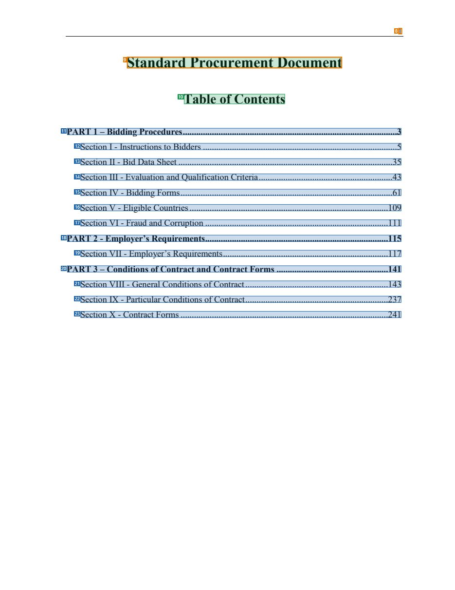
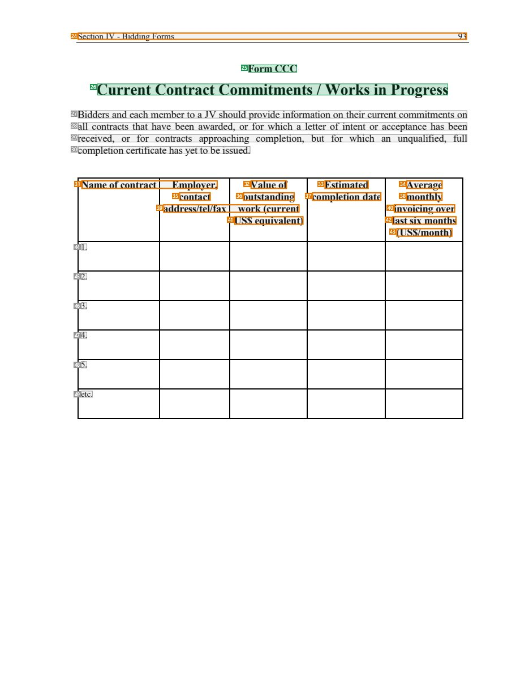
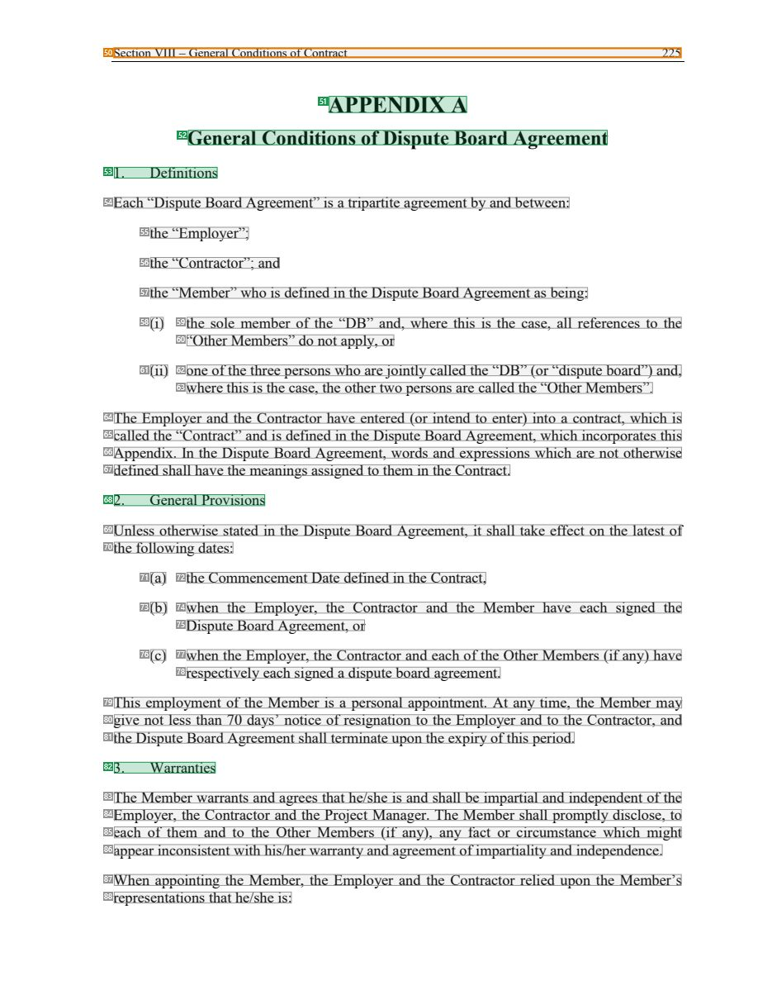

# 034 — `todo10_8/heading_corpus_100/02_hop_dong_mua_sam/034_WB_Plant_Without_Prequal_2016.pdf`

Draft status: `DRAFT_REVIEWER_A_NOT_APPROVED`. Source sha256 `ac8bba6f592e5f76a6f2908a7b7b23475de58cdab5f23660722087c26d4464ba`. [Back to index](README.md)

## Page 1 (FIRST)

| # | alias | text | font | draft | flag | rationale |
|---:|---|---|---|---|---|---|
| 1 | L0000:S0 | STANDARD PROCUREMENT | 26 B | **ESTABLISHES** |  | Cover title wording &quot;STANDARD PROCUREMENT&quot; |
| 2 | L0001:S0 | DOCUMENT | 26 B | **ESTABLISHES** |  | Cover title wording &quot;DOCUMENT&quot; |
| 3 | L0002:S0 | Request for Bids | 48 B | **ESTABLISHES** |  | Cover title &quot;Request for Bids&quot; |
| 4 | L0003:S0 | Plant | 42 B | **ESTABLISHES** |  | Cover title &quot;Plant&quot; |
| 5 | L0004:S0 | Design, Supply, and Installation | 22 B | **ESTABLISHES** |  | Cover subtitle &quot;Design, Supply, and Installation&quot; |
| 6 | L0005:S0 | (Without Prequalification) | 16 B | **ESTABLISHES** |  | Cover subtitle &quot;(Without Prequalification)&quot; |
| 7 | L0006:S0 | JULY, 2016 | 12 B | **OTHER** | REVIEW_FOCUS | Cover date |

## Page 17 (TARGETED_STRUCTURE)

| # | alias | text | font | draft | flag | rationale |
|---:|---|---|---|---|---|---|
| 8 | L0209:S0 | 1 | 10 | **OTHER** | REVIEW_FOCUS | Page number |
| 9 | L0210:S0 | Standard Procurement Document | 20 B | **ESTABLISHES** | REVIEW_FOCUS | &quot;Standard Procurement Document&quot; (bold 20, centred) heading the contents page; names the document here |
| 10 | L0211:S0 | Table of Contents | 18 B | **ESTABLISHES** |  | Heading &quot;Table of Contents&quot; |
| 11 | L0212:S0 | PART 1 – Bidding Procedures.............................................................................................… | 12 B | **REPRESENTS** |  | Contents entry &quot;PART 1 – Bidding Procedures ...3&quot; (dot leaders, page number) |
| 12 | L0213:S0 | Section I - Instructions to Bidders ....................................................................................… | 12 | **REPRESENTS** |  | Contents entry for Section I |
| 13 | L0214:S0 | Section II - Bid Data Sheet ............................................................................................… | 12 | **REPRESENTS** |  | Contents entry for Section II |
| 14 | L0215:S0 | Section III - Evaluation and Qualification Criteria............................................................43 | 12 | **REPRESENTS** |  | Contents entry for Section III |
| 15 | L0216:S0 | Section IV - Bidding Forms..............................................................................................… | 12 | **REPRESENTS** |  | Contents entry for Section IV |
| 16 | L0217:S0 | Section V - Eligible Countries.........................................................................................1… | 12 | **REPRESENTS** |  | Contents entry for Section V |
| 17 | L0218:S0 | Section VI - Fraud and Corruption ..................................................................................111 | 12 | **REPRESENTS** |  | Contents entry for Section VI |
| 18 | L0219:S0 | PART 2 - Employer’s Requirements..................................................................................115 | 12 B | **REPRESENTS** |  | Contents entry for PART 2 |
| 19 | L0220:S0 | Section VII - Employer’s Requirements..........................................................................117 | 12 | **REPRESENTS** |  | Contents entry for Section VII |
| 20 | L0221:S0 | PART 3 – Conditions of Contract and Contract Forms ..................................................141 | 12 B | **REPRESENTS** |  | Contents entry for PART 3 |
| 21 | L0222:S0 | Section VIII - General Conditions of Contract................................................................143 | 12 | **REPRESENTS** |  | Contents entry for Section VIII |
| 22 | L0223:S0 | Section IX - Particular Conditions of Contract................................................................237 | 12 | **REPRESENTS** |  | Contents entry for Section IX |
| 23 | L0224:S0 | Section X - Contract Forms .............................................................................................… | 12 | **REPRESENTS** |  | Contents entry for Section X |

## Page 109 (SEEDED_INTERIOR)

| # | alias | text | font | draft | flag | rationale |
|---:|---|---|---|---|---|---|
| 24 | L2499:S0 | Section IV - Bidding Forms 93 | 10 | **OTHER** | REVIEW_FOCUS | Running header &quot;Section IV - Bidding Forms 93&quot; |
| 25 | L2500:S0 | Form CCC | 12 B | **ESTABLISHES** |  | Form label &quot;Form CCC&quot; (bold, centred) heading the form |
| 26 | L2501:S0 | Current Contract Commitments / Works in Progress | 18 B | **ESTABLISHES** |  | Form title &quot;Current Contract Commitments / Works in Progress&quot; (bold 18) |
| 27 | L2502:S0 | Bidders and each member to a JV should provide information on their current commitments on | 12 | **OTHER** |  | Default: body text, list item, table cell, page number or other non-heading content on this page |
| 28 | L2503:S0 | all contracts that have been awarded, or for which a letter of intent or acceptance has been | 12 | **OTHER** |  | Default: body text, list item, table cell, page number or other non-heading content on this page |
| 29 | L2504:S0 | received, or for contracts approaching completion, but for which an unqualified, full | 12 | **OTHER** |  | Default: body text, list item, table cell, page number or other non-heading content on this page |
| 30 | L2505:S0 | completion certificate has yet to be issued. | 12 | **OTHER** |  | Default: body text, list item, table cell, page number or other non-heading content on this page |
| 31 | L2506:S0 | Name of contract Employer, | 12 B | **OTHER** | REVIEW_FOCUS | Table column label |
| 32 | L2506:S1 | Value of | 12 B | **OTHER** | REVIEW_FOCUS | Table column label |
| 33 | L2506:S2 | Estimated | 12 B | **OTHER** | REVIEW_FOCUS | Table column label |
| 34 | L2506:S3 | Average | 12 B | **OTHER** | REVIEW_FOCUS | Table column label |
| 35 | L2507:S0 | contact | 12 B | **OTHER** | REVIEW_FOCUS | Table column label continuation |
| 36 | L2507:S1 | outstanding | 12 B | **OTHER** | REVIEW_FOCUS | Table column label continuation |
| 37 | L2507:S2 | completion date | 12 B | **OTHER** | REVIEW_FOCUS | Table column label continuation |
| 38 | L2507:S3 | monthly | 12 B | **OTHER** | REVIEW_FOCUS | Table column label continuation |
| 39 | L2508:S0 | address/tel/fax work (current | 12 B | **OTHER** | REVIEW_FOCUS | Table column label continuation |
| 40 | L2508:S1 | invoicing over | 12 B | **OTHER** | REVIEW_FOCUS | Table column label continuation |
| 41 | L2509:S0 | US$ equivalent) | 12 B | **OTHER** | REVIEW_FOCUS | Table column label continuation |
| 42 | L2509:S1 | last six months | 12 B | **OTHER** | REVIEW_FOCUS | Table column label continuation |
| 43 | L2510:S0 | (US$/month) | 12 B | **OTHER** | REVIEW_FOCUS | Table column label continuation |
| 44 | L2511:S0 | 1. | 10 | **OTHER** |  | Default: body text, list item, table cell, page number or other non-heading content on this page |
| 45 | L2512:S0 | 2. | 10 | **OTHER** |  | Default: body text, list item, table cell, page number or other non-heading content on this page |
| 46 | L2513:S0 | 3. | 10 | **OTHER** |  | Default: body text, list item, table cell, page number or other non-heading content on this page |
| 47 | L2514:S0 | 4. | 10 | **OTHER** |  | Default: body text, list item, table cell, page number or other non-heading content on this page |
| 48 | L2515:S0 | 5. | 10 | **OTHER** |  | Default: body text, list item, table cell, page number or other non-heading content on this page |
| 49 | L2516:S0 | etc. | 10 | **OTHER** |  | Default: body text, list item, table cell, page number or other non-heading content on this page |

## Page 241 (SEEDED_INTERIOR)

| # | alias | text | font | draft | flag | rationale |
|---:|---|---|---|---|---|---|
| 50 | L6637:S0 | Section VIII – General Conditions of Contract 225 | 10 | **OTHER** | REVIEW_FOCUS | Running header &quot;Section VIII – General Conditions of Contract 225&quot; |
| 51 | L6638:S0 | APPENDIX A | 18 B | **ESTABLISHES** |  | Appendix label &quot;APPENDIX A&quot; (bold 18) |
| 52 | L6639:S0 | General Conditions of Dispute Board Agreement | 16 B | **ESTABLISHES** |  | Appendix title &quot;General Conditions of Dispute Board Agreement&quot; (bold 16) |
| 53 | L6640:S0 | 1. Definitions | 12 | **ESTABLISHES** |  | Clause heading &quot;1. Definitions&quot; (standalone line) |
| 54 | L6641:S0 | Each “Dispute Board Agreement” is a tripartite agreement by and between: | 12 | **OTHER** |  | Default: body text, list item, table cell, page number or other non-heading content on this page |
| 55 | L6642:S0 | the “Employer”; | 12 | **OTHER** |  | Default: body text, list item, table cell, page number or other non-heading content on this page |
| 56 | L6643:S0 | the “Contractor”; and | 12 | **OTHER** |  | Default: body text, list item, table cell, page number or other non-heading content on this page |
| 57 | L6644:S0 | the “Member” who is defined in the Dispute Board Agreement as being: | 12 | **OTHER** |  | Default: body text, list item, table cell, page number or other non-heading content on this page |
| 58 | L6645:S0 | (i) | 12 | **OTHER** |  | Default: body text, list item, table cell, page number or other non-heading content on this page |
| 59 | L6645:S1 | the sole member of the “DB” and, where this is the case, all references to the | 12 | **OTHER** |  | Default: body text, list item, table cell, page number or other non-heading content on this page |
| 60 | L6646:S0 | “Other Members” do not apply, or | 12 | **OTHER** |  | Default: body text, list item, table cell, page number or other non-heading content on this page |
| 61 | L6647:S0 | (ii) | 12 | **OTHER** |  | Default: body text, list item, table cell, page number or other non-heading content on this page |
| 62 | L6647:S1 | one of the three persons who are jointly called the “DB” (or “dispute board”) and, | 12 | **OTHER** |  | Default: body text, list item, table cell, page number or other non-heading content on this page |
| 63 | L6648:S0 | where this is the case, the other two persons are called the “Other Members”. | 12 | **OTHER** |  | Default: body text, list item, table cell, page number or other non-heading content on this page |
| 64 | L6649:S0 | The Employer and the Contractor have entered (or intend to enter) into a contract, which is | 12 | **OTHER** |  | Default: body text, list item, table cell, page number or other non-heading content on this page |
| 65 | L6650:S0 | called the “Contract” and is defined in the Dispute Board Agreement, which incorporates this | 12 | **OTHER** |  | Default: body text, list item, table cell, page number or other non-heading content on this page |
| 66 | L6651:S0 | Appendix. In the Dispute Board Agreement, words and expressions which are not otherwise | 12 | **OTHER** |  | Default: body text, list item, table cell, page number or other non-heading content on this page |
| 67 | L6652:S0 | defined shall have the meanings assigned to them in the Contract. | 12 | **OTHER** |  | Default: body text, list item, table cell, page number or other non-heading content on this page |
| 68 | L6653:S0 | 2. General Provisions | 12 | **ESTABLISHES** |  | Clause heading &quot;2. General Provisions&quot; (standalone line) |
| 69 | L6654:S0 | Unless otherwise stated in the Dispute Board Agreement, it shall take effect on the latest of | 12 | **OTHER** |  | Default: body text, list item, table cell, page number or other non-heading content on this page |
| 70 | L6655:S0 | the following dates: | 12 | **OTHER** |  | Default: body text, list item, table cell, page number or other non-heading content on this page |
| 71 | L6656:S0 | (a) | 12 | **OTHER** |  | Default: body text, list item, table cell, page number or other non-heading content on this page |
| 72 | L6656:S1 | the Commencement Date defined in the Contract, | 12 | **OTHER** |  | Default: body text, list item, table cell, page number or other non-heading content on this page |
| 73 | L6657:S0 | (b) | 12 | **OTHER** |  | Default: body text, list item, table cell, page number or other non-heading content on this page |
| 74 | L6657:S1 | when the Employer, the Contractor and the Member have each signed the | 12 | **OTHER** |  | Default: body text, list item, table cell, page number or other non-heading content on this page |
| 75 | L6658:S0 | Dispute Board Agreement, or | 12 | **OTHER** |  | Default: body text, list item, table cell, page number or other non-heading content on this page |
| 76 | L6659:S0 | (c) | 12 | **OTHER** |  | Default: body text, list item, table cell, page number or other non-heading content on this page |
| 77 | L6659:S1 | when the Employer, the Contractor and each of the Other Members (if any) have | 12 | **OTHER** |  | Default: body text, list item, table cell, page number or other non-heading content on this page |
| 78 | L6660:S0 | respectively each signed a dispute board agreement. | 12 | **OTHER** |  | Default: body text, list item, table cell, page number or other non-heading content on this page |
| 79 | L6661:S0 | This employment of the Member is a personal appointment. At any time, the Member may | 12 | **OTHER** |  | Default: body text, list item, table cell, page number or other non-heading content on this page |
| 80 | L6662:S0 | give not less than 70 days’ notice of resignation to the Employer and to the Contractor, and | 12 | **OTHER** |  | Default: body text, list item, table cell, page number or other non-heading content on this page |
| 81 | L6663:S0 | the Dispute Board Agreement shall terminate upon the expiry of this period. | 12 | **OTHER** |  | Default: body text, list item, table cell, page number or other non-heading content on this page |
| 82 | L6664:S0 | 3. Warranties | 12 | **ESTABLISHES** |  | Clause heading &quot;3. Warranties&quot; (standalone line) |
| 83 | L6665:S0 | The Member warrants and agrees that he/she is and shall be impartial and independent of the | 12 | **OTHER** |  | Default: body text, list item, table cell, page number or other non-heading content on this page |
| 84 | L6666:S0 | Employer, the Contractor and the Project Manager. The Member shall promptly disclose, to | 12 | **OTHER** |  | Default: body text, list item, table cell, page number or other non-heading content on this page |
| 85 | L6667:S0 | each of them and to the Other Members (if any), any fact or circumstance which might | 12 | **OTHER** |  | Default: body text, list item, table cell, page number or other non-heading content on this page |
| 86 | L6668:S0 | appear inconsistent with his/her warranty and agreement of impartiality and independence. | 12 | **OTHER** |  | Default: body text, list item, table cell, page number or other non-heading content on this page |
| 87 | L6669:S0 | When appointing the Member, the Employer and the Contractor relied upon the Member’s | 12 | **OTHER** |  | Default: body text, list item, table cell, page number or other non-heading content on this page |
| 88 | L6670:S0 | representations that he/she is: | 12 | **OTHER** |  | Default: body text, list item, table cell, page number or other non-heading content on this page |
