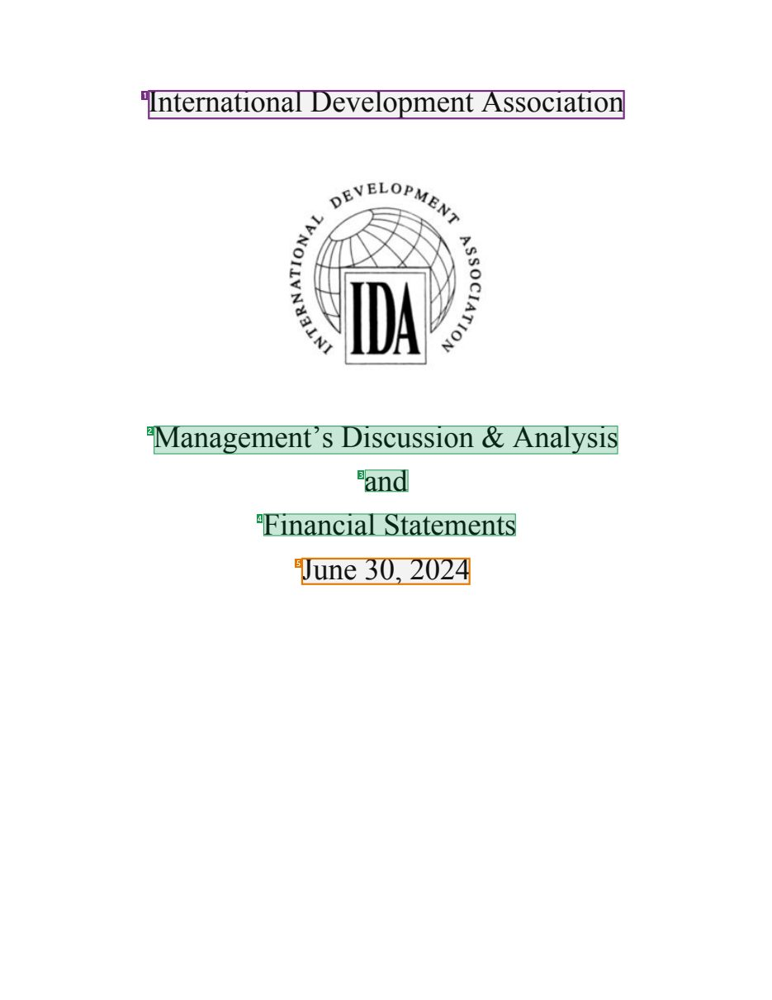
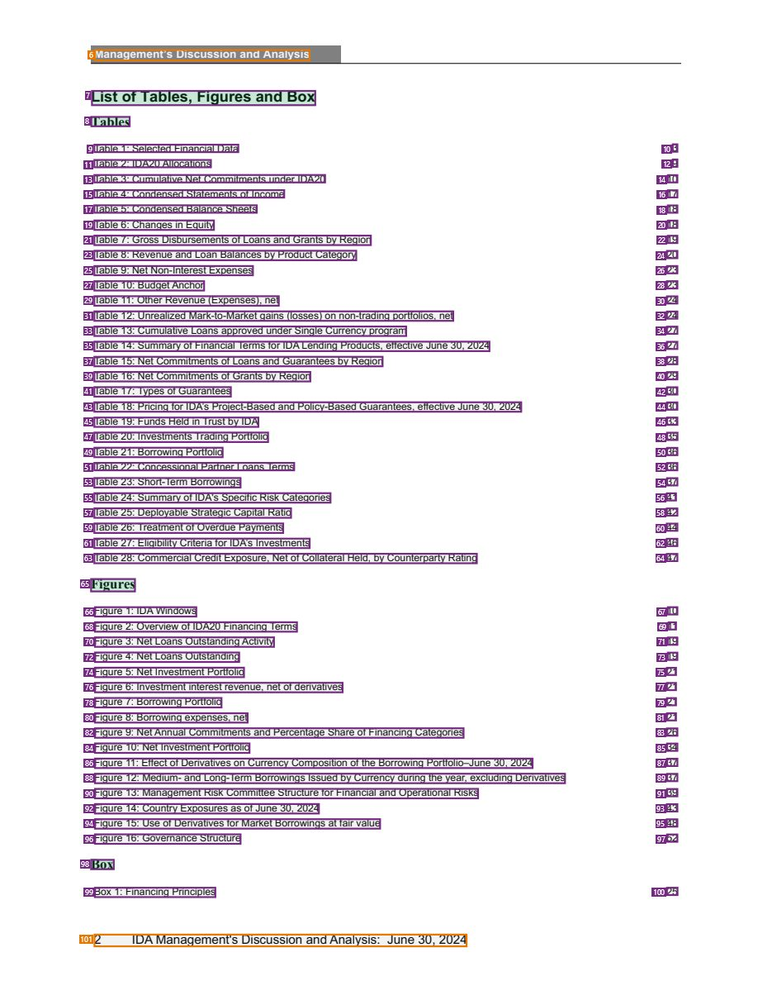
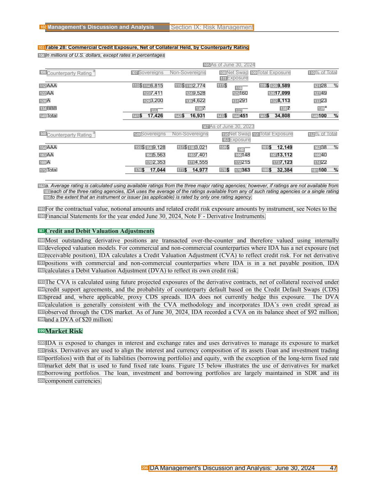
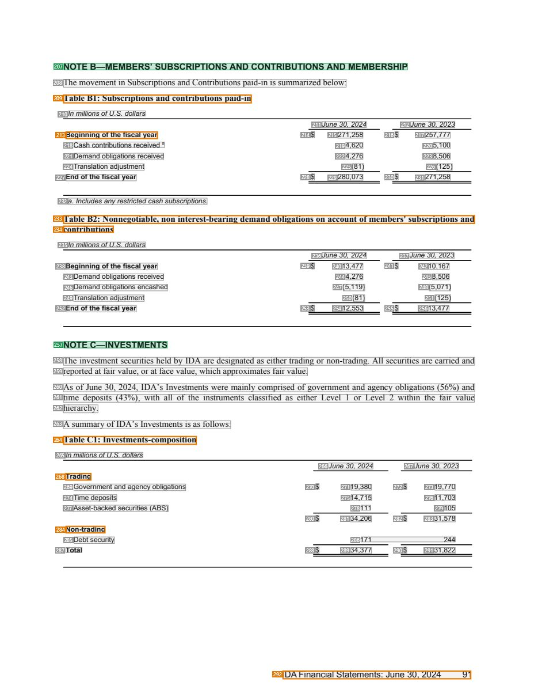

# 044 — `todo10_8/heading_corpus_100/03_tai_chinh_ke_toan/044_IDA_Financial_Statements_June_2024.pdf`

Draft status: `DRAFT_REVIEWER_A_NOT_APPROVED`. Source sha256 `55dee9b16b5616109ba186bb0a4d83632e24d06d5a00beab80b82ca59b3b0d6b`. [Back to index](README.md)

## Page 1 (FIRST)

| # | alias | text | font | draft | flag | rationale |
|---:|---|---|---|---|---|---|
| 1 | L0000:S0 | International DevelopmentAssociation | 24 | **OTHER** | USER_DECIDED | Issuer name on the cover; USER_DECISION_2026_10_10 (Issue #6): OTHER, issuing organization, not the report title |
| 2 | L0001:S0 | Management’s Discussion &amp; Analysis | 24 | **ESTABLISHES** |  | Cover title &quot;Management&#39;s Discussion &amp; Analysis&quot; (24pt, centred) |
| 3 | L0002:S0 | and | 24 | **ESTABLISHES** |  | Cover title connector &quot;and&quot; (part of the title block) |
| 4 | L0003:S0 | Financial Statements | 24 | **ESTABLISHES** |  | Cover title &quot;Financial Statements&quot; |
| 5 | L0004:S0 | June 30, 2024 | 24 | **OTHER** | REVIEW_FOCUS | Reporting date on the cover |

## Page 4 (TARGETED_STRUCTURE)

| # | alias | text | font | draft | flag | rationale |
|---:|---|---|---|---|---|---|
| 6 | L0043:S0 | Management’s Discussion and Analysis | 9 B | **OTHER** | REVIEW_FOCUS | Running header &quot;Management&#39;s Discussion and Analysis&quot; |
| 7 | L0044:S0 | List ofTables, Figures and Box | 12 B | **ESTABLISHES** | USER_DECIDED | Front-matter heading &quot;List of Tables, Figures and Box&quot; (bold 12); USER_DECISION_2026_10_10 (Issue #6): ESTABLISHES (names the list… |
| 8 | L0045:S0 | Tables | 11 B | **ESTABLISHES** | USER_DECIDED | List subheading &quot;Tables&quot; (bold 11); USER_DECISION_2026_10_10 (Issue #6): ESTABLISHES (names the list section here) |
| 9 | L0046:S0 | Table 1 : Selected Financial Data | 8 | **OTHER** | USER_DECIDED | List-of-tables/figures/boxes entry or its page number; USER_DECISION_2026_10_10 (Issue #6): OTHER, navigates to an object caption, not to a … |
| 10 | L0046:S1 | 3 | 8 | **OTHER** | USER_DECIDED | List-of-tables/figures/boxes entry or its page number; USER_DECISION_2026_10_10 (Issue #6): OTHER, navigates to an object caption, not to a … |
| 11 | L0047:S0 | Table 2: IDA20Allocations | 8 | **OTHER** | USER_DECIDED | List-of-tables/figures/boxes entry or its page number; USER_DECISION_2026_10_10 (Issue #6): OTHER, navigates to an object caption, not to a … |
| 12 | L0047:S1 | 9 | 8 | **OTHER** | USER_DECIDED | List-of-tables/figures/boxes entry or its page number; USER_DECISION_2026_10_10 (Issue #6): OTHER, navigates to an object caption, not to a … |
| 13 | L0048:S0 | Table 3: Cumulative Net Commitments under IDA20 | 8 | **OTHER** | USER_DECIDED | List-of-tables/figures/boxes entry or its page number; USER_DECISION_2026_10_10 (Issue #6): OTHER, navigates to an object caption, not to a … |
| 14 | L0048:S1 | 10 | 8 | **OTHER** | USER_DECIDED | List-of-tables/figures/boxes entry or its page number; USER_DECISION_2026_10_10 (Issue #6): OTHER, navigates to an object caption, not to a … |
| 15 | L0049:S0 | Table 4: Condensed Statements of Income | 8 | **OTHER** | USER_DECIDED | List-of-tables/figures/boxes entry or its page number; USER_DECISION_2026_10_10 (Issue #6): OTHER, navigates to an object caption, not to a … |
| 16 | L0049:S1 | 17 | 8 | **OTHER** | USER_DECIDED | List-of-tables/figures/boxes entry or its page number; USER_DECISION_2026_10_10 (Issue #6): OTHER, navigates to an object caption, not to a … |
| 17 | L0050:S0 | Table 5: Condensed Balance Sheets | 8 | **OTHER** | USER_DECIDED | List-of-tables/figures/boxes entry or its page number; USER_DECISION_2026_10_10 (Issue #6): OTHER, navigates to an object caption, not to a … |
| 18 | L0050:S1 | 18 | 8 | **OTHER** | USER_DECIDED | List-of-tables/figures/boxes entry or its page number; USER_DECISION_2026_10_10 (Issue #6): OTHER, navigates to an object caption, not to a … |
| 19 | L0051:S0 | Table 6: Changes in Equity | 8 | **OTHER** | USER_DECIDED | List-of-tables/figures/boxes entry or its page number; USER_DECISION_2026_10_10 (Issue #6): OTHER, navigates to an object caption, not to a … |
| 20 | L0051:S1 | 18 | 8 | **OTHER** | USER_DECIDED | List-of-tables/figures/boxes entry or its page number; USER_DECISION_2026_10_10 (Issue #6): OTHER, navigates to an object caption, not to a … |
| 21 | L0052:S0 | Table 7: Gross Disbursements of Loans and Grants by Region | 8 | **OTHER** | USER_DECIDED | List-of-tables/figures/boxes entry or its page number; USER_DECISION_2026_10_10 (Issue #6): OTHER, navigates to an object caption, not to a … |
| 22 | L0052:S1 | 19 | 8 | **OTHER** | USER_DECIDED | List-of-tables/figures/boxes entry or its page number; USER_DECISION_2026_10_10 (Issue #6): OTHER, navigates to an object caption, not to a … |
| 23 | L0053:S0 | Table 8: Revenue and Loan Balances by Product Category | 8 | **OTHER** | USER_DECIDED | List-of-tables/figures/boxes entry or its page number; USER_DECISION_2026_10_10 (Issue #6): OTHER, navigates to an object caption, not to a … |
| 24 | L0053:S1 | 20 | 8 | **OTHER** | USER_DECIDED | List-of-tables/figures/boxes entry or its page number; USER_DECISION_2026_10_10 (Issue #6): OTHER, navigates to an object caption, not to a … |
| 25 | L0054:S0 | Table 9: Net Non-Interest Expenses | 8 | **OTHER** | USER_DECIDED | List-of-tables/figures/boxes entry or its page number; USER_DECISION_2026_10_10 (Issue #6): OTHER, navigates to an object caption, not to a … |
| 26 | L0054:S1 | 23 | 8 | **OTHER** | USER_DECIDED | List-of-tables/figures/boxes entry or its page number; USER_DECISION_2026_10_10 (Issue #6): OTHER, navigates to an object caption, not to a … |
| 27 | L0055:S0 | Table 10: BudgetAnchor | 8 | **OTHER** | USER_DECIDED | List-of-tables/figures/boxes entry or its page number; USER_DECISION_2026_10_10 (Issue #6): OTHER, navigates to an object caption, not to a … |
| 28 | L0055:S1 | 23 | 8 | **OTHER** | USER_DECIDED | List-of-tables/figures/boxes entry or its page number; USER_DECISION_2026_10_10 (Issue #6): OTHER, navigates to an object caption, not to a … |
| 29 | L0056:S0 | Table 11 : Other Revenue (Expenses), net | 8 | **OTHER** | USER_DECIDED | List-of-tables/figures/boxes entry or its page number; USER_DECISION_2026_10_10 (Issue #6): OTHER, navigates to an object caption, not to a … |
| 30 | L0056:S1 | 24 | 8 | **OTHER** | USER_DECIDED | List-of-tables/figures/boxes entry or its page number; USER_DECISION_2026_10_10 (Issue #6): OTHER, navigates to an object caption, not to a … |
| 31 | L0057:S0 | Table 12: Unrealized Mark-to-Market gains (losses) on non-trading portfolios, net | 8 | **OTHER** | USER_DECIDED | List-of-tables/figures/boxes entry or its page number; USER_DECISION_2026_10_10 (Issue #6): OTHER, navigates to an object caption, not to a … |
| 32 | L0057:S1 | 24 | 8 | **OTHER** | USER_DECIDED | List-of-tables/figures/boxes entry or its page number; USER_DECISION_2026_10_10 (Issue #6): OTHER, navigates to an object caption, not to a … |
| 33 | L0058:S0 | Table 13: Cumulative Loans approved under Single Currency program | 8 | **OTHER** | USER_DECIDED | List-of-tables/figures/boxes entry or its page number; USER_DECISION_2026_10_10 (Issue #6): OTHER, navigates to an object caption, not to a … |
| 34 | L0058:S1 | 27 | 8 | **OTHER** | USER_DECIDED | List-of-tables/figures/boxes entry or its page number; USER_DECISION_2026_10_10 (Issue #6): OTHER, navigates to an object caption, not to a … |
| 35 | L0059:S0 | Table 14: Summary of Financial Terms for IDA Lending Products, effective June 30, 2024 | 8 | **OTHER** | USER_DECIDED | List-of-tables/figures/boxes entry or its page number; USER_DECISION_2026_10_10 (Issue #6): OTHER, navigates to an object caption, not to a … |
| 36 | L0059:S1 | 27 | 8 | **OTHER** | USER_DECIDED | List-of-tables/figures/boxes entry or its page number; USER_DECISION_2026_10_10 (Issue #6): OTHER, navigates to an object caption, not to a … |
| 37 | L0060:S0 | Table 15: Net Commitments of Loans and Guarantees by Region | 8 | **OTHER** | USER_DECIDED | List-of-tables/figures/boxes entry or its page number; USER_DECISION_2026_10_10 (Issue #6): OTHER, navigates to an object caption, not to a … |
| 38 | L0060:S1 | 28 | 8 | **OTHER** | USER_DECIDED | List-of-tables/figures/boxes entry or its page number; USER_DECISION_2026_10_10 (Issue #6): OTHER, navigates to an object caption, not to a … |
| 39 | L0061:S0 | Table 16: Net Commitments of Grants by Region | 8 | **OTHER** | USER_DECIDED | List-of-tables/figures/boxes entry or its page number; USER_DECISION_2026_10_10 (Issue #6): OTHER, navigates to an object caption, not to a … |
| 40 | L0061:S1 | 29 | 8 | **OTHER** | USER_DECIDED | List-of-tables/figures/boxes entry or its page number; USER_DECISION_2026_10_10 (Issue #6): OTHER, navigates to an object caption, not to a … |
| 41 | L0062:S0 | Table 17: Types of Guarantees | 8 | **OTHER** | USER_DECIDED | List-of-tables/figures/boxes entry or its page number; USER_DECISION_2026_10_10 (Issue #6): OTHER, navigates to an object caption, not to a … |
| 42 | L0062:S1 | 30 | 8 | **OTHER** | USER_DECIDED | List-of-tables/figures/boxes entry or its page number; USER_DECISION_2026_10_10 (Issue #6): OTHER, navigates to an object caption, not to a … |
| 43 | L0063:S0 | Table 18: Pricing for IDA’s Project-Based and Policy-Based Guarantees, effective June 30, 2024 | 8 | **OTHER** | USER_DECIDED | List-of-tables/figures/boxes entry or its page number; USER_DECISION_2026_10_10 (Issue #6): OTHER, navigates to an object caption, not to a … |
| 44 | L0063:S1 | 30 | 8 | **OTHER** | USER_DECIDED | List-of-tables/figures/boxes entry or its page number; USER_DECISION_2026_10_10 (Issue #6): OTHER, navigates to an object caption, not to a … |
| 45 | L0064:S0 | Table 19: Funds Held in Trust by IDA | 8 | **OTHER** | USER_DECIDED | List-of-tables/figures/boxes entry or its page number; USER_DECISION_2026_10_10 (Issue #6): OTHER, navigates to an object caption, not to a … |
| 46 | L0064:S1 | 33 | 8 | **OTHER** | USER_DECIDED | List-of-tables/figures/boxes entry or its page number; USER_DECISION_2026_10_10 (Issue #6): OTHER, navigates to an object caption, not to a … |
| 47 | L0065:S0 | Table 20: Investments Trading Portfolio | 8 | **OTHER** | USER_DECIDED | List-of-tables/figures/boxes entry or its page number; USER_DECISION_2026_10_10 (Issue #6): OTHER, navigates to an object caption, not to a … |
| 48 | L0065:S1 | 35 | 8 | **OTHER** | USER_DECIDED | List-of-tables/figures/boxes entry or its page number; USER_DECISION_2026_10_10 (Issue #6): OTHER, navigates to an object caption, not to a … |
| 49 | L0066:S0 | Table 21 : Borrowing Portfolio | 8 | **OTHER** | USER_DECIDED | List-of-tables/figures/boxes entry or its page number; USER_DECISION_2026_10_10 (Issue #6): OTHER, navigates to an object caption, not to a … |
| 50 | L0066:S1 | 36 | 8 | **OTHER** | USER_DECIDED | List-of-tables/figures/boxes entry or its page number; USER_DECISION_2026_10_10 (Issue #6): OTHER, navigates to an object caption, not to a … |
| 51 | L0067:S0 | Table 22: Concessional Partner Loans Terms | 8 | **OTHER** | USER_DECIDED | List-of-tables/figures/boxes entry or its page number; USER_DECISION_2026_10_10 (Issue #6): OTHER, navigates to an object caption, not to a … |
| 52 | L0067:S1 | 36 | 8 | **OTHER** | USER_DECIDED | List-of-tables/figures/boxes entry or its page number; USER_DECISION_2026_10_10 (Issue #6): OTHER, navigates to an object caption, not to a … |
| 53 | L0068:S0 | Table 23: Short-Term Borrowings | 8 | **OTHER** | USER_DECIDED | List-of-tables/figures/boxes entry or its page number; USER_DECISION_2026_10_10 (Issue #6): OTHER, navigates to an object caption, not to a … |
| 54 | L0068:S1 | 37 | 8 | **OTHER** | USER_DECIDED | List-of-tables/figures/boxes entry or its page number; USER_DECISION_2026_10_10 (Issue #6): OTHER, navigates to an object caption, not to a … |
| 55 | L0069:S0 | Table 24: Summary of IDA&#39;s Specific Risk Categories | 8 | **OTHER** | USER_DECIDED | List-of-tables/figures/boxes entry or its page number; USER_DECISION_2026_10_10 (Issue #6): OTHER, navigates to an object caption, not to a … |
| 56 | L0069:S1 | 41 | 8 | **OTHER** | USER_DECIDED | List-of-tables/figures/boxes entry or its page number; USER_DECISION_2026_10_10 (Issue #6): OTHER, navigates to an object caption, not to a … |
| 57 | L0070:S0 | Table 25: Deployable Strategic Capital Ratio | 8 | **OTHER** | USER_DECIDED | List-of-tables/figures/boxes entry or its page number; USER_DECISION_2026_10_10 (Issue #6): OTHER, navigates to an object caption, not to a … |
| 58 | L0070:S1 | 42 | 8 | **OTHER** | USER_DECIDED | List-of-tables/figures/boxes entry or its page number; USER_DECISION_2026_10_10 (Issue #6): OTHER, navigates to an object caption, not to a … |
| 59 | L0071:S0 | Table 26: Treatment of Overdue Payments | 8 | **OTHER** | USER_DECIDED | List-of-tables/figures/boxes entry or its page number; USER_DECISION_2026_10_10 (Issue #6): OTHER, navigates to an object caption, not to a … |
| 60 | L0071:S1 | 44 | 8 | **OTHER** | USER_DECIDED | List-of-tables/figures/boxes entry or its page number; USER_DECISION_2026_10_10 (Issue #6): OTHER, navigates to an object caption, not to a … |
| 61 | L0072:S0 | Table 27: Eligibility Criteria for IDA’s Investments | 8 | **OTHER** | USER_DECIDED | List-of-tables/figures/boxes entry or its page number; USER_DECISION_2026_10_10 (Issue #6): OTHER, navigates to an object caption, not to a … |
| 62 | L0072:S1 | 46 | 8 | **OTHER** | USER_DECIDED | List-of-tables/figures/boxes entry or its page number; USER_DECISION_2026_10_10 (Issue #6): OTHER, navigates to an object caption, not to a … |
| 63 | L0073:S0 | Table 28: Commercial Credit Exposure, Net of Collateral Held, by Counterparty Rating | 8 | **OTHER** | USER_DECIDED | List-of-tables/figures/boxes entry or its page number; USER_DECISION_2026_10_10 (Issue #6): OTHER, navigates to an object caption, not to a … |
| 64 | L0073:S1 | 47 | 8 | **OTHER** | USER_DECIDED | List-of-tables/figures/boxes entry or its page number; USER_DECISION_2026_10_10 (Issue #6): OTHER, navigates to an object caption, not to a … |
| 65 | L0074:S0 | Figures | 11 B | **ESTABLISHES** | USER_DECIDED | List subheading &quot;Figures&quot; (bold 11); USER_DECISION_2026_10_10 (Issue #6): ESTABLISHES (names the list section here) |
| 66 | L0075:S0 | Figure 1 : IDAWindows | 8 | **OTHER** | USER_DECIDED | List-of-tables/figures/boxes entry or its page number; USER_DECISION_2026_10_10 (Issue #6): OTHER, navigates to an object caption, not to a … |
| 67 | L0075:S1 | 10 | 8 | **OTHER** | USER_DECIDED | List-of-tables/figures/boxes entry or its page number; USER_DECISION_2026_10_10 (Issue #6): OTHER, navigates to an object caption, not to a … |
| 68 | L0076:S0 | Figure 2: Overview of IDA20 Financing Terms | 8 | **OTHER** | USER_DECIDED | List-of-tables/figures/boxes entry or its page number; USER_DECISION_2026_10_10 (Issue #6): OTHER, navigates to an object caption, not to a … |
| 69 | L0076:S1 | 11 | 8 | **OTHER** | USER_DECIDED | List-of-tables/figures/boxes entry or its page number; USER_DECISION_2026_10_10 (Issue #6): OTHER, navigates to an object caption, not to a … |
| 70 | L0077:S0 | Figure 3: Net Loans Outstanding Activity | 8 | **OTHER** | USER_DECIDED | List-of-tables/figures/boxes entry or its page number; USER_DECISION_2026_10_10 (Issue #6): OTHER, navigates to an object caption, not to a … |
| 71 | L0077:S1 | 19 | 8 | **OTHER** | USER_DECIDED | List-of-tables/figures/boxes entry or its page number; USER_DECISION_2026_10_10 (Issue #6): OTHER, navigates to an object caption, not to a … |
| 72 | L0078:S0 | Figure 4: Net Loans Outstanding | 8 | **OTHER** | USER_DECIDED | List-of-tables/figures/boxes entry or its page number; USER_DECISION_2026_10_10 (Issue #6): OTHER, navigates to an object caption, not to a … |
| 73 | L0078:S1 | 19 | 8 | **OTHER** | USER_DECIDED | List-of-tables/figures/boxes entry or its page number; USER_DECISION_2026_10_10 (Issue #6): OTHER, navigates to an object caption, not to a … |
| 74 | L0079:S0 | Figure 5: Net Investment Portfolio | 8 | **OTHER** | USER_DECIDED | List-of-tables/figures/boxes entry or its page number; USER_DECISION_2026_10_10 (Issue #6): OTHER, navigates to an object caption, not to a … |
| 75 | L0079:S1 | 21 | 8 | **OTHER** | USER_DECIDED | List-of-tables/figures/boxes entry or its page number; USER_DECISION_2026_10_10 (Issue #6): OTHER, navigates to an object caption, not to a … |
| 76 | L0080:S0 | Figure 6: Investment interest revenue, net of derivatives | 8 | **OTHER** | USER_DECIDED | List-of-tables/figures/boxes entry or its page number; USER_DECISION_2026_10_10 (Issue #6): OTHER, navigates to an object caption, not to a … |
| 77 | L0080:S1 | 21 | 8 | **OTHER** | USER_DECIDED | List-of-tables/figures/boxes entry or its page number; USER_DECISION_2026_10_10 (Issue #6): OTHER, navigates to an object caption, not to a … |
| 78 | L0081:S0 | Figure 7: Borrowing Portfolio | 8 | **OTHER** | USER_DECIDED | List-of-tables/figures/boxes entry or its page number; USER_DECISION_2026_10_10 (Issue #6): OTHER, navigates to an object caption, not to a … |
| 79 | L0081:S1 | 21 | 8 | **OTHER** | USER_DECIDED | List-of-tables/figures/boxes entry or its page number; USER_DECISION_2026_10_10 (Issue #6): OTHER, navigates to an object caption, not to a … |
| 80 | L0082:S0 | Figure 8: Borrowing expenses, net | 8 | **OTHER** | USER_DECIDED | List-of-tables/figures/boxes entry or its page number; USER_DECISION_2026_10_10 (Issue #6): OTHER, navigates to an object caption, not to a … |
| 81 | L0082:S1 | 21 | 8 | **OTHER** | USER_DECIDED | List-of-tables/figures/boxes entry or its page number; USER_DECISION_2026_10_10 (Issue #6): OTHER, navigates to an object caption, not to a … |
| 82 | L0083:S0 | Figure 9: NetAnnual Commitments and Percentage Share of Financing Categories | 8 | **OTHER** | USER_DECIDED | List-of-tables/figures/boxes entry or its page number; USER_DECISION_2026_10_10 (Issue #6): OTHER, navigates to an object caption, not to a … |
| 83 | L0083:S1 | 26 | 8 | **OTHER** | USER_DECIDED | List-of-tables/figures/boxes entry or its page number; USER_DECISION_2026_10_10 (Issue #6): OTHER, navigates to an object caption, not to a … |
| 84 | L0084:S0 | Figure 10: Net Investment Portfolio | 8 | **OTHER** | USER_DECIDED | List-of-tables/figures/boxes entry or its page number; USER_DECISION_2026_10_10 (Issue #6): OTHER, navigates to an object caption, not to a … |
| 85 | L0084:S1 | 34 | 8 | **OTHER** | USER_DECIDED | List-of-tables/figures/boxes entry or its page number; USER_DECISION_2026_10_10 (Issue #6): OTHER, navigates to an object caption, not to a … |
| 86 | L0085:S0 | Figure 11 : Effect of Derivatives on Currency Composition ofthe Borrowing Portfolio–June 30, 2024 | 8 | **OTHER** | USER_DECIDED | List-of-tables/figures/boxes entry or its page number; USER_DECISION_2026_10_10 (Issue #6): OTHER, navigates to an object caption, not to a … |
| 87 | L0085:S1 | 37 | 8 | **OTHER** | USER_DECIDED | List-of-tables/figures/boxes entry or its page number; USER_DECISION_2026_10_10 (Issue #6): OTHER, navigates to an object caption, not to a … |
| 88 | L0086:S0 | Figure 12: Medium- and Long-Term Borrowings Issued by Currency during the year, excluding Derivatives | 8 | **OTHER** | USER_DECIDED | List-of-tables/figures/boxes entry or its page number; USER_DECISION_2026_10_10 (Issue #6): OTHER, navigates to an object caption, not to a … |
| 89 | L0086:S1 | 37 | 8 | **OTHER** | USER_DECIDED | List-of-tables/figures/boxes entry or its page number; USER_DECISION_2026_10_10 (Issue #6): OTHER, navigates to an object caption, not to a … |
| 90 | L0087:S0 | Figure 13: Management Risk Committee Structure for Financial and Operational Risks | 8 | **OTHER** | USER_DECIDED | List-of-tables/figures/boxes entry or its page number; USER_DECISION_2026_10_10 (Issue #6): OTHER, navigates to an object caption, not to a … |
| 91 | L0087:S1 | 39 | 8 | **OTHER** | USER_DECIDED | List-of-tables/figures/boxes entry or its page number; USER_DECISION_2026_10_10 (Issue #6): OTHER, navigates to an object caption, not to a … |
| 92 | L0088:S0 | Figure 14: Country Exposures as of June 30, 2024 | 8 | **OTHER** | USER_DECIDED | List-of-tables/figures/boxes entry or its page number; USER_DECISION_2026_10_10 (Issue #6): OTHER, navigates to an object caption, not to a … |
| 93 | L0088:S1 | 43 | 8 | **OTHER** | USER_DECIDED | List-of-tables/figures/boxes entry or its page number; USER_DECISION_2026_10_10 (Issue #6): OTHER, navigates to an object caption, not to a … |
| 94 | L0089:S0 | Figure 15: Use of Derivatives for Market Borrowings at fair value | 8 | **OTHER** | USER_DECIDED | List-of-tables/figures/boxes entry or its page number; USER_DECISION_2026_10_10 (Issue #6): OTHER, navigates to an object caption, not to a … |
| 95 | L0089:S1 | 48 | 8 | **OTHER** | USER_DECIDED | List-of-tables/figures/boxes entry or its page number; USER_DECISION_2026_10_10 (Issue #6): OTHER, navigates to an object caption, not to a … |
| 96 | L0090:S0 | Figure 16: Governance Structure | 8 | **OTHER** | USER_DECIDED | List-of-tables/figures/boxes entry or its page number; USER_DECISION_2026_10_10 (Issue #6): OTHER, navigates to an object caption, not to a … |
| 97 | L0090:S1 | 52 | 8 | **OTHER** | USER_DECIDED | List-of-tables/figures/boxes entry or its page number; USER_DECISION_2026_10_10 (Issue #6): OTHER, navigates to an object caption, not to a … |
| 98 | L0091:S0 | Box | 11 B | **ESTABLISHES** | USER_DECIDED | List subheading &quot;Box&quot; (bold 11); USER_DECISION_2026_10_10 (Issue #6): ESTABLISHES (names the list section here) |
| 99 | L0092:S0 | Box 1 : Financing Principles | 8 | **OTHER** | USER_DECIDED | List-of-tables/figures/boxes entry or its page number; USER_DECISION_2026_10_10 (Issue #6): OTHER, navigates to an object caption, not to a … |
| 100 | L0092:S1 | 25 | 8 | **OTHER** | USER_DECIDED | List-of-tables/figures/boxes entry or its page number; USER_DECISION_2026_10_10 (Issue #6): OTHER, navigates to an object caption, not to a … |
| 101 | L0093:S0 | 2 IDA Management&#39;s Discussion and Analysis: June 30, 2024 | 10 | **OTHER** | REVIEW_FOCUS | Running footer with page number |

## Page 49 (SEEDED_INTERIOR)

| # | alias | text | font | draft | flag | rationale |
|---:|---|---|---|---|---|---|
| 102 | L1875:S0 | Management’s Discussion and Analysis Section IX: Risk Management | 9 B | **OTHER** | REVIEW_FOCUS | Running header with section name |
| 103 | L1876:S0 | Table 28: Commercial Credit Exposure, Net of Collateral Held, by Counterparty Rating | 8 B | **OTHER** | REVIEW_FOCUS | Table caption &quot;Table 28: ...&quot; (object caption, not a heading) |
| 104 | L1877:S0 | In millions ofU.S. dollars, exceptrates in percentages | 8 I | **OTHER** |  | Default: body text, list item, table cell, page number or other non-heading content on this page |
| 105 | L1878:S0 | As ofJune 30, 2024 | 8 | **OTHER** |  | Default: body text, list item, table cell, page number or other non-heading content on this page |
| 106 | L1879:S0 | Counterparty Rating a | 8 | **OTHER** |  | Default: body text, list item, table cell, page number or other non-heading content on this page |
| 107 | L1879:S1 | Sovereigns Non-Sovereigns | 8 | **OTHER** |  | Default: body text, list item, table cell, page number or other non-heading content on this page |
| 108 | L1879:S2 | Net Swap | 8 | **OTHER** |  | Default: body text, list item, table cell, page number or other non-heading content on this page |
| 109 | L1879:S3 | Total Exposure | 8 | **OTHER** |  | Default: body text, list item, table cell, page number or other non-heading content on this page |
| 110 | L1879:S4 | % ofTotal | 8 | **OTHER** |  | Default: body text, list item, table cell, page number or other non-heading content on this page |
| 111 | L1880:S0 | Exposure | 8 | **OTHER** |  | Default: body text, list item, table cell, page number or other non-heading content on this page |
| 112 | L1881:S0 | AAA | 8 | **OTHER** |  | Default: body text, list item, table cell, page number or other non-heading content on this page |
| 113 | L1881:S1 | $ | 8 | **OTHER** |  | Default: body text, list item, table cell, page number or other non-heading content on this page |
| 114 | L1881:S2 | 6,815 | 8 | **OTHER** |  | Default: body text, list item, table cell, page number or other non-heading content on this page |
| 115 | L1881:S3 | $ | 8 | **OTHER** |  | Default: body text, list item, table cell, page number or other non-heading content on this page |
| 116 | L1881:S4 | 2,774 | 8 | **OTHER** |  | Default: body text, list item, table cell, page number or other non-heading content on this page |
| 117 | L1881:S5 | $ | 8 | **OTHER** |  | Default: body text, list item, table cell, page number or other non-heading content on this page |
| 118 | L1881:S6 | — | 8 | **OTHER** |  | Default: body text, list item, table cell, page number or other non-heading content on this page |
| 119 | L1881:S7 | $ | 8 B | **OTHER** |  | Default: body text, list item, table cell, page number or other non-heading content on this page |
| 120 | L1881:S8 | 9,589 | 8 B | **OTHER** |  | Default: body text, list item, table cell, page number or other non-heading content on this page |
| 121 | L1881:S9 | 28 % | 8 | **OTHER** |  | Default: body text, list item, table cell, page number or other non-heading content on this page |
| 122 | L1882:S0 | AA | 8 | **OTHER** |  | Default: body text, list item, table cell, page number or other non-heading content on this page |
| 123 | L1882:S1 | 7,41 1 | 8 | **OTHER** |  | Default: body text, list item, table cell, page number or other non-heading content on this page |
| 124 | L1882:S2 | 9,528 | 8 | **OTHER** |  | Default: body text, list item, table cell, page number or other non-heading content on this page |
| 125 | L1882:S3 | 160 | 8 | **OTHER** |  | Default: body text, list item, table cell, page number or other non-heading content on this page |
| 126 | L1882:S4 | 17,099 | 8 B | **OTHER** |  | Default: body text, list item, table cell, page number or other non-heading content on this page |
| 127 | L1882:S5 | 49 | 8 | **OTHER** |  | Default: body text, list item, table cell, page number or other non-heading content on this page |
| 128 | L1883:S0 | A | 8 | **OTHER** |  | Default: body text, list item, table cell, page number or other non-heading content on this page |
| 129 | L1883:S1 | 3,200 | 8 | **OTHER** |  | Default: body text, list item, table cell, page number or other non-heading content on this page |
| 130 | L1883:S2 | 4,622 | 8 | **OTHER** |  | Default: body text, list item, table cell, page number or other non-heading content on this page |
| 131 | L1883:S3 | 291 | 8 | **OTHER** |  | Default: body text, list item, table cell, page number or other non-heading content on this page |
| 132 | L1883:S4 | 8,113 | 8 B | **OTHER** |  | Default: body text, list item, table cell, page number or other non-heading content on this page |
| 133 | L1883:S5 | 23 | 8 | **OTHER** |  | Default: body text, list item, table cell, page number or other non-heading content on this page |
| 134 | L1884:S0 | BBB | 8 | **OTHER** |  | Default: body text, list item, table cell, page number or other non-heading content on this page |
| 135 | L1884:S1 | — | 8 | **OTHER** |  | Default: body text, list item, table cell, page number or other non-heading content on this page |
| 136 | L1884:S2 | 7 | 8 | **OTHER** |  | Default: body text, list item, table cell, page number or other non-heading content on this page |
| 137 | L1884:S3 | — | 8 | **OTHER** |  | Default: body text, list item, table cell, page number or other non-heading content on this page |
| 138 | L1884:S4 | 7 | 8 B | **OTHER** |  | Default: body text, list item, table cell, page number or other non-heading content on this page |
| 139 | L1884:S5 | * | 8 | **OTHER** |  | Default: body text, list item, table cell, page number or other non-heading content on this page |
| 140 | L1885:S0 | Total | 8 | **OTHER** |  | Default: body text, list item, table cell, page number or other non-heading content on this page |
| 141 | L1885:S1 | $ 17,426 | 8 B | **OTHER** |  | Default: body text, list item, table cell, page number or other non-heading content on this page |
| 142 | L1885:S2 | $ 16,931 | 8 B | **OTHER** |  | Default: body text, list item, table cell, page number or other non-heading content on this page |
| 143 | L1885:S3 | $ | 8 B | **OTHER** |  | Default: body text, list item, table cell, page number or other non-heading content on this page |
| 144 | L1885:S4 | 451 | 8 B | **OTHER** |  | Default: body text, list item, table cell, page number or other non-heading content on this page |
| 145 | L1885:S5 | $ 34,808 | 8 B | **OTHER** |  | Default: body text, list item, table cell, page number or other non-heading content on this page |
| 146 | L1885:S6 | 100 % | 8 B | **OTHER** |  | Default: body text, list item, table cell, page number or other non-heading content on this page |
| 147 | L1886:S0 | As of June 30, 2023 | 8 | **OTHER** |  | Default: body text, list item, table cell, page number or other non-heading content on this page |
| 148 | L1887:S0 | Counterparty Rating a | 8 | **OTHER** |  | Default: body text, list item, table cell, page number or other non-heading content on this page |
| 149 | L1887:S1 | Sovereigns Non-Sovereigns | 8 | **OTHER** |  | Default: body text, list item, table cell, page number or other non-heading content on this page |
| 150 | L1887:S2 | Net Swap | 8 | **OTHER** |  | Default: body text, list item, table cell, page number or other non-heading content on this page |
| 151 | L1887:S3 | Total Exposure | 8 | **OTHER** |  | Default: body text, list item, table cell, page number or other non-heading content on this page |
| 152 | L1887:S4 | % ofTotal | 8 | **OTHER** |  | Default: body text, list item, table cell, page number or other non-heading content on this page |
| 153 | L1888:S0 | Exposure | 8 | **OTHER** |  | Default: body text, list item, table cell, page number or other non-heading content on this page |
| 154 | L1889:S0 | AAA | 8 | **OTHER** |  | Default: body text, list item, table cell, page number or other non-heading content on this page |
| 155 | L1889:S1 | $ | 8 | **OTHER** |  | Default: body text, list item, table cell, page number or other non-heading content on this page |
| 156 | L1889:S2 | 9,128 | 8 | **OTHER** |  | Default: body text, list item, table cell, page number or other non-heading content on this page |
| 157 | L1889:S3 | $ | 8 | **OTHER** |  | Default: body text, list item, table cell, page number or other non-heading content on this page |
| 158 | L1889:S4 | 3,021 | 8 | **OTHER** |  | Default: body text, list item, table cell, page number or other non-heading content on this page |
| 159 | L1889:S5 | $ | 8 | **OTHER** |  | Default: body text, list item, table cell, page number or other non-heading content on this page |
| 160 | L1889:S6 | — | 8 | **OTHER** |  | Default: body text, list item, table cell, page number or other non-heading content on this page |
| 161 | L1889:S7 | $ 12,149 | 8 B | **OTHER** |  | Default: body text, list item, table cell, page number or other non-heading content on this page |
| 162 | L1889:S8 | 38 % | 8 | **OTHER** |  | Default: body text, list item, table cell, page number or other non-heading content on this page |
| 163 | L1890:S0 | AA | 8 | **OTHER** |  | Default: body text, list item, table cell, page number or other non-heading content on this page |
| 164 | L1890:S1 | 5,563 | 8 | **OTHER** |  | Default: body text, list item, table cell, page number or other non-heading content on this page |
| 165 | L1890:S2 | 7,401 | 8 | **OTHER** |  | Default: body text, list item, table cell, page number or other non-heading content on this page |
| 166 | L1890:S3 | 148 | 8 | **OTHER** |  | Default: body text, list item, table cell, page number or other non-heading content on this page |
| 167 | L1890:S4 | 13,112 | 8 B | **OTHER** |  | Default: body text, list item, table cell, page number or other non-heading content on this page |
| 168 | L1890:S5 | 40 | 8 | **OTHER** |  | Default: body text, list item, table cell, page number or other non-heading content on this page |
| 169 | L1891:S0 | A | 8 | **OTHER** |  | Default: body text, list item, table cell, page number or other non-heading content on this page |
| 170 | L1891:S1 | 2,353 | 8 | **OTHER** |  | Default: body text, list item, table cell, page number or other non-heading content on this page |
| 171 | L1891:S2 | 4,555 | 8 | **OTHER** |  | Default: body text, list item, table cell, page number or other non-heading content on this page |
| 172 | L1891:S3 | 215 | 8 | **OTHER** |  | Default: body text, list item, table cell, page number or other non-heading content on this page |
| 173 | L1891:S4 | 7,123 | 8 B | **OTHER** |  | Default: body text, list item, table cell, page number or other non-heading content on this page |
| 174 | L1891:S5 | 22 | 8 | **OTHER** |  | Default: body text, list item, table cell, page number or other non-heading content on this page |
| 175 | L1892:S0 | Total | 8 | **OTHER** |  | Default: body text, list item, table cell, page number or other non-heading content on this page |
| 176 | L1892:S1 | $ 17,044 | 8 B | **OTHER** |  | Default: body text, list item, table cell, page number or other non-heading content on this page |
| 177 | L1892:S2 | $ 14,977 | 8 B | **OTHER** |  | Default: body text, list item, table cell, page number or other non-heading content on this page |
| 178 | L1892:S3 | $ | 8 B | **OTHER** |  | Default: body text, list item, table cell, page number or other non-heading content on this page |
| 179 | L1892:S4 | 363 | 8 B | **OTHER** |  | Default: body text, list item, table cell, page number or other non-heading content on this page |
| 180 | L1892:S5 | $ 32,384 | 8 B | **OTHER** |  | Default: body text, list item, table cell, page number or other non-heading content on this page |
| 181 | L1892:S6 | 100 % | 8 B | **OTHER** |  | Default: body text, list item, table cell, page number or other non-heading content on this page |
| 182 | L1893:S0 | a. Average rating is calculated using available ratings from the three majorrating agencies; however, ifratings are not … | 8 I | **OTHER** |  | Default: body text, list item, table cell, page number or other non-heading content on this page |
| 183 | L1894:S0 | each ofthe three rating agencies, IDA uses the average ofthe ratings available from anyofsuch rating agencies ora single… | 8 I | **OTHER** |  | Default: body text, list item, table cell, page number or other non-heading content on this page |
| 184 | L1895:S0 | to the extent that an instrument orissuer (as applicable) is ratedbyonlyone rating agency. | 8 I | **OTHER** |  | Default: body text, list item, table cell, page number or other non-heading content on this page |
| 185 | L1896:S0 | Forthe contractual value, notional amounts andrelated creditrisk exposure amounts by instrument, seeNotes to the | 10 | **OTHER** |  | Default: body text, list item, table cell, page number or other non-heading content on this page |
| 186 | L1897:S0 | Financial Statements forthe year endedJune 30, 2024, Note F - Derivative Instruments. | 10 | **OTHER** |  | Default: body text, list item, table cell, page number or other non-heading content on this page |
| 187 | L1898:S0 | Credit and DebitValuation Adjustments | 10 B | **ESTABLISHES** |  | Subsection heading &quot;Credit and Debit Valuation Adjustments&quot; (bold 10, standalone) |
| 188 | L1899:S0 | Most outstanding derivative positions are transacted over-the-counter and therefore valued using internally | 10 | **OTHER** |  | Default: body text, list item, table cell, page number or other non-heading content on this page |
| 189 | L1900:S0 | developed valuation models. For commercial andnon-commercial counterparties where IDA has a net exposure (net | 10 | **OTHER** |  | Default: body text, list item, table cell, page number or other non-heading content on this page |
| 190 | L1901:S0 | receivable position), IDA calculates a Credit Valuation Adjustment (CVA) to reflect credit risk. For net derivative | 10 | **OTHER** |  | Default: body text, list item, table cell, page number or other non-heading content on this page |
| 191 | L1902:S0 | positions with commercial and non-commercial counterparties where IDA is in a net payable position, IDA | 10 | **OTHER** |  | Default: body text, list item, table cell, page number or other non-heading content on this page |
| 192 | L1903:S0 | calculates aDebitValuationAdjustment (DVA) to reflect its own creditrisk. | 10 | **OTHER** |  | Default: body text, list item, table cell, page number or other non-heading content on this page |
| 193 | L1904:S0 | The CVA is calculated using future projected exposures ofthe derivative contracts, net ofcollateral received under | 10 | **OTHER** |  | Default: body text, list item, table cell, page number or other non-heading content on this page |
| 194 | L1905:S0 | credit support agreements, and the probability of counterparty default based on the Credit Default Swaps (CDS) | 10 | **OTHER** |  | Default: body text, list item, table cell, page number or other non-heading content on this page |
| 195 | L1906:S0 | spread and, where applicable, proxy CDS spreads. IDA does not currently hedge this exposure. The DVA | 10 | **OTHER** |  | Default: body text, list item, table cell, page number or other non-heading content on this page |
| 196 | L1907:S0 | calculation is generally consistent with the CVA methodology and incorporates IDA’s own credit spread as | 10 | **OTHER** |  | Default: body text, list item, table cell, page number or other non-heading content on this page |
| 197 | L1908:S0 | observed through the CDS market. As ofJune 30, 2024, IDA recorded a CVA on its balance sheet of$92 million, | 10 | **OTHER** |  | Default: body text, list item, table cell, page number or other non-heading content on this page |
| 198 | L1909:S0 | and aDVA of$20 million. | 10 | **OTHER** |  | Default: body text, list item, table cell, page number or other non-heading content on this page |
| 199 | L1910:S0 | Market Risk | 11 B | **ESTABLISHES** |  | Subsection heading &quot;Market Risk&quot; (bold 11, standalone) |
| 200 | L1911:S0 | IDA is exposed to changes in interest and exchange rates and uses derivatives to manage its exposure to market | 10 | **OTHER** |  | Default: body text, list item, table cell, page number or other non-heading content on this page |
| 201 | L1912:S0 | risks. Derivatives are used to align the interest and currency composition ofits assets (loan and investment trading | 10 | **OTHER** |  | Default: body text, list item, table cell, page number or other non-heading content on this page |
| 202 | L1913:S0 | portfolios) with that ofits liabilities (borrowing portfolio) and equity, with the exception ofthe long-term fixed rate | 10 | **OTHER** |  | Default: body text, list item, table cell, page number or other non-heading content on this page |
| 203 | L1914:S0 | market debt that is used to fund fixed rate loans. Figure 15 below illustrates the use of derivatives for market | 10 | **OTHER** |  | Default: body text, list item, table cell, page number or other non-heading content on this page |
| 204 | L1915:S0 | borrowing portfolios. The loan, investment and borrowing portfolios are largely maintained in SDR and its | 10 | **OTHER** |  | Default: body text, list item, table cell, page number or other non-heading content on this page |
| 205 | L1916:S0 | component currencies. | 10 | **OTHER** |  | Default: body text, list item, table cell, page number or other non-heading content on this page |
| 206 | L1917:S0 | IDA Management&#39;s Discussion and Analysis: June 30, 2024 47 | 10 | **OTHER** | REVIEW_FOCUS | Running footer |

## Page 93 (SEEDED_INTERIOR)

| # | alias | text | font | draft | flag | rationale |
|---:|---|---|---|---|---|---|
| 207 | L3349:S0 | NOTE B—MEMBERS’ SUBSCRIPTIONS AND CONTRIBUTIONS AND MEMBERSHIP | 10 B | **ESTABLISHES** |  | Note heading &quot;NOTE B—MEMBERS&#39; SUBSCRIPTIONS AND CONTRIBUTIONS AND MEMBERSHIP&quot; |
| 208 | L3350:S0 | The movement in Subscriptions and Contributions paid-in is summarizedbelow: | 10 | **OTHER** |  | Default: body text, list item, table cell, page number or other non-heading content on this page |
| 209 | L3351:S0 | Table B1: Subscriptions and contributions paid-in | 10 B | **OTHER** | REVIEW_FOCUS | Table caption &quot;Table B1: ...&quot; (object caption) |
| 210 | L3352:S0 | In millions ofU.S. dollars | 8 I | **OTHER** |  | Default: body text, list item, table cell, page number or other non-heading content on this page |
| 211 | L3353:S0 | June 30, 2024 | 8 I | **OTHER** |  | Default: body text, list item, table cell, page number or other non-heading content on this page |
| 212 | L3353:S1 | June 30, 2023 | 8 I | **OTHER** |  | Default: body text, list item, table cell, page number or other non-heading content on this page |
| 213 | L3354:S0 | Beginning ofthe fiscal year | 8 B | **OTHER** | REVIEW_FOCUS | Table row label &quot;Beginning of the fiscal year&quot; (bold row label) |
| 214 | L3354:S1 | $ | 8 | **OTHER** |  | Default: body text, list item, table cell, page number or other non-heading content on this page |
| 215 | L3354:S2 | 271,258 | 8 | **OTHER** |  | Default: body text, list item, table cell, page number or other non-heading content on this page |
| 216 | L3354:S3 | $ | 8 | **OTHER** |  | Default: body text, list item, table cell, page number or other non-heading content on this page |
| 217 | L3354:S4 | 257,777 | 8 | **OTHER** |  | Default: body text, list item, table cell, page number or other non-heading content on this page |
| 218 | L3355:S0 | Cash contributions received a | 8 | **OTHER** |  | Default: body text, list item, table cell, page number or other non-heading content on this page |
| 219 | L3355:S1 | 4,620 | 8 | **OTHER** |  | Default: body text, list item, table cell, page number or other non-heading content on this page |
| 220 | L3355:S2 | 5,100 | 8 | **OTHER** |  | Default: body text, list item, table cell, page number or other non-heading content on this page |
| 221 | L3356:S0 | Demand obligations received | 8 | **OTHER** |  | Default: body text, list item, table cell, page number or other non-heading content on this page |
| 222 | L3356:S1 | 4,276 | 8 | **OTHER** |  | Default: body text, list item, table cell, page number or other non-heading content on this page |
| 223 | L3356:S2 | 8,506 | 8 | **OTHER** |  | Default: body text, list item, table cell, page number or other non-heading content on this page |
| 224 | L3357:S0 | Translation adjustment | 8 | **OTHER** |  | Default: body text, list item, table cell, page number or other non-heading content on this page |
| 225 | L3357:S1 | (81) | 8 | **OTHER** |  | Default: body text, list item, table cell, page number or other non-heading content on this page |
| 226 | L3357:S2 | (125) | 8 | **OTHER** |  | Default: body text, list item, table cell, page number or other non-heading content on this page |
| 227 | L3358:S0 | End ofthe fiscal year | 8 B | **OTHER** |  | Default: body text, list item, table cell, page number or other non-heading content on this page |
| 228 | L3358:S1 | $ | 8 | **OTHER** |  | Default: body text, list item, table cell, page number or other non-heading content on this page |
| 229 | L3358:S2 | 280,073 | 8 | **OTHER** |  | Default: body text, list item, table cell, page number or other non-heading content on this page |
| 230 | L3358:S3 | $ | 8 | **OTHER** |  | Default: body text, list item, table cell, page number or other non-heading content on this page |
| 231 | L3358:S4 | 271,258 | 8 | **OTHER** |  | Default: body text, list item, table cell, page number or other non-heading content on this page |
| 232 | L3359:S0 | a. Includes anyrestricted cash subscriptions. | 8 I | **OTHER** |  | Default: body text, list item, table cell, page number or other non-heading content on this page |
| 233 | L3360:S0 | Table B2: Nonnegotiable, non interest-bearing demand obligations on account ofmembers&#39; subscriptions and | 10 B | **OTHER** | REVIEW_FOCUS | Table caption &quot;Table B2: ...&quot; line 1 (object caption) |
| 234 | L3361:S0 | contributions | 10 B | **OTHER** | REVIEW_FOCUS | Table caption &quot;Table B2: ...&quot; line 2 |
| 235 | L3362:S0 | In millions ofU.S. dollars | 8 I | **OTHER** |  | Default: body text, list item, table cell, page number or other non-heading content on this page |
| 236 | L3363:S0 | June 30, 2024 | 8 I | **OTHER** |  | Default: body text, list item, table cell, page number or other non-heading content on this page |
| 237 | L3363:S1 | June 30, 2023 | 8 I | **OTHER** |  | Default: body text, list item, table cell, page number or other non-heading content on this page |
| 238 | L3364:S0 | Beginning ofthe fiscal year | 8 B | **OTHER** |  | Default: body text, list item, table cell, page number or other non-heading content on this page |
| 239 | L3364:S1 | $ | 8 | **OTHER** |  | Default: body text, list item, table cell, page number or other non-heading content on this page |
| 240 | L3364:S2 | 13,477 | 8 | **OTHER** |  | Default: body text, list item, table cell, page number or other non-heading content on this page |
| 241 | L3364:S3 | $ | 8 | **OTHER** |  | Default: body text, list item, table cell, page number or other non-heading content on this page |
| 242 | L3364:S4 | 10,167 | 8 | **OTHER** |  | Default: body text, list item, table cell, page number or other non-heading content on this page |
| 243 | L3365:S0 | Demand obligations received | 8 | **OTHER** |  | Default: body text, list item, table cell, page number or other non-heading content on this page |
| 244 | L3365:S1 | 4,276 | 8 | **OTHER** |  | Default: body text, list item, table cell, page number or other non-heading content on this page |
| 245 | L3365:S2 | 8,506 | 8 | **OTHER** |  | Default: body text, list item, table cell, page number or other non-heading content on this page |
| 246 | L3366:S0 | Demand obligations encashed | 8 | **OTHER** |  | Default: body text, list item, table cell, page number or other non-heading content on this page |
| 247 | L3366:S1 | (5,1 19) | 8 | **OTHER** |  | Default: body text, list item, table cell, page number or other non-heading content on this page |
| 248 | L3366:S2 | (5,071) | 8 | **OTHER** |  | Default: body text, list item, table cell, page number or other non-heading content on this page |
| 249 | L3367:S0 | Translation adjustment | 8 | **OTHER** |  | Default: body text, list item, table cell, page number or other non-heading content on this page |
| 250 | L3367:S1 | (81) | 8 | **OTHER** |  | Default: body text, list item, table cell, page number or other non-heading content on this page |
| 251 | L3367:S2 | (125) | 8 | **OTHER** |  | Default: body text, list item, table cell, page number or other non-heading content on this page |
| 252 | L3368:S0 | End ofthe fiscal year | 8 B | **OTHER** |  | Default: body text, list item, table cell, page number or other non-heading content on this page |
| 253 | L3368:S1 | $ | 8 | **OTHER** |  | Default: body text, list item, table cell, page number or other non-heading content on this page |
| 254 | L3368:S2 | 12,553 | 8 | **OTHER** |  | Default: body text, list item, table cell, page number or other non-heading content on this page |
| 255 | L3368:S3 | $ | 8 | **OTHER** |  | Default: body text, list item, table cell, page number or other non-heading content on this page |
| 256 | L3368:S4 | 13,477 | 8 | **OTHER** |  | Default: body text, list item, table cell, page number or other non-heading content on this page |
| 257 | L3369:S0 | NOTE C—INVESTMENTS | 10 B | **ESTABLISHES** |  | Note heading &quot;NOTE C—INVESTMENTS&quot; |
| 258 | L3370:S0 | The investment securities held by IDA are designated as either trading or non-trading. All securities are carried and | 10 | **OTHER** |  | Default: body text, list item, table cell, page number or other non-heading content on this page |
| 259 | L3371:S0 | reported at fairvalue, or at face value, which approximates fairvalue. | 10 | **OTHER** |  | Default: body text, list item, table cell, page number or other non-heading content on this page |
| 260 | L3372:S0 | As ofJune 30, 2024, IDA’s Investments were mainly comprised ofgovernment and agency obligations (56%) and | 10 | **OTHER** |  | Default: body text, list item, table cell, page number or other non-heading content on this page |
| 261 | L3373:S0 | time deposits (43%), with all of the instruments classified as either Level 1 or Level 2 within the fair value | 10 | **OTHER** |  | Default: body text, list item, table cell, page number or other non-heading content on this page |
| 262 | L3374:S0 | hierarchy. | 10 | **OTHER** |  | Default: body text, list item, table cell, page number or other non-heading content on this page |
| 263 | L3375:S0 | A summary ofIDA’s Investments is as follows: | 10 | **OTHER** |  | Default: body text, list item, table cell, page number or other non-heading content on this page |
| 264 | L3376:S0 | Table C1: Investments-composition | 10 B | **OTHER** | REVIEW_FOCUS | Table caption &quot;Table C1: ...&quot; (object caption) |
| 265 | L3377:S0 | In millions ofU.S. dollars | 8 I | **OTHER** |  | Default: body text, list item, table cell, page number or other non-heading content on this page |
| 266 | L3378:S0 | June 30, 2024 | 8 I | **OTHER** |  | Default: body text, list item, table cell, page number or other non-heading content on this page |
| 267 | L3378:S1 | June 30, 2023 | 8 I | **OTHER** |  | Default: body text, list item, table cell, page number or other non-heading content on this page |
| 268 | L3379:S0 | Trading | 8 B | **OTHER** | REVIEW_FOCUS | Table row group label &quot;Trading&quot; |
| 269 | L3380:S0 | Government and agency obligations | 8 | **OTHER** |  | Default: body text, list item, table cell, page number or other non-heading content on this page |
| 270 | L3380:S1 | $ | 8 | **OTHER** |  | Default: body text, list item, table cell, page number or other non-heading content on this page |
| 271 | L3380:S2 | 19,380 | 8 | **OTHER** |  | Default: body text, list item, table cell, page number or other non-heading content on this page |
| 272 | L3380:S3 | $ | 8 | **OTHER** |  | Default: body text, list item, table cell, page number or other non-heading content on this page |
| 273 | L3380:S4 | 19,770 | 8 | **OTHER** |  | Default: body text, list item, table cell, page number or other non-heading content on this page |
| 274 | L3381:S0 | Time deposits | 8 | **OTHER** |  | Default: body text, list item, table cell, page number or other non-heading content on this page |
| 275 | L3381:S1 | 14,715 | 8 | **OTHER** |  | Default: body text, list item, table cell, page number or other non-heading content on this page |
| 276 | L3381:S2 | 1 1,703 | 8 | **OTHER** |  | Default: body text, list item, table cell, page number or other non-heading content on this page |
| 277 | L3382:S0 | Asset-backed securities (ABS) | 8 | **OTHER** |  | Default: body text, list item, table cell, page number or other non-heading content on this page |
| 278 | L3382:S1 | 1 1 1 | 8 | **OTHER** |  | Default: body text, list item, table cell, page number or other non-heading content on this page |
| 279 | L3382:S2 | 105 | 8 | **OTHER** |  | Default: body text, list item, table cell, page number or other non-heading content on this page |
| 280 | L3383:S0 | $ | 8 | **OTHER** |  | Default: body text, list item, table cell, page number or other non-heading content on this page |
| 281 | L3383:S1 | 34,206 | 8 | **OTHER** |  | Default: body text, list item, table cell, page number or other non-heading content on this page |
| 282 | L3383:S2 | $ | 8 | **OTHER** |  | Default: body text, list item, table cell, page number or other non-heading content on this page |
| 283 | L3383:S3 | 31,578 | 8 | **OTHER** |  | Default: body text, list item, table cell, page number or other non-heading content on this page |
| 284 | L3384:S0 | Non-trading | 8 B | **OTHER** | REVIEW_FOCUS | Table row group label &quot;Non-trading&quot; |
| 285 | L3385:S0 | Debt security | 8 | **OTHER** |  | Default: body text, list item, table cell, page number or other non-heading content on this page |
| 286 | L3385:S1 | 171 244 | 8 | **OTHER** |  | Default: body text, list item, table cell, page number or other non-heading content on this page |
| 287 | L3386:S0 | Total | 8 B | **OTHER** |  | Default: body text, list item, table cell, page number or other non-heading content on this page |
| 288 | L3386:S1 | $ | 8 | **OTHER** |  | Default: body text, list item, table cell, page number or other non-heading content on this page |
| 289 | L3386:S2 | 34,377 | 8 | **OTHER** |  | Default: body text, list item, table cell, page number or other non-heading content on this page |
| 290 | L3386:S3 | $ | 8 | **OTHER** |  | Default: body text, list item, table cell, page number or other non-heading content on this page |
| 291 | L3386:S4 | 31,822 | 8 | **OTHER** |  | Default: body text, list item, table cell, page number or other non-heading content on this page |
| 292 | L3387:S0 | IDA Financial Statements: June 30, 2024 91 | 10 | **OTHER** | REVIEW_FOCUS | Running footer |
