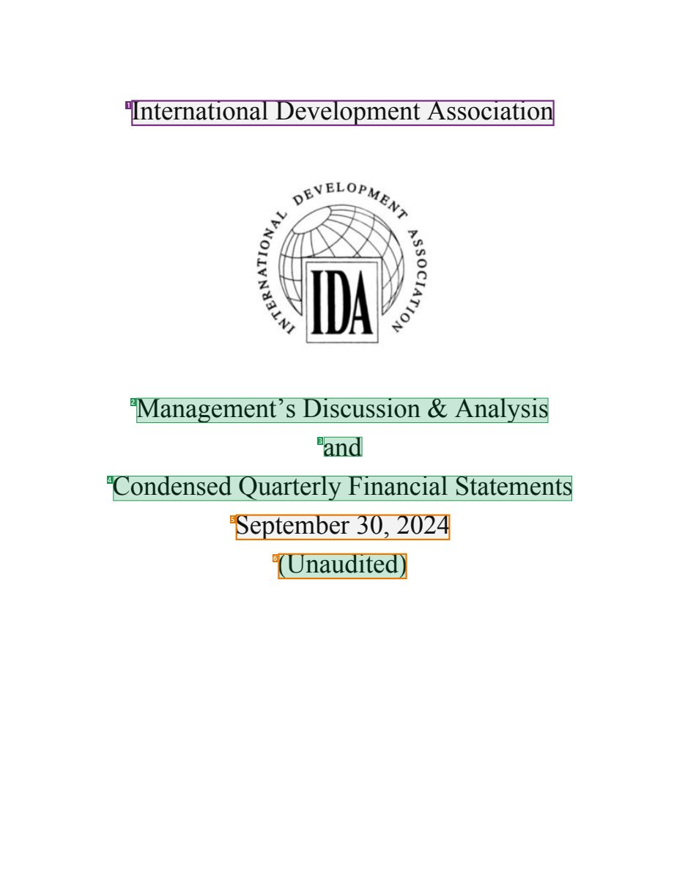
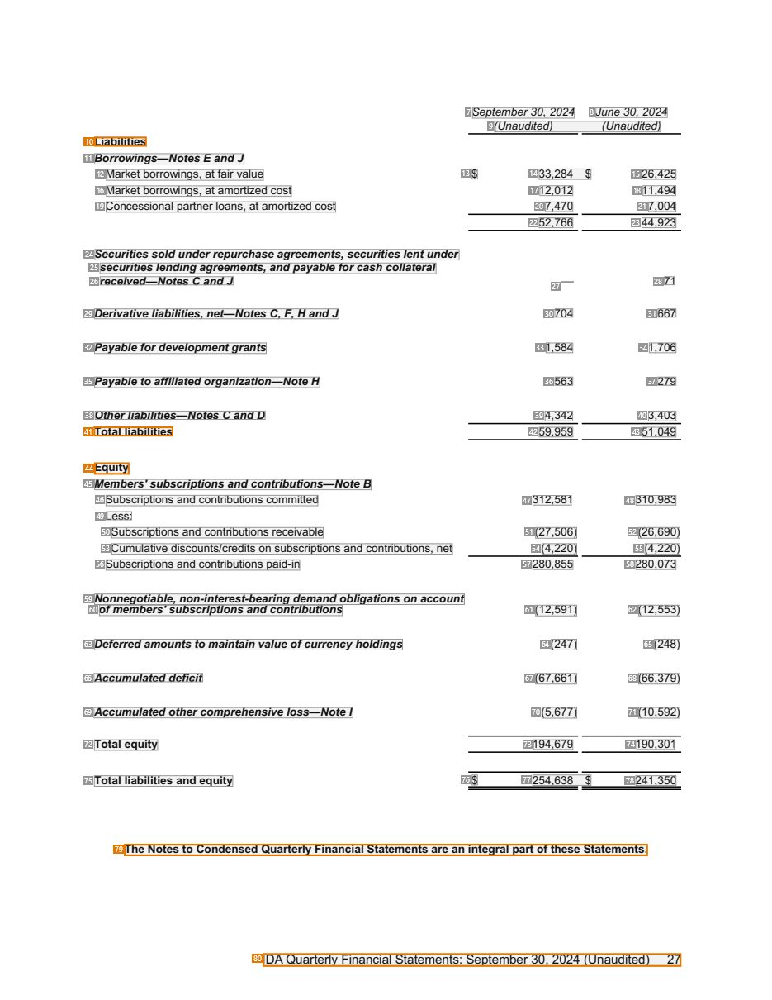
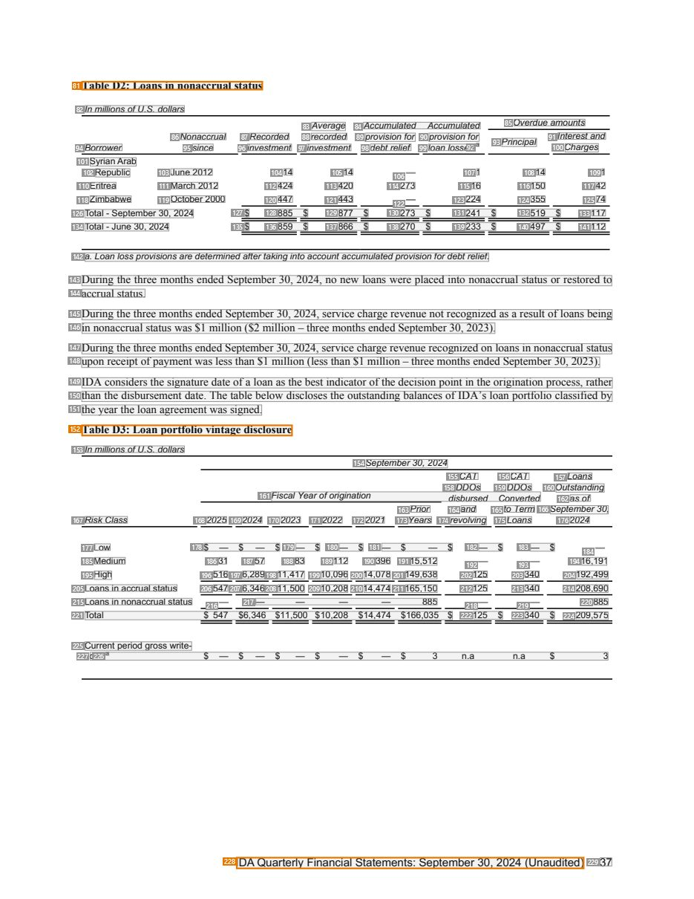
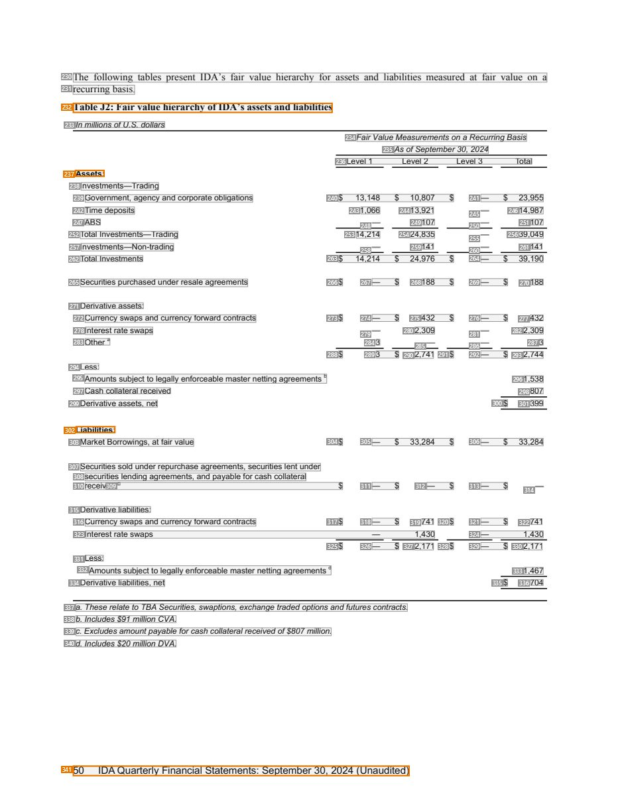

# 049 — `todo10_8/heading_corpus_100/03_tai_chinh_ke_toan/049_IDA_Financial_Statements_September_2024.pdf`

Draft status: `DRAFT_REVIEWER_A_NOT_APPROVED`. Source sha256 `d8a58945a6bfea431724b24118af6adfdf63502d1f32db8d103b62530420a60a`. [Back to index](README.md)

## Page 1 (FIRST)

| # | alias | text | font | draft | flag | rationale |
|---:|---|---|---|---|---|---|
| 1 | L0000:S0 | International DevelopmentAssociation | 24 | **OTHER** | USER_DECIDED | Issuer name on the cover; USER_DECISION_2026_10_10 (Issue #6): OTHER, issuing organization, not the report title |
| 2 | L0001:S0 | Management’s Discussion &amp; Analysis | 24 | **ESTABLISHES** |  | Cover title &quot;Management&#39;s Discussion &amp; Analysis&quot; |
| 3 | L0002:S0 | and | 24 | **ESTABLISHES** |  | Cover title connector &quot;and&quot; |
| 4 | L0003:S0 | Condensed Quarterly Financial Statements | 24 | **ESTABLISHES** |  | Cover title &quot;Condensed Quarterly Financial Statements&quot; |
| 5 | L0004:S0 | September 30, 2024 | 24 | **OTHER** | REVIEW_FOCUS | Reporting date on the cover |
| 6 | L0005:S0 | (Unaudited) | 24 | **ESTABLISHES** | REVIEW_FOCUS | Cover title qualifier &quot;(Unaudited)&quot; (centred, same size as title) — part of the title block or metadata |

## Page 29 (SEEDED_INTERIOR)

| # | alias | text | font | draft | flag | rationale |
|---:|---|---|---|---|---|---|
| 7 | L0970:S0 | September30, 2024 | 9 I | **OTHER** |  | Default: body text, list item, table cell, page number or other non-heading content on this page |
| 8 | L0970:S1 | June 30, 2024 | 9 I | **OTHER** |  | Default: body text, list item, table cell, page number or other non-heading content on this page |
| 9 | L0971:S0 | (Unaudited) (Unaudited) | 9 I | **OTHER** |  | Default: body text, list item, table cell, page number or other non-heading content on this page |
| 10 | L0972:S0 | Liabilities | 9 B | **OTHER** | REVIEW_FOCUS | Balance-sheet row group label &quot;Liabilities&quot; (bold, table label) |
| 11 | L0973:S0 | Borrowings—Notes EandJ | 9 B I | **OTHER** |  | Default: body text, list item, table cell, page number or other non-heading content on this page |
| 12 | L0974:S0 | Market borrowings, at fair value | 9 | **OTHER** |  | Default: body text, list item, table cell, page number or other non-heading content on this page |
| 13 | L0974:S1 | $ | 9 | **OTHER** |  | Default: body text, list item, table cell, page number or other non-heading content on this page |
| 14 | L0974:S2 | 33,284 $ | 9 | **OTHER** |  | Default: body text, list item, table cell, page number or other non-heading content on this page |
| 15 | L0974:S3 | 26,425 | 9 | **OTHER** |  | Default: body text, list item, table cell, page number or other non-heading content on this page |
| 16 | L0975:S0 | Market borrowings, at amortized cost | 9 | **OTHER** |  | Default: body text, list item, table cell, page number or other non-heading content on this page |
| 17 | L0975:S1 | 12,012 | 9 | **OTHER** |  | Default: body text, list item, table cell, page number or other non-heading content on this page |
| 18 | L0975:S2 | 1 1,494 | 9 | **OTHER** |  | Default: body text, list item, table cell, page number or other non-heading content on this page |
| 19 | L0976:S0 | Concessional partner loans, at amortized cost | 9 | **OTHER** |  | Default: body text, list item, table cell, page number or other non-heading content on this page |
| 20 | L0976:S1 | 7,470 | 9 | **OTHER** |  | Default: body text, list item, table cell, page number or other non-heading content on this page |
| 21 | L0976:S2 | 7,004 | 9 | **OTHER** |  | Default: body text, list item, table cell, page number or other non-heading content on this page |
| 22 | L0977:S0 | 52,766 | 9 | **OTHER** |  | Default: body text, list item, table cell, page number or other non-heading content on this page |
| 23 | L0977:S1 | 44,923 | 9 | **OTHER** |  | Default: body text, list item, table cell, page number or other non-heading content on this page |
| 24 | L0978:S0 | Securities sold underrepurchase agreements, securities lent under | 9 B I | **OTHER** |  | Default: body text, list item, table cell, page number or other non-heading content on this page |
| 25 | L0979:S0 | securities lending agreements, andpayable forcash collateral | 9 B I | **OTHER** |  | Default: body text, list item, table cell, page number or other non-heading content on this page |
| 26 | L0980:S0 | received—Notes C andJ | 9 B I | **OTHER** |  | Default: body text, list item, table cell, page number or other non-heading content on this page |
| 27 | L0980:S1 | — | 9 | **OTHER** |  | Default: body text, list item, table cell, page number or other non-heading content on this page |
| 28 | L0980:S2 | 71 | 9 | **OTHER** |  | Default: body text, list item, table cell, page number or other non-heading content on this page |
| 29 | L0981:S0 | Derivative liabilities, net—Notes C, F, H andJ | 9 B I | **OTHER** |  | Default: body text, list item, table cell, page number or other non-heading content on this page |
| 30 | L0981:S1 | 704 | 9 | **OTHER** |  | Default: body text, list item, table cell, page number or other non-heading content on this page |
| 31 | L0981:S2 | 667 | 9 | **OTHER** |  | Default: body text, list item, table cell, page number or other non-heading content on this page |
| 32 | L0982:S0 | Payable fordevelopmentgrants | 9 B I | **OTHER** |  | Default: body text, list item, table cell, page number or other non-heading content on this page |
| 33 | L0982:S1 | 1,584 | 9 | **OTHER** |  | Default: body text, list item, table cell, page number or other non-heading content on this page |
| 34 | L0982:S2 | 1,706 | 9 | **OTHER** |  | Default: body text, list item, table cell, page number or other non-heading content on this page |
| 35 | L0983:S0 | Payable to affiliated organization—Note H | 9 B I | **OTHER** |  | Default: body text, list item, table cell, page number or other non-heading content on this page |
| 36 | L0983:S1 | 563 | 9 | **OTHER** |  | Default: body text, list item, table cell, page number or other non-heading content on this page |
| 37 | L0983:S2 | 279 | 9 | **OTHER** |  | Default: body text, list item, table cell, page number or other non-heading content on this page |
| 38 | L0984:S0 | Otherliabilities—Notes C andD | 9 B I | **OTHER** |  | Default: body text, list item, table cell, page number or other non-heading content on this page |
| 39 | L0984:S1 | 4,342 | 9 | **OTHER** |  | Default: body text, list item, table cell, page number or other non-heading content on this page |
| 40 | L0984:S2 | 3,403 | 9 | **OTHER** |  | Default: body text, list item, table cell, page number or other non-heading content on this page |
| 41 | L0985:S0 | Total liabilities | 9 B | **OTHER** | REVIEW_FOCUS | Table total row label |
| 42 | L0985:S1 | 59,959 | 9 | **OTHER** |  | Default: body text, list item, table cell, page number or other non-heading content on this page |
| 43 | L0985:S2 | 51,049 | 9 | **OTHER** |  | Default: body text, list item, table cell, page number or other non-heading content on this page |
| 44 | L0986:S0 | Equity | 9 B | **OTHER** | REVIEW_FOCUS | Balance-sheet row group label &quot;Equity&quot; |
| 45 | L0987:S0 | Members&#39;subscriptions and contributions—Note B | 9 B I | **OTHER** |  | Default: body text, list item, table cell, page number or other non-heading content on this page |
| 46 | L0988:S0 | Subscriptions and contributions committed | 9 | **OTHER** |  | Default: body text, list item, table cell, page number or other non-heading content on this page |
| 47 | L0988:S1 | 312,581 | 9 | **OTHER** |  | Default: body text, list item, table cell, page number or other non-heading content on this page |
| 48 | L0988:S2 | 310,983 | 9 | **OTHER** |  | Default: body text, list item, table cell, page number or other non-heading content on this page |
| 49 | L0989:S0 | Less: | 9 | **OTHER** |  | Default: body text, list item, table cell, page number or other non-heading content on this page |
| 50 | L0990:S0 | Subscriptions and contributions receivable | 9 | **OTHER** |  | Default: body text, list item, table cell, page number or other non-heading content on this page |
| 51 | L0990:S1 | (27,506) | 9 | **OTHER** |  | Default: body text, list item, table cell, page number or other non-heading content on this page |
| 52 | L0990:S2 | (26,690) | 9 | **OTHER** |  | Default: body text, list item, table cell, page number or other non-heading content on this page |
| 53 | L0991:S0 | Cumulative discounts/credits on subscriptions and contributions, net | 9 | **OTHER** |  | Default: body text, list item, table cell, page number or other non-heading content on this page |
| 54 | L0991:S1 | (4,220) | 9 | **OTHER** |  | Default: body text, list item, table cell, page number or other non-heading content on this page |
| 55 | L0991:S2 | (4,220) | 9 | **OTHER** |  | Default: body text, list item, table cell, page number or other non-heading content on this page |
| 56 | L0992:S0 | Subscriptions and contributions paid-in | 9 | **OTHER** |  | Default: body text, list item, table cell, page number or other non-heading content on this page |
| 57 | L0992:S1 | 280,855 | 9 | **OTHER** |  | Default: body text, list item, table cell, page number or other non-heading content on this page |
| 58 | L0992:S2 | 280,073 | 9 | **OTHER** |  | Default: body text, list item, table cell, page number or other non-heading content on this page |
| 59 | L0993:S0 | Nonnegotiable, non-interest-bearing demand obligations on account | 9 B I | **OTHER** |  | Default: body text, list item, table cell, page number or other non-heading content on this page |
| 60 | L0994:S0 | ofmembers&#39;subscriptions and contributions | 9 B I | **OTHER** |  | Default: body text, list item, table cell, page number or other non-heading content on this page |
| 61 | L0994:S1 | (12,591) | 9 | **OTHER** |  | Default: body text, list item, table cell, page number or other non-heading content on this page |
| 62 | L0994:S2 | (12,553) | 9 | **OTHER** |  | Default: body text, list item, table cell, page number or other non-heading content on this page |
| 63 | L0995:S0 | Deferredamounts to maintain value ofcurrencyholdings | 9 B I | **OTHER** |  | Default: body text, list item, table cell, page number or other non-heading content on this page |
| 64 | L0995:S1 | (247) | 9 | **OTHER** |  | Default: body text, list item, table cell, page number or other non-heading content on this page |
| 65 | L0995:S2 | (248) | 9 | **OTHER** |  | Default: body text, list item, table cell, page number or other non-heading content on this page |
| 66 | L0996:S0 | Accumulated deficit | 9 B I | **OTHER** |  | Default: body text, list item, table cell, page number or other non-heading content on this page |
| 67 | L0996:S1 | (67,661) | 9 | **OTHER** |  | Default: body text, list item, table cell, page number or other non-heading content on this page |
| 68 | L0996:S2 | (66,379) | 9 | **OTHER** |  | Default: body text, list item, table cell, page number or other non-heading content on this page |
| 69 | L0997:S0 | Accumulated othercomprehensive loss—Note I | 9 B I | **OTHER** |  | Default: body text, list item, table cell, page number or other non-heading content on this page |
| 70 | L0997:S1 | (5,677) | 9 | **OTHER** |  | Default: body text, list item, table cell, page number or other non-heading content on this page |
| 71 | L0997:S2 | (10,592) | 9 | **OTHER** |  | Default: body text, list item, table cell, page number or other non-heading content on this page |
| 72 | L0998:S0 | Total equity | 9 B | **OTHER** |  | Default: body text, list item, table cell, page number or other non-heading content on this page |
| 73 | L0998:S1 | 194,679 | 9 | **OTHER** |  | Default: body text, list item, table cell, page number or other non-heading content on this page |
| 74 | L0998:S2 | 190,301 | 9 | **OTHER** |  | Default: body text, list item, table cell, page number or other non-heading content on this page |
| 75 | L0999:S0 | Total liabilities and equity | 9 B | **OTHER** |  | Default: body text, list item, table cell, page number or other non-heading content on this page |
| 76 | L0999:S1 | $ | 9 | **OTHER** |  | Default: body text, list item, table cell, page number or other non-heading content on this page |
| 77 | L0999:S2 | 254,638 $ | 9 | **OTHER** |  | Default: body text, list item, table cell, page number or other non-heading content on this page |
| 78 | L0999:S3 | 241,350 | 9 | **OTHER** |  | Default: body text, list item, table cell, page number or other non-heading content on this page |
| 79 | L1000:S0 | The Notes to Condensed Quarterly Financial Statements are an integral part ofthese Statements. | 9 B | **OTHER** | REVIEW_FOCUS | Statement footnote (bold) &quot;The Notes ... are an integral part ...&quot; |
| 80 | L1001:S0 | IDAQuarterly Financial Statements: September 30, 2024 (Unaudited) 27 | 10 | **OTHER** | REVIEW_FOCUS | Running footer |

## Page 39 (TARGETED_STRUCTURE)

| # | alias | text | font | draft | flag | rationale |
|---:|---|---|---|---|---|---|
| 81 | L1361:S0 | Table D2: Loans in nonaccrual status | 10 B | **OTHER** | REVIEW_FOCUS | Table caption &quot;Table D2: ...&quot; (object caption) |
| 82 | L1362:S0 | In millions ofU.S. dollars | 8 I | **OTHER** |  | Default: body text, list item, table cell, page number or other non-heading content on this page |
| 83 | L1363:S0 | Average | 8 I | **OTHER** |  | Default: body text, list item, table cell, page number or other non-heading content on this page |
| 84 | L1363:S1 | Accumulated Accumulated | 8 I | **OTHER** |  | Default: body text, list item, table cell, page number or other non-heading content on this page |
| 85 | L1363:S2 | Overdue amounts | 8 I | **OTHER** |  | Default: body text, list item, table cell, page number or other non-heading content on this page |
| 86 | L1364:S0 | Nonaccrual | 8 I | **OTHER** |  | Default: body text, list item, table cell, page number or other non-heading content on this page |
| 87 | L1364:S1 | Recorded | 8 I | **OTHER** |  | Default: body text, list item, table cell, page number or other non-heading content on this page |
| 88 | L1364:S2 | recorded | 8 I | **OTHER** |  | Default: body text, list item, table cell, page number or other non-heading content on this page |
| 89 | L1364:S3 | provision for | 8 I | **OTHER** |  | Default: body text, list item, table cell, page number or other non-heading content on this page |
| 90 | L1364:S4 | provision for | 8 I | **OTHER** |  | Default: body text, list item, table cell, page number or other non-heading content on this page |
| 91 | L1364:S5 | Interest and | 8 I | **OTHER** |  | Default: body text, list item, table cell, page number or other non-heading content on this page |
| 92 | L1365:S0 | a | 5.2 I | **OTHER** |  | Default: body text, list item, table cell, page number or other non-heading content on this page |
| 93 | L1365:S1 | Principal | 8 I | **OTHER** |  | Default: body text, list item, table cell, page number or other non-heading content on this page |
| 94 | L1366:S0 | Borrower | 8 I | **OTHER** |  | Default: body text, list item, table cell, page number or other non-heading content on this page |
| 95 | L1366:S1 | since | 8 I | **OTHER** |  | Default: body text, list item, table cell, page number or other non-heading content on this page |
| 96 | L1366:S2 | investment | 8 I | **OTHER** |  | Default: body text, list item, table cell, page number or other non-heading content on this page |
| 97 | L1366:S3 | investment | 8 I | **OTHER** |  | Default: body text, list item, table cell, page number or other non-heading content on this page |
| 98 | L1366:S4 | debtrelief | 8 I | **OTHER** |  | Default: body text, list item, table cell, page number or other non-heading content on this page |
| 99 | L1366:S5 | loan losses | 8 I | **OTHER** |  | Default: body text, list item, table cell, page number or other non-heading content on this page |
| 100 | L1366:S6 | Charges | 8 I | **OTHER** |  | Default: body text, list item, table cell, page number or other non-heading content on this page |
| 101 | L1367:S0 | Syrian Arab | 8 | **OTHER** |  | Default: body text, list item, table cell, page number or other non-heading content on this page |
| 102 | L1368:S0 | Republic | 8 | **OTHER** |  | Default: body text, list item, table cell, page number or other non-heading content on this page |
| 103 | L1368:S1 | June 2012 | 8 | **OTHER** |  | Default: body text, list item, table cell, page number or other non-heading content on this page |
| 104 | L1368:S2 | 14 | 8 | **OTHER** |  | Default: body text, list item, table cell, page number or other non-heading content on this page |
| 105 | L1368:S3 | 14 | 8 | **OTHER** |  | Default: body text, list item, table cell, page number or other non-heading content on this page |
| 106 | L1368:S4 | — | 8 | **OTHER** |  | Default: body text, list item, table cell, page number or other non-heading content on this page |
| 107 | L1368:S5 | 1 | 8 | **OTHER** |  | Default: body text, list item, table cell, page number or other non-heading content on this page |
| 108 | L1368:S6 | 14 | 8 | **OTHER** |  | Default: body text, list item, table cell, page number or other non-heading content on this page |
| 109 | L1368:S7 | 1 | 8 | **OTHER** |  | Default: body text, list item, table cell, page number or other non-heading content on this page |
| 110 | L1369:S0 | Eritrea | 8 | **OTHER** |  | Default: body text, list item, table cell, page number or other non-heading content on this page |
| 111 | L1369:S1 | March 2012 | 8 | **OTHER** |  | Default: body text, list item, table cell, page number or other non-heading content on this page |
| 112 | L1369:S2 | 424 | 8 | **OTHER** |  | Default: body text, list item, table cell, page number or other non-heading content on this page |
| 113 | L1369:S3 | 420 | 8 | **OTHER** |  | Default: body text, list item, table cell, page number or other non-heading content on this page |
| 114 | L1369:S4 | 273 | 8 | **OTHER** |  | Default: body text, list item, table cell, page number or other non-heading content on this page |
| 115 | L1369:S5 | 16 | 8 | **OTHER** |  | Default: body text, list item, table cell, page number or other non-heading content on this page |
| 116 | L1369:S6 | 150 | 8 | **OTHER** |  | Default: body text, list item, table cell, page number or other non-heading content on this page |
| 117 | L1369:S7 | 42 | 8 | **OTHER** |  | Default: body text, list item, table cell, page number or other non-heading content on this page |
| 118 | L1370:S0 | Zimbabwe | 8 | **OTHER** |  | Default: body text, list item, table cell, page number or other non-heading content on this page |
| 119 | L1370:S1 | October 2000 | 8 | **OTHER** |  | Default: body text, list item, table cell, page number or other non-heading content on this page |
| 120 | L1370:S2 | 447 | 8 | **OTHER** |  | Default: body text, list item, table cell, page number or other non-heading content on this page |
| 121 | L1370:S3 | 443 | 8 | **OTHER** |  | Default: body text, list item, table cell, page number or other non-heading content on this page |
| 122 | L1370:S4 | — | 8 | **OTHER** |  | Default: body text, list item, table cell, page number or other non-heading content on this page |
| 123 | L1370:S5 | 224 | 8 | **OTHER** |  | Default: body text, list item, table cell, page number or other non-heading content on this page |
| 124 | L1370:S6 | 355 | 8 | **OTHER** |  | Default: body text, list item, table cell, page number or other non-heading content on this page |
| 125 | L1370:S7 | 74 | 8 | **OTHER** |  | Default: body text, list item, table cell, page number or other non-heading content on this page |
| 126 | L1371:S0 | Total - September 30, 2024 | 8 | **OTHER** |  | Default: body text, list item, table cell, page number or other non-heading content on this page |
| 127 | L1371:S1 | $ | 8 | **OTHER** |  | Default: body text, list item, table cell, page number or other non-heading content on this page |
| 128 | L1371:S2 | 885 $ | 8 | **OTHER** |  | Default: body text, list item, table cell, page number or other non-heading content on this page |
| 129 | L1371:S3 | 877 $ | 8 | **OTHER** |  | Default: body text, list item, table cell, page number or other non-heading content on this page |
| 130 | L1371:S4 | 273 $ | 8 | **OTHER** |  | Default: body text, list item, table cell, page number or other non-heading content on this page |
| 131 | L1371:S5 | 241 $ | 8 | **OTHER** |  | Default: body text, list item, table cell, page number or other non-heading content on this page |
| 132 | L1371:S6 | 519 $ | 8 | **OTHER** |  | Default: body text, list item, table cell, page number or other non-heading content on this page |
| 133 | L1371:S7 | 1 17 | 8 | **OTHER** |  | Default: body text, list item, table cell, page number or other non-heading content on this page |
| 134 | L1372:S0 | Total - June 30, 2024 | 8 | **OTHER** |  | Default: body text, list item, table cell, page number or other non-heading content on this page |
| 135 | L1372:S1 | $ | 8 | **OTHER** |  | Default: body text, list item, table cell, page number or other non-heading content on this page |
| 136 | L1372:S2 | 859 $ | 8 | **OTHER** |  | Default: body text, list item, table cell, page number or other non-heading content on this page |
| 137 | L1372:S3 | 866 $ | 8 | **OTHER** |  | Default: body text, list item, table cell, page number or other non-heading content on this page |
| 138 | L1372:S4 | 270 $ | 8 | **OTHER** |  | Default: body text, list item, table cell, page number or other non-heading content on this page |
| 139 | L1372:S5 | 233 $ | 8 | **OTHER** |  | Default: body text, list item, table cell, page number or other non-heading content on this page |
| 140 | L1372:S6 | 497 $ | 8 | **OTHER** |  | Default: body text, list item, table cell, page number or other non-heading content on this page |
| 141 | L1372:S7 | 1 12 | 8 | **OTHER** |  | Default: body text, list item, table cell, page number or other non-heading content on this page |
| 142 | L1373:S0 | a. Loan lossprovisions are determined aftertaking into account accumulatedprovision fordebtrelief. | 8 I | **OTHER** |  | Default: body text, list item, table cell, page number or other non-heading content on this page |
| 143 | L1374:S0 | During the three months ended September 30, 2024, no new loans were placed into nonaccrual status or restored to | 10 | **OTHER** |  | Default: body text, list item, table cell, page number or other non-heading content on this page |
| 144 | L1375:S0 | accrual status. | 10 | **OTHER** |  | Default: body text, list item, table cell, page number or other non-heading content on this page |
| 145 | L1376:S0 | During the three months ended September 30, 2024, service charge revenue notrecognized as aresult ofloans being | 10 | **OTHER** |  | Default: body text, list item, table cell, page number or other non-heading content on this page |
| 146 | L1377:S0 | innonaccrual status was $1 million ($2 million–three months ended September 30, 2023). | 10 | **OTHER** |  | Default: body text, list item, table cell, page number or other non-heading content on this page |
| 147 | L1378:S0 | During the three months ended September 30, 2024, service charge revenue recognized on loans innonaccrual status | 10 | **OTHER** |  | Default: body text, list item, table cell, page number or other non-heading content on this page |
| 148 | L1379:S0 | uponreceipt ofpaymentwas less than $1 million (less than $1 million–three months ended September 30, 2023). | 10 | **OTHER** |  | Default: body text, list item, table cell, page number or other non-heading content on this page |
| 149 | L1380:S0 | IDA considers the signature date ofa loan as the best indicator ofthe decisionpoint inthe originationprocess, rather | 10 | **OTHER** |  | Default: body text, list item, table cell, page number or other non-heading content on this page |
| 150 | L1381:S0 | than the disbursement date. The table below discloses the outstanding balances ofIDA’s loan portfolio classified by | 10 | **OTHER** |  | Default: body text, list item, table cell, page number or other non-heading content on this page |
| 151 | L1382:S0 | the yearthe loan agreementwas signed. | 10 | **OTHER** |  | Default: body text, list item, table cell, page number or other non-heading content on this page |
| 152 | L1383:S0 | Table D3: Loan portfolio vintage disclosure | 10 B | **OTHER** | REVIEW_FOCUS | Table caption &quot;Table D3: ...&quot; (object caption) |
| 153 | L1384:S0 | In millions ofU.S. dollars | 8 I | **OTHER** |  | Default: body text, list item, table cell, page number or other non-heading content on this page |
| 154 | L1385:S0 | September30, 2024 | 8 I | **OTHER** |  | Default: body text, list item, table cell, page number or other non-heading content on this page |
| 155 | L1386:S0 | CAT | 8 I | **OTHER** |  | Default: body text, list item, table cell, page number or other non-heading content on this page |
| 156 | L1386:S1 | CAT | 8 I | **OTHER** |  | Default: body text, list item, table cell, page number or other non-heading content on this page |
| 157 | L1386:S2 | Loans | 8 I | **OTHER** |  | Default: body text, list item, table cell, page number or other non-heading content on this page |
| 158 | L1387:S0 | DDOs | 8 I | **OTHER** |  | Default: body text, list item, table cell, page number or other non-heading content on this page |
| 159 | L1387:S1 | DDOs | 8 I | **OTHER** |  | Default: body text, list item, table cell, page number or other non-heading content on this page |
| 160 | L1387:S2 | Outstanding | 8 I | **OTHER** |  | Default: body text, list item, table cell, page number or other non-heading content on this page |
| 161 | L1388:S0 | Fiscal Yearoforigination disbursed Converted | 8 I | **OTHER** |  | Default: body text, list item, table cell, page number or other non-heading content on this page |
| 162 | L1388:S1 | as of | 8 I | **OTHER** |  | Default: body text, list item, table cell, page number or other non-heading content on this page |
| 163 | L1389:S0 | Prior | 8 I | **OTHER** |  | Default: body text, list item, table cell, page number or other non-heading content on this page |
| 164 | L1389:S1 | and | 8 I | **OTHER** |  | Default: body text, list item, table cell, page number or other non-heading content on this page |
| 165 | L1389:S2 | to Term | 8 I | **OTHER** |  | Default: body text, list item, table cell, page number or other non-heading content on this page |
| 166 | L1389:S3 | September30, | 8 I | **OTHER** |  | Default: body text, list item, table cell, page number or other non-heading content on this page |
| 167 | L1390:S0 | Risk Class | 8 I | **OTHER** |  | Default: body text, list item, table cell, page number or other non-heading content on this page |
| 168 | L1390:S1 | 2025 | 8 I | **OTHER** |  | Default: body text, list item, table cell, page number or other non-heading content on this page |
| 169 | L1390:S2 | 2024 | 8 I | **OTHER** |  | Default: body text, list item, table cell, page number or other non-heading content on this page |
| 170 | L1390:S3 | 2023 | 8 I | **OTHER** |  | Default: body text, list item, table cell, page number or other non-heading content on this page |
| 171 | L1390:S4 | 2022 | 8 I | **OTHER** |  | Default: body text, list item, table cell, page number or other non-heading content on this page |
| 172 | L1390:S5 | 2021 | 8 I | **OTHER** |  | Default: body text, list item, table cell, page number or other non-heading content on this page |
| 173 | L1390:S6 | Years | 8 I | **OTHER** |  | Default: body text, list item, table cell, page number or other non-heading content on this page |
| 174 | L1390:S7 | revolving | 8 I | **OTHER** |  | Default: body text, list item, table cell, page number or other non-heading content on this page |
| 175 | L1390:S8 | Loans | 8 I | **OTHER** |  | Default: body text, list item, table cell, page number or other non-heading content on this page |
| 176 | L1390:S9 | 2024 | 8 I | **OTHER** |  | Default: body text, list item, table cell, page number or other non-heading content on this page |
| 177 | L1391:S0 | Low | 8 | **OTHER** |  | Default: body text, list item, table cell, page number or other non-heading content on this page |
| 178 | L1391:S1 | $ — $ — $ | 8 | **OTHER** |  | Default: body text, list item, table cell, page number or other non-heading content on this page |
| 179 | L1391:S2 | — $ | 8 | **OTHER** |  | Default: body text, list item, table cell, page number or other non-heading content on this page |
| 180 | L1391:S3 | — $ | 8 | **OTHER** |  | Default: body text, list item, table cell, page number or other non-heading content on this page |
| 181 | L1391:S4 | — $ — $ | 8 | **OTHER** |  | Default: body text, list item, table cell, page number or other non-heading content on this page |
| 182 | L1391:S5 | — $ | 8 | **OTHER** |  | Default: body text, list item, table cell, page number or other non-heading content on this page |
| 183 | L1391:S6 | — $ | 8 | **OTHER** |  | Default: body text, list item, table cell, page number or other non-heading content on this page |
| 184 | L1391:S7 | — | 8 | **OTHER** |  | Default: body text, list item, table cell, page number or other non-heading content on this page |
| 185 | L1392:S0 | Medium | 8 | **OTHER** |  | Default: body text, list item, table cell, page number or other non-heading content on this page |
| 186 | L1392:S1 | 31 | 8 | **OTHER** |  | Default: body text, list item, table cell, page number or other non-heading content on this page |
| 187 | L1392:S2 | 57 | 8 | **OTHER** |  | Default: body text, list item, table cell, page number or other non-heading content on this page |
| 188 | L1392:S3 | 83 | 8 | **OTHER** |  | Default: body text, list item, table cell, page number or other non-heading content on this page |
| 189 | L1392:S4 | 1 12 | 8 | **OTHER** |  | Default: body text, list item, table cell, page number or other non-heading content on this page |
| 190 | L1392:S5 | 396 | 8 | **OTHER** |  | Default: body text, list item, table cell, page number or other non-heading content on this page |
| 191 | L1392:S6 | 15,512 | 8 | **OTHER** |  | Default: body text, list item, table cell, page number or other non-heading content on this page |
| 192 | L1392:S7 | — | 8 | **OTHER** |  | Default: body text, list item, table cell, page number or other non-heading content on this page |
| 193 | L1392:S8 | — | 8 | **OTHER** |  | Default: body text, list item, table cell, page number or other non-heading content on this page |
| 194 | L1392:S9 | 16,191 | 8 | **OTHER** |  | Default: body text, list item, table cell, page number or other non-heading content on this page |
| 195 | L1393:S0 | High | 8 | **OTHER** |  | Default: body text, list item, table cell, page number or other non-heading content on this page |
| 196 | L1393:S1 | 516 | 8 | **OTHER** |  | Default: body text, list item, table cell, page number or other non-heading content on this page |
| 197 | L1393:S2 | 6,289 | 8 | **OTHER** |  | Default: body text, list item, table cell, page number or other non-heading content on this page |
| 198 | L1393:S3 | 1 1,417 | 8 | **OTHER** |  | Default: body text, list item, table cell, page number or other non-heading content on this page |
| 199 | L1393:S4 | 10,096 | 8 | **OTHER** |  | Default: body text, list item, table cell, page number or other non-heading content on this page |
| 200 | L1393:S5 | 14,078 | 8 | **OTHER** |  | Default: body text, list item, table cell, page number or other non-heading content on this page |
| 201 | L1393:S6 | 149,638 | 8 | **OTHER** |  | Default: body text, list item, table cell, page number or other non-heading content on this page |
| 202 | L1393:S7 | 125 | 8 | **OTHER** |  | Default: body text, list item, table cell, page number or other non-heading content on this page |
| 203 | L1393:S8 | 340 | 8 | **OTHER** |  | Default: body text, list item, table cell, page number or other non-heading content on this page |
| 204 | L1393:S9 | 192,499 | 8 | **OTHER** |  | Default: body text, list item, table cell, page number or other non-heading content on this page |
| 205 | L1394:S0 | Loans in accrual status | 8 | **OTHER** |  | Default: body text, list item, table cell, page number or other non-heading content on this page |
| 206 | L1394:S1 | 547 | 8 | **OTHER** |  | Default: body text, list item, table cell, page number or other non-heading content on this page |
| 207 | L1394:S2 | 6,346 | 8 | **OTHER** |  | Default: body text, list item, table cell, page number or other non-heading content on this page |
| 208 | L1394:S3 | 1 1,500 | 8 | **OTHER** |  | Default: body text, list item, table cell, page number or other non-heading content on this page |
| 209 | L1394:S4 | 10,208 | 8 | **OTHER** |  | Default: body text, list item, table cell, page number or other non-heading content on this page |
| 210 | L1394:S5 | 14,474 | 8 | **OTHER** |  | Default: body text, list item, table cell, page number or other non-heading content on this page |
| 211 | L1394:S6 | 165,150 | 8 | **OTHER** |  | Default: body text, list item, table cell, page number or other non-heading content on this page |
| 212 | L1394:S7 | 125 | 8 | **OTHER** |  | Default: body text, list item, table cell, page number or other non-heading content on this page |
| 213 | L1394:S8 | 340 | 8 | **OTHER** |  | Default: body text, list item, table cell, page number or other non-heading content on this page |
| 214 | L1394:S9 | 208,690 | 8 | **OTHER** |  | Default: body text, list item, table cell, page number or other non-heading content on this page |
| 215 | L1395:S0 | Loans in nonaccrual status | 8 | **OTHER** |  | Default: body text, list item, table cell, page number or other non-heading content on this page |
| 216 | L1395:S1 | — | 8 | **OTHER** |  | Default: body text, list item, table cell, page number or other non-heading content on this page |
| 217 | L1395:S2 | — — — — 885 | 8 | **OTHER** |  | Default: body text, list item, table cell, page number or other non-heading content on this page |
| 218 | L1395:S3 | — | 8 | **OTHER** |  | Default: body text, list item, table cell, page number or other non-heading content on this page |
| 219 | L1395:S4 | — | 8 | **OTHER** |  | Default: body text, list item, table cell, page number or other non-heading content on this page |
| 220 | L1395:S5 | 885 | 8 | **OTHER** |  | Default: body text, list item, table cell, page number or other non-heading content on this page |
| 221 | L1396:S0 | Total $ 547 $6,346 $1 1,500 $10,208 $14,474 $166,035 $ | 8 | **OTHER** |  | Default: body text, list item, table cell, page number or other non-heading content on this page |
| 222 | L1396:S1 | 125 $ | 8 | **OTHER** |  | Default: body text, list item, table cell, page number or other non-heading content on this page |
| 223 | L1396:S2 | 340 $ | 8 | **OTHER** |  | Default: body text, list item, table cell, page number or other non-heading content on this page |
| 224 | L1396:S3 | 209,575 | 8 | **OTHER** |  | Default: body text, list item, table cell, page number or other non-heading content on this page |
| 225 | L1397:S0 | Current period gross write- | 8 | **OTHER** |  | Default: body text, list item, table cell, page number or other non-heading content on this page |
| 226 | L1398:S0 | a | 5.2 | **OTHER** |  | Default: body text, list item, table cell, page number or other non-heading content on this page |
| 227 | L1399:S0 | offs $ — $ — $ — $ — $ — $ 3 n.a n.a $ 3 | 8 | **OTHER** |  | Default: body text, list item, table cell, page number or other non-heading content on this page |
| 228 | L1400:S0 | IDAQuarterly Financial Statements: September 30, 2024 (Unaudited) | 10 | **OTHER** | REVIEW_FOCUS | Running footer |
| 229 | L1400:S1 | 37 | 10 | **OTHER** |  | Default: body text, list item, table cell, page number or other non-heading content on this page |

## Page 52 (SEEDED_INTERIOR)

| # | alias | text | font | draft | flag | rationale |
|---:|---|---|---|---|---|---|
| 230 | L1885:S0 | The following tables present IDA’s fair value hierarchy for assets and liabilities measured at fair value on a | 10 | **OTHER** |  | Default: body text, list item, table cell, page number or other non-heading content on this page |
| 231 | L1886:S0 | recurringbasis. | 10 | **OTHER** |  | Default: body text, list item, table cell, page number or other non-heading content on this page |
| 232 | L1887:S0 | Table J2: Fair value hierarchy ofIDA’s assets and liabilities | 10 B | **OTHER** | REVIEW_FOCUS | Table caption &quot;Table J2: ...&quot; (object caption) |
| 233 | L1888:S0 | In millions ofU.S. dollars | 8 I | **OTHER** |  | Default: body text, list item, table cell, page number or other non-heading content on this page |
| 234 | L1889:S0 | Fair Value Measurements on a Recurring Basis | 8 I | **OTHER** |  | Default: body text, list item, table cell, page number or other non-heading content on this page |
| 235 | L1890:S0 | As ofSeptember30, 2024 | 8 I | **OTHER** |  | Default: body text, list item, table cell, page number or other non-heading content on this page |
| 236 | L1891:S0 | Level 1 Level 2 Level 3 Total | 8 | **OTHER** |  | Default: body text, list item, table cell, page number or other non-heading content on this page |
| 237 | L1892:S0 | Assets: | 8 B | **OTHER** | REVIEW_FOCUS | Table row group label &quot;Assets:&quot; |
| 238 | L1893:S0 | Investments—Trading | 8 | **OTHER** |  | Default: body text, list item, table cell, page number or other non-heading content on this page |
| 239 | L1894:S0 | Government, agency and corporate obligations | 8 | **OTHER** |  | Default: body text, list item, table cell, page number or other non-heading content on this page |
| 240 | L1894:S1 | $ 13,148 $ 10,807 $ | 8 | **OTHER** |  | Default: body text, list item, table cell, page number or other non-heading content on this page |
| 241 | L1894:S2 | — $ 23,955 | 8 | **OTHER** |  | Default: body text, list item, table cell, page number or other non-heading content on this page |
| 242 | L1895:S0 | Time deposits | 8 | **OTHER** |  | Default: body text, list item, table cell, page number or other non-heading content on this page |
| 243 | L1895:S1 | 1,066 | 8 | **OTHER** |  | Default: body text, list item, table cell, page number or other non-heading content on this page |
| 244 | L1895:S2 | 13,921 | 8 | **OTHER** |  | Default: body text, list item, table cell, page number or other non-heading content on this page |
| 245 | L1895:S3 | — | 8 | **OTHER** |  | Default: body text, list item, table cell, page number or other non-heading content on this page |
| 246 | L1895:S4 | 14,987 | 8 | **OTHER** |  | Default: body text, list item, table cell, page number or other non-heading content on this page |
| 247 | L1896:S0 | ABS | 8 | **OTHER** |  | Default: body text, list item, table cell, page number or other non-heading content on this page |
| 248 | L1896:S1 | — | 8 | **OTHER** |  | Default: body text, list item, table cell, page number or other non-heading content on this page |
| 249 | L1896:S2 | 107 | 8 | **OTHER** |  | Default: body text, list item, table cell, page number or other non-heading content on this page |
| 250 | L1896:S3 | — | 8 | **OTHER** |  | Default: body text, list item, table cell, page number or other non-heading content on this page |
| 251 | L1896:S4 | 107 | 8 | **OTHER** |  | Default: body text, list item, table cell, page number or other non-heading content on this page |
| 252 | L1897:S0 | Total Investments—Trading | 8 | **OTHER** |  | Default: body text, list item, table cell, page number or other non-heading content on this page |
| 253 | L1897:S1 | 14,214 | 8 | **OTHER** |  | Default: body text, list item, table cell, page number or other non-heading content on this page |
| 254 | L1897:S2 | 24,835 | 8 | **OTHER** |  | Default: body text, list item, table cell, page number or other non-heading content on this page |
| 255 | L1897:S3 | — | 8 | **OTHER** |  | Default: body text, list item, table cell, page number or other non-heading content on this page |
| 256 | L1897:S4 | 39,049 | 8 | **OTHER** |  | Default: body text, list item, table cell, page number or other non-heading content on this page |
| 257 | L1898:S0 | Investments—Non-trading | 8 | **OTHER** |  | Default: body text, list item, table cell, page number or other non-heading content on this page |
| 258 | L1898:S1 | — | 8 | **OTHER** |  | Default: body text, list item, table cell, page number or other non-heading content on this page |
| 259 | L1898:S2 | 141 | 8 | **OTHER** |  | Default: body text, list item, table cell, page number or other non-heading content on this page |
| 260 | L1898:S3 | — | 8 | **OTHER** |  | Default: body text, list item, table cell, page number or other non-heading content on this page |
| 261 | L1898:S4 | 141 | 8 | **OTHER** |  | Default: body text, list item, table cell, page number or other non-heading content on this page |
| 262 | L1899:S0 | Total Investments | 8 | **OTHER** |  | Default: body text, list item, table cell, page number or other non-heading content on this page |
| 263 | L1899:S1 | $ 14,214 $ 24,976 $ | 8 | **OTHER** |  | Default: body text, list item, table cell, page number or other non-heading content on this page |
| 264 | L1899:S2 | — $ 39,190 | 8 | **OTHER** |  | Default: body text, list item, table cell, page number or other non-heading content on this page |
| 265 | L1900:S0 | Securities purchased under resale agreements | 8 | **OTHER** |  | Default: body text, list item, table cell, page number or other non-heading content on this page |
| 266 | L1900:S1 | $ | 8 | **OTHER** |  | Default: body text, list item, table cell, page number or other non-heading content on this page |
| 267 | L1900:S2 | — $ | 8 | **OTHER** |  | Default: body text, list item, table cell, page number or other non-heading content on this page |
| 268 | L1900:S3 | 188 $ | 8 | **OTHER** |  | Default: body text, list item, table cell, page number or other non-heading content on this page |
| 269 | L1900:S4 | — $ | 8 | **OTHER** |  | Default: body text, list item, table cell, page number or other non-heading content on this page |
| 270 | L1900:S5 | 188 | 8 | **OTHER** |  | Default: body text, list item, table cell, page number or other non-heading content on this page |
| 271 | L1901:S0 | Derivative assets: | 8 | **OTHER** |  | Default: body text, list item, table cell, page number or other non-heading content on this page |
| 272 | L1902:S0 | Currency swaps and currency forward contracts | 8 | **OTHER** |  | Default: body text, list item, table cell, page number or other non-heading content on this page |
| 273 | L1902:S1 | $ | 8 | **OTHER** |  | Default: body text, list item, table cell, page number or other non-heading content on this page |
| 274 | L1902:S2 | — $ | 8 | **OTHER** |  | Default: body text, list item, table cell, page number or other non-heading content on this page |
| 275 | L1902:S3 | 432 $ | 8 | **OTHER** |  | Default: body text, list item, table cell, page number or other non-heading content on this page |
| 276 | L1902:S4 | — $ | 8 | **OTHER** |  | Default: body text, list item, table cell, page number or other non-heading content on this page |
| 277 | L1902:S5 | 432 | 8 | **OTHER** |  | Default: body text, list item, table cell, page number or other non-heading content on this page |
| 278 | L1903:S0 | Interest rate swaps | 8 | **OTHER** |  | Default: body text, list item, table cell, page number or other non-heading content on this page |
| 279 | L1903:S1 | — | 8 | **OTHER** |  | Default: body text, list item, table cell, page number or other non-heading content on this page |
| 280 | L1903:S2 | 2,309 | 8 | **OTHER** |  | Default: body text, list item, table cell, page number or other non-heading content on this page |
| 281 | L1903:S3 | — | 8 | **OTHER** |  | Default: body text, list item, table cell, page number or other non-heading content on this page |
| 282 | L1903:S4 | 2,309 | 8 | **OTHER** |  | Default: body text, list item, table cell, page number or other non-heading content on this page |
| 283 | L1904:S0 | Other a | 8 | **OTHER** |  | Default: body text, list item, table cell, page number or other non-heading content on this page |
| 284 | L1904:S1 | 3 | 8 | **OTHER** |  | Default: body text, list item, table cell, page number or other non-heading content on this page |
| 285 | L1904:S2 | — | 8 | **OTHER** |  | Default: body text, list item, table cell, page number or other non-heading content on this page |
| 286 | L1904:S3 | — | 8 | **OTHER** |  | Default: body text, list item, table cell, page number or other non-heading content on this page |
| 287 | L1904:S4 | 3 | 8 | **OTHER** |  | Default: body text, list item, table cell, page number or other non-heading content on this page |
| 288 | L1905:S0 | $ | 8 | **OTHER** |  | Default: body text, list item, table cell, page number or other non-heading content on this page |
| 289 | L1905:S1 | 3 $ | 8 | **OTHER** |  | Default: body text, list item, table cell, page number or other non-heading content on this page |
| 290 | L1905:S2 | 2,741 | 8 | **OTHER** |  | Default: body text, list item, table cell, page number or other non-heading content on this page |
| 291 | L1905:S3 | $ | 8 | **OTHER** |  | Default: body text, list item, table cell, page number or other non-heading content on this page |
| 292 | L1905:S4 | — $ | 8 | **OTHER** |  | Default: body text, list item, table cell, page number or other non-heading content on this page |
| 293 | L1905:S5 | 2,744 | 8 | **OTHER** |  | Default: body text, list item, table cell, page number or other non-heading content on this page |
| 294 | L1906:S0 | Less: | 8 | **OTHER** |  | Default: body text, list item, table cell, page number or other non-heading content on this page |
| 295 | L1907:S0 | Amounts subject to legally enforceable master netting agreements b | 8 | **OTHER** |  | Default: body text, list item, table cell, page number or other non-heading content on this page |
| 296 | L1907:S1 | 1,538 | 8 | **OTHER** |  | Default: body text, list item, table cell, page number or other non-heading content on this page |
| 297 | L1908:S0 | Cash collateral received | 8 | **OTHER** |  | Default: body text, list item, table cell, page number or other non-heading content on this page |
| 298 | L1908:S1 | 807 | 8 | **OTHER** |  | Default: body text, list item, table cell, page number or other non-heading content on this page |
| 299 | L1909:S0 | Derivative assets, net | 8 | **OTHER** |  | Default: body text, list item, table cell, page number or other non-heading content on this page |
| 300 | L1909:S1 | $ | 8 | **OTHER** |  | Default: body text, list item, table cell, page number or other non-heading content on this page |
| 301 | L1909:S2 | 399 | 8 | **OTHER** |  | Default: body text, list item, table cell, page number or other non-heading content on this page |
| 302 | L1910:S0 | Liabilities: | 8 B | **OTHER** | REVIEW_FOCUS | Table row group label &quot;Liabilities:&quot; |
| 303 | L1911:S0 | Market Borrowings, at fair value | 8 | **OTHER** |  | Default: body text, list item, table cell, page number or other non-heading content on this page |
| 304 | L1911:S1 | $ | 8 | **OTHER** |  | Default: body text, list item, table cell, page number or other non-heading content on this page |
| 305 | L1911:S2 | — $ 33,284 $ | 8 | **OTHER** |  | Default: body text, list item, table cell, page number or other non-heading content on this page |
| 306 | L1911:S3 | — $ 33,284 | 8 | **OTHER** |  | Default: body text, list item, table cell, page number or other non-heading content on this page |
| 307 | L1912:S0 | Securities sold under repurchase agreements, securities lent under | 8 | **OTHER** |  | Default: body text, list item, table cell, page number or other non-heading content on this page |
| 308 | L1913:S0 | securities lending agreements, and payable for cash collateral | 8 | **OTHER** |  | Default: body text, list item, table cell, page number or other non-heading content on this page |
| 309 | L1914:S0 | c | 5.2 | **OTHER** |  | Default: body text, list item, table cell, page number or other non-heading content on this page |
| 310 | L1915:S0 | received $ | 8 | **OTHER** |  | Default: body text, list item, table cell, page number or other non-heading content on this page |
| 311 | L1915:S1 | — $ | 8 | **OTHER** |  | Default: body text, list item, table cell, page number or other non-heading content on this page |
| 312 | L1915:S2 | — $ | 8 | **OTHER** |  | Default: body text, list item, table cell, page number or other non-heading content on this page |
| 313 | L1915:S3 | — $ | 8 | **OTHER** |  | Default: body text, list item, table cell, page number or other non-heading content on this page |
| 314 | L1915:S4 | — | 8 | **OTHER** |  | Default: body text, list item, table cell, page number or other non-heading content on this page |
| 315 | L1916:S0 | Derivative liabilities: | 8 | **OTHER** |  | Default: body text, list item, table cell, page number or other non-heading content on this page |
| 316 | L1917:S0 | Currency swaps and currency forward contracts | 8 | **OTHER** |  | Default: body text, list item, table cell, page number or other non-heading content on this page |
| 317 | L1917:S1 | $ | 8 | **OTHER** |  | Default: body text, list item, table cell, page number or other non-heading content on this page |
| 318 | L1917:S2 | — $ | 8 | **OTHER** |  | Default: body text, list item, table cell, page number or other non-heading content on this page |
| 319 | L1917:S3 | 741 | 8 | **OTHER** |  | Default: body text, list item, table cell, page number or other non-heading content on this page |
| 320 | L1917:S4 | $ | 8 | **OTHER** |  | Default: body text, list item, table cell, page number or other non-heading content on this page |
| 321 | L1917:S5 | — $ | 8 | **OTHER** |  | Default: body text, list item, table cell, page number or other non-heading content on this page |
| 322 | L1917:S6 | 741 | 8 | **OTHER** |  | Default: body text, list item, table cell, page number or other non-heading content on this page |
| 323 | L1918:S0 | Interest rate swaps — 1,430 | 8 | **OTHER** |  | Default: body text, list item, table cell, page number or other non-heading content on this page |
| 324 | L1918:S1 | — 1,430 | 8 | **OTHER** |  | Default: body text, list item, table cell, page number or other non-heading content on this page |
| 325 | L1919:S0 | $ | 8 | **OTHER** |  | Default: body text, list item, table cell, page number or other non-heading content on this page |
| 326 | L1919:S1 | — $ | 8 | **OTHER** |  | Default: body text, list item, table cell, page number or other non-heading content on this page |
| 327 | L1919:S2 | 2,171 | 8 | **OTHER** |  | Default: body text, list item, table cell, page number or other non-heading content on this page |
| 328 | L1919:S3 | $ | 8 | **OTHER** |  | Default: body text, list item, table cell, page number or other non-heading content on this page |
| 329 | L1919:S4 | — $ | 8 | **OTHER** |  | Default: body text, list item, table cell, page number or other non-heading content on this page |
| 330 | L1919:S5 | 2,171 | 8 | **OTHER** |  | Default: body text, list item, table cell, page number or other non-heading content on this page |
| 331 | L1920:S0 | Less: | 8 | **OTHER** |  | Default: body text, list item, table cell, page number or other non-heading content on this page |
| 332 | L1921:S0 | Amounts subject to legally enforceable master netting agreements d | 8 | **OTHER** |  | Default: body text, list item, table cell, page number or other non-heading content on this page |
| 333 | L1921:S1 | 1,467 | 8 | **OTHER** |  | Default: body text, list item, table cell, page number or other non-heading content on this page |
| 334 | L1922:S0 | Derivative liabilities, net | 8 | **OTHER** |  | Default: body text, list item, table cell, page number or other non-heading content on this page |
| 335 | L1922:S1 | $ | 8 | **OTHER** |  | Default: body text, list item, table cell, page number or other non-heading content on this page |
| 336 | L1922:S2 | 704 | 8 | **OTHER** |  | Default: body text, list item, table cell, page number or other non-heading content on this page |
| 337 | L1923:S0 | a. These relate to TBA Securities, swaptions, exchange traded options and futures contracts. | 8 I | **OTHER** |  | Default: body text, list item, table cell, page number or other non-heading content on this page |
| 338 | L1924:S0 | b. Includes $91 million CVA. | 8 I | **OTHER** |  | Default: body text, list item, table cell, page number or other non-heading content on this page |
| 339 | L1925:S0 | c. Excludes amountpayable forcash collateralreceived of$807 million. | 8 I | **OTHER** |  | Default: body text, list item, table cell, page number or other non-heading content on this page |
| 340 | L1926:S0 | d. Includes $20 million DVA. | 8 I | **OTHER** |  | Default: body text, list item, table cell, page number or other non-heading content on this page |
| 341 | L1927:S0 | 50 IDAQuarterly Financial Statements: September 30, 2024 (Unaudited) | 10 | **OTHER** | REVIEW_FOCUS | Running footer |
