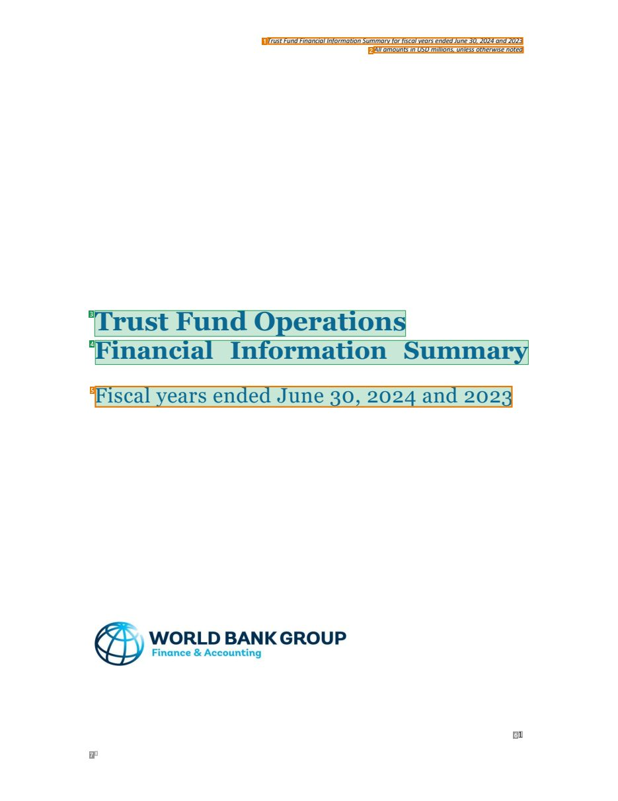
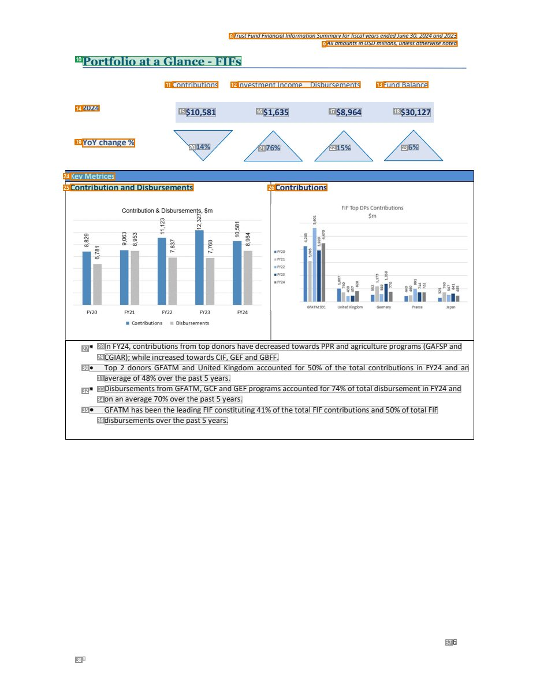
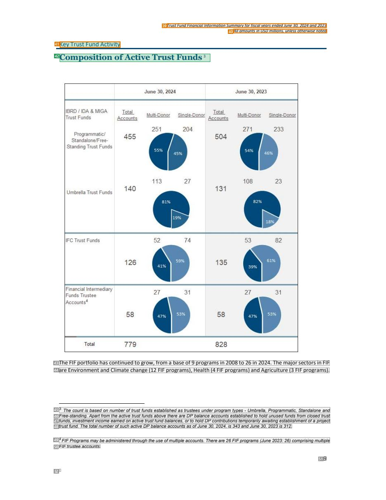
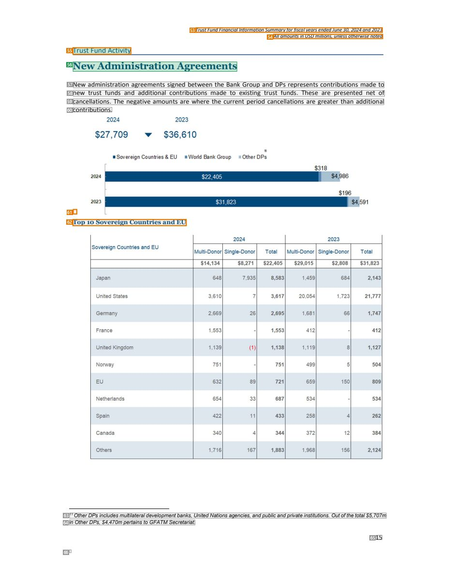

# 051 — `todo10_8/heading_corpus_100/03_tai_chinh_ke_toan/051_WBG_Trust_Fund_FIS_June_2024.pdf`

Draft status: `DRAFT_REVIEWER_A_NOT_APPROVED`. Source sha256 `7fd684159939651921105dcc478b4cc145bac8e7810b4ee7b83f15aec7fa0622`. [Back to index](README.md)

## Page 1 (FIRST)

| # | alias | text | font | draft | flag | rationale |
|---:|---|---|---|---|---|---|
| 1 | L0000:S0 | TrustFundFinancialInformationSummaryforfiscalyearsendedJune30,2024and2023 | 7.1 I | **OTHER** | REVIEW_FOCUS | Running header (italic 7.1, repeated on every page) |
| 2 | L0001:S0 | AllamountsinUSDmillions, unlessotherwisenoted | 7.1 I | **OTHER** | REVIEW_FOCUS | Running header &quot;All amounts in USD millions...&quot; |
| 3 | L0002:S0 | TrustFundOperations | 26.2 B | **ESTABLISHES** |  | Cover title &quot;Trust Fund Operations&quot; (bold 26) |
| 4 | L0003:S0 | Financial Information Summary | 24.4 B | **ESTABLISHES** |  | Cover title &quot;Financial Information Summary&quot; (bold 24) |
| 5 | L0004:S0 | Fiscalyears endedJune30, 2024and2023 | 20.6 | **ESTABLISHES** | REVIEW_FOCUS | Cover subtitle &quot;Fiscal years ended June 30, 2024 and 2023&quot; (20.6, regular) — subtitle or reporting-period metadata |
| 6 | L0005:S0 | 1 | 9.3 | **OTHER** |  | Default: body text, list item, table cell, page number or other non-heading content on this page |
| 7 | L0006:S0 | 1 | 6.1 | **OTHER** |  | Default: body text, list item, table cell, page number or other non-heading content on this page |

## Page 6 (TARGETED_STRUCTURE)

| # | alias | text | font | draft | flag | rationale |
|---:|---|---|---|---|---|---|
| 8 | L0067:S0 | TrustFundFinancialInformationSummaryforfiscalyearsendedJune30,2024and2023 | 7.1 I | **OTHER** | REVIEW_FOCUS | Running header |
| 9 | L0068:S0 | AllamountsinUSDmillions, unlessotherwisenoted | 7.1 I | **OTHER** | REVIEW_FOCUS | Running header |
| 10 | L0069:S0 | PortfolioataGlance-FIFs | 13.2 B | **ESTABLISHES** |  | Slide/page heading &quot;Portfolio at a Glance - FIFs&quot; (bold 13) |
| 11 | L0070:S0 | Contributions | 9.4 | **OTHER** | REVIEW_FOCUS | Table column label |
| 12 | L0070:S1 | InvestmentIncome Disbursements | 9.4 | **OTHER** | REVIEW_FOCUS | Table column labels |
| 13 | L0070:S2 | Fund Balance | 9.4 | **OTHER** | REVIEW_FOCUS | Table column label |
| 14 | L0071:S0 | 2024 | 9.4 B | **OTHER** | REVIEW_FOCUS | Table row label &quot;2024&quot; |
| 15 | L0071:S1 | $10,581 | 10.4 B | **OTHER** |  | Default: body text, list item, table cell, page number or other non-heading content on this page |
| 16 | L0071:S2 | $1,635 | 10.4 B | **OTHER** |  | Default: body text, list item, table cell, page number or other non-heading content on this page |
| 17 | L0071:S3 | $8,964 | 10.4 B | **OTHER** |  | Default: body text, list item, table cell, page number or other non-heading content on this page |
| 18 | L0071:S4 | $30,127 | 10.4 B | **OTHER** |  | Default: body text, list item, table cell, page number or other non-heading content on this page |
| 19 | L0072:S0 | YoYchange% | 10.4 B | **OTHER** | REVIEW_FOCUS | Table row label &quot;YoY change%&quot; |
| 20 | L0072:S1 | 14% | 9.4 B | **OTHER** |  | Default: body text, list item, table cell, page number or other non-heading content on this page |
| 21 | L0072:S2 | 76% | 9.4 B | **OTHER** |  | Default: body text, list item, table cell, page number or other non-heading content on this page |
| 22 | L0072:S3 | 15% | 9.4 B | **OTHER** |  | Default: body text, list item, table cell, page number or other non-heading content on this page |
| 23 | L0072:S4 | 6% | 9.4 B | **OTHER** |  | Default: body text, list item, table cell, page number or other non-heading content on this page |
| 24 | L0073:S0 | KeyMetrices | 9.4 B | **ESTABLISHES** | REVIEW_FOCUS | Sub-heading &quot;Key Metrices&quot; (bold 9.4) introducing the metrics block |
| 25 | L0074:S0 | ContributionandDisbursements | 10.4 B | **ESTABLISHES** | REVIEW_FOCUS | Block heading &quot;Contribution and Disbursements&quot; (bold 10.4) |
| 26 | L0074:S1 | Contributions | 10.4 B | **OTHER** | REVIEW_FOCUS | Chart title &quot;Contributions&quot; (object caption) |
| 27 | L0075:S0 |  | 9.4 | **OTHER** |  | Default: body text, list item, table cell, page number or other non-heading content on this page |
| 28 | L0075:S1 | In FY24,contributionsfromtopdonorshavedecreasedtowardsPPRandagricultureprograms(GAFSPand | 9.4 | **OTHER** |  | Default: body text, list item, table cell, page number or other non-heading content on this page |
| 29 | L0076:S0 | CGIAR);whileincreasedtowardsCIF,GEFandGBFF. | 9.4 | **OTHER** |  | Default: body text, list item, table cell, page number or other non-heading content on this page |
| 30 | L0077:S0 |  Top 2 donors GFATM and United Kingdom accounted for 50% of the total contributions in FY24 and an | 9.4 | **OTHER** |  | Default: body text, list item, table cell, page number or other non-heading content on this page |
| 31 | L0078:S0 | averageo2f%48%overthepast5years. | 9.4 | **OTHER** |  | Default: body text, list item, table cell, page number or other non-heading content on this page |
| 32 | L0079:S0 |  | 9.4 | **OTHER** |  | Default: body text, list item, table cell, page number or other non-heading content on this page |
| 33 | L0079:S1 | DisbursementsfromGFATM,GCFandGEFprogramsaccountedfor74%oftotaldisbursementin FY24and | 9.4 | **OTHER** |  | Default: body text, list item, table cell, page number or other non-heading content on this page |
| 34 | L0080:S0 | onanaverage70%overthepast5years. | 9.4 | **OTHER** |  | Default: body text, list item, table cell, page number or other non-heading content on this page |
| 35 | L0081:S0 |  GFATM hasbeenthe leading FIFconstituting41%ofthetotal FIFcontributionsand50%oftotal FIF | 9.4 | **OTHER** |  | Default: body text, list item, table cell, page number or other non-heading content on this page |
| 36 | L0082:S0 | disbursementsoverthe past5years. | 9.4 | **OTHER** |  | Default: body text, list item, table cell, page number or other non-heading content on this page |
| 37 | L0083:S0 | 6 | 9.4 | **OTHER** |  | Default: body text, list item, table cell, page number or other non-heading content on this page |
| 38 | L0084:S0 | 1 | 6.1 | **OTHER** |  | Default: body text, list item, table cell, page number or other non-heading content on this page |

## Page 9 (SEEDED_INTERIOR)

| # | alias | text | font | draft | flag | rationale |
|---:|---|---|---|---|---|---|
| 39 | L0124:S0 | TrustFundFinancialInformationSummaryforfiscalyearsendedJune30,2024and2023 | 7.1 I | **OTHER** | REVIEW_FOCUS | Running header |
| 40 | L0125:S0 | AllamountsinUSDmillions, unlessotherwisenoted | 7.1 I | **OTHER** | REVIEW_FOCUS | Running header |
| 41 | L0126:S0 | KeyTrustFundActivity | 10.4 | **ESTABLISHES** | REVIEW_FOCUS | Section kicker &quot;Key Trust Fund Activity&quot; above the slide title (10.4, regular) |
| 42 | L0127:S0 | CompositionofActiveTrustFunds3 2 | 12.7 B | **ESTABLISHES** |  | Slide/page heading &quot;Composition of Active Trust Funds&quot; (bold 12.7, with footnote markers) |
| 43 | L0128:S0 | TheFIFportfoliohascontinuedtogrow,froma baseof9programsin2008to26in2024.Themajorsectorsin FIF | 9.3 | **OTHER** |  | Default: body text, list item, table cell, page number or other non-heading content on this page |
| 44 | L0129:S0 | areEnvironmentandClimatechange(12 FIFprograms), Health(4FIFprograms)andAgriculture(3FIFprograms). | 9.3 | **OTHER** |  | Default: body text, list item, table cell, page number or other non-heading content on this page |
| 45 | L0130:S0 | 3 The countis based on numberoftrustfunds establishedas trustees underprogram types - Umbrella, Programmatic, Standalone… | 7.1 I | **OTHER** |  | Default: body text, list item, table cell, page number or other non-heading content on this page |
| 46 | L0131:S0 | Free-standing. Apartfromtheactive trustfundsabove there areDPbalanceaccountsestablishedtoholdunusedfundsfromclosedtrust | 7.1 I | **OTHER** |  | Default: body text, list item, table cell, page number or other non-heading content on this page |
| 47 | L0132:S0 | funds, investmentincomeearnedonactivetrustfundbalances, ortoholdDPcontributionstemporarilyawaitingestablishmentofaprojec… | 7.1 I | **OTHER** |  | Default: body text, list item, table cell, page number or other non-heading content on this page |
| 48 | L0133:S0 | trustfund. ThetotalnumberofsuchactiveDPbalanceaccountsasofJune 30, 2024, is343andJune30, 2023is312. | 7.1 I | **OTHER** |  | Default: body text, list item, table cell, page number or other non-heading content on this page |
| 49 | L0134:S0 | 4FIFProgramsmaybeadministeredthroughtheuseofmultipleaccounts. Thereare26FIFprograms (June2023:26) comprisingmultiple | 7.1 I | **OTHER** |  | Default: body text, list item, table cell, page number or other non-heading content on this page |
| 50 | L0135:S0 | FIFtrusteeaccounts. | 7.1 I | **OTHER** |  | Default: body text, list item, table cell, page number or other non-heading content on this page |
| 51 | L0136:S0 | 9 | 9.3 | **OTHER** |  | Default: body text, list item, table cell, page number or other non-heading content on this page |
| 52 | L0137:S0 | 1 | 6.1 | **OTHER** |  | Default: body text, list item, table cell, page number or other non-heading content on this page |

## Page 15 (SEEDED_INTERIOR)

| # | alias | text | font | draft | flag | rationale |
|---:|---|---|---|---|---|---|
| 53 | L0210:S0 | TrustFundFinancialInformationSummaryforfiscalyearsendedJune30,2024and2023 | 7.1 I | **OTHER** | REVIEW_FOCUS | Running header |
| 54 | L0211:S0 | AllamountsinUSDmillions, unlessotherwisenoted | 7.1 I | **OTHER** | REVIEW_FOCUS | Running header |
| 55 | L0212:S0 | TrustFundActivity | 10.4 | **ESTABLISHES** | REVIEW_FOCUS | Section kicker &quot;Trust Fund Activity&quot; above the slide title |
| 56 | L0213:S0 | NewAdministrationAgreements | 13.2 B | **ESTABLISHES** |  | Slide/page heading &quot;New Administration Agreements&quot; (bold 13.2) |
| 57 | L0214:S0 | New administration agreements signed between the Bank Group and DPs represents contributions made to | 9.4 | **OTHER** |  | Default: body text, list item, table cell, page number or other non-heading content on this page |
| 58 | L0215:S0 | new trust funds and additional contributions made to existing trust funds. These are presented net of | 9.4 | **OTHER** |  | Default: body text, list item, table cell, page number or other non-heading content on this page |
| 59 | L0216:S0 | cancellations. The negative amounts are where the current period cancellations are greater than additional | 9.4 | **OTHER** |  | Default: body text, list item, table cell, page number or other non-heading content on this page |
| 60 | L0217:S0 | contributions. | 9.4 | **OTHER** |  | Default: body text, list item, table cell, page number or other non-heading content on this page |
| 61 | L0218:S0 | 8 | 8.4 B | **OTHER** | REVIEW_FOCUS | Chart figure label &quot;8&quot; |
| 62 | L0219:S0 | Top10SovereignCountriesandEU | 8.4 B | **OTHER** | REVIEW_FOCUS | Chart title &quot;Top 10 Sovereign Countries and EU&quot; (object caption) |
| 63 | L0220:S0 | 11 OtherDPsincludesmultilateraldevelopmentbanks, UnitedNationsagencies, andpublicandprivateinstitutions. Outofthetotal$5… | 7.1 I | **OTHER** |  | Default: body text, list item, table cell, page number or other non-heading content on this page |
| 64 | L0221:S0 | in OtherDPs, $4,470mpertainsto GFATMSecretariat. | 7.1 I | **OTHER** |  | Default: body text, list item, table cell, page number or other non-heading content on this page |
| 65 | L0222:S0 | 15 | 9.4 | **OTHER** |  | Default: body text, list item, table cell, page number or other non-heading content on this page |
| 66 | L0223:S0 | 1 | 6.1 | **OTHER** |  | Default: body text, list item, table cell, page number or other non-heading content on this page |
