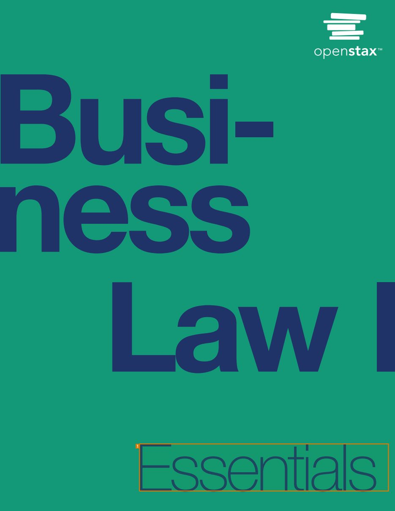
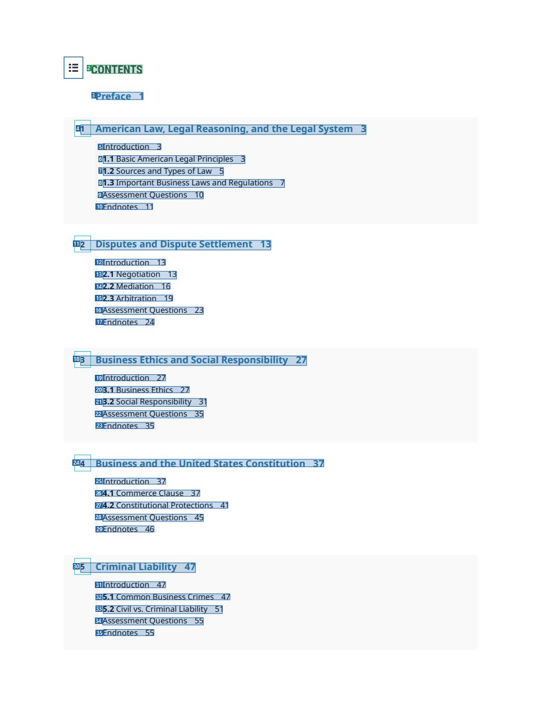
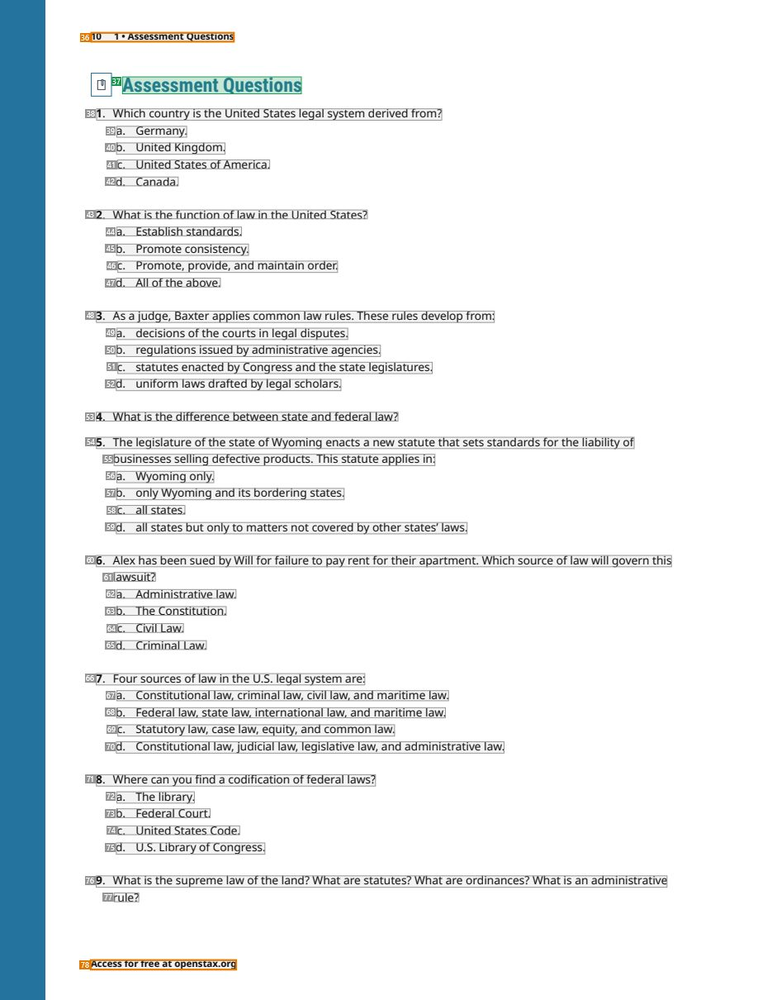
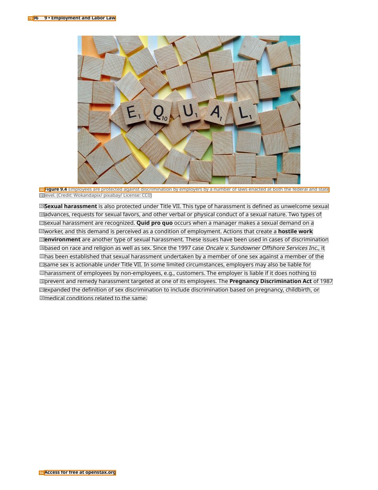

# 056 — `todo10_8/heading_corpus_100/04_giao_trinh/056_OpenStax_Business_Law_I_Essentials.pdf`

Draft status: `DRAFT_REVIEWER_A_NOT_APPROVED`. Source sha256 `c56eef123fd5699ef7fac923394687c34cb46f349bad0b0f5f59b2106bc303bc`. [Back to index](README.md)

## Page 1 (FIRST)

| # | alias | text | font | draft | flag | rationale |
|---:|---|---|---|---|---|---|
| 1 | L0000:S0 | Essentials | 102.2 | **ESTABLISHES** | REVIEW_FOCUS | Cover word &quot;Essentials&quot; (102pt) — visible part of the cover title &quot;Business Law I Essentials&quot;; remaining title words are… |

## Page 7 (TARGETED_STRUCTURE)

| # | alias | text | font | draft | flag | rationale |
|---:|---|---|---|---|---|---|
| 2 | L0078:S0 | CONTENTS | 13 B | **ESTABLISHES** |  | Heading &quot;CONTENTS&quot; |
| 3 | L0079:S0 | Preface 1 | 10.8 B | **REPRESENTS** |  | Contents entry &quot;Preface 1&quot; |
| 4 | L0080:S0 | 1 American Law, Legal Reasoning, and the Legal System 3 | 10.8 B | **REPRESENTS** |  | Contents entry for chapter 1 |
| 5 | L0081:S0 | Introduction 3 | 9 | **REPRESENTS** |  | Contents entry &quot;Introduction 3&quot; |
| 6 | L0082:S0 | 1.1 Basic American Legal Principles 3 | 9 | **REPRESENTS** |  | Contents entry 1.1 |
| 7 | L0083:S0 | 1.2 Sources and Types of Law 5 | 9 | **REPRESENTS** |  | Contents entry 1.2 |
| 8 | L0084:S0 | 1.3 Important Business Laws and Regulations 7 | 9 | **REPRESENTS** |  | Contents entry 1.3 |
| 9 | L0085:S0 | Assessment Questions 10 | 9 | **REPRESENTS** |  | Contents entry &quot;Assessment Questions 10&quot; |
| 10 | L0086:S0 | Endnotes 1 1 | 9 | **REPRESENTS** |  | Contents entry &quot;Endnotes 11&quot; |
| 11 | L0087:S0 | 2 Disputes and Dispute Settlement 13 | 10.8 B | **REPRESENTS** |  | Contents entry for chapter 2 |
| 12 | L0088:S0 | Introduction 13 | 9 | **REPRESENTS** |  | Contents entry |
| 13 | L0089:S0 | 2.1 Negotiation 13 | 9 | **REPRESENTS** |  | Contents entry 2.1 |
| 14 | L0090:S0 | 2.2 Mediation 1 6 | 9 | **REPRESENTS** |  | Contents entry 2.2 |
| 15 | L0091:S0 | 2.3 Arbitration 19 | 9 | **REPRESENTS** |  | Contents entry 2.3 |
| 16 | L0092:S0 | Assessment Questions 23 | 9 | **REPRESENTS** |  | Contents entry |
| 17 | L0093:S0 | Endnotes 24 | 9 | **REPRESENTS** |  | Contents entry |
| 18 | L0094:S0 | 3 Business Ethics and Social Responsibility 27 | 10.8 B | **REPRESENTS** |  | Contents entry for chapter 3 |
| 19 | L0095:S0 | Introduction 27 | 9 | **REPRESENTS** |  | Contents entry |
| 20 | L0096:S0 | 3.1 Business Ethics 27 | 9 | **REPRESENTS** |  | Contents entry 3.1 |
| 21 | L0097:S0 | 3.2 Social Responsibility 31 | 9 | **REPRESENTS** |  | Contents entry 3.2 |
| 22 | L0098:S0 | Assessment Questions 35 | 9 | **REPRESENTS** |  | Contents entry |
| 23 | L0099:S0 | Endnotes 35 | 9 | **REPRESENTS** |  | Contents entry |
| 24 | L0100:S0 | 4 Business and the United States Constitution 37 | 10.8 B | **REPRESENTS** |  | Contents entry for chapter 4 |
| 25 | L0101:S0 | Introduction 37 | 9 | **REPRESENTS** |  | Contents entry |
| 26 | L0102:S0 | 4.1 Commerce Clause 37 | 9 | **REPRESENTS** |  | Contents entry 4.1 |
| 27 | L0103:S0 | 4.2 Constitutional Protections 41 | 9 | **REPRESENTS** |  | Contents entry 4.2 |
| 28 | L0104:S0 | Assessment Questions 45 | 9 | **REPRESENTS** |  | Contents entry |
| 29 | L0105:S0 | Endnotes 46 | 9 | **REPRESENTS** |  | Contents entry |
| 30 | L0106:S0 | 5 Criminal Liability 47 | 10.8 B | **REPRESENTS** |  | Contents entry for chapter 5 |
| 31 | L0107:S0 | Introduction 47 | 9 | **REPRESENTS** |  | Contents entry |
| 32 | L0108:S0 | 5.1 Common Business Crimes 47 | 9 | **REPRESENTS** |  | Contents entry 5.1 |
| 33 | L0109:S0 | 5.2 Civil vs. Criminal Liability 51 | 9 | **REPRESENTS** |  | Contents entry 5.2 |
| 34 | L0110:S0 | Assessment Questions 55 | 9 | **REPRESENTS** |  | Contents entry |
| 35 | L0111:S0 | Endnotes 55 | 9 | **REPRESENTS** |  | Contents entry |

## Page 20 (SEEDED_INTERIOR)

| # | alias | text | font | draft | flag | rationale |
|---:|---|---|---|---|---|---|
| 36 | L0466:S0 | 10 1 • Assessment Questions | 7.5 B | **OTHER** | REVIEW_FOCUS | Running header &quot;10 1 • Assessment Questions&quot; (repeats the section name; page furniture) |
| 37 | L0467:S0 | Assessment Questions | 15.6 B | **ESTABLISHES** |  | Section heading &quot;Assessment Questions&quot; (bold 15.6) |
| 38 | L0468:S0 | 1. Which country is the United States legal system derived from? | 9 | **OTHER** |  | Default: body text, list item, table cell, page number or other non-heading content on this page |
| 39 | L0469:S0 | a. Germany. | 9 | **OTHER** |  | Default: body text, list item, table cell, page number or other non-heading content on this page |
| 40 | L0470:S0 | b. United Kingdom. | 9 | **OTHER** |  | Default: body text, list item, table cell, page number or other non-heading content on this page |
| 41 | L0471:S0 | c. United States ofAmerica. | 9 | **OTHER** |  | Default: body text, list item, table cell, page number or other non-heading content on this page |
| 42 | L0472:S0 | d. Canada. | 9 | **OTHER** |  | Default: body text, list item, table cell, page number or other non-heading content on this page |
| 43 | L0473:S0 | 2. What is the function of law in the United States? | 9 | **OTHER** |  | Default: body text, list item, table cell, page number or other non-heading content on this page |
| 44 | L0474:S0 | a. Establish standards. | 9 | **OTHER** |  | Default: body text, list item, table cell, page number or other non-heading content on this page |
| 45 | L0475:S0 | b. Promote consistency. | 9 | **OTHER** |  | Default: body text, list item, table cell, page number or other non-heading content on this page |
| 46 | L0476:S0 | c. Promote, provide, and maintain order. | 9 | **OTHER** |  | Default: body text, list item, table cell, page number or other non-heading content on this page |
| 47 | L0477:S0 | d. All ofthe above. | 9 | **OTHER** |  | Default: body text, list item, table cell, page number or other non-heading content on this page |
| 48 | L0478:S0 | 3. As a judge, Baxter applies common law rules. These rules develop from: | 9 | **OTHER** |  | Default: body text, list item, table cell, page number or other non-heading content on this page |
| 49 | L0479:S0 | a. decisions ofthe courts in legal disputes. | 9 | **OTHER** |  | Default: body text, list item, table cell, page number or other non-heading content on this page |
| 50 | L0480:S0 | b. regulations issued by administrative agencies. | 9 | **OTHER** |  | Default: body text, list item, table cell, page number or other non-heading content on this page |
| 51 | L0481:S0 | c. statutes enacted by Congress and the state legislatures. | 9 | **OTHER** |  | Default: body text, list item, table cell, page number or other non-heading content on this page |
| 52 | L0482:S0 | d. uniform laws drafted by legal scholars. | 9 | **OTHER** |  | Default: body text, list item, table cell, page number or other non-heading content on this page |
| 53 | L0483:S0 | 4. What is the difference between state and federal law? | 9 | **OTHER** |  | Default: body text, list item, table cell, page number or other non-heading content on this page |
| 54 | L0484:S0 | 5. The legislature ofthe state ofWyoming enacts a new statute that sets standards for the liability of | 9 | **OTHER** |  | Default: body text, list item, table cell, page number or other non-heading content on this page |
| 55 | L0485:S0 | businesses selling defective products. This statute applies in: | 9 | **OTHER** |  | Default: body text, list item, table cell, page number or other non-heading content on this page |
| 56 | L0486:S0 | a. Wyoming only. | 9 | **OTHER** |  | Default: body text, list item, table cell, page number or other non-heading content on this page |
| 57 | L0487:S0 | b. only Wyoming and its bordering states. | 9 | **OTHER** |  | Default: body text, list item, table cell, page number or other non-heading content on this page |
| 58 | L0488:S0 | c. all states. | 9 | **OTHER** |  | Default: body text, list item, table cell, page number or other non-heading content on this page |
| 59 | L0489:S0 | d. all states but only to matters not covered by other states’ laws. | 9 | **OTHER** |  | Default: body text, list item, table cell, page number or other non-heading content on this page |
| 60 | L0490:S0 | 6. Alex has been sued by Will for failure to pay rent for their apartment. Which source of law will govern this | 9 | **OTHER** |  | Default: body text, list item, table cell, page number or other non-heading content on this page |
| 61 | L0491:S0 | lawsuit? | 9 | **OTHER** |  | Default: body text, list item, table cell, page number or other non-heading content on this page |
| 62 | L0492:S0 | a. Administrative law. | 9 | **OTHER** |  | Default: body text, list item, table cell, page number or other non-heading content on this page |
| 63 | L0493:S0 | b. The Constitution. | 9 | **OTHER** |  | Default: body text, list item, table cell, page number or other non-heading content on this page |
| 64 | L0494:S0 | c. Civil Law. | 9 | **OTHER** |  | Default: body text, list item, table cell, page number or other non-heading content on this page |
| 65 | L0495:S0 | d. Criminal Law. | 9 | **OTHER** |  | Default: body text, list item, table cell, page number or other non-heading content on this page |
| 66 | L0496:S0 | 7. Four sources of law in the U.S. legal system are: | 9 | **OTHER** |  | Default: body text, list item, table cell, page number or other non-heading content on this page |
| 67 | L0497:S0 | a. Constitutional law, criminal law, civil law, and maritime law. | 9 | **OTHER** |  | Default: body text, list item, table cell, page number or other non-heading content on this page |
| 68 | L0498:S0 | b. Federal law, state law, international law, and maritime law. | 9 | **OTHER** |  | Default: body text, list item, table cell, page number or other non-heading content on this page |
| 69 | L0499:S0 | c. Statutory law, case law, equity, and common law. | 9 | **OTHER** |  | Default: body text, list item, table cell, page number or other non-heading content on this page |
| 70 | L0500:S0 | d. Constitutional law, judicial law, legislative law, and administrative law. | 9 | **OTHER** |  | Default: body text, list item, table cell, page number or other non-heading content on this page |
| 71 | L0501:S0 | 8. Where can you find a codification offederal laws? | 9 | **OTHER** |  | Default: body text, list item, table cell, page number or other non-heading content on this page |
| 72 | L0502:S0 | a. The library. | 9 | **OTHER** |  | Default: body text, list item, table cell, page number or other non-heading content on this page |
| 73 | L0503:S0 | b. Federal Court. | 9 | **OTHER** |  | Default: body text, list item, table cell, page number or other non-heading content on this page |
| 74 | L0504:S0 | c. United States Code. | 9 | **OTHER** |  | Default: body text, list item, table cell, page number or other non-heading content on this page |
| 75 | L0505:S0 | d. U.S. Library of Congress. | 9 | **OTHER** |  | Default: body text, list item, table cell, page number or other non-heading content on this page |
| 76 | L0506:S0 | 9. What is the supreme law ofthe land? What are statutes? What are ordinances? What is an administrative | 9 | **OTHER** |  | Default: body text, list item, table cell, page number or other non-heading content on this page |
| 77 | L0507:S0 | rule? | 9 | **OTHER** |  | Default: body text, list item, table cell, page number or other non-heading content on this page |
| 78 | L0508:S0 | Access for free at openstax.org | 7.5 B | **OTHER** | REVIEW_FOCUS | Running footer &quot;Access for free at openstax.org&quot; |

## Page 106 (SEEDED_INTERIOR)

| # | alias | text | font | draft | flag | rationale |
|---:|---|---|---|---|---|---|
| 79 | L3205:S0 | 96 9 • Employment and Labor Law | 7.5 B | **OTHER** | REVIEW_FOCUS | Running header &quot;96 9 • Employment and Labor Law&quot; |
| 80 | L3206:S0 | Figure 9.4 Employees are protected against discrimination by employers by a number of laws enacted at both the federal a… | 7.5 | **OTHER** | REVIEW_FOCUS | Figure caption &quot;Figure 9.4 ...&quot; (object caption) |
| 81 | L3207:S0 | level. (Credit: Wokandapix/ pixabay/ License: CC0) | 7.5 | **OTHER** |  | Default: body text, list item, table cell, page number or other non-heading content on this page |
| 82 | L3208:S0 | Sexual harassment is also protected under Title VII. This type of harassment is defined as unwelcome sexual | 9 | **OTHER** |  | Default: body text, list item, table cell, page number or other non-heading content on this page |
| 83 | L3209:S0 | advances, requests for sexual favors, and other verbal or physical conduct ofa sexual nature. Two types of | 9 | **OTHER** |  | Default: body text, list item, table cell, page number or other non-heading content on this page |
| 84 | L3210:S0 | sexual harassment are recognized. Quid pro quo occurs when a manager makes a sexual demand on a | 9 | **OTHER** |  | Default: body text, list item, table cell, page number or other non-heading content on this page |
| 85 | L3211:S0 | worker, and this demand is perceived as a condition of employment. Actions that create a hostile work | 9 | **OTHER** |  | Default: body text, list item, table cell, page number or other non-heading content on this page |
| 86 | L3212:S0 | environment are another type ofsexual harassment. These issues have been used in cases of discrimination | 9 | **OTHER** |  | Default: body text, list item, table cell, page number or other non-heading content on this page |
| 87 | L3213:S0 | based on race and religion as well as sex. Since the 1997 case Onca le v. Su n downer Offs hore Services Inc., it | 9 | **OTHER** |  | Default: body text, list item, table cell, page number or other non-heading content on this page |
| 88 | L3214:S0 | has been established that sexual harassment undertaken by a member of one sex against a member ofthe | 9 | **OTHER** |  | Default: body text, list item, table cell, page number or other non-heading content on this page |
| 89 | L3215:S0 | same sex is actionable under Title VII. In some limited circumstances, employers may also be liable for | 9 | **OTHER** |  | Default: body text, list item, table cell, page number or other non-heading content on this page |
| 90 | L3216:S0 | harassment of employees by non-employees, e.g., customers. The employer is liable if it does nothing to | 9 | **OTHER** |  | Default: body text, list item, table cell, page number or other non-heading content on this page |
| 91 | L3217:S0 | prevent and remedy harassment targeted at one of its employees. The Pregnancy Discrimination Act of 1987 | 9 | **OTHER** |  | Default: body text, list item, table cell, page number or other non-heading content on this page |
| 92 | L3218:S0 | expanded the definition ofsex discrimination to include discrimination based on pregnancy, childbirth, or | 9 | **OTHER** |  | Default: body text, list item, table cell, page number or other non-heading content on this page |
| 93 | L3219:S0 | medical conditions related to the same. | 9 | **OTHER** |  | Default: body text, list item, table cell, page number or other non-heading content on this page |
| 94 | L3220:S0 | Access for free at openstax.org | 7.5 B | **OTHER** | REVIEW_FOCUS | Running footer |
