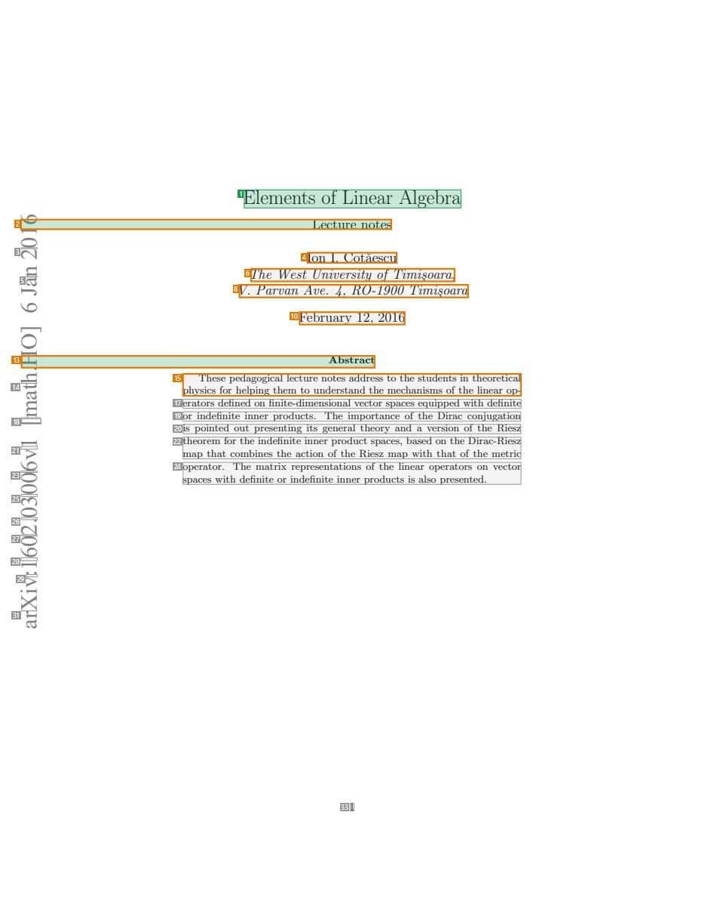
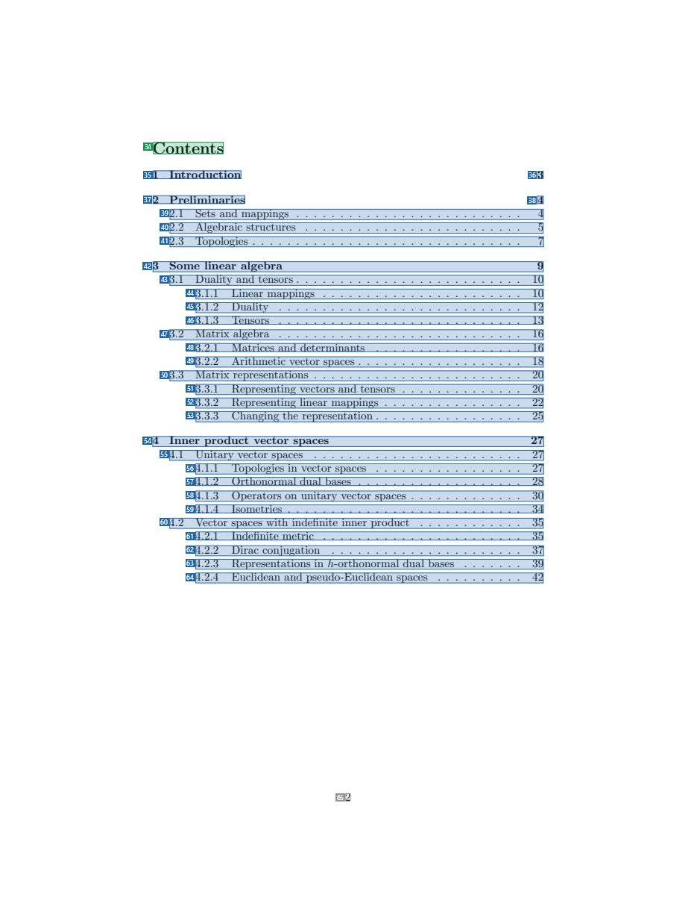
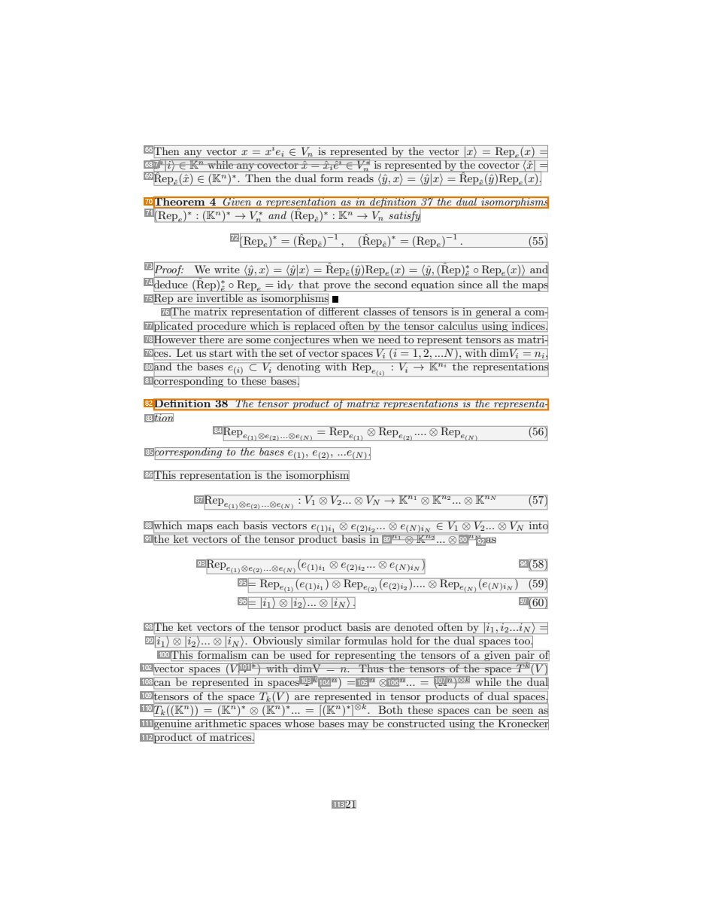
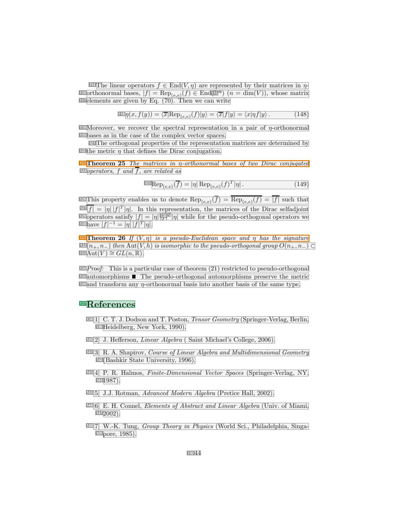

# 060 — `todo10_8/heading_corpus_100/04_giao_trinh/060_Elements_of_Linear_Algebra_Lecture_Notes.pdf`

Draft status: `DRAFT_REVIEWER_A_NOT_APPROVED`. Source sha256 `b3bdfbece3c9df4409ac2012569553ac332dd35a6ca759571c0d74c9d06ccdb2`. [Back to index](README.md)

## Page 1 (FIRST)

| # | alias | text | font | draft | flag | rationale |
|---:|---|---|---|---|---|---|
| 1 | L0000:S0 | Elements of Linear Algebra | 17.2 | **ESTABLISHES** |  | Title &quot;Elements of Linear Algebra&quot; (17.2pt, centred) |
| 2 | L0001:S0 | 61 Lecture notes | 12 | **ESTABLISHES** | REVIEW_FOCUS | Subtitle &quot;Lecture notes&quot; merged by the parser with a stray margin-stamp digit |
| 3 | L0002:S0 | 02 | 20 | **OTHER** |  | Default: body text, list item, table cell, page number or other non-heading content on this page |
| 4 | L0003:S0 | Ion I. Cota˘escu | 12 | **OTHER** | REVIEW_FOCUS | Author name |
| 5 | L0004:S0 | na | 20 | **OTHER** |  | Default: body text, list item, table cell, page number or other non-heading content on this page |
| 6 | L0004:S1 | The West University of Timi&#184;soara, | 12 | **OTHER** | REVIEW_FOCUS | Author affiliation |
| 7 | L0005:S0 | J | 20 | **OTHER** |  | Default: body text, list item, table cell, page number or other non-heading content on this page |
| 8 | L0005:S1 | V. Parvan Ave. 4, RO-1900 Timi&#184;soara | 12 | **OTHER** | REVIEW_FOCUS | Author address |
| 9 | L0006:S0 | 6 | 20 | **OTHER** |  | Default: body text, list item, table cell, page number or other non-heading content on this page |
| 10 | L0007:S0 | February 12, 2016 | 12 | **OTHER** | REVIEW_FOCUS | Date |
| 11 | L0008:S0 | ] | 20 | **OTHER** |  | Default: body text, list item, table cell, page number or other non-heading content on this page |
| 12 | L0009:S0 | O | 20 | **OTHER** |  | Default: body text, list item, table cell, page number or other non-heading content on this page |
| 13 | L0010:S0 | H. Abstract | 9 | **ESTABLISHES** | REVIEW_FOCUS | Heading &quot;Abstract&quot; merged with a stray stamp fragment &quot;H.&quot; |
| 14 | L0011:S0 | ht | 20 | **OTHER** |  | Default: body text, list item, table cell, page number or other non-heading content on this page |
| 15 | L0011:S1 | phyTsihcsesfeorpehdealpgionggictahlelmecttuoreunndoetresstaandddrtehses tmoetchheanstisumdesnotfstihnethlienoeraertiocpa… | 9 | **OTHER** | REVIEW_FOCUS | Abstract text interleaved with vertical stamp characters (garbled) |
| 16 | L0012:S0 | a | 20 | **OTHER** |  | Default: body text, list item, table cell, page number or other non-heading content on this page |
| 17 | L0013:S0 | erators defined on finite-dimensional vector spaces equipped with definite | 9 | **OTHER** |  | Default: body text, list item, table cell, page number or other non-heading content on this page |
| 18 | L0014:S0 | [m | 20 | **OTHER** |  | Default: body text, list item, table cell, page number or other non-heading content on this page |
| 19 | L0014:S1 | or indefinite inner products. The importance of the Dirac conjugation | 9 | **OTHER** |  | Default: body text, list item, table cell, page number or other non-heading content on this page |
| 20 | L0015:S0 | is pointed out presenting its general theory and a version of the Riesz | 9 | **OTHER** |  | Default: body text, list item, table cell, page number or other non-heading content on this page |
| 21 | L0016:S0 | 1v | 20 | **OTHER** |  | Default: body text, list item, table cell, page number or other non-heading content on this page |
| 22 | L0016:S1 | tmhaeportehmatfocrotmhbeininedsetfihneitaecitnionneropfrtohdeucRtiesspzacmesa,pbwasietdh otnhattheofDtihreacm-Reitersizc | 9 | **OTHER** |  | Default: body text, list item, table cell, page number or other non-heading content on this page |
| 23 | L0017:S0 | 60 | 20 | **OTHER** |  | Default: body text, list item, table cell, page number or other non-heading content on this page |
| 24 | L0017:S1 | osppaecreastowr.ithTdheefimniatetroixr irnedperfiesneintetaitninoners porfotdhuectlsiniesaarlsoopperraetsoenrsteodn. vecto… | 9 | **OTHER** |  | Default: body text, list item, table cell, page number or other non-heading content on this page |
| 25 | L0018:S0 | 03 | 20 | **OTHER** |  | Default: body text, list item, table cell, page number or other non-heading content on this page |
| 26 | L0019:S0 | 0. | 20 | **OTHER** |  | Default: body text, list item, table cell, page number or other non-heading content on this page |
| 27 | L0020:S0 | 20 | 20 | **OTHER** |  | Default: body text, list item, table cell, page number or other non-heading content on this page |
| 28 | L0021:S0 | 61 | 20 | **OTHER** |  | Default: body text, list item, table cell, page number or other non-heading content on this page |
| 29 | L0022:S0 | :v | 20 | **OTHER** |  | Default: body text, list item, table cell, page number or other non-heading content on this page |
| 30 | L0023:S0 | i | 20 | **OTHER** |  | Default: body text, list item, table cell, page number or other non-heading content on this page |
| 31 | L0024:S0 | Xr | 20 | **OTHER** |  | Default: body text, list item, table cell, page number or other non-heading content on this page |
| 32 | L0025:S0 | a | 20 | **OTHER** |  | Default: body text, list item, table cell, page number or other non-heading content on this page |
| 33 | L0026:S0 | 1 | 10 | **OTHER** |  | Default: body text, list item, table cell, page number or other non-heading content on this page |

## Page 2 (TARGETED_STRUCTURE)

| # | alias | text | font | draft | flag | rationale |
|---:|---|---|---|---|---|---|
| 34 | L0027:S0 | Contents | 14.4 | **ESTABLISHES** |  | Heading &quot;Contents&quot; (14.4pt) |
| 35 | L0028:S0 | 1 Introduction | 10 | **REPRESENTS** |  | Contents entry &quot;1 Introduction&quot; |
| 36 | L0028:S1 | 3 | 10 | **REPRESENTS** |  | Contents entry page-number segment |
| 37 | L0029:S0 | 2 Preliminaries | 10 | **REPRESENTS** |  | Contents entry &quot;2 Preliminaries&quot; |
| 38 | L0029:S1 | 4 | 10 | **REPRESENTS** |  | Contents entry page-number segment |
| 39 | L0030:S0 | 2.1 Sets and mappings . . . . . . . . . . . . . . . . . . . . . . . . . . 4 | 10 | **REPRESENTS** |  | Contents entry |
| 40 | L0031:S0 | 2.2 Algebraic structures . . . . . . . . . . . . . . . . . . . . . . . . . 5 | 10 | **REPRESENTS** |  | Contents entry |
| 41 | L0032:S0 | 2.3 Topologies . . . . . . . . . . . . . . . . . . . . . . . . . . . . . . . 7 | 10 | **REPRESENTS** |  | Contents entry |
| 42 | L0033:S0 | 3 Some linear algebra 9 | 10 | **REPRESENTS** |  | Contents entry |
| 43 | L0034:S0 | 3.1 Duality and tensors . . . . . . . . . . . . . . . . . . . . . . . . . . 10 | 10 | **REPRESENTS** |  | Contents entry |
| 44 | L0035:S0 | 3.1.1 Linear mappings . . . . . . . . . . . . . . . . . . . . . . . 10 | 10 | **REPRESENTS** |  | Contents entry |
| 45 | L0036:S0 | 3.1.2 Duality . . . . . . . . . . . . . . . . . . . . . . . . . . . . 12 | 10 | **REPRESENTS** |  | Contents entry |
| 46 | L0037:S0 | 3.1.3 Tensors . . . . . . . . . . . . . . . . . . . . . . . . . . . . 13 | 10 | **REPRESENTS** |  | Contents entry |
| 47 | L0038:S0 | 3.2 Matrix algebra . . . . . . . . . . . . . . . . . . . . . . . . . . . . 16 | 10 | **REPRESENTS** |  | Contents entry |
| 48 | L0039:S0 | 3.2.1 Matrices and determinants . . . . . . . . . . . . . . . . . 16 | 10 | **REPRESENTS** |  | Contents entry |
| 49 | L0040:S0 | 3.2.2 Arithmetic vector spaces . . . . . . . . . . . . . . . . . . . 18 | 10 | **REPRESENTS** |  | Contents entry |
| 50 | L0041:S0 | 3.3 Matrix representations . . . . . . . . . . . . . . . . . . . . . . . . 20 | 10 | **REPRESENTS** |  | Contents entry |
| 51 | L0042:S0 | 3.3.1 Representing vectors and tensors . . . . . . . . . . . . . . 20 | 10 | **REPRESENTS** |  | Contents entry |
| 52 | L0043:S0 | 3.3.2 Representing linear mappings . . . . . . . . . . . . . . . . 22 | 10 | **REPRESENTS** |  | Contents entry |
| 53 | L0044:S0 | 3.3.3 Changing the representation . . . . . . . . . . . . . . . . . 25 | 10 | **REPRESENTS** |  | Contents entry |
| 54 | L0045:S0 | 4 Inner product vector spaces 27 | 10 | **REPRESENTS** |  | Contents entry |
| 55 | L0046:S0 | 4.1 Unitary vector spaces . . . . . . . . . . . . . . . . . . . . . . . . 27 | 10 | **REPRESENTS** |  | Contents entry |
| 56 | L0047:S0 | 4.1.1 Topologies in vector spaces . . . . . . . . . . . . . . . . . 27 | 10 | **REPRESENTS** |  | Contents entry |
| 57 | L0048:S0 | 4.1.2 Orthonormal dual bases . . . . . . . . . . . . . . . . . . . 28 | 10 | **REPRESENTS** |  | Contents entry |
| 58 | L0049:S0 | 4.1.3 Operators on unitary vector spaces . . . . . . . . . . . . . 30 | 10 | **REPRESENTS** |  | Contents entry |
| 59 | L0050:S0 | 4.1.4 Isometries . . . . . . . . . . . . . . . . . . . . . . . . . . . 34 | 10 | **REPRESENTS** |  | Contents entry |
| 60 | L0051:S0 | 4.2 Vector spaces with indefinite inner product . . . . . . . . . . . . 35 | 10 | **REPRESENTS** |  | Contents entry |
| 61 | L0052:S0 | 4.2.1 Indefinite metric . . . . . . . . . . . . . . . . . . . . . . . 35 | 10 | **REPRESENTS** |  | Contents entry |
| 62 | L0053:S0 | 4.2.2 Dirac conjugation . . . . . . . . . . . . . . . . . . . . . . 37 | 10 | **REPRESENTS** |  | Contents entry |
| 63 | L0054:S0 | 4.2.3 Representations in h-orthonormal dual bases . . . . . . . 39 | 10 | **REPRESENTS** |  | Contents entry |
| 64 | L0055:S0 | 4.2.4 Euclidean and pseudo-Euclidean spaces . . . . . . . . . . 42 | 10 | **REPRESENTS** |  | Contents entry |
| 65 | L0056:S0 | 2 | 10 | **OTHER** |  | Default: body text, list item, table cell, page number or other non-heading content on this page |

## Page 21 (SEEDED_INTERIOR)

| # | alias | text | font | draft | flag | rationale |
|---:|---|---|---|---|---|---|
| 66 | L0789:S0 | Then any vector x = xiei ∈ Vn is represented by the vector \|x〉 = Repe(x) = | 10 | **OTHER** |  | Default: body text, list item, table cell, page number or other non-heading content on this page |
| 67 | L0790:S0 | i n i ∗ | 7 | **OTHER** |  | Default: body text, list item, table cell, page number or other non-heading content on this page |
| 68 | L0791:S0 | x \|i〉 ∈ K while any covector xˆ = xˆieˆ ∈ Vn is represented by the covector 〈xˆ\| = | 10 | **OTHER** |  | Default: body text, list item, table cell, page number or other non-heading content on this page |
| 69 | L0792:S0 | Rˆepeˆ (xˆ) ∈ (Kn)∗ . Then the dual form reads 〈yˆ, x〉 = 〈yˆ\|x〉 = Rˆepeˆ (yˆ)Repe(x). | 10 | **OTHER** |  | Default: body text, list item, table cell, page number or other non-heading content on this page |
| 70 | L0793:S0 | Theorem 4 Given a representation as in definition 37 the dual isomorphisms | 10 | **OTHER** | REVIEW_FOCUS | Theorem lead-in &quot;Theorem 4 Given ...&quot; (statement text, not a heading) |
| 71 | L0794:S0 | (Repe)∗ : (Kn)∗ → Vn∗ and (Rˆepeˆ)∗ : Kn → Vn satisfy | 10 | **OTHER** |  | Default: body text, list item, table cell, page number or other non-heading content on this page |
| 72 | L0795:S0 | (Repe)∗ = (Rˆ epeˆ)−1 , (Rˆ epeˆ)∗ = (Repe)−1 . (55) | 10 | **OTHER** |  | Default: body text, list item, table cell, page number or other non-heading content on this page |
| 73 | L0796:S0 | Proof: We write 〈yˆ, x〉 = 〈yˆ\|x〉 = Rˆepeˆ (yˆ)Repe(x) = 〈yˆ, (Rˆ ep)e∗ˆ ◦ Repe(x)〉 and | 10 | **OTHER** |  | Default: body text, list item, table cell, page number or other non-heading content on this page |
| 74 | L0797:S0 | deduce (Rˆ ep)e∗ˆ ◦ Repe = idV that prove the second equation since all the maps | 10 | **OTHER** |  | Default: body text, list item, table cell, page number or other non-heading content on this page |
| 75 | L0798:S0 | Rep are invertible as isomorphisms | 10 | **OTHER** |  | Default: body text, list item, table cell, page number or other non-heading content on this page |
| 76 | L0799:S0 | The matrix representation of different classes of tensors is in general a com- | 10 | **OTHER** |  | Default: body text, list item, table cell, page number or other non-heading content on this page |
| 77 | L0800:S0 | plicated procedure which is replaced often by the tensor calculus using indices. | 10 | **OTHER** |  | Default: body text, list item, table cell, page number or other non-heading content on this page |
| 78 | L0801:S0 | However there are some conjectures when we need to represent tensors as matri- | 10 | **OTHER** |  | Default: body text, list item, table cell, page number or other non-heading content on this page |
| 79 | L0802:S0 | ces. Let us start with the set ofvector spaces Vi (i = 1, 2, ...N), with dimVi = ni, | 10 | **OTHER** |  | Default: body text, list item, table cell, page number or other non-heading content on this page |
| 80 | L0803:S0 | and the bases e(i) ⊂ Vi denoting with Repe(i) : Vi → Kni the representations | 10 | **OTHER** |  | Default: body text, list item, table cell, page number or other non-heading content on this page |
| 81 | L0804:S0 | corresponding to these bases. | 10 | **OTHER** |  | Default: body text, list item, table cell, page number or other non-heading content on this page |
| 82 | L0805:S0 | Definition 38 The tensor product of matrix representations is the representa- | 10 | **OTHER** | REVIEW_FOCUS | Definition lead-in &quot;Definition 38 ...&quot; (statement text) |
| 83 | L0806:S0 | tion | 10 | **OTHER** |  | Default: body text, list item, table cell, page number or other non-heading content on this page |
| 84 | L0807:S0 | Repe(1) ⊗e(2) ...⊗e(N) = Repe(1) ⊗ Repe(2) .... ⊗ Repe(N) (56) | 10 | **OTHER** |  | Default: body text, list item, table cell, page number or other non-heading content on this page |
| 85 | L0808:S0 | corresponding to the bases e(1) , e(2) , ...e(N) . | 10 | **OTHER** |  | Default: body text, list item, table cell, page number or other non-heading content on this page |
| 86 | L0809:S0 | This representation is the isomorphism | 10 | **OTHER** |  | Default: body text, list item, table cell, page number or other non-heading content on this page |
| 87 | L0810:S0 | Repe(1) ⊗e(2) ...⊗e(N) : V1 ⊗ V2 ... ⊗ VN → Kn1 ⊗ Kn2 ... ⊗ KnN (57) | 10 | **OTHER** |  | Default: body text, list item, table cell, page number or other non-heading content on this page |
| 88 | L0811:S0 | which maps each basis vectors e(1)i1 ⊗ e(2)i2 ... ⊗ e(N)iN ∈ V1 ⊗ V2 ... ⊗ VN into | 10 | **OTHER** |  | Default: body text, list item, table cell, page number or other non-heading content on this page |
| 89 | L0812:S0 | n1 n2 | 5 | **OTHER** |  | Default: body text, list item, table cell, page number or other non-heading content on this page |
| 90 | L0812:S1 | nN | 5 | **OTHER** |  | Default: body text, list item, table cell, page number or other non-heading content on this page |
| 91 | L0813:S0 | the ket vectors of the tensor product basis in K ⊗ K ... ⊗ K | 10 | **OTHER** |  | Default: body text, list item, table cell, page number or other non-heading content on this page |
| 92 | L0813:S1 | as | 10 | **OTHER** |  | Default: body text, list item, table cell, page number or other non-heading content on this page |
| 93 | L0814:S0 | Repe(1) ⊗e(2) ...⊗e(N) (e(1)i1 ⊗ e(2)i2 ... ⊗ e(N)iN ) | 7 | **OTHER** |  | Default: body text, list item, table cell, page number or other non-heading content on this page |
| 94 | L0814:S1 | (58) | 10 | **OTHER** |  | Default: body text, list item, table cell, page number or other non-heading content on this page |
| 95 | L0815:S0 | = Repe(1) (e(1)i1 ) ⊗ Repe(2) (e(2)i2 ).... ⊗ Repe(N) (e(N)iN ) (59) | 10 | **OTHER** |  | Default: body text, list item, table cell, page number or other non-heading content on this page |
| 96 | L0816:S0 | = \|i1〉 ⊗ \|i2〉... ⊗ \|iN〉 . | 10 | **OTHER** |  | Default: body text, list item, table cell, page number or other non-heading content on this page |
| 97 | L0816:S1 | (60) | 10 | **OTHER** |  | Default: body text, list item, table cell, page number or other non-heading content on this page |
| 98 | L0817:S0 | The ket vectors of the tensor product basis are denoted often by \|i1 , i2...iN〉 = | 10 | **OTHER** |  | Default: body text, list item, table cell, page number or other non-heading content on this page |
| 99 | L0818:S0 | \|i1〉 ⊗ \|i2〉... ⊗ \|iN〉. Obviously similar formulas hold for the dual spaces too. | 10 | **OTHER** |  | Default: body text, list item, table cell, page number or other non-heading content on this page |
| 100 | L0819:S0 | This formalism can be used for representing the tensors of a given pair of | 10 | **OTHER** |  | Default: body text, list item, table cell, page number or other non-heading content on this page |
| 101 | L0820:S0 | ∗ k | 7 | **OTHER** |  | Default: body text, list item, table cell, page number or other non-heading content on this page |
| 102 | L0821:S0 | vector spaces (V, V ) with dimV = n. Thus the tensors of the space T (V) | 10 | **OTHER** |  | Default: body text, list item, table cell, page number or other non-heading content on this page |
| 103 | L0822:S0 | k | 7 | **OTHER** |  | Default: body text, list item, table cell, page number or other non-heading content on this page |
| 104 | L0822:S1 | n | 7 | **OTHER** |  | Default: body text, list item, table cell, page number or other non-heading content on this page |
| 105 | L0822:S2 | n | 7 | **OTHER** |  | Default: body text, list item, table cell, page number or other non-heading content on this page |
| 106 | L0822:S3 | n | 7 | **OTHER** |  | Default: body text, list item, table cell, page number or other non-heading content on this page |
| 107 | L0822:S4 | n ⊗k | 7 | **OTHER** |  | Default: body text, list item, table cell, page number or other non-heading content on this page |
| 108 | L0823:S0 | can be represented in spaces T (K ) = K ⊗ K ... = (K ) while the dual | 10 | **OTHER** |  | Default: body text, list item, table cell, page number or other non-heading content on this page |
| 109 | L0824:S0 | tensors of the space Tk (V) are represented in tensor products of dual spaces, | 10 | **OTHER** |  | Default: body text, list item, table cell, page number or other non-heading content on this page |
| 110 | L0825:S0 | Tk((Kn)) = (Kn)∗ ⊗ (Kn)∗ ... = [(Kn)∗]⊗k. Both these spaces can be seen as | 10 | **OTHER** |  | Default: body text, list item, table cell, page number or other non-heading content on this page |
| 111 | L0826:S0 | genuine arithmetic spaces whose bases may be constructed using the Kronecker | 10 | **OTHER** |  | Default: body text, list item, table cell, page number or other non-heading content on this page |
| 112 | L0827:S0 | product of matrices. | 10 | **OTHER** |  | Default: body text, list item, table cell, page number or other non-heading content on this page |
| 113 | L0828:S0 | 21 | 10 | **OTHER** |  | Default: body text, list item, table cell, page number or other non-heading content on this page |

## Page 44 (SEEDED_INTERIOR)

| # | alias | text | font | draft | flag | rationale |
|---:|---|---|---|---|---|---|
| 114 | L1688:S0 | The linear operators f ∈ End(V, η) are represented by their matrices in η- | 10 | **OTHER** |  | Default: body text, list item, table cell, page number or other non-heading content on this page |
| 115 | L1689:S0 | n | 7 | **OTHER** |  | Default: body text, list item, table cell, page number or other non-heading content on this page |
| 116 | L1690:S0 | orthonormal bases, \|f\| = Rep(e,e) (f) ∈ End(R ) (n = dim(V)), whose matrix | 10 | **OTHER** |  | Default: body text, list item, table cell, page number or other non-heading content on this page |
| 117 | L1691:S0 | elements are given by Eq. (70). Then we can write | 10 | **OTHER** |  | Default: body text, list item, table cell, page number or other non-heading content on this page |
| 118 | L1692:S0 | η(x, f(y)) = 〈x\|Rep(e,e) (f)\|y〉 = 〈x\|f\|y〉 = 〈x\|ηf\|y〉 . (148) | 10 | **OTHER** |  | Default: body text, list item, table cell, page number or other non-heading content on this page |
| 119 | L1693:S0 | Moreover, we recover the spectral representation in a pair of η-orthonormal | 10 | **OTHER** |  | Default: body text, list item, table cell, page number or other non-heading content on this page |
| 120 | L1694:S0 | bases as in the case of the complex vector spaces. | 10 | **OTHER** |  | Default: body text, list item, table cell, page number or other non-heading content on this page |
| 121 | L1695:S0 | The orthogonal properties of the representation matrices are determined by | 10 | **OTHER** |  | Default: body text, list item, table cell, page number or other non-heading content on this page |
| 122 | L1696:S0 | the metric η that defines the Dirac conjugation. | 10 | **OTHER** |  | Default: body text, list item, table cell, page number or other non-heading content on this page |
| 123 | L1697:S0 | Theorem 25 The matrices in η-orthonormal bases of two Dirac conjugated | 10 | **OTHER** | REVIEW_FOCUS | Theorem lead-in &quot;Theorem 25 ...&quot; |
| 124 | L1698:S0 | operators, f and f, are related as | 10 | **OTHER** |  | Default: body text, list item, table cell, page number or other non-heading content on this page |
| 125 | L1699:S0 | Rep(e,e) (f) = \|η\| Rep(e,e) (f)T \|η\| . (149) | 10 | **OTHER** |  | Default: body text, list item, table cell, page number or other non-heading content on this page |
| 126 | L1700:S0 | This property enables us to denote Rep(e,e) (f) = Rep(e,e) (f) = \|f\| such that | 10 | **OTHER** |  | Default: body text, list item, table cell, page number or other non-heading content on this page |
| 127 | L1701:S0 | \|f\| = \|η\| \|f\|T \|η\|. In this representation, the matrices of the Dirac selfadjoint | 10 | **OTHER** |  | Default: body text, list item, table cell, page number or other non-heading content on this page |
| 128 | L1702:S0 | T | 7 | **OTHER** |  | Default: body text, list item, table cell, page number or other non-heading content on this page |
| 129 | L1703:S0 | operators satisfy \|f\| = \|η\| \|f\| \|η\| while for the pseudo-orthogonal operators we | 10 | **OTHER** |  | Default: body text, list item, table cell, page number or other non-heading content on this page |
| 130 | L1704:S0 | have \|f\|−1 = \|η\| \|f\|T \|η\|. | 10 | **OTHER** |  | Default: body text, list item, table cell, page number or other non-heading content on this page |
| 131 | L1705:S0 | Theorem 26 If (V, η) is a pseudo-Euclidean space and η has the signature | 10 | **OTHER** | REVIEW_FOCUS | Theorem lead-in &quot;Theorem 26 ...&quot; |
| 132 | L1706:S0 | (n+, n−) thenAut(V, h) is isomorphic to thepseudo-orthogonal group O(n+ , n−) ⊂ | 10 | **OTHER** |  | Default: body text, list item, table cell, page number or other non-heading content on this page |
| 133 | L1707:S0 | Aut(V) ∼= GL(n,R). | 10 | **OTHER** |  | Default: body text, list item, table cell, page number or other non-heading content on this page |
| 134 | L1708:S0 | Proof: This is a particular case oftheorem (21) restricted to pseudo-orthogonal | 10 | **OTHER** |  | Default: body text, list item, table cell, page number or other non-heading content on this page |
| 135 | L1709:S0 | automorphisms The pseudo-orthogonal automorphisms preserve the metric | 10 | **OTHER** |  | Default: body text, list item, table cell, page number or other non-heading content on this page |
| 136 | L1710:S0 | and transform any η-orthonormal basis into another basis of the same type. | 10 | **OTHER** |  | Default: body text, list item, table cell, page number or other non-heading content on this page |
| 137 | L1711:S0 | References | 14.4 | **ESTABLISHES** |  | Section heading &quot;References&quot; (14.4pt) |
| 138 | L1712:S0 | [1] C. T. J. Dodson and T. Poston, Tensor Geometry (Springer-Verlag, Berlin, | 10 | **OTHER** |  | Default: body text, list item, table cell, page number or other non-heading content on this page |
| 139 | L1713:S0 | Heidelberg, New York, 1990). | 10 | **OTHER** |  | Default: body text, list item, table cell, page number or other non-heading content on this page |
| 140 | L1714:S0 | [2] J. Hefferson, Linear Algebra ( Saint Michael’s College, 2006). | 10 | **OTHER** |  | Default: body text, list item, table cell, page number or other non-heading content on this page |
| 141 | L1715:S0 | [3] R. A. Shapirov, Course ofLinear Algebra and Multidimensional Geometry | 10 | **OTHER** |  | Default: body text, list item, table cell, page number or other non-heading content on this page |
| 142 | L1716:S0 | (Bashkir State University, 1996). | 10 | **OTHER** |  | Default: body text, list item, table cell, page number or other non-heading content on this page |
| 143 | L1717:S0 | [4] P. R. Halmos, Finite-Dimensional Vector Spaces (Springer-Verlag, NY, | 10 | **OTHER** |  | Default: body text, list item, table cell, page number or other non-heading content on this page |
| 144 | L1718:S0 | 1987). | 10 | **OTHER** |  | Default: body text, list item, table cell, page number or other non-heading content on this page |
| 145 | L1719:S0 | [5] J.J. Rotman, Advanced Modern Algebra (Pretice Hall, 2002). | 10 | **OTHER** |  | Default: body text, list item, table cell, page number or other non-heading content on this page |
| 146 | L1720:S0 | [6] E. H. Connel, Elements of Abstract and Linear Algebra (Univ. of Miami, | 10 | **OTHER** |  | Default: body text, list item, table cell, page number or other non-heading content on this page |
| 147 | L1721:S0 | 2002). | 10 | **OTHER** |  | Default: body text, list item, table cell, page number or other non-heading content on this page |
| 148 | L1722:S0 | [7] W.-K. Tung, Group Theory in Physics (World Sci., Philadelphia, Singa- | 10 | **OTHER** |  | Default: body text, list item, table cell, page number or other non-heading content on this page |
| 149 | L1723:S0 | pore, 1985). | 10 | **OTHER** |  | Default: body text, list item, table cell, page number or other non-heading content on this page |
| 150 | L1724:S0 | 44 | 10 | **OTHER** |  | Default: body text, list item, table cell, page number or other non-heading content on this page |
