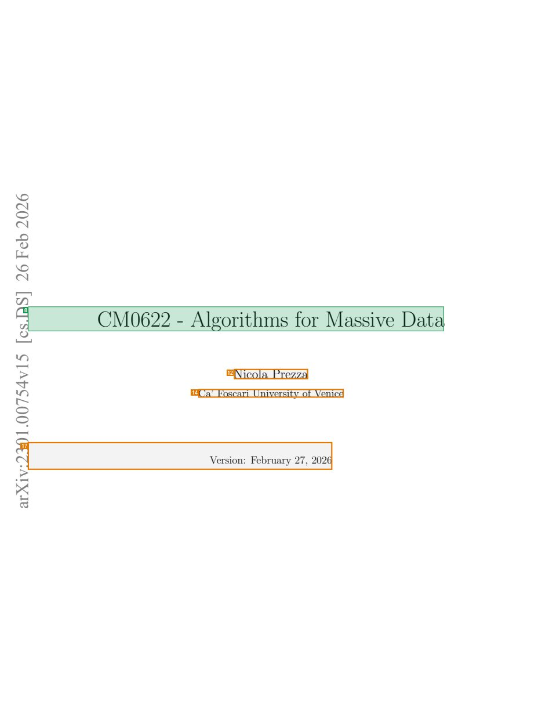
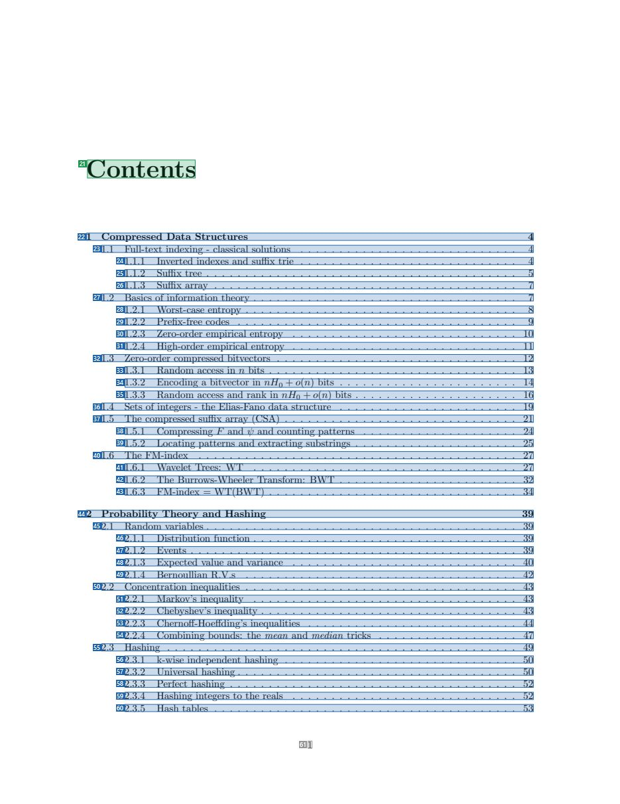
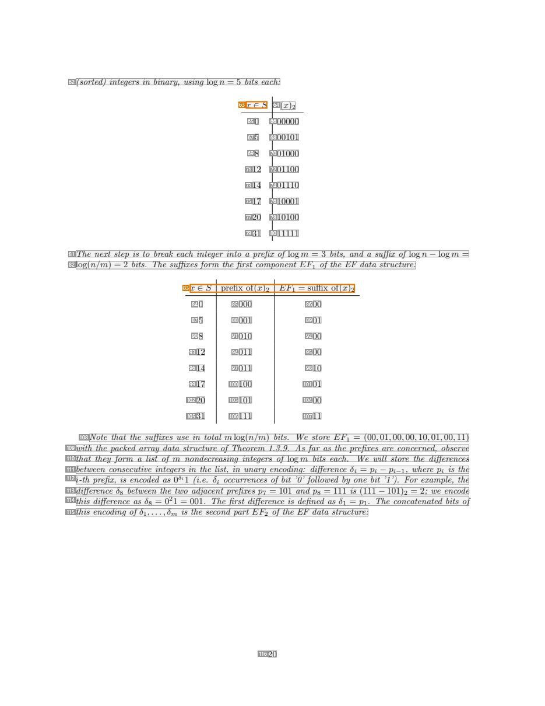

# 067 — `todo10_8/heading_corpus_100/04_giao_trinh/067_Algorithms_for_Massive_Data_Lecture_Notes.pdf`

Draft status: `DRAFT_REVIEWER_A_NOT_APPROVED`. Source sha256 `810f3313d2aa43c53390de8b776d810856d9dbc1d5066fde1600b59530ba9d6f`. [Back to index](README.md)

## Page 1 (FIRST)

| # | alias | text | font | draft | flag | rationale |
|---:|---|---|---|---|---|---|
| 1 | L0000:S0 | 62 | 20 | **OTHER** |  | Default: body text, list item, table cell, page number or other non-heading content on this page |
| 2 | L0001:S0 | 02 | 20 | **OTHER** |  | Default: body text, list item, table cell, page number or other non-heading content on this page |
| 3 | L0002:S0 | be | 20 | **OTHER** |  | Default: body text, list item, table cell, page number or other non-heading content on this page |
| 4 | L0003:S0 | F | 20 | **OTHER** |  | Default: body text, list item, table cell, page number or other non-heading content on this page |
| 5 | L0004:S0 | 62 | 20 | **OTHER** |  | Default: body text, list item, table cell, page number or other non-heading content on this page |
| 6 | L0005:S0 | ] | 20 | **OTHER** |  | Default: body text, list item, table cell, page number or other non-heading content on this page |
| 7 | L0006:S0 | S | 20 | **OTHER** |  | Default: body text, list item, table cell, page number or other non-heading content on this page |
| 8 | L0007:S0 | D.s CM0622 - Algorithms for Massive Data | 24.8 | **ESTABLISHES** |  | Title &quot;CM0622 - Algorithms for Massive Data&quot; (24.8pt) merged with stray stamp characters &quot;D.s&quot; |
| 9 | L0008:S0 | c[ | 20 | **OTHER** |  | Default: body text, list item, table cell, page number or other non-heading content on this page |
| 10 | L0009:S0 | 51 | 20 | **OTHER** |  | Default: body text, list item, table cell, page number or other non-heading content on this page |
| 11 | L0010:S0 | v4 | 20 | **OTHER** |  | Default: body text, list item, table cell, page number or other non-heading content on this page |
| 12 | L0010:S1 | Nicola Prezza | 14.4 | **OTHER** | REVIEW_FOCUS | Author name |
| 13 | L0011:S0 | 57 | 20 | **OTHER** |  | Default: body text, list item, table cell, page number or other non-heading content on this page |
| 14 | L0011:S1 | Ca’ Foscari University of Venice | 12 | **OTHER** | REVIEW_FOCUS | Author affiliation |
| 15 | L0012:S0 | 00. | 20 | **OTHER** |  | Default: body text, list item, table cell, page number or other non-heading content on this page |
| 16 | L0013:S0 | 10 | 20 | **OTHER** |  | Default: body text, list item, table cell, page number or other non-heading content on this page |
| 17 | L0014:S0 | 32: Version: February 27, 2026 | 12 | **OTHER** | REVIEW_FOCUS | Version date (merged with a stamp fragment) |
| 18 | L0015:S0 | vi | 20 | **OTHER** |  | Default: body text, list item, table cell, page number or other non-heading content on this page |
| 19 | L0016:S0 | Xr | 20 | **OTHER** |  | Default: body text, list item, table cell, page number or other non-heading content on this page |
| 20 | L0017:S0 | a | 20 | **OTHER** |  | Default: body text, list item, table cell, page number or other non-heading content on this page |

## Page 2 (TARGETED_STRUCTURE)

| # | alias | text | font | draft | flag | rationale |
|---:|---|---|---|---|---|---|
| 21 | L0018:S0 | Contents | 24.8 | **ESTABLISHES** |  | Heading &quot;Contents&quot; (24.8pt) |
| 22 | L0019:S0 | 1 Compressed Data Structures 4 | 10 | **REPRESENTS** |  | Contents entry |
| 23 | L0020:S0 | 1.1 Full-text indexing - classical solutions . . . . . . . . . . . . . . . . . . . . . . . . . . . . 4 | 10 | **REPRESENTS** |  | Contents entry |
| 24 | L0021:S0 | 1.1.1 Inverted indexes and suffix trie . . . . . . . . . . . . . . . . . . . . . . . . . . . . 4 | 10 | **REPRESENTS** |  | Contents entry |
| 25 | L0022:S0 | 1.1.2 Suffix tree . . . . . . . . . . . . . . . . . . . . . . . . . . . . . . . . . . . . . . . . 5 | 10 | **REPRESENTS** |  | Contents entry |
| 26 | L0023:S0 | 1.1.3 Suffix array . . . . . . . . . . . . . . . . . . . . . . . . . . . . . . . . . . . . . . . 7 | 10 | **REPRESENTS** |  | Contents entry |
| 27 | L0024:S0 | 1.2 Basics of information theory . . . . . . . . . . . . . . . . . . . . . . . . . . . . . . . . . . 7 | 10 | **REPRESENTS** |  | Contents entry |
| 28 | L0025:S0 | 1.2.1 Worst-case entropy . . . . . . . . . . . . . . . . . . . . . . . . . . . . . . . . . . . 8 | 10 | **REPRESENTS** |  | Contents entry |
| 29 | L0026:S0 | 1.2.2 Prefix-free codes . . . . . . . . . . . . . . . . . . . . . . . . . . . . . . . . . . . . 9 | 10 | **REPRESENTS** |  | Contents entry |
| 30 | L0027:S0 | 1.2.3 Zero-order empirical entropy . . . . . . . . . . . . . . . . . . . . . . . . . . . . . 10 | 10 | **REPRESENTS** |  | Contents entry |
| 31 | L0028:S0 | 1.2.4 High-order empirical entropy . . . . . . . . . . . . . . . . . . . . . . . . . . . . . 11 | 10 | **REPRESENTS** |  | Contents entry |
| 32 | L0029:S0 | 1.3 Zero-order compressed bitvectors . . . . . . . . . . . . . . . . . . . . . . . . . . . . . . . 12 | 10 | **REPRESENTS** |  | Contents entry |
| 33 | L0030:S0 | 1.3.1 Random access in n bits . . . . . . . . . . . . . . . . . . . . . . . . . . . . . . . . 13 | 10 | **REPRESENTS** |  | Contents entry |
| 34 | L0031:S0 | 1.3.2 Encoding a bitvector in nH0 + o(n) bits . . . . . . . . . . . . . . . . . . . . . . . 14 | 10 | **REPRESENTS** |  | Contents entry |
| 35 | L0032:S0 | 1.3.3 Random access and rank in nH0 + o(n) bits . . . . . . . . . . . . . . . . . . . . . 16 | 10 | **REPRESENTS** |  | Contents entry |
| 36 | L0033:S0 | 1.4 Sets of integers - the Elias-Fano data structure . . . . . . . . . . . . . . . . . . . . . . . 19 | 10 | **REPRESENTS** |  | Contents entry |
| 37 | L0034:S0 | 1.5 The compressed suffix array (CSA) . . . . . . . . . . . . . . . . . . . . . . . . . . . . . . 21 | 10 | **REPRESENTS** |  | Contents entry |
| 38 | L0035:S0 | 1.5.1 Compressing F and ψ and counting patterns . . . . . . . . . . . . . . . . . . . . 24 | 10 | **REPRESENTS** |  | Contents entry |
| 39 | L0036:S0 | 1.5.2 Locating patterns and extracting substrings . . . . . . . . . . . . . . . . . . . . . 25 | 10 | **REPRESENTS** |  | Contents entry |
| 40 | L0037:S0 | 1.6 The FM-index . . . . . . . . . . . . . . . . . . . . . . . . . . . . . . . . . . . . . . . . . 27 | 10 | **REPRESENTS** |  | Contents entry |
| 41 | L0038:S0 | 1.6.1 Wavelet Trees: WT . . . . . . . . . . . . . . . . . . . . . . . . . . . . . . . . . . 27 | 10 | **REPRESENTS** |  | Contents entry |
| 42 | L0039:S0 | 1.6.2 The Burrows-Wheeler Transform: BWT . . . . . . . . . . . . . . . . . . . . . . . 32 | 10 | **REPRESENTS** |  | Contents entry |
| 43 | L0040:S0 | 1.6.3 FM-index = WT(BWT) . . . . . . . . . . . . . . . . . . . . . . . . . . . . . . . . 34 | 10 | **REPRESENTS** |  | Contents entry |
| 44 | L0041:S0 | 2 Probability Theory and Hashing 39 | 10 | **REPRESENTS** |  | Contents entry |
| 45 | L0042:S0 | 2.1 Random variables . . . . . . . . . . . . . . . . . . . . . . . . . . . . . . . . . . . . . . . . 39 | 10 | **REPRESENTS** |  | Contents entry |
| 46 | L0043:S0 | 2.1.1 Distribution function . . . . . . . . . . . . . . . . . . . . . . . . . . . . . . . . . . 39 | 10 | **REPRESENTS** |  | Contents entry |
| 47 | L0044:S0 | 2.1.2 Events . . . . . . . . . . . . . . . . . . . . . . . . . . . . . . . . . . . . . . . . . . 39 | 10 | **REPRESENTS** |  | Contents entry |
| 48 | L0045:S0 | 2.1.3 Expected value and variance . . . . . . . . . . . . . . . . . . . . . . . . . . . . . 40 | 10 | **REPRESENTS** |  | Contents entry |
| 49 | L0046:S0 | 2.1.4 Bernoullian R.V.s . . . . . . . . . . . . . . . . . . . . . . . . . . . . . . . . . . . 42 | 10 | **REPRESENTS** |  | Contents entry |
| 50 | L0047:S0 | 2.2 Concentration inequalities . . . . . . . . . . . . . . . . . . . . . . . . . . . . . . . . . . . 43 | 10 | **REPRESENTS** |  | Contents entry |
| 51 | L0048:S0 | 2.2.1 Markov’s inequality . . . . . . . . . . . . . . . . . . . . . . . . . . . . . . . . . . 43 | 10 | **REPRESENTS** |  | Contents entry |
| 52 | L0049:S0 | 2.2.2 Chebyshev’s inequality . . . . . . . . . . . . . . . . . . . . . . . . . . . . . . . . . 43 | 10 | **REPRESENTS** |  | Contents entry |
| 53 | L0050:S0 | 2.2.3 Chernoff-Hoeffding’s inequalities . . . . . . . . . . . . . . . . . . . . . . . . . . . 44 | 10 | **REPRESENTS** |  | Contents entry |
| 54 | L0051:S0 | 2.2.4 Combining bounds: the mean and median tricks . . . . . . . . . . . . . . . . . . 47 | 10 | **REPRESENTS** |  | Contents entry |
| 55 | L0052:S0 | 2.3 Hashing . . . . . . . . . . . . . . . . . . . . . . . . . . . . . . . . . . . . . . . . . . . . . 49 | 10 | **REPRESENTS** |  | Contents entry |
| 56 | L0053:S0 | 2.3.1 k-wise independent hashing . . . . . . . . . . . . . . . . . . . . . . . . . . . . . . 50 | 10 | **REPRESENTS** |  | Contents entry |
| 57 | L0054:S0 | 2.3.2 Universal hashing . . . . . . . . . . . . . . . . . . . . . . . . . . . . . . . . . . . . 50 | 10 | **REPRESENTS** |  | Contents entry |
| 58 | L0055:S0 | 2.3.3 Perfect hashing . . . . . . . . . . . . . . . . . . . . . . . . . . . . . . . . . . . . . 52 | 10 | **REPRESENTS** |  | Contents entry |
| 59 | L0056:S0 | 2.3.4 Hashing integers to the reals . . . . . . . . . . . . . . . . . . . . . . . . . . . . . 52 | 10 | **REPRESENTS** |  | Contents entry |
| 60 | L0057:S0 | 2.3.5 Hash tables . . . . . . . . . . . . . . . . . . . . . . . . . . . . . . . . . . . . . . . 53 | 10 | **REPRESENTS** |  | Contents entry |
| 61 | L0058:S0 | 1 | 10 | **OTHER** |  | Default: body text, list item, table cell, page number or other non-heading content on this page |

## Page 21 (SEEDED_INTERIOR)

| # | alias | text | font | draft | flag | rationale |
|---:|---|---|---|---|---|---|
| 62 | L0813:S0 | (sorted) integers in binary, using log n = 5 bits each: | 10 I | **OTHER** |  | Default: body text, list item, table cell, page number or other non-heading content on this page |
| 63 | L0814:S0 | x ∈ S | 10 I | **OTHER** | REVIEW_FOCUS | Inline table header &quot;x in S&quot; in a worked example |
| 64 | L0814:S1 | (x)2 | 10 | **OTHER** |  | Default: body text, list item, table cell, page number or other non-heading content on this page |
| 65 | L0815:S0 | 0 | 10 | **OTHER** |  | Default: body text, list item, table cell, page number or other non-heading content on this page |
| 66 | L0815:S1 | 00000 | 10 | **OTHER** |  | Default: body text, list item, table cell, page number or other non-heading content on this page |
| 67 | L0816:S0 | 5 | 10 | **OTHER** |  | Default: body text, list item, table cell, page number or other non-heading content on this page |
| 68 | L0816:S1 | 00101 | 10 | **OTHER** |  | Default: body text, list item, table cell, page number or other non-heading content on this page |
| 69 | L0817:S0 | 8 | 10 | **OTHER** |  | Default: body text, list item, table cell, page number or other non-heading content on this page |
| 70 | L0817:S1 | 01000 | 10 | **OTHER** |  | Default: body text, list item, table cell, page number or other non-heading content on this page |
| 71 | L0818:S0 | 12 | 10 | **OTHER** |  | Default: body text, list item, table cell, page number or other non-heading content on this page |
| 72 | L0818:S1 | 01100 | 10 | **OTHER** |  | Default: body text, list item, table cell, page number or other non-heading content on this page |
| 73 | L0819:S0 | 14 | 10 | **OTHER** |  | Default: body text, list item, table cell, page number or other non-heading content on this page |
| 74 | L0819:S1 | 01110 | 10 | **OTHER** |  | Default: body text, list item, table cell, page number or other non-heading content on this page |
| 75 | L0820:S0 | 17 | 10 | **OTHER** |  | Default: body text, list item, table cell, page number or other non-heading content on this page |
| 76 | L0820:S1 | 10001 | 10 | **OTHER** |  | Default: body text, list item, table cell, page number or other non-heading content on this page |
| 77 | L0821:S0 | 20 | 10 | **OTHER** |  | Default: body text, list item, table cell, page number or other non-heading content on this page |
| 78 | L0821:S1 | 10100 | 10 | **OTHER** |  | Default: body text, list item, table cell, page number or other non-heading content on this page |
| 79 | L0822:S0 | 31 | 10 | **OTHER** |  | Default: body text, list item, table cell, page number or other non-heading content on this page |
| 80 | L0822:S1 | 11111 | 10 | **OTHER** |  | Default: body text, list item, table cell, page number or other non-heading content on this page |
| 81 | L0823:S0 | The next step is to break each integer into a prefix of log m = 3 bits, and a suffix of log n − log m = | 10 I | **OTHER** |  | Default: body text, list item, table cell, page number or other non-heading content on this page |
| 82 | L0824:S0 | log(n/m) = 2 bits. The suffixes form the first component EF1 of the EF data structure: | 10 I | **OTHER** |  | Default: body text, list item, table cell, page number or other non-heading content on this page |
| 83 | L0825:S0 | x ∈ S prefix of(x)2 EF1 = suffix of(x)2 | 10 | **OTHER** | REVIEW_FOCUS | Inline table header row of a worked example |
| 84 | L0826:S0 | 0 | 10 | **OTHER** |  | Default: body text, list item, table cell, page number or other non-heading content on this page |
| 85 | L0826:S1 | 000 | 10 | **OTHER** |  | Default: body text, list item, table cell, page number or other non-heading content on this page |
| 86 | L0826:S2 | 00 | 10 | **OTHER** |  | Default: body text, list item, table cell, page number or other non-heading content on this page |
| 87 | L0827:S0 | 5 | 10 | **OTHER** |  | Default: body text, list item, table cell, page number or other non-heading content on this page |
| 88 | L0827:S1 | 001 | 10 | **OTHER** |  | Default: body text, list item, table cell, page number or other non-heading content on this page |
| 89 | L0827:S2 | 01 | 10 | **OTHER** |  | Default: body text, list item, table cell, page number or other non-heading content on this page |
| 90 | L0828:S0 | 8 | 10 | **OTHER** |  | Default: body text, list item, table cell, page number or other non-heading content on this page |
| 91 | L0828:S1 | 010 | 10 | **OTHER** |  | Default: body text, list item, table cell, page number or other non-heading content on this page |
| 92 | L0828:S2 | 00 | 10 | **OTHER** |  | Default: body text, list item, table cell, page number or other non-heading content on this page |
| 93 | L0829:S0 | 12 | 10 | **OTHER** |  | Default: body text, list item, table cell, page number or other non-heading content on this page |
| 94 | L0829:S1 | 011 | 10 | **OTHER** |  | Default: body text, list item, table cell, page number or other non-heading content on this page |
| 95 | L0829:S2 | 00 | 10 | **OTHER** |  | Default: body text, list item, table cell, page number or other non-heading content on this page |
| 96 | L0830:S0 | 14 | 10 | **OTHER** |  | Default: body text, list item, table cell, page number or other non-heading content on this page |
| 97 | L0830:S1 | 011 | 10 | **OTHER** |  | Default: body text, list item, table cell, page number or other non-heading content on this page |
| 98 | L0830:S2 | 10 | 10 | **OTHER** |  | Default: body text, list item, table cell, page number or other non-heading content on this page |
| 99 | L0831:S0 | 17 | 10 | **OTHER** |  | Default: body text, list item, table cell, page number or other non-heading content on this page |
| 100 | L0831:S1 | 100 | 10 | **OTHER** |  | Default: body text, list item, table cell, page number or other non-heading content on this page |
| 101 | L0831:S2 | 01 | 10 | **OTHER** |  | Default: body text, list item, table cell, page number or other non-heading content on this page |
| 102 | L0832:S0 | 20 | 10 | **OTHER** |  | Default: body text, list item, table cell, page number or other non-heading content on this page |
| 103 | L0832:S1 | 101 | 10 | **OTHER** |  | Default: body text, list item, table cell, page number or other non-heading content on this page |
| 104 | L0832:S2 | 00 | 10 | **OTHER** |  | Default: body text, list item, table cell, page number or other non-heading content on this page |
| 105 | L0833:S0 | 31 | 10 | **OTHER** |  | Default: body text, list item, table cell, page number or other non-heading content on this page |
| 106 | L0833:S1 | 111 | 10 | **OTHER** |  | Default: body text, list item, table cell, page number or other non-heading content on this page |
| 107 | L0833:S2 | 11 | 10 | **OTHER** |  | Default: body text, list item, table cell, page number or other non-heading content on this page |
| 108 | L0834:S0 | Note that the suffixes use in total mlog(n/m) bits. We store EF1 = (00,01,00,00,10,01,00,11) | 10 I | **OTHER** |  | Default: body text, list item, table cell, page number or other non-heading content on this page |
| 109 | L0835:S0 | with the packed array data structure of Theorem 1.3.9. As far as the prefixes are concerned, observe | 10 I | **OTHER** |  | Default: body text, list item, table cell, page number or other non-heading content on this page |
| 110 | L0836:S0 | that they form a list of m nondecreasing integers of log m bits each. We will store the differences | 10 I | **OTHER** |  | Default: body text, list item, table cell, page number or other non-heading content on this page |
| 111 | L0837:S0 | between consecutive integers in the list, in unary encoding: difference δi = pi − pi−1, where pi is the | 10 I | **OTHER** |  | Default: body text, list item, table cell, page number or other non-heading content on this page |
| 112 | L0838:S0 | i-th prefix, is encoded as 0δi1 (i.e. δi occurrences of bit ’0’ followed by one bit ’1’). For example, the | 10 I | **OTHER** |  | Default: body text, list item, table cell, page number or other non-heading content on this page |
| 113 | L0839:S0 | difference δ8 between the two adjacent prefixes p7 = 101 and p8 = 111 is (111 − 101)2 = 2; we encode | 10 I | **OTHER** |  | Default: body text, list item, table cell, page number or other non-heading content on this page |
| 114 | L0840:S0 | this difference as δ8 = 021 = 001. The first difference is defined as δ1 = p1. The concatenated bits of | 10 I | **OTHER** |  | Default: body text, list item, table cell, page number or other non-heading content on this page |
| 115 | L0841:S0 | this encoding of δ1,...,δm is the second part EF2 of the EF data structure: | 10 I | **OTHER** |  | Default: body text, list item, table cell, page number or other non-heading content on this page |
| 116 | L0842:S0 | 20 | 10 | **OTHER** |  | Default: body text, list item, table cell, page number or other non-heading content on this page |

## Page 119 (SEEDED_INTERIOR)

| # | alias | text | font | draft | flag | rationale |
|---:|---|---|---|---|---|---|
| 117 | L4828:S0 | Chapter 6 | 20.7 | **ESTABLISHES** |  | Chapter label &quot;Chapter 6&quot; (20.7pt) |
| 118 | L4829:S0 | Bibliography | 24.8 | **ESTABLISHES** |  | Chapter title &quot;Bibliography&quot; (24.8pt) |
| 119 | L4830:S0 | [1] Noga Alon, Martin Dietzfelbinger, Peter Bro Miltersen, Erez Petrank, and Ga&#180;bor Tardos. Linear | 10 | **OTHER** |  | Default: body text, list item, table cell, page number or other non-heading content on this page |
| 120 | L4831:S0 | hash functions. Journal of the ACM (JACM), 46(5):667–683, 1999. | 10 | **OTHER** |  | Default: body text, list item, table cell, page number or other non-heading content on this page |
| 121 | L4832:S0 | [2] Noga Alon, Phillip B Gibbons, Yossi Matias, and Mario Szegedy. Tracking join and self-join sizes | 10 | **OTHER** |  | Default: body text, list item, table cell, page number or other non-heading content on this page |
| 122 | L4833:S0 | in limited storage. In Proceedings of the eighteenth ACM SIGMOD-SIGACT-SIGART symposium | 10 I | **OTHER** |  | Default: body text, list item, table cell, page number or other non-heading content on this page |
| 123 | L4834:S0 | on Principles of database systems, pages 10–20, 1999. | 10 I | **OTHER** |  | Default: body text, list item, table cell, page number or other non-heading content on this page |
| 124 | L4835:S0 | [3] Noga Alon, Yossi Matias, and Mario Szegedy. The space complexity of approximating the fre- | 10 | **OTHER** |  | Default: body text, list item, table cell, page number or other non-heading content on this page |
| 125 | L4836:S0 | quency moments. Journal of Computer and System Sciences, 58:137–147, 1999. | 10 I | **OTHER** |  | Default: body text, list item, table cell, page number or other non-heading content on this page |
| 126 | L4837:S0 | [4] Michael A Bender, Martin Farach-Colton, Rob Johnson, Bradley C Kuszmaul, Dzejla Medjedovic, | 10 | **OTHER** |  | Default: body text, list item, table cell, page number or other non-heading content on this page |
| 127 | L4838:S0 | Pablo Montes, Pradeep Shetty, Richard P Spillane, and Erez Zadok. Don’t thrash: how to cache | 10 | **OTHER** |  | Default: body text, list item, table cell, page number or other non-heading content on this page |
| 128 | L4839:S0 | your hash on flash. In 3rd Workshop on Hot Topics in Storage and File Systems (HotStorage 11), | 10 I | **OTHER** |  | Default: body text, list item, table cell, page number or other non-heading content on this page |
| 129 | L4840:S0 | 2011. | 10 | **OTHER** |  | Default: body text, list item, table cell, page number or other non-heading content on this page |
| 130 | L4841:S0 | [5] Burton H Bloom. Space/time trade-offs in hash coding with allowable errors. Communications | 10 | **OTHER** |  | Default: body text, list item, table cell, page number or other non-heading content on this page |
| 131 | L4842:S0 | of the ACM, 13(7):422–426, 1970. | 10 | **OTHER** |  | Default: body text, list item, table cell, page number or other non-heading content on this page |
| 132 | L4843:S0 | [6] Alex Bowe. RRR: A Succinct Rank/Select Index for Bit Vectors. https://www.alexbowe.com/ | 10 | **OTHER** |  | Default: body text, list item, table cell, page number or other non-heading content on this page |
| 133 | L4844:S0 | rrr/. Accessed: 2024-02-20. | 10 | **OTHER** |  | Default: body text, list item, table cell, page number or other non-heading content on this page |
| 134 | L4845:S0 | [7] Dany Breslauer and Zvi Galil. Real-time streaming string-matching. ACM Transactions on | 10 | **OTHER** |  | Default: body text, list item, table cell, page number or other non-heading content on this page |
| 135 | L4846:S0 | Algorithms (TALG), 10(4):1–12, 2014. | 10 I | **OTHER** |  | Default: body text, list item, table cell, page number or other non-heading content on this page |
| 136 | L4847:S0 | [8] Andrei Z Broder. Min-wise independent permutations: Theory and practice. In International | 10 | **OTHER** |  | Default: body text, list item, table cell, page number or other non-heading content on this page |
| 137 | L4848:S0 | Colloquium on Automata, Languages, and Programming, pages 808–808. Springer, 2000. | 10 I | **OTHER** |  | Default: body text, list item, table cell, page number or other non-heading content on this page |
| 138 | L4849:S0 | [9] Michael Burrows and David J Wheeler. A block-sorting lossless data compression algorithm, 1994. | 10 | **OTHER** |  | Default: body text, list item, table cell, page number or other non-heading content on this page |
| 139 | L4850:S0 | [10] Amit Chakrabarti. Data Stream Algorithms - Lecture Notes. https://www.cs.dartmouth.edu/ | 10 | **OTHER** |  | Default: body text, list item, table cell, page number or other non-heading content on this page |
| 140 | L4851:S0 | ~ac/Teach/data-streams-lecnotes.pdf. Accessed: 2023-01-03. | 10 | **OTHER** |  | Default: body text, list item, table cell, page number or other non-heading content on this page |
| 141 | L4852:S0 | [11] Rapha&#168;el Clifford, Allyx Fontaine, Ely Porat, Benjamin Sach, and Tatiana Starikovskaya. The k- | 10 | **OTHER** |  | Default: body text, list item, table cell, page number or other non-heading content on this page |
| 142 | L4853:S0 | mismatch problem revisited. In Proceedings of the twenty-seventh annual ACM-SIAM symposium | 10 I | **OTHER** |  | Default: body text, list item, table cell, page number or other non-heading content on this page |
| 143 | L4854:S0 | on Discrete algorithms, pages 2039–2052. SIAM, 2016. | 10 | **OTHER** |  | Default: body text, list item, table cell, page number or other non-heading content on this page |
| 144 | L4855:S0 | [12] Rapha&#168;el Clifford, Tomasz Kociumaka, and Ely Porat. The streaming k-mismatch problem. In | 10 | **OTHER** |  | Default: body text, list item, table cell, page number or other non-heading content on this page |
| 145 | L4856:S0 | Proceedings of the Thirtieth Annual ACM-SIAM Symposium on Discrete Algorithms, pages 1106– | 10 I | **OTHER** |  | Default: body text, list item, table cell, page number or other non-heading content on this page |
| 146 | L4857:S0 | 1125. SIAM, 2019. | 10 | **OTHER** |  | Default: body text, list item, table cell, page number or other non-heading content on this page |
| 147 | L4858:S0 | [13] Graham Cormode. Data sketching. https://cacm.acm.org/magazines/2017/9/ | 10 | **OTHER** |  | Default: body text, list item, table cell, page number or other non-heading content on this page |
| 148 | L4859:S0 | 220427-data-sketching/fulltext. Communications of the ACM, 60(9):48–55, 2017. | 10 | **OTHER** |  | Default: body text, list item, table cell, page number or other non-heading content on this page |
| 149 | L4860:S0 | 118 | 10 | **OTHER** |  | Default: body text, list item, table cell, page number or other non-heading content on this page |
