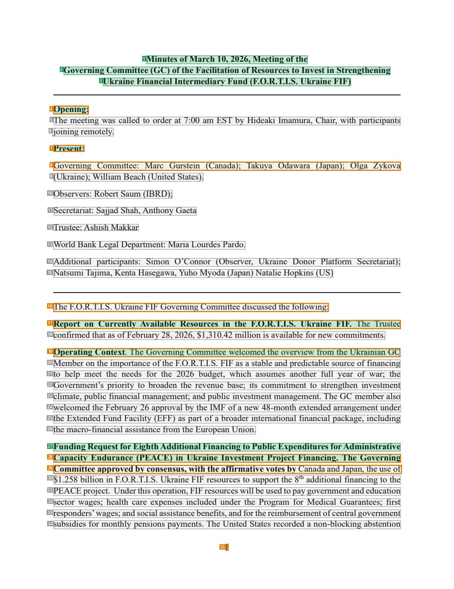
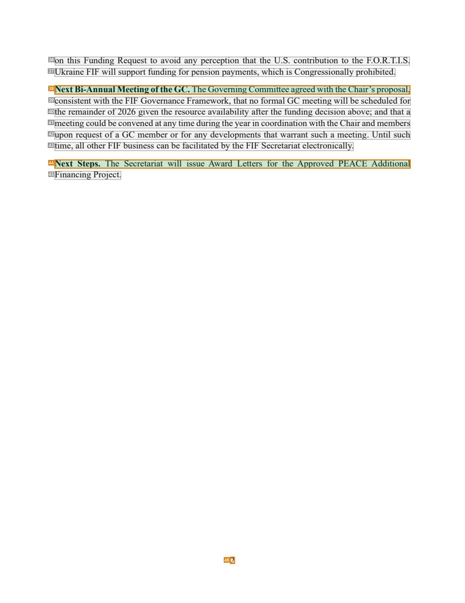

# 073 — `todo10_8/heading_corpus_100/05_bien_ban_hop/073_FORTIS_GC_Minutes_Mar_2026.pdf`

Draft status: `DRAFT_REVIEWER_A_NOT_APPROVED`. Source sha256 `e73ab5ca9d4d9f101e2f2b2d5f169cbf67e331bde84726860619c00473bf5da3`. [Back to index](README.md)

## Page 1 (ALL_PAGES)

| # | alias | text | font | draft | flag | rationale |
|---:|---|---|---|---|---|---|
| 1 | L0000:S0 | Minutes ofMarch 10, 2026, Meeting ofthe | 12 B | **ESTABLISHES** |  | Minutes title line 1 (bold, centred) |
| 2 | L0001:S0 | Governing Committee (GC) ofthe Facilitation ofResources to Invest in Strengthening | 12 B | **ESTABLISHES** |  | Minutes title line 2 |
| 3 | L0002:S0 | Ukraine Financial Intermediary Fund (F.O.R.T.I.S. Ukraine FIF) | 12 B | **ESTABLISHES** |  | Minutes title line 3 |
| 4 | L0003:S0 | Opening: | 12 B | **ESTABLISHES** | REVIEW_FOCUS | Bold standalone label &quot;Opening:&quot; introducing the opening paragraph |
| 5 | L0004:S0 | The meeting was called to order at 7:00 am EST by Hideaki Imamura, Chair, with participants | 12 | **OTHER** |  | Default: body text, list item, table cell, page number or other non-heading content on this page |
| 6 | L0005:S0 | joining remotely. | 12 | **OTHER** |  | Default: body text, list item, table cell, page number or other non-heading content on this page |
| 7 | L0006:S0 | Present: | 12 B | **ESTABLISHES** | REVIEW_FOCUS | Bold standalone label &quot;Present:&quot; introducing the attendance list |
| 8 | L0007:S0 | Governing Committee: Marc Gurstein (Canada); Takuya Odawara (Japan); Olga Zykova | 12 | **OTHER** | REVIEW_FOCUS | Attendance list line (names) |
| 9 | L0008:S0 | (Ukraine); William Beach (United States). | 12 | **OTHER** |  | Default: body text, list item, table cell, page number or other non-heading content on this page |
| 10 | L0009:S0 | Observers: Robert Saum (IBRD); | 12 | **OTHER** |  | Default: body text, list item, table cell, page number or other non-heading content on this page |
| 11 | L0010:S0 | Secretariat: Sajjad Shah,Anthony Gaeta | 12 | **OTHER** |  | Default: body text, list item, table cell, page number or other non-heading content on this page |
| 12 | L0011:S0 | Trustee: Ashish Makkar | 12 | **OTHER** |  | Default: body text, list item, table cell, page number or other non-heading content on this page |
| 13 | L0012:S0 | WorldBankLegal Department: MariaLourdes Pardo. | 12 | **OTHER** |  | Default: body text, list item, table cell, page number or other non-heading content on this page |
| 14 | L0013:S0 | Additional participants: Simon O’Connor (Observer, Ukraine Donor Platform Secretariat); | 12 | **OTHER** |  | Default: body text, list item, table cell, page number or other non-heading content on this page |
| 15 | L0014:S0 | Natsumi Tajima, Kenta Hasegawa, Yuho Myoda (Japan) Natalie Hopkins (US) | 12 | **OTHER** |  | Default: body text, list item, table cell, page number or other non-heading content on this page |
| 16 | L0015:S0 | The F.O.R.T.I.S. Ukraine FIF Governing Committee discussedthe following: | 12 | **OTHER** | REVIEW_FOCUS | Lead-in sentence &quot;... discussed the following:&quot; |
| 17 | L0016:S0 | Report on Currently Available Resources in the F.O.R.T.I.S. Ukraine FIF. The Trustee | 12 B | **ESTABLISHES** | REVIEW_FOCUS | Run-in agenda heading &quot;Report on Currently Available Resources in the F.O.R.T.I.S. Ukraine FIF.&quot; merged with the start of its para… |
| 18 | L0017:S0 | confirmedthat as ofFebruary 28, 2026, $1,310.42 million is available fornew commitments. | 12 | **OTHER** |  | Default: body text, list item, table cell, page number or other non-heading content on this page |
| 19 | L0018:S0 | Operating Context. The Governing Committee welcomed the overview from the Ukrainian GC | 12 | **ESTABLISHES** | REVIEW_FOCUS | Run-in agenda heading &quot;Operating Context.&quot; merged with its paragraph (heading wording at line start) |
| 20 | L0019:S0 | Member on the importance ofthe F.O.R.T.I.S. FIF as a stable andpredictable source offinancing | 12 | **OTHER** |  | Default: body text, list item, table cell, page number or other non-heading content on this page |
| 21 | L0020:S0 | to help meet the needs for the 2026 budget, which assumes another full year of war; the | 12 | **OTHER** |  | Default: body text, list item, table cell, page number or other non-heading content on this page |
| 22 | L0021:S0 | Government’s priority to broaden the revenue base; its commitment to strengthen investment | 12 | **OTHER** |  | Default: body text, list item, table cell, page number or other non-heading content on this page |
| 23 | L0022:S0 | climate, public financial management; andpublic investment management. The GC member also | 12 | **OTHER** |  | Default: body text, list item, table cell, page number or other non-heading content on this page |
| 24 | L0023:S0 | welcomed the February 26 approval by the IMF ofa new 48-month extended arrangementunder | 12 | **OTHER** |  | Default: body text, list item, table cell, page number or other non-heading content on this page |
| 25 | L0024:S0 | the Extended Fund Facility (EFF) as part ofa broader international financial package, including | 12 | **OTHER** |  | Default: body text, list item, table cell, page number or other non-heading content on this page |
| 26 | L0025:S0 | the macro-financial assistance fromthe EuropeanUnion. | 12 | **OTHER** |  | Default: body text, list item, table cell, page number or other non-heading content on this page |
| 27 | L0026:S0 | FundingRequestforEighthAdditionalFinancingtoPublicExpenditures forAdministrative | 12 B | **ESTABLISHES** |  | Bold run-in agenda heading &quot;Funding Request for Eighth Additional Financing to Public Expenditures for Administrative ...&quot; line 1 |
| 28 | L0027:S0 | Capacity Endurance (PEACE) in Ukraine Investment Project Financing. The Governing | 12 B | **ESTABLISHES** | REVIEW_FOCUS | Bold run-in agenda heading line 2 &quot;Capacity Endurance (PEACE) in Ukraine Investment Project Financing.&quot; merged with the start of t… |
| 29 | L0028:S0 | Committee approvedby consensus,withthe affirmativevotes byCanadaandJapan, theuse of | 12 B | **OTHER** | REVIEW_FOCUS | Bold decision sentence (body text emphasised in bold), not heading wording |
| 30 | L0029:S0 | $1.258 billion in F.O.R.T.I.S. Ukraine FIF resources to support the 8th additional financing to the | 12 | **OTHER** |  | Default: body text, list item, table cell, page number or other non-heading content on this page |
| 31 | L0030:S0 | PEACEproject. Underthisoperation,FIFresourceswillbeusedtopaygovernmentandeducation | 12 | **OTHER** |  | Default: body text, list item, table cell, page number or other non-heading content on this page |
| 32 | L0031:S0 | sector wages; health care expenses included under the Program for Medical Guarantees; first | 12 | **OTHER** |  | Default: body text, list item, table cell, page number or other non-heading content on this page |
| 33 | L0032:S0 | responders’wages; andsocialassistancebenefits, andforthereimbursementofcentralgovernment | 12 | **OTHER** |  | Default: body text, list item, table cell, page number or other non-heading content on this page |
| 34 | L0033:S0 | subsidies for monthly pensions payments. The United States recorded a non-blocking abstention | 12 | **OTHER** |  | Default: body text, list item, table cell, page number or other non-heading content on this page |
| 35 | L0034:S0 | 1 | 12 | **OTHER** | REVIEW_FOCUS | Page number |

## Page 2 (ALL_PAGES)

| # | alias | text | font | draft | flag | rationale |
|---:|---|---|---|---|---|---|
| 36 | L0035:S0 | on this Funding Request to avoid any perception that the U.S. contribution to the F.O.R.T.I.S. | 12 | **OTHER** |  | Default: body text, list item, table cell, page number or other non-heading content on this page |
| 37 | L0036:S0 | Ukraine FIF will support funding forpensionpayments, which is Congressionallyprohibited. | 12 | **OTHER** |  | Default: body text, list item, table cell, page number or other non-heading content on this page |
| 38 | L0037:S0 | NextBi-AnnualMeetingoftheGC. TheGoverningCommitteeagreedwiththeChair’sproposal, | 12 | **ESTABLISHES** | REVIEW_FOCUS | Run-in agenda heading &quot;Next Bi-Annual Meeting of the GC.&quot; merged with its paragraph |
| 39 | L0038:S0 | consistentwiththe FIF Governance Framework, thatno formal GC meetingwillbe scheduled for | 12 | **OTHER** |  | Default: body text, list item, table cell, page number or other non-heading content on this page |
| 40 | L0039:S0 | the remainder of2026 given the resource availability after the funding decision above; and that a | 12 | **OTHER** |  | Default: body text, list item, table cell, page number or other non-heading content on this page |
| 41 | L0040:S0 | meetingcouldbeconvenedatanytimeduringtheyearincoordinationwiththeChairandmembers | 12 | **OTHER** |  | Default: body text, list item, table cell, page number or other non-heading content on this page |
| 42 | L0041:S0 | upon request ofa GC member or for any developments that warrant such a meeting. Until such | 12 | **OTHER** |  | Default: body text, list item, table cell, page number or other non-heading content on this page |
| 43 | L0042:S0 | time, all otherFIF business canbe facilitatedbythe FIF Secretariat electronically. | 12 | **OTHER** |  | Default: body text, list item, table cell, page number or other non-heading content on this page |
| 44 | L0043:S0 | Next Steps. The Secretariat will issue Award Letters for the Approved PEACE Additional | 12 | **ESTABLISHES** | REVIEW_FOCUS | Run-in agenda heading &quot;Next Steps.&quot; merged with its paragraph |
| 45 | L0044:S0 | Financing Project. | 12 | **OTHER** |  | Default: body text, list item, table cell, page number or other non-heading content on this page |
| 46 | L0045:S0 | 2 | 12 | **OTHER** | REVIEW_FOCUS | Page number |
