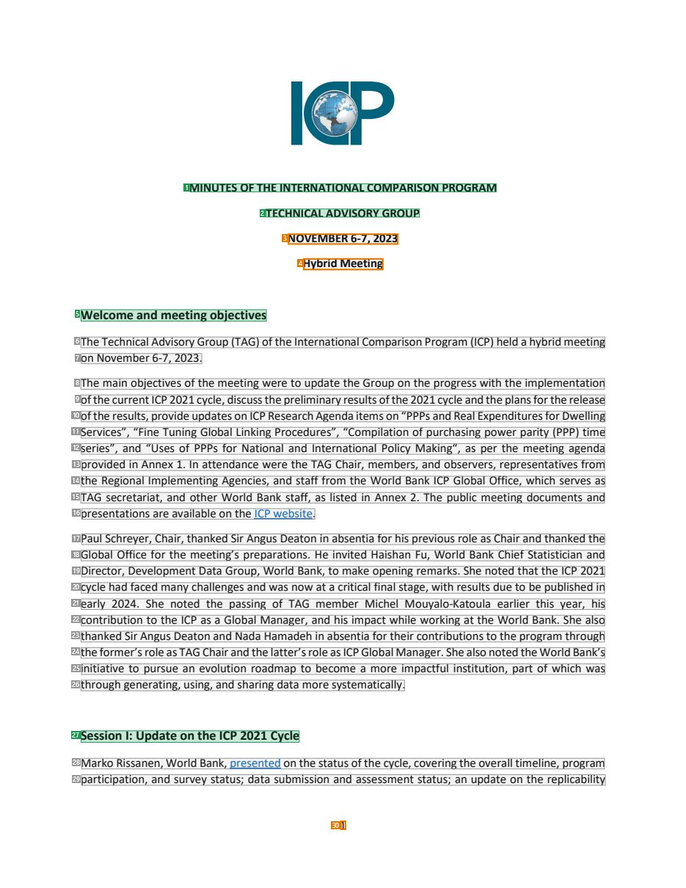
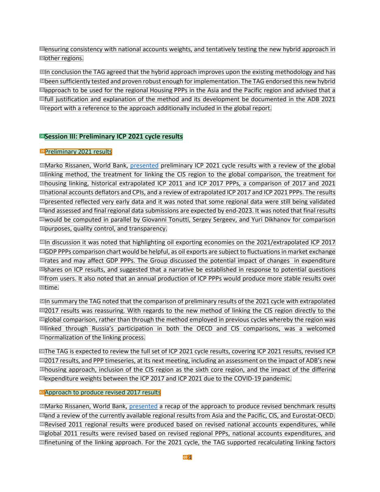
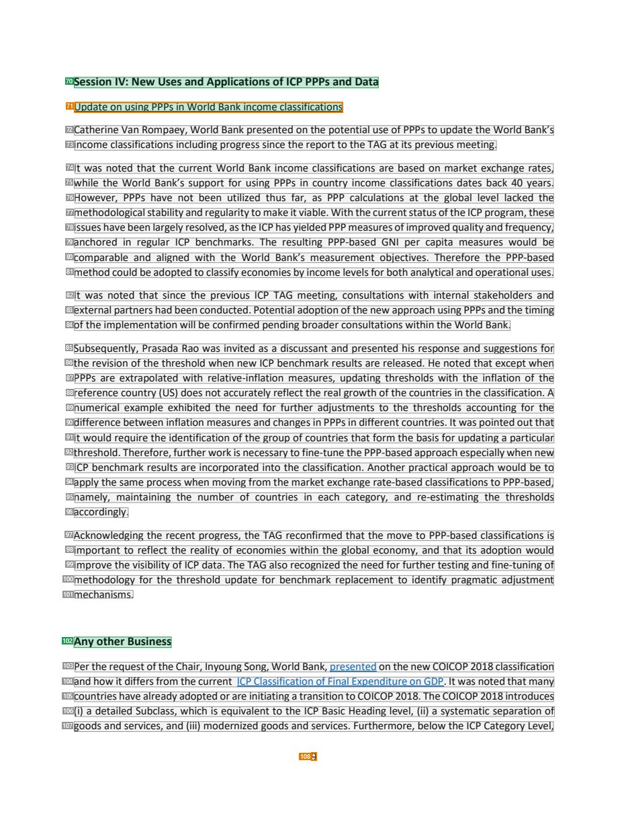

# 077 — `todo10_8/heading_corpus_100/05_bien_ban_hop/077_ICP_TAG_Minutes_Nov_2023.pdf`

Draft status: `DRAFT_REVIEWER_A_NOT_APPROVED`. Source sha256 `6db97b728d016a875fdc3187ee54632fd9de0b93f1bc65e903bc5c1c8825f9c3`. [Back to index](README.md)

## Page 1 (FIRST)

| # | alias | text | font | draft | flag | rationale |
|---:|---|---|---|---|---|---|
| 1 | L0000:S0 | MINUTES OF THE INTERNATIONAL COMPARISON PROGRAM | 11 B | **ESTABLISHES** |  | Minutes title line 1 (bold caps, centred) |
| 2 | L0001:S0 | TECHNICAL ADVISORY GROUP | 11 B | **ESTABLISHES** |  | Minutes title line 2 &quot;TECHNICAL ADVISORY GROUP&quot; |
| 3 | L0002:S0 | NOVEMBER 6-7, 2023 | 11 B | **OTHER** | REVIEW_FOCUS | Meeting dates in the masthead (metadata) |
| 4 | L0003:S0 | Hybrid Meeting | 11 B | **OTHER** | REVIEW_FOCUS | Meeting mode &quot;Hybrid Meeting&quot; in the masthead (metadata) |
| 5 | L0004:S0 | Welcome and meeting objectives | 12 B | **ESTABLISHES** |  | Agenda heading &quot;Welcome and meeting objectives&quot; (bold 12) |
| 6 | L0005:S0 | The Technical Advisory Group (TAG) of the International Comparison Program (ICP) held a hybrid meeting | 11 | **OTHER** |  | Default: body text, list item, table cell, page number or other non-heading content on this page |
| 7 | L0006:S0 | on November 6-7, 2023. | 11 | **OTHER** |  | Default: body text, list item, table cell, page number or other non-heading content on this page |
| 8 | L0007:S0 | The main objectives of the meeting were to update the Group on the progress with the implementation | 11 | **OTHER** |  | Default: body text, list item, table cell, page number or other non-heading content on this page |
| 9 | L0008:S0 | ofthe current ICP 2021 cycle, discuss the preliminary results ofthe 2021 cycle and the plans for the release | 11 | **OTHER** |  | Default: body text, list item, table cell, page number or other non-heading content on this page |
| 10 | L0009:S0 | of the results, provide updates on ICP Research Agenda items on “PPPs and Real Expenditures for Dwelling | 11 | **OTHER** |  | Default: body text, list item, table cell, page number or other non-heading content on this page |
| 11 | L0010:S0 | Services”, “Fine Tuning Global Linking Procedures”, “Compilation of purchasing power parity (PPP) time | 11 | **OTHER** |  | Default: body text, list item, table cell, page number or other non-heading content on this page |
| 12 | L0011:S0 | series”, and “Uses of PPPs for National and International Policy Making“, as per the meeting agenda | 11 | **OTHER** |  | Default: body text, list item, table cell, page number or other non-heading content on this page |
| 13 | L0012:S0 | provided in Annex 1. In attendance were the TAG Chair, members, and observers, representatives from | 11 | **OTHER** |  | Default: body text, list item, table cell, page number or other non-heading content on this page |
| 14 | L0013:S0 | the Regional Implementing Agencies, and staff from the World Bank ICP Global Office, which serves as | 11 | **OTHER** |  | Default: body text, list item, table cell, page number or other non-heading content on this page |
| 15 | L0014:S0 | TAG secretariat, and other World Bank staff, as listed in Annex 2. The public meeting documents and | 11 | **OTHER** |  | Default: body text, list item, table cell, page number or other non-heading content on this page |
| 16 | L0015:S0 | presentations are available on the ICP website. | 11 | **OTHER** |  | Default: body text, list item, table cell, page number or other non-heading content on this page |
| 17 | L0016:S0 | Paul Schreyer, Chair, thanked Sir Angus Deaton in absentia for his previous role as Chair and thanked the | 11 | **OTHER** |  | Default: body text, list item, table cell, page number or other non-heading content on this page |
| 18 | L0017:S0 | Global Office for the meeting’s preparations. He invited Haishan Fu, World Bank Chief Statistician and | 11 | **OTHER** |  | Default: body text, list item, table cell, page number or other non-heading content on this page |
| 19 | L0018:S0 | Director, Development Data Group, World Bank, to make opening remarks. She noted that the ICP 2021 | 11 | **OTHER** |  | Default: body text, list item, table cell, page number or other non-heading content on this page |
| 20 | L0019:S0 | cycle had faced many challenges and was now at a critical final stage, with results due to be published in | 11 | **OTHER** |  | Default: body text, list item, table cell, page number or other non-heading content on this page |
| 21 | L0020:S0 | early 2024. She noted the passing of TAG member Michel Mouyalo-Katoula earlier this year, his | 11 | **OTHER** |  | Default: body text, list item, table cell, page number or other non-heading content on this page |
| 22 | L0021:S0 | contribution to the ICP as a Global Manager, and his impact while working at the World Bank. She also | 11 | **OTHER** |  | Default: body text, list item, table cell, page number or other non-heading content on this page |
| 23 | L0022:S0 | thanked Sir Angus Deaton and Nada Hamadeh in absentia for their contributions to the program through | 11 | **OTHER** |  | Default: body text, list item, table cell, page number or other non-heading content on this page |
| 24 | L0023:S0 | the former’s role as TAG Chair and the latter’s role as ICP Global Manager. She also noted the World Bank’s | 11 | **OTHER** |  | Default: body text, list item, table cell, page number or other non-heading content on this page |
| 25 | L0024:S0 | initiative to pursue an evolution roadmap to become a more impactful institution, part of which was | 11 | **OTHER** |  | Default: body text, list item, table cell, page number or other non-heading content on this page |
| 26 | L0025:S0 | through generating, using, and sharing data more systematically. | 11 | **OTHER** |  | Default: body text, list item, table cell, page number or other non-heading content on this page |
| 27 | L0026:S0 | Session I: Update on the ICP 2021 Cycle | 12 B | **ESTABLISHES** |  | Session heading &quot;Session I: Update on the ICP 2021 Cycle&quot; (bold 12) |
| 28 | L0027:S0 | Marko Rissanen, World Bank, presented on the status of the cycle, covering the overall timeline, program | 11 | **OTHER** |  | Default: body text, list item, table cell, page number or other non-heading content on this page |
| 29 | L0028:S0 | participation, and survey status; data submission and assessment status; an update on the replicability | 11 | **OTHER** |  | Default: body text, list item, table cell, page number or other non-heading content on this page |
| 30 | L0029:S0 | 1 | 11 | **OTHER** | REVIEW_FOCUS | Page number |

## Page 4 (SEEDED_INTERIOR)

| # | alias | text | font | draft | flag | rationale |
|---:|---|---|---|---|---|---|
| 31 | L0112:S0 | ensuring consistency with national accounts weights, and tentatively testing the new hybrid approach in | 11 | **OTHER** |  | Default: body text, list item, table cell, page number or other non-heading content on this page |
| 32 | L0113:S0 | other regions. | 11 | **OTHER** |  | Default: body text, list item, table cell, page number or other non-heading content on this page |
| 33 | L0114:S0 | In conclusion the TAG agreed that the hybrid approach improves upon the existing methodology and has | 11 | **OTHER** |  | Default: body text, list item, table cell, page number or other non-heading content on this page |
| 34 | L0115:S0 | been sufficiently tested and proven robust enough for implementation. The TAG endorsed this new hybrid | 11 | **OTHER** |  | Default: body text, list item, table cell, page number or other non-heading content on this page |
| 35 | L0116:S0 | approach to be used for the regional Housing PPPs in the Asia and the Pacific region and advised that a | 11 | **OTHER** |  | Default: body text, list item, table cell, page number or other non-heading content on this page |
| 36 | L0117:S0 | full justification and explanation of the method and its development be documented in the ADB 2021 | 11 | **OTHER** |  | Default: body text, list item, table cell, page number or other non-heading content on this page |
| 37 | L0118:S0 | report with a reference to the approach additionally included in the global report. | 11 | **OTHER** |  | Default: body text, list item, table cell, page number or other non-heading content on this page |
| 38 | L0119:S0 | Session III: Preliminary ICP 2021 cycle results | 12 B | **ESTABLISHES** |  | Session heading &quot;Session III: Preliminary ICP 2021 cycle results&quot; |
| 39 | L0120:S0 | Preliminary 2021 results | 11 | **ESTABLISHES** | REVIEW_FOCUS | Item heading &quot;Preliminary 2021 results&quot; (standalone line, regular weight per parser) introducing the presentation summary |
| 40 | L0121:S0 | Marko Rissanen, World Bank, presented preliminary ICP 2021 cycle results with a review of the global | 11 | **OTHER** |  | Default: body text, list item, table cell, page number or other non-heading content on this page |
| 41 | L0122:S0 | linking method, the treatment for linking the CIS region to the global comparison, the treatment for | 11 | **OTHER** |  | Default: body text, list item, table cell, page number or other non-heading content on this page |
| 42 | L0123:S0 | housing linking, historical extrapolated ICP 2011 and ICP 2017 PPPs, a comparison of 2017 and 2021 | 11 | **OTHER** |  | Default: body text, list item, table cell, page number or other non-heading content on this page |
| 43 | L0124:S0 | national accounts deflators and CPIs, and a review of extrapolated ICP 2017 and ICP 2021 PPPs. The results | 11 | **OTHER** |  | Default: body text, list item, table cell, page number or other non-heading content on this page |
| 44 | L0125:S0 | presented reflected very early data and it was noted that some regional data were still being validated | 11 | **OTHER** |  | Default: body text, list item, table cell, page number or other non-heading content on this page |
| 45 | L0126:S0 | and assessed and final regional data submissions are expected by end-2023. It was noted that final results | 11 | **OTHER** |  | Default: body text, list item, table cell, page number or other non-heading content on this page |
| 46 | L0127:S0 | would be computed in parallel by Giovanni Tonutti, Sergey Sergeev, and Yuri Dikhanov for comparison | 11 | **OTHER** |  | Default: body text, list item, table cell, page number or other non-heading content on this page |
| 47 | L0128:S0 | purposes, quality control, and transparency. | 11 | **OTHER** |  | Default: body text, list item, table cell, page number or other non-heading content on this page |
| 48 | L0129:S0 | In discussion it was noted that highlighting oil exporting economies on the 2021/extrapolated ICP 2017 | 11 | **OTHER** |  | Default: body text, list item, table cell, page number or other non-heading content on this page |
| 49 | L0130:S0 | GDP PPPs comparison chart would be helpful, as oil exports are subject to fluctuations in market exchange | 11 | **OTHER** |  | Default: body text, list item, table cell, page number or other non-heading content on this page |
| 50 | L0131:S0 | rates and may affect GDP PPPs. The Group discussed the potential impact of changes in expenditure | 11 | **OTHER** |  | Default: body text, list item, table cell, page number or other non-heading content on this page |
| 51 | L0132:S0 | shares on ICP results, and suggested that a narrative be established in response to potential questions | 11 | **OTHER** |  | Default: body text, list item, table cell, page number or other non-heading content on this page |
| 52 | L0133:S0 | from users. It also noted that an annual production of ICP PPPs would produce more stable results over | 11 | **OTHER** |  | Default: body text, list item, table cell, page number or other non-heading content on this page |
| 53 | L0134:S0 | time. | 11 | **OTHER** |  | Default: body text, list item, table cell, page number or other non-heading content on this page |
| 54 | L0135:S0 | In summary the TAG noted that the comparison of preliminary results of the 2021 cycle with extrapolated | 11 | **OTHER** |  | Default: body text, list item, table cell, page number or other non-heading content on this page |
| 55 | L0136:S0 | 2017 results was reassuring. With regards to the new method of linking the CIS region directly to the | 11 | **OTHER** |  | Default: body text, list item, table cell, page number or other non-heading content on this page |
| 56 | L0137:S0 | global comparison, rather than through the method employed in previous cycles whereby the region was | 11 | **OTHER** |  | Default: body text, list item, table cell, page number or other non-heading content on this page |
| 57 | L0138:S0 | linked through Russia’s participation in both the OECD and CIS comparisons, was a welcomed | 11 | **OTHER** |  | Default: body text, list item, table cell, page number or other non-heading content on this page |
| 58 | L0139:S0 | normalization of the linking process. | 11 | **OTHER** |  | Default: body text, list item, table cell, page number or other non-heading content on this page |
| 59 | L0140:S0 | The TAG is expected to review the full set of ICP 2021 cycle results, covering ICP 2021 results, revised ICP | 11 | **OTHER** |  | Default: body text, list item, table cell, page number or other non-heading content on this page |
| 60 | L0141:S0 | 2017 results, and PPP timeseries, at its next meeting, including an assessment on the impact of ADB’s new | 11 | **OTHER** |  | Default: body text, list item, table cell, page number or other non-heading content on this page |
| 61 | L0142:S0 | housing approach, inclusion of the CIS region as the sixth core region, and the impact of the differing | 11 | **OTHER** |  | Default: body text, list item, table cell, page number or other non-heading content on this page |
| 62 | L0143:S0 | expenditure weights between the ICP 2017 and ICP 2021 due to the COVID-19 pandemic. | 11 | **OTHER** |  | Default: body text, list item, table cell, page number or other non-heading content on this page |
| 63 | L0144:S0 | Approach to produce revised 2017 results | 11 | **ESTABLISHES** | REVIEW_FOCUS | Item heading &quot;Approach to produce revised 2017 results&quot; (standalone, regular weight per parser) |
| 64 | L0145:S0 | Marko Rissanen, World Bank, presented a recap of the approach to produce revised benchmark results | 11 | **OTHER** |  | Default: body text, list item, table cell, page number or other non-heading content on this page |
| 65 | L0146:S0 | and a review of the currently available regional results from Asia and the Pacific, CIS, and Eurostat-OECD. | 11 | **OTHER** |  | Default: body text, list item, table cell, page number or other non-heading content on this page |
| 66 | L0147:S0 | Revised 2011 regional results were produced based on revised national accounts expenditures, while | 11 | **OTHER** |  | Default: body text, list item, table cell, page number or other non-heading content on this page |
| 67 | L0148:S0 | global 2011 results were revised based on revised regional PPPs, national accounts expenditures, and | 11 | **OTHER** |  | Default: body text, list item, table cell, page number or other non-heading content on this page |
| 68 | L0149:S0 | finetuning of the linking approach. For the 2021 cycle, the TAG supported recalculating linking factors | 11 | **OTHER** |  | Default: body text, list item, table cell, page number or other non-heading content on this page |
| 69 | L0150:S0 | 4 | 11 | **OTHER** | REVIEW_FOCUS | Page number |

## Page 9 (SEEDED_INTERIOR)

| # | alias | text | font | draft | flag | rationale |
|---:|---|---|---|---|---|---|
| 70 | L0311:S0 | Session IV: New Uses and Applications of ICP PPPs and Data | 12 B | **ESTABLISHES** |  | Session heading &quot;Session IV: New Uses and Applications of ICP PPPs and Data&quot; |
| 71 | L0312:S0 | Update on using PPPs in World Bank income classifications | 11 | **ESTABLISHES** | REVIEW_FOCUS | Item heading &quot;Update on using PPPs in World Bank income classifications&quot; (standalone, regular weight per parser) |
| 72 | L0313:S0 | Catherine Van Rompaey, World Bank presented on the potential use of PPPs to update the World Bank’s | 11 | **OTHER** |  | Default: body text, list item, table cell, page number or other non-heading content on this page |
| 73 | L0314:S0 | income classifications including progress since the report to the TAG at its previous meeting. | 11 | **OTHER** |  | Default: body text, list item, table cell, page number or other non-heading content on this page |
| 74 | L0315:S0 | It was noted that the current World Bank income classifications are based on market exchange rates, | 11 | **OTHER** |  | Default: body text, list item, table cell, page number or other non-heading content on this page |
| 75 | L0316:S0 | while the World Bank’s support for using PPPs in country income classifications dates back 40 years. | 11 | **OTHER** |  | Default: body text, list item, table cell, page number or other non-heading content on this page |
| 76 | L0317:S0 | However, PPPs have not been utilized thus far, as PPP calculations at the global level lacked the | 11 | **OTHER** |  | Default: body text, list item, table cell, page number or other non-heading content on this page |
| 77 | L0318:S0 | methodological stability and regularity to make it viable. With the current status of the ICP program, these | 11 | **OTHER** |  | Default: body text, list item, table cell, page number or other non-heading content on this page |
| 78 | L0319:S0 | issues have been largely resolved, as the ICP has yielded PPP measures of improved quality and frequency, | 11 | **OTHER** |  | Default: body text, list item, table cell, page number or other non-heading content on this page |
| 79 | L0320:S0 | anchored in regular ICP benchmarks. The resulting PPP-based GNI per capita measures would be | 11 | **OTHER** |  | Default: body text, list item, table cell, page number or other non-heading content on this page |
| 80 | L0321:S0 | comparable and aligned with the World Bank’s measurement objectives. Therefore the PPP-based | 11 | **OTHER** |  | Default: body text, list item, table cell, page number or other non-heading content on this page |
| 81 | L0322:S0 | method could be adopted to classify economies by income levels for both analytical and operational uses. | 11 | **OTHER** |  | Default: body text, list item, table cell, page number or other non-heading content on this page |
| 82 | L0323:S0 | It was noted that since the previous ICP TAG meeting, consultations with internal stakeholders and | 11 | **OTHER** |  | Default: body text, list item, table cell, page number or other non-heading content on this page |
| 83 | L0324:S0 | external partners had been conducted. Potential adoption of the new approach using PPPs and the timing | 11 | **OTHER** |  | Default: body text, list item, table cell, page number or other non-heading content on this page |
| 84 | L0325:S0 | of the implementation will be confirmed pending broader consultations within the World Bank. | 11 | **OTHER** |  | Default: body text, list item, table cell, page number or other non-heading content on this page |
| 85 | L0326:S0 | Subsequently, Prasada Rao was invited as a discussant and presented his response and suggestions for | 11 | **OTHER** |  | Default: body text, list item, table cell, page number or other non-heading content on this page |
| 86 | L0327:S0 | the revision of the threshold when new ICP benchmark results are released. He noted that except when | 11 | **OTHER** |  | Default: body text, list item, table cell, page number or other non-heading content on this page |
| 87 | L0328:S0 | PPPs are extrapolated with relative-inflation measures, updating thresholds with the inflation of the | 11 | **OTHER** |  | Default: body text, list item, table cell, page number or other non-heading content on this page |
| 88 | L0329:S0 | reference country (US) does not accurately reflect the real growth of the countries in the classification. A | 11 | **OTHER** |  | Default: body text, list item, table cell, page number or other non-heading content on this page |
| 89 | L0330:S0 | numerical example exhibited the need for further adjustments to the thresholds accounting for the | 11 | **OTHER** |  | Default: body text, list item, table cell, page number or other non-heading content on this page |
| 90 | L0331:S0 | difference between inflation measures and changes in PPPs in different countries. It was pointed out that | 11 | **OTHER** |  | Default: body text, list item, table cell, page number or other non-heading content on this page |
| 91 | L0332:S0 | it would require the identification of the group of countries that form the basis for updating a particular | 11 | **OTHER** |  | Default: body text, list item, table cell, page number or other non-heading content on this page |
| 92 | L0333:S0 | threshold. Therefore, further work is necessary to fine-tune the PPP-based approach especially when new | 11 | **OTHER** |  | Default: body text, list item, table cell, page number or other non-heading content on this page |
| 93 | L0334:S0 | ICP benchmark results are incorporated into the classification. Another practical approach would be to | 11 | **OTHER** |  | Default: body text, list item, table cell, page number or other non-heading content on this page |
| 94 | L0335:S0 | apply the same process when moving from the market exchange rate-based classifications to PPP-based, | 11 | **OTHER** |  | Default: body text, list item, table cell, page number or other non-heading content on this page |
| 95 | L0336:S0 | namely, maintaining the number of countries in each category, and re-estimating the thresholds | 11 | **OTHER** |  | Default: body text, list item, table cell, page number or other non-heading content on this page |
| 96 | L0337:S0 | accordingly. | 11 | **OTHER** |  | Default: body text, list item, table cell, page number or other non-heading content on this page |
| 97 | L0338:S0 | Acknowledging the recent progress, the TAG reconfirmed that the move to PPP-based classifications is | 11 | **OTHER** |  | Default: body text, list item, table cell, page number or other non-heading content on this page |
| 98 | L0339:S0 | important to reflect the reality of economies within the global economy, and that its adoption would | 11 | **OTHER** |  | Default: body text, list item, table cell, page number or other non-heading content on this page |
| 99 | L0340:S0 | improve the visibility of ICP data. The TAG also recognized the need for further testing and fine-tuning of | 11 | **OTHER** |  | Default: body text, list item, table cell, page number or other non-heading content on this page |
| 100 | L0341:S0 | methodology for the threshold update for benchmark replacement to identify pragmatic adjustment | 11 | **OTHER** |  | Default: body text, list item, table cell, page number or other non-heading content on this page |
| 101 | L0342:S0 | mechanisms. | 11 | **OTHER** |  | Default: body text, list item, table cell, page number or other non-heading content on this page |
| 102 | L0343:S0 | Any other Business | 12 B | **ESTABLISHES** |  | Agenda heading &quot;Any other Business&quot; (bold 12) |
| 103 | L0344:S0 | Per the request of the Chair, Inyoung Song, World Bank, presented on the new COICOP 2018 classification | 11 | **OTHER** |  | Default: body text, list item, table cell, page number or other non-heading content on this page |
| 104 | L0345:S0 | and how it differs from the current ICP Classification of Final Expenditure on GDP. It was noted that many | 11 | **OTHER** |  | Default: body text, list item, table cell, page number or other non-heading content on this page |
| 105 | L0346:S0 | countries have already adopted or are initiating a transition to COICOP 2018. The COICOP 2018 introduces | 11 | **OTHER** |  | Default: body text, list item, table cell, page number or other non-heading content on this page |
| 106 | L0347:S0 | (i) a detailed Subclass, which is equivalent to the ICP Basic Heading level, (ii) a systematic separation of | 11 | **OTHER** |  | Default: body text, list item, table cell, page number or other non-heading content on this page |
| 107 | L0348:S0 | goods and services, and (iii) modernized goods and services. Furthermore, below the ICP Category Level, | 11 | **OTHER** |  | Default: body text, list item, table cell, page number or other non-heading content on this page |
| 108 | L0349:S0 | 9 | 11 | **OTHER** | REVIEW_FOCUS | Page number |
