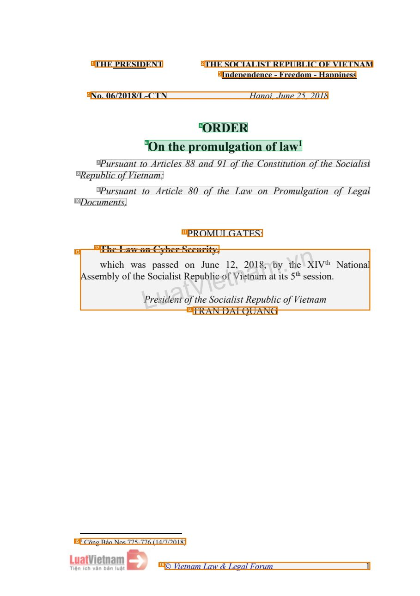
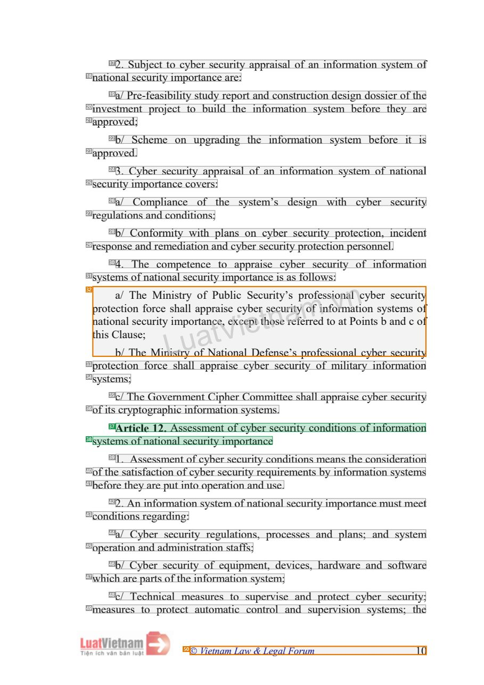
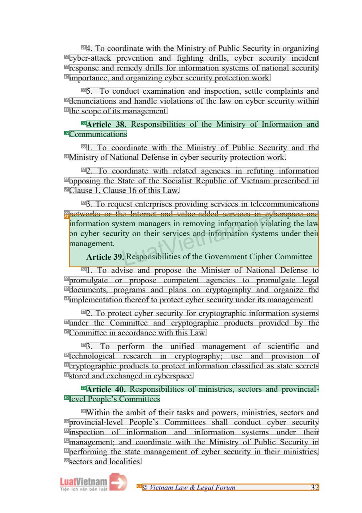

# 083 — `todo10_8/heading_corpus_100/06_dich_song_ngu/083_Luat_An_ninh_mang_2018_EN.pdf`

Draft status: `DRAFT_REVIEWER_A_NOT_APPROVED`. Source sha256 `30f921f155045d5adc04822d795b6fc4014b004d7763a59536bdb4467914ff62`. [Back to index](README.md)

## Page 1 (FIRST)

| # | alias | text | font | draft | flag | rationale |
|---:|---|---|---|---|---|---|
| 1 | L0000:S0 | THE PRESIDENT | 12 B | **OTHER** | REVIEW_FOCUS | Issuer &quot;THE PRESIDENT&quot; (letterhead) |
| 2 | L0000:S1 | THE SOCIALIST REPUBLIC OF VIETNAM | 12 B | **OTHER** | REVIEW_FOCUS | National name (letterhead) |
| 3 | L0001:S0 | Independence - Freedom - Happiness | 12 B | **OTHER** | REVIEW_FOCUS | National motto |
| 4 | L0002:S0 | No. 06/2018/L-CTN Hanoi, June 25, 2018 | 13 B I | **OTHER** | REVIEW_FOCUS | Order number, place and date |
| 5 | L0003:S0 | ORDER | 18 B | **ESTABLISHES** |  | Document title &quot;ORDER&quot; (bold 18, centred) |
| 6 | L0004:S0 | On the promulgation of law1 | 18 B | **ESTABLISHES** |  | Document title continuation &quot;On the promulgation of law&quot; (bold 18, with footnote marker) |
| 7 | L0005:S0 | Pursuant to Articles 88 and 91 of the Constitution of the Socialist | 14 I | **OTHER** |  | Default: body text, list item, table cell, page number or other non-heading content on this page |
| 8 | L0006:S0 | Republic of Vietnam; | 14 I | **OTHER** |  | Default: body text, list item, table cell, page number or other non-heading content on this page |
| 9 | L0007:S0 | Pursuant to Article 80 of the Law on Promulgation of Legal | 14 I | **OTHER** |  | Default: body text, list item, table cell, page number or other non-heading content on this page |
| 10 | L0008:S0 | Documents, | 14 I | **OTHER** |  | Default: body text, list item, table cell, page number or other non-heading content on this page |
| 11 | L0009:S0 | PROMULGATES: | 14 | **OTHER** | REVIEW_FOCUS | Enacting word &quot;PROMULGATES:&quot; |
| 12 | L0010:S0 | The Law on Cyber Security, | 14 B | **OTHER** | REVIEW_FOCUS | Name of the promulgated law inside the order&#39;s body (bold); refers to the law, not a heading here |
| 13 | L0011:S0 | AssemwbhliychofwthaesPLSrpoeacsusiiadsleeiadnstt RootfneVtphuJebuSilnioeeccoi1aft2lVin,site2Rta0ne1apm8um,balbticyito.sf… | 14 | **OTHER** | REVIEW_FOCUS | Garbled interleaved text (overlapping text layers) |
| 14 | L0012:S0 | TRAN DAI QUANG | 14 | **OTHER** | REVIEW_FOCUS | Signatory name |
| 15 | L0013:S0 | 1 C&#244;ng B&#225;o Nos 775-776 (14/7/2018) | 10 | **OTHER** | REVIEW_FOCUS | Footnote |
| 16 | L0014:S0 |  Vietnam Law &amp; Legal Forum 1 | 12 I | **OTHER** | REVIEW_FOCUS | Running footer &quot;Vietnam Law &amp; Legal Forum 1&quot; |

## Page 10 (SEEDED_INTERIOR)

| # | alias | text | font | draft | flag | rationale |
|---:|---|---|---|---|---|---|
| 17 | L0290:S0 | 2. Subject to cyber security appraisal of an information system of | 14 | **OTHER** |  | Default: body text, list item, table cell, page number or other non-heading content on this page |
| 18 | L0291:S0 | national security importance are: | 14 | **OTHER** |  | Default: body text, list item, table cell, page number or other non-heading content on this page |
| 19 | L0292:S0 | a/ Pre-feasibility study report and construction design dossier of the | 14 | **OTHER** |  | Default: body text, list item, table cell, page number or other non-heading content on this page |
| 20 | L0293:S0 | investment project to build the information system before they are | 14 | **OTHER** |  | Default: body text, list item, table cell, page number or other non-heading content on this page |
| 21 | L0294:S0 | approved; | 14 | **OTHER** |  | Default: body text, list item, table cell, page number or other non-heading content on this page |
| 22 | L0295:S0 | b/ Scheme on upgrading the information system before it is | 14 | **OTHER** |  | Default: body text, list item, table cell, page number or other non-heading content on this page |
| 23 | L0296:S0 | approved. | 14 | **OTHER** |  | Default: body text, list item, table cell, page number or other non-heading content on this page |
| 24 | L0297:S0 | 3. Cyber security appraisal of an information system of national | 14 | **OTHER** |  | Default: body text, list item, table cell, page number or other non-heading content on this page |
| 25 | L0298:S0 | security importance covers: | 14 | **OTHER** |  | Default: body text, list item, table cell, page number or other non-heading content on this page |
| 26 | L0299:S0 | a/ Compliance of the system’s design with cyber security | 14 | **OTHER** |  | Default: body text, list item, table cell, page number or other non-heading content on this page |
| 27 | L0300:S0 | regulations and conditions; | 14 | **OTHER** |  | Default: body text, list item, table cell, page number or other non-heading content on this page |
| 28 | L0301:S0 | b/ Conformity with plans on cyber security protection, incident | 14 | **OTHER** |  | Default: body text, list item, table cell, page number or other non-heading content on this page |
| 29 | L0302:S0 | response and remediation and cyber security protection personnel. | 14 | **OTHER** |  | Default: body text, list item, table cell, page number or other non-heading content on this page |
| 30 | L0303:S0 | 4. The competence to appraise cyber security of information | 14 | **OTHER** |  | Default: body text, list item, table cell, page number or other non-heading content on this page |
| 31 | L0304:S0 | systems of national security importance is as follows: | 14 | **OTHER** |  | Default: body text, list item, table cell, page number or other non-heading content on this page |
| 32 | L0305:S0 | pnthraiotsitoeCnabcl/ta/ailouTTsnshheeecef;ouMrrMcitieyinnLisiismhsttarrpuylylooraotafpafpnNrcPtaaeuit,Vsbioeelxincccaiy… | 14 | **OTHER** | REVIEW_FOCUS | Garbled interleaved text (overlapping text layers) |
| 33 | L0306:S0 | protection force shall appraise cyber security of military information | 14 | **OTHER** |  | Default: body text, list item, table cell, page number or other non-heading content on this page |
| 34 | L0307:S0 | systems; | 14 | **OTHER** |  | Default: body text, list item, table cell, page number or other non-heading content on this page |
| 35 | L0308:S0 | c/ The Government Cipher Committee shall appraise cyber security | 14 | **OTHER** |  | Default: body text, list item, table cell, page number or other non-heading content on this page |
| 36 | L0309:S0 | of its cryptographic information systems. | 14 | **OTHER** |  | Default: body text, list item, table cell, page number or other non-heading content on this page |
| 37 | L0310:S0 | Article 12. Assessment of cyber security conditions of information | 14 | **ESTABLISHES** |  | Article heading &quot;Article 12. Assessment of cyber security conditions of information&quot; (line 1) |
| 38 | L0311:S0 | systems of national security importance | 14 | **ESTABLISHES** |  | Article heading line 2 &quot;systems of national security importance&quot; |
| 39 | L0312:S0 | 1. Assessment of cyber security conditions means the consideration | 14 | **OTHER** |  | Default: body text, list item, table cell, page number or other non-heading content on this page |
| 40 | L0313:S0 | of the satisfaction of cyber security requirements by information systems | 14 | **OTHER** |  | Default: body text, list item, table cell, page number or other non-heading content on this page |
| 41 | L0314:S0 | before they are put into operation and use. | 14 | **OTHER** |  | Default: body text, list item, table cell, page number or other non-heading content on this page |
| 42 | L0315:S0 | 2. An information system of national security importance must meet | 14 | **OTHER** |  | Default: body text, list item, table cell, page number or other non-heading content on this page |
| 43 | L0316:S0 | conditions regarding: | 14 | **OTHER** |  | Default: body text, list item, table cell, page number or other non-heading content on this page |
| 44 | L0317:S0 | a/ Cyber security regulations, processes and plans; and system | 14 | **OTHER** |  | Default: body text, list item, table cell, page number or other non-heading content on this page |
| 45 | L0318:S0 | operation and administration staffs; | 14 | **OTHER** |  | Default: body text, list item, table cell, page number or other non-heading content on this page |
| 46 | L0319:S0 | b/ Cyber security of equipment, devices, hardware and software | 14 | **OTHER** |  | Default: body text, list item, table cell, page number or other non-heading content on this page |
| 47 | L0320:S0 | which are parts of the information system; | 14 | **OTHER** |  | Default: body text, list item, table cell, page number or other non-heading content on this page |
| 48 | L0321:S0 | c/ Technical measures to supervise and protect cyber security; | 14 | **OTHER** |  | Default: body text, list item, table cell, page number or other non-heading content on this page |
| 49 | L0322:S0 | measures to protect automatic control and supervision systems; the | 14 | **OTHER** |  | Default: body text, list item, table cell, page number or other non-heading content on this page |
| 50 | L0323:S0 |  Vietnam Law &amp; Legal Forum 10 | 12 I | **OTHER** | REVIEW_FOCUS | Running footer |

## Page 32 (SEEDED_INTERIOR)

| # | alias | text | font | draft | flag | rationale |
|---:|---|---|---|---|---|---|
| 51 | L1059:S0 | 4. To coordinate with the Ministry of Public Security in organizing | 14 | **OTHER** |  | Default: body text, list item, table cell, page number or other non-heading content on this page |
| 52 | L1060:S0 | cyber-attack prevention and fighting drills, cyber security incident | 14 | **OTHER** |  | Default: body text, list item, table cell, page number or other non-heading content on this page |
| 53 | L1061:S0 | response and remedy drills for information systems of national security | 14 | **OTHER** |  | Default: body text, list item, table cell, page number or other non-heading content on this page |
| 54 | L1062:S0 | importance, and organizing cyber security protection work. | 14 | **OTHER** |  | Default: body text, list item, table cell, page number or other non-heading content on this page |
| 55 | L1063:S0 | 5. To conduct examination and inspection, settle complaints and | 14 | **OTHER** |  | Default: body text, list item, table cell, page number or other non-heading content on this page |
| 56 | L1064:S0 | denunciations and handle violations of the law on cyber security within | 14 | **OTHER** |  | Default: body text, list item, table cell, page number or other non-heading content on this page |
| 57 | L1065:S0 | the scope of its management. | 14 | **OTHER** |  | Default: body text, list item, table cell, page number or other non-heading content on this page |
| 58 | L1066:S0 | Article 38. Responsibilities of the Ministry of Information and | 14 | **ESTABLISHES** |  | Article heading &quot;Article 38. Responsibilities of the Ministry of Information and&quot; (line 1) |
| 59 | L1067:S0 | Communications | 14 | **ESTABLISHES** |  | Article heading line 2 &quot;Communications&quot; |
| 60 | L1068:S0 | 1. To coordinate with the Ministry of Public Security and the | 14 | **OTHER** |  | Default: body text, list item, table cell, page number or other non-heading content on this page |
| 61 | L1069:S0 | Ministry of National Defense in cyber security protection work. | 14 | **OTHER** |  | Default: body text, list item, table cell, page number or other non-heading content on this page |
| 62 | L1070:S0 | 2. To coordinate with related agencies in refuting information | 14 | **OTHER** |  | Default: body text, list item, table cell, page number or other non-heading content on this page |
| 63 | L1071:S0 | opposing the State of the Socialist Republic of Vietnam prescribed in | 14 | **OTHER** |  | Default: body text, list item, table cell, page number or other non-heading content on this page |
| 64 | L1072:S0 | Clause 1, Clause 16 of this Law. | 14 | **OTHER** |  | Default: body text, list item, table cell, page number or other non-heading content on this page |
| 65 | L1073:S0 | 3. To request enterprises providing services in telecommunications | 14 | **OTHER** |  | Default: body text, list item, table cell, page number or other non-heading content on this page |
| 66 | L1074:S0 | networks or the Internet and value-added services in cyberspace and | 14 | **OTHER** |  | Default: body text, list item, table cell, page number or other non-heading content on this page |
| 67 | L1075:S0 | iomnnafoncraymAgbearemttriiocesnlenects.u3yr9si.ttLeyRmeosnumpotahnnaesaiigrbteislreVistrivieniscireoeesfmtahontevdniGni… | 14 | **ESTABLISHES** | REVIEW_FOCUS | Garbled line that interleaves the &quot;Article 39. Responsibilities of the Government Cipher Committee&quot; heading with body text; contri… |
| 68 | L1076:S0 | 1. To advise and propose the Minister of National Defense to | 14 | **OTHER** |  | Default: body text, list item, table cell, page number or other non-heading content on this page |
| 69 | L1077:S0 | promulgate or propose competent agencies to promulgate legal | 14 | **OTHER** |  | Default: body text, list item, table cell, page number or other non-heading content on this page |
| 70 | L1078:S0 | documents, programs and plans on cryptography and organize the | 14 | **OTHER** |  | Default: body text, list item, table cell, page number or other non-heading content on this page |
| 71 | L1079:S0 | implementation thereof to protect cyber security under its management. | 14 | **OTHER** |  | Default: body text, list item, table cell, page number or other non-heading content on this page |
| 72 | L1080:S0 | 2. To protect cyber security for cryptographic information systems | 14 | **OTHER** |  | Default: body text, list item, table cell, page number or other non-heading content on this page |
| 73 | L1081:S0 | under the Committee and cryptographic products provided by the | 14 | **OTHER** |  | Default: body text, list item, table cell, page number or other non-heading content on this page |
| 74 | L1082:S0 | Committee in accordance with this Law. | 14 | **OTHER** |  | Default: body text, list item, table cell, page number or other non-heading content on this page |
| 75 | L1083:S0 | 3. To perform the unified management of scientific and | 14 | **OTHER** |  | Default: body text, list item, table cell, page number or other non-heading content on this page |
| 76 | L1084:S0 | technological research in cryptography; use and provision of | 14 | **OTHER** |  | Default: body text, list item, table cell, page number or other non-heading content on this page |
| 77 | L1085:S0 | cryptographic products to protect information classified as state secrets | 14 | **OTHER** |  | Default: body text, list item, table cell, page number or other non-heading content on this page |
| 78 | L1086:S0 | stored and exchanged in cyberspace. | 14 | **OTHER** |  | Default: body text, list item, table cell, page number or other non-heading content on this page |
| 79 | L1087:S0 | Article 40. Responsibilities of ministries, sectors and provincial- | 14 | **ESTABLISHES** |  | Article heading &quot;Article 40. Responsibilities of ministries, sectors and provincial-&quot; (line 1) |
| 80 | L1088:S0 | level People’s Committees | 14 | **ESTABLISHES** |  | Article heading line 2 &quot;level People&#39;s Committees&quot; |
| 81 | L1089:S0 | Within the ambit of their tasks and powers, ministries, sectors and | 14 | **OTHER** |  | Default: body text, list item, table cell, page number or other non-heading content on this page |
| 82 | L1090:S0 | provincial-level People’s Committees shall conduct cyber security | 14 | **OTHER** |  | Default: body text, list item, table cell, page number or other non-heading content on this page |
| 83 | L1091:S0 | inspection of information and information systems under their | 14 | **OTHER** |  | Default: body text, list item, table cell, page number or other non-heading content on this page |
| 84 | L1092:S0 | management; and coordinate with the Ministry of Public Security in | 14 | **OTHER** |  | Default: body text, list item, table cell, page number or other non-heading content on this page |
| 85 | L1093:S0 | performing the state management of cyber security in their ministries, | 14 | **OTHER** |  | Default: body text, list item, table cell, page number or other non-heading content on this page |
| 86 | L1094:S0 | sectors and localities. | 14 | **OTHER** |  | Default: body text, list item, table cell, page number or other non-heading content on this page |
| 87 | L1095:S0 |  Vietnam Law &amp; Legal Forum 32 | 12 I | **OTHER** | REVIEW_FOCUS | Running footer |
