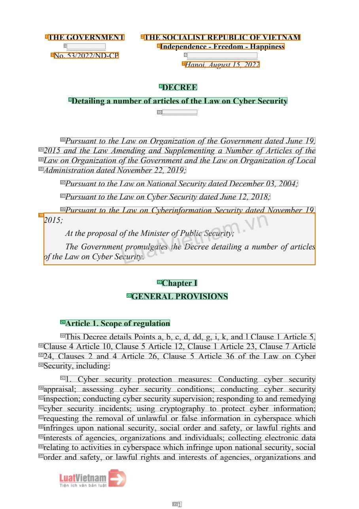
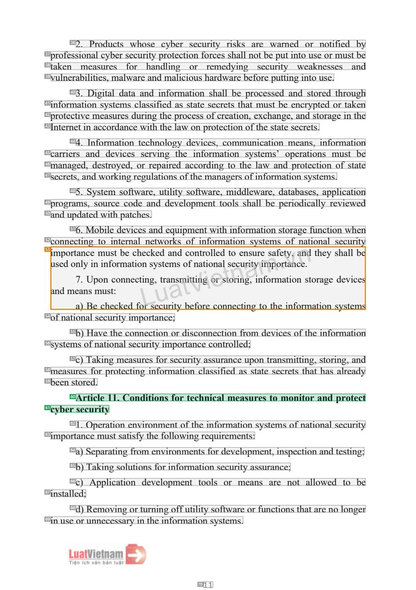
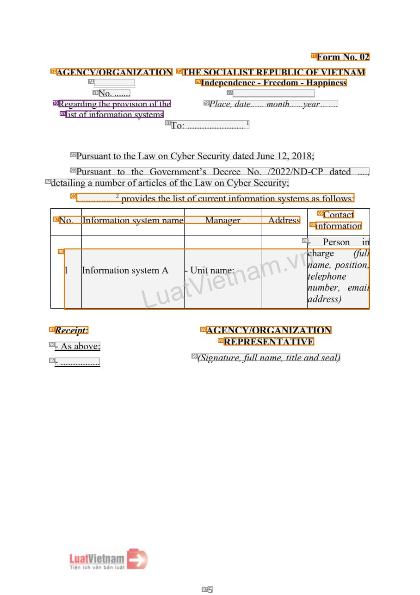
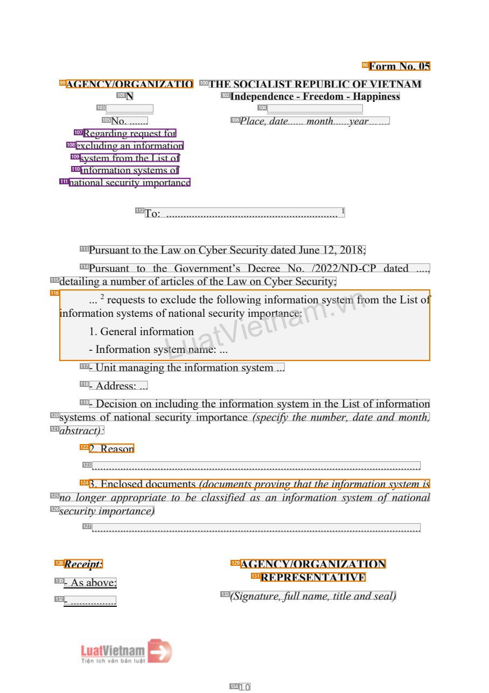

# 087 — `todo10_8/heading_corpus_100/06_dich_song_ngu/087_ND_53-2022_An_ninh_mang_EN.pdf`

Draft status: `DRAFT_REVIEWER_A_NOT_APPROVED`. Source sha256 `a603afb1c59c438e1d6e72a0bb5d78e3d367a16ce28fb0bdedbe60360a884d4d`. [Back to index](README.md)

## Page 1 (FIRST)

| # | alias | text | font | draft | flag | rationale |
|---:|---|---|---|---|---|---|
| 1 | L0000:S0 | THE GOVERNMENT | 13 B | **OTHER** | REVIEW_FOCUS | Issuer &quot;THE GOVERNMENT&quot; (letterhead) |
| 2 | L0000:S1 | THE SOCIALIST REPUBLIC OF VIETNAM | 13 B | **OTHER** | REVIEW_FOCUS | National name |
| 3 | L0001:S0 | __________ | 13 | **OTHER** |  | Default: body text, list item, table cell, page number or other non-heading content on this page |
| 4 | L0001:S1 | Independence - Freedom - Happiness | 13 B | **OTHER** | REVIEW_FOCUS | National motto |
| 5 | L0002:S0 | No. 53/2022/ND-CP | 13 | **OTHER** | REVIEW_FOCUS | Decree number |
| 6 | L0002:S1 | __________________ | 13 | **OTHER** |  | Default: body text, list item, table cell, page number or other non-heading content on this page |
| 7 | L0003:S0 | Hanoi, August 15, 2022 | 13 I | **OTHER** | REVIEW_FOCUS | Place and date |
| 8 | L0004:S0 | DECREE | 14 B | **ESTABLISHES** |  | Document type title &quot;DECREE&quot; |
| 9 | L0005:S0 | Detailing a number of articles of the Law on Cyber Security | 14 B | **ESTABLISHES** |  | Document title &quot;Detailing a number of articles of the Law on Cyber Security&quot; |
| 10 | L0006:S0 | _____________ | 9 | **OTHER** |  | Default: body text, list item, table cell, page number or other non-heading content on this page |
| 11 | L0007:S0 | Pursuant to the Law on Organization of the Government dated June 19, | 14 I | **OTHER** |  | Default: body text, list item, table cell, page number or other non-heading content on this page |
| 12 | L0008:S0 | 2015 and the Law Amending and Supplementing a Number of Articles of the | 14 I | **OTHER** |  | Default: body text, list item, table cell, page number or other non-heading content on this page |
| 13 | L0009:S0 | Law on Organization of the Government and the Law on Organization of Local | 14 I | **OTHER** |  | Default: body text, list item, table cell, page number or other non-heading content on this page |
| 14 | L0010:S0 | Administration dated November 22, 2019; | 14 I | **OTHER** |  | Default: body text, list item, table cell, page number or other non-heading content on this page |
| 15 | L0011:S0 | Pursuant to the Law on National Security dated December 03, 2004; | 14 I | **OTHER** |  | Default: body text, list item, table cell, page number or other non-heading content on this page |
| 16 | L0012:S0 | Pursuant to the Law on Cyber Security dated June 12, 2018; | 14 I | **OTHER** |  | Default: body text, list item, table cell, page number or other non-heading content on this page |
| 17 | L0013:S0 | Pursuant to the Law on Cyberinformation Security dated November 19, | 14 I | **OTHER** |  | Default: body text, list item, table cell, page number or other non-heading content on this page |
| 18 | L0014:S0 | 2o0f 1th5e;LATahtwethGoenopvrCoeyrpbnoemsraeSlneotcfLputrhroieutmyM.uailngiasttteesVr tohfeiPeDubelctircneSeedcauetraimt… | 14 I | **OTHER** | REVIEW_FOCUS | Garbled interleaved text (overlapping text layers) |
| 19 | L0015:S0 | Chapter I | 14 B | **ESTABLISHES** |  | Chapter label &quot;Chapter I&quot; |
| 20 | L0016:S0 | GENERAL PROVISIONS | 14 B | **ESTABLISHES** |  | Chapter title &quot;GENERAL PROVISIONS&quot; |
| 21 | L0017:S0 | Article 1. Scope of regulation | 14 B | **ESTABLISHES** |  | Article heading &quot;Article 1. Scope of regulation&quot; |
| 22 | L0018:S0 | This Decree details Points a, b, c, d, dd, g, i, k, and l Clause 1 Article 5, | 14 | **OTHER** |  | Default: body text, list item, table cell, page number or other non-heading content on this page |
| 23 | L0019:S0 | Clause 4 Article 10, Clause 5 Article 12, Clause 1 Article 23, Clause 7 Article | 14 | **OTHER** |  | Default: body text, list item, table cell, page number or other non-heading content on this page |
| 24 | L0020:S0 | 24, Clauses 2 and 4 Article 26, Clause 5 Article 36 of the Law on Cyber | 14 | **OTHER** |  | Default: body text, list item, table cell, page number or other non-heading content on this page |
| 25 | L0021:S0 | Security, including: | 14 | **OTHER** |  | Default: body text, list item, table cell, page number or other non-heading content on this page |
| 26 | L0022:S0 | 1. Cyber security protection measures: Conducting cyber security | 14 | **OTHER** |  | Default: body text, list item, table cell, page number or other non-heading content on this page |
| 27 | L0023:S0 | appraisal; assessing cyber security conditions; conducting cyber security | 14 | **OTHER** |  | Default: body text, list item, table cell, page number or other non-heading content on this page |
| 28 | L0024:S0 | inspection; conducting cyber security supervision; responding to and remedying | 14 | **OTHER** |  | Default: body text, list item, table cell, page number or other non-heading content on this page |
| 29 | L0025:S0 | cyber security incidents; using cryptography to protect cyber information; | 14 | **OTHER** |  | Default: body text, list item, table cell, page number or other non-heading content on this page |
| 30 | L0026:S0 | requesting the removal of unlawful or false information in cyberspace which | 14 | **OTHER** |  | Default: body text, list item, table cell, page number or other non-heading content on this page |
| 31 | L0027:S0 | infringes upon national security, social order and safety, or lawful rights and | 14 | **OTHER** |  | Default: body text, list item, table cell, page number or other non-heading content on this page |
| 32 | L0028:S0 | interests of agencies, organizations and individuals; collecting electronic data | 14 | **OTHER** |  | Default: body text, list item, table cell, page number or other non-heading content on this page |
| 33 | L0029:S0 | relating to activities in cyberspace which infringe upon national security, social | 14 | **OTHER** |  | Default: body text, list item, table cell, page number or other non-heading content on this page |
| 34 | L0030:S0 | order and safety, or lawful rights and interests of agencies, organizations and | 14 | **OTHER** |  | Default: body text, list item, table cell, page number or other non-heading content on this page |
| 35 | L0031:S0 | 1 | 12 | **OTHER** |  | Default: body text, list item, table cell, page number or other non-heading content on this page |

## Page 11 (SEEDED_INTERIOR)

| # | alias | text | font | draft | flag | rationale |
|---:|---|---|---|---|---|---|
| 36 | L0361:S0 | 2. Products whose cyber security risks are warned or notified by | 14 | **OTHER** |  | Default: body text, list item, table cell, page number or other non-heading content on this page |
| 37 | L0362:S0 | professional cyber security protection forces shall not be put into use or must be | 14 | **OTHER** |  | Default: body text, list item, table cell, page number or other non-heading content on this page |
| 38 | L0363:S0 | taken measures for handling or remedying security weaknesses and | 14 | **OTHER** |  | Default: body text, list item, table cell, page number or other non-heading content on this page |
| 39 | L0364:S0 | vulnerabilities, malware and malicious hardware before putting into use. | 14 | **OTHER** |  | Default: body text, list item, table cell, page number or other non-heading content on this page |
| 40 | L0365:S0 | 3. Digital data and information shall be processed and stored through | 14 | **OTHER** |  | Default: body text, list item, table cell, page number or other non-heading content on this page |
| 41 | L0366:S0 | information systems classified as state secrets that must be encrypted or taken | 14 | **OTHER** |  | Default: body text, list item, table cell, page number or other non-heading content on this page |
| 42 | L0367:S0 | protective measures during the process of creation, exchange, and storage in the | 14 | **OTHER** |  | Default: body text, list item, table cell, page number or other non-heading content on this page |
| 43 | L0368:S0 | Internet in accordance with the law on protection of the state secrets. | 14 | **OTHER** |  | Default: body text, list item, table cell, page number or other non-heading content on this page |
| 44 | L0369:S0 | 4. Information technology devices, communication means, information | 14 | **OTHER** |  | Default: body text, list item, table cell, page number or other non-heading content on this page |
| 45 | L0370:S0 | carriers and devices serving the information systems’ operations must be | 14 | **OTHER** |  | Default: body text, list item, table cell, page number or other non-heading content on this page |
| 46 | L0371:S0 | managed, destroyed, or repaired according to the law and protection of state | 14 | **OTHER** |  | Default: body text, list item, table cell, page number or other non-heading content on this page |
| 47 | L0372:S0 | secrets, and working regulations of the managers of information systems. | 14 | **OTHER** |  | Default: body text, list item, table cell, page number or other non-heading content on this page |
| 48 | L0373:S0 | 5. System software, utility software, middleware, databases, application | 14 | **OTHER** |  | Default: body text, list item, table cell, page number or other non-heading content on this page |
| 49 | L0374:S0 | programs, source code and development tools shall be periodically reviewed | 14 | **OTHER** |  | Default: body text, list item, table cell, page number or other non-heading content on this page |
| 50 | L0375:S0 | and updated with patches. | 14 | **OTHER** |  | Default: body text, list item, table cell, page number or other non-heading content on this page |
| 51 | L0376:S0 | 6. Mobile devices and equipment with information storage function when | 14 | **OTHER** |  | Default: body text, list item, table cell, page number or other non-heading content on this page |
| 52 | L0377:S0 | connecting to internal networks of information systems of national security | 14 | **OTHER** |  | Default: body text, list item, table cell, page number or other non-heading content on this page |
| 53 | L0378:S0 | iuamnsedpdomrote7anaa).lnyncUBseienpmmociunnhusfestco:tcorkmbneenadetcicfhotoeinLrncsgksy,eeuscdttrueaarmnaintssydmotbci… | 14 | **OTHER** | REVIEW_FOCUS | Garbled interleaved text (overlapping text layers) |
| 54 | L0379:S0 | of national security importance; | 14 | **OTHER** |  | Default: body text, list item, table cell, page number or other non-heading content on this page |
| 55 | L0380:S0 | b) Have the connection or disconnection from devices of the information | 14 | **OTHER** |  | Default: body text, list item, table cell, page number or other non-heading content on this page |
| 56 | L0381:S0 | systems of national security importance controlled; | 14 | **OTHER** |  | Default: body text, list item, table cell, page number or other non-heading content on this page |
| 57 | L0382:S0 | c) Taking measures for security assurance upon transmitting, storing, and | 14 | **OTHER** |  | Default: body text, list item, table cell, page number or other non-heading content on this page |
| 58 | L0383:S0 | measures for protecting information classified as state secrets that has already | 14 | **OTHER** |  | Default: body text, list item, table cell, page number or other non-heading content on this page |
| 59 | L0384:S0 | been stored. | 14 | **OTHER** |  | Default: body text, list item, table cell, page number or other non-heading content on this page |
| 60 | L0385:S0 | Article 11. Conditions for technical measures to monitor and protect | 14 B | **ESTABLISHES** |  | Article heading &quot;Article 11. Conditions for technical measures to monitor and protect&quot; (line 1) |
| 61 | L0386:S0 | cyber security | 14 B | **ESTABLISHES** |  | Article heading line 2 &quot;cyber security&quot; |
| 62 | L0387:S0 | 1. Operation environment of the information systems of national security | 14 | **OTHER** |  | Default: body text, list item, table cell, page number or other non-heading content on this page |
| 63 | L0388:S0 | importance must satisfy the following requirements: | 14 | **OTHER** |  | Default: body text, list item, table cell, page number or other non-heading content on this page |
| 64 | L0389:S0 | a) Separating from environments for development, inspection and testing; | 14 | **OTHER** |  | Default: body text, list item, table cell, page number or other non-heading content on this page |
| 65 | L0390:S0 | b) Taking solutions for information security assurance; | 14 | **OTHER** |  | Default: body text, list item, table cell, page number or other non-heading content on this page |
| 66 | L0391:S0 | c) Application development tools or means are not allowed to be | 14 | **OTHER** |  | Default: body text, list item, table cell, page number or other non-heading content on this page |
| 67 | L0392:S0 | installed; | 14 | **OTHER** |  | Default: body text, list item, table cell, page number or other non-heading content on this page |
| 68 | L0393:S0 | d) Removing or turning off utility software or functions that are no longer | 14 | **OTHER** |  | Default: body text, list item, table cell, page number or other non-heading content on this page |
| 69 | L0394:S0 | in use or unnecessary in the information systems. | 14 | **OTHER** |  | Default: body text, list item, table cell, page number or other non-heading content on this page |
| 70 | L0395:S0 | 11 | 12 | **OTHER** |  | Default: body text, list item, table cell, page number or other non-heading content on this page |

## Page 33 (TARGETED_STRUCTURE)

| # | alias | text | font | draft | flag | rationale |
|---:|---|---|---|---|---|---|
| 71 | L1114:S0 | Form No. 02 | 14 B | **OTHER** | REVIEW_FOCUS | Form number &quot;Form No. 02&quot; (form furniture) |
| 72 | L1115:S0 | AGENCY/ORGANIZATION | 13 B | **OTHER** | REVIEW_FOCUS | Placeholder issuer &quot;AGENCY/ORGANIZATION&quot; in the form letterhead |
| 73 | L1115:S1 | THE SOCIALIST REPUBLIC OF VIETNAM | 13 B | **OTHER** | REVIEW_FOCUS | National name in the form template |
| 74 | L1116:S0 | _________ | 13 | **OTHER** |  | Default: body text, list item, table cell, page number or other non-heading content on this page |
| 75 | L1116:S1 | Independence - Freedom - Happiness | 13 B | **OTHER** | REVIEW_FOCUS | National motto in the form template |
| 76 | L1117:S0 | No. ....... | 13 | **OTHER** |  | Default: body text, list item, table cell, page number or other non-heading content on this page |
| 77 | L1117:S1 | __________________ | 13 | **OTHER** |  | Default: body text, list item, table cell, page number or other non-heading content on this page |
| 78 | L1118:S0 | Regarding the provision of the | 13 | **OTHER** | USER_DECIDED | Subject line (tr&#237;ch yếu) of the template letter: left administrative column under the number, regular 13pt; USER_DECISION_2026_10_10 (I… |
| 79 | L1118:S1 | Place, date...... month......year……. | 13 I | **OTHER** |  | Default: body text, list item, table cell, page number or other non-heading content on this page |
| 80 | L1119:S0 | list of information systems | 13 | **OTHER** | USER_DECIDED | Subject line continuation; USER_DECISION_2026_10_10 (Issue #6): OTHER, not a title |
| 81 | L1120:S0 | To: ....................... 1 | 14 | **OTHER** |  | Default: body text, list item, table cell, page number or other non-heading content on this page |
| 82 | L1121:S0 | Pursuant to the Law on Cyber Security dated June 12, 2018; | 14 | **OTHER** |  | Default: body text, list item, table cell, page number or other non-heading content on this page |
| 83 | L1122:S0 | Pursuant to the Government’s Decree No. /2022/ND-CP dated ...., | 14 | **OTHER** |  | Default: body text, list item, table cell, page number or other non-heading content on this page |
| 84 | L1123:S0 | detailing a number of articles of the Law on Cyber Security; | 14 | **OTHER** |  | Default: body text, list item, table cell, page number or other non-heading content on this page |
| 85 | L1124:S0 | ............... 2 provides the list of current information systems as follows: | 14 | **OTHER** | REVIEW_FOCUS | Lead-in sentence of the template |
| 86 | L1125:S0 | Contact | 14 | **OTHER** | REVIEW_FOCUS | Table column label &quot;Contact&quot; |
| 87 | L1126:S0 | No. Information system name Manager Address | 14 | **OTHER** | REVIEW_FOCUS | Table column labels |
| 88 | L1126:S1 | information | 14 | **OTHER** | REVIEW_FOCUS | Table column label |
| 89 | L1127:S0 | - Person in | 14 | **OTHER** |  | Default: body text, list item, table cell, page number or other non-heading content on this page |
| 90 | L1128:S0 | 1 Information systLemuA a-tUVnit ineamet:nam.vncntnaehaudlamemdrprgbeeh,eesorspn,)oeseitm(ifoaunilll, | 14 I | **OTHER** | REVIEW_FOCUS | Garbled table row (overlapping text layers) |
| 91 | L1129:S0 | Receipt: | 14 B I | **OTHER** | REVIEW_FOCUS | &quot;Receipt:&quot; distribution label |
| 92 | L1129:S1 | AGENCY/ORGANIZATION | 14 B | **OTHER** | REVIEW_FOCUS | Signature block label |
| 93 | L1130:S0 | - As above; | 14 | **OTHER** |  | Default: body text, list item, table cell, page number or other non-heading content on this page |
| 94 | L1130:S1 | REPRESENTATIVE | 14 B | **OTHER** | REVIEW_FOCUS | Signature block label |
| 95 | L1131:S0 | - ................ | 14 | **OTHER** |  | Default: body text, list item, table cell, page number or other non-heading content on this page |
| 96 | L1131:S1 | (Signature, full name, title and seal) | 14 I | **OTHER** |  | Default: body text, list item, table cell, page number or other non-heading content on this page |
| 97 | L1132:S0 | 5 | 12 | **OTHER** |  | Default: body text, list item, table cell, page number or other non-heading content on this page |

## Page 38 (SEEDED_INTERIOR)

| # | alias | text | font | draft | flag | rationale |
|---:|---|---|---|---|---|---|
| 98 | L1202:S0 | Form No. 05 | 14 B | **OTHER** | REVIEW_FOCUS | Form number &quot;Form No. 05&quot; |
| 99 | L1203:S0 | AGENCY/ORGANIZATIO | 13 B | **OTHER** | REVIEW_FOCUS | Placeholder issuer in the form letterhead |
| 100 | L1203:S1 | THE SOCIALIST REPUBLIC OF VIETNAM | 13 B | **OTHER** |  | Default: body text, list item, table cell, page number or other non-heading content on this page |
| 101 | L1204:S0 | N | 13 B | **OTHER** |  | Default: body text, list item, table cell, page number or other non-heading content on this page |
| 102 | L1204:S1 | Independence - Freedom - Happiness | 13 B | **OTHER** |  | Default: body text, list item, table cell, page number or other non-heading content on this page |
| 103 | L1205:S0 | _________ | 13 | **OTHER** |  | Default: body text, list item, table cell, page number or other non-heading content on this page |
| 104 | L1205:S1 | __________________ | 13 | **OTHER** |  | Default: body text, list item, table cell, page number or other non-heading content on this page |
| 105 | L1206:S0 | No. ....... | 13 | **OTHER** |  | Default: body text, list item, table cell, page number or other non-heading content on this page |
| 106 | L1206:S1 | Place, date...... month......year……. | 13 I | **OTHER** |  | Default: body text, list item, table cell, page number or other non-heading content on this page |
| 107 | L1207:S0 | Regarding request for | 13 | **OTHER** | USER_DECIDED | Subject line (tr&#237;ch yếu) of the template letter; USER_DECISION_2026_10_10 (Issue #6): OTHER, not a title |
| 108 | L1208:S0 | excluding an information | 13 | **OTHER** | USER_DECIDED | Subject line continuation; USER_DECISION_2026_10_10 (Issue #6): OTHER, not a title |
| 109 | L1209:S0 | system from the List of | 13 | **OTHER** | USER_DECIDED | Subject line continuation; USER_DECISION_2026_10_10 (Issue #6): OTHER, not a title |
| 110 | L1210:S0 | information systems of | 13 | **OTHER** | USER_DECIDED | Subject line continuation; USER_DECISION_2026_10_10 (Issue #6): OTHER, not a title |
| 111 | L1211:S0 | national security importance | 13 | **OTHER** | USER_DECIDED | Subject line continuation; USER_DECISION_2026_10_10 (Issue #6): OTHER, not a title |
| 112 | L1212:S0 | To: ............................................................ 1 | 14 | **OTHER** |  | Default: body text, list item, table cell, page number or other non-heading content on this page |
| 113 | L1213:S0 | Pursuant to the Law on Cyber Security dated June 12, 2018; | 14 | **OTHER** |  | Default: body text, list item, table cell, page number or other non-heading content on this page |
| 114 | L1214:S0 | Pursuant to the Government’s Decree No. /2022/ND-CP dated ...., | 14 | **OTHER** |  | Default: body text, list item, table cell, page number or other non-heading content on this page |
| 115 | L1215:S0 | detailing a number of articles of the Law on Cyber Security; | 14 | **OTHER** |  | Default: body text, list item, table cell, page number or other non-heading content on this page |
| 116 | L1216:S0 | inform.1-a...Itin2GofrneoenrqsmeyursaeattsleitomisnntsfoosoyrefmsxtnLaceatlmtiuioudonnenaatmalheese:ftc.o.uV.lrloitwyiii… | 14 | **OTHER** | REVIEW_FOCUS | Garbled interleaved text (overlapping text layers) |
| 117 | L1217:S0 | - Unit managing the information system ... | 14 | **OTHER** |  | Default: body text, list item, table cell, page number or other non-heading content on this page |
| 118 | L1218:S0 | - Address: ... | 14 | **OTHER** |  | Default: body text, list item, table cell, page number or other non-heading content on this page |
| 119 | L1219:S0 | - Decision on including the information system in the List of information | 14 | **OTHER** |  | Default: body text, list item, table cell, page number or other non-heading content on this page |
| 120 | L1220:S0 | systems of national security importance (specify the number, date and month, | 14 I | **OTHER** |  | Default: body text, list item, table cell, page number or other non-heading content on this page |
| 121 | L1221:S0 | abstract): | 14 I | **OTHER** |  | Default: body text, list item, table cell, page number or other non-heading content on this page |
| 122 | L1222:S0 | 2. Reason | 14 | **OTHER** | REVIEW_FOCUS | Form item &quot;2. Reason&quot; (form field, not a document heading) |
| 123 | L1223:S0 | ................................................................................................................... | 14 | **OTHER** |  | Default: body text, list item, table cell, page number or other non-heading content on this page |
| 124 | L1224:S0 | 3. Enclosed documents (documents proving that the information system is | 14 I | **OTHER** | REVIEW_FOCUS | Form item &quot;3. Enclosed documents ...&quot; (form field) |
| 125 | L1225:S0 | no longer appropriate to be classified as an information system of national | 14 I | **OTHER** |  | Default: body text, list item, table cell, page number or other non-heading content on this page |
| 126 | L1226:S0 | security importance) | 14 I | **OTHER** |  | Default: body text, list item, table cell, page number or other non-heading content on this page |
| 127 | L1227:S0 | ................................................................................................................... | 14 | **OTHER** |  | Default: body text, list item, table cell, page number or other non-heading content on this page |
| 128 | L1228:S0 | Receipt: | 14 B I | **OTHER** | REVIEW_FOCUS | &quot;Receipt:&quot; distribution label |
| 129 | L1228:S1 | AGENCY/ORGANIZATION | 14 B | **OTHER** | REVIEW_FOCUS | Signature block label |
| 130 | L1229:S0 | - As above; | 14 | **OTHER** |  | Default: body text, list item, table cell, page number or other non-heading content on this page |
| 131 | L1229:S1 | REPRESENTATIVE | 14 B | **OTHER** | REVIEW_FOCUS | Signature block label |
| 132 | L1230:S0 | - ................ | 14 | **OTHER** |  | Default: body text, list item, table cell, page number or other non-heading content on this page |
| 133 | L1230:S1 | (Signature, full name, title and seal) | 14 I | **OTHER** |  | Default: body text, list item, table cell, page number or other non-heading content on this page |
| 134 | L1231:S0 | 10 | 12 | **OTHER** |  | Default: body text, list item, table cell, page number or other non-heading content on this page |
