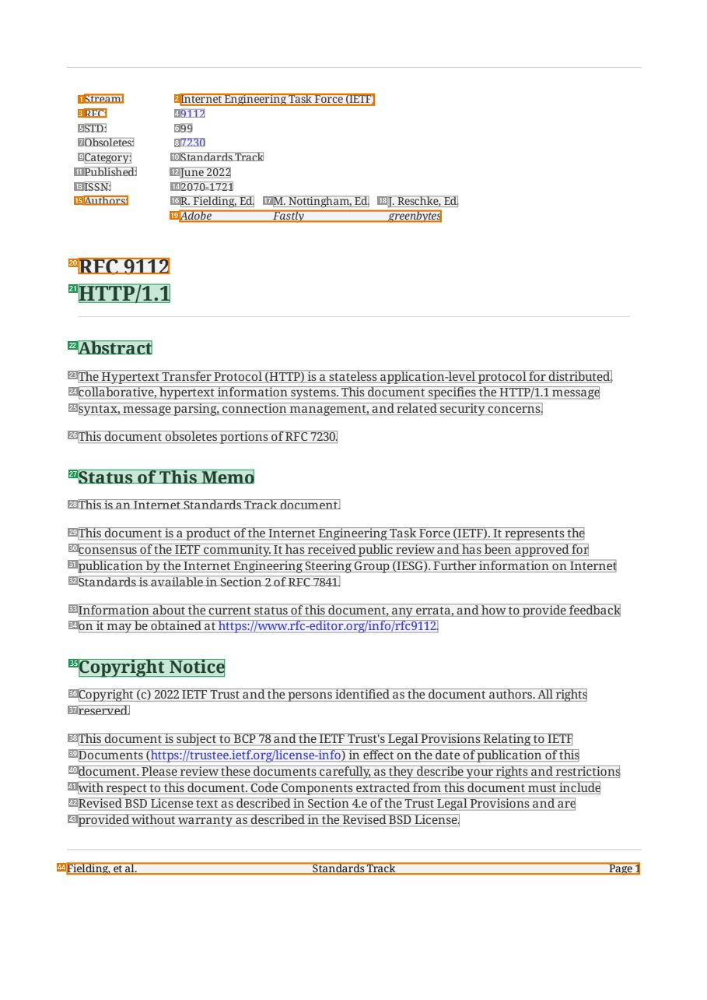
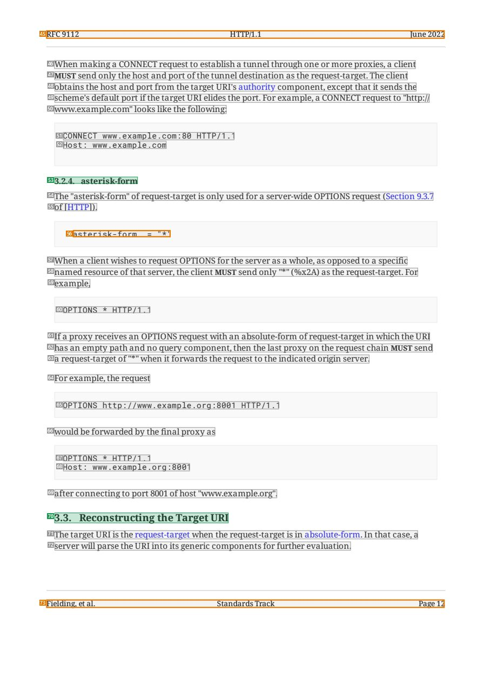
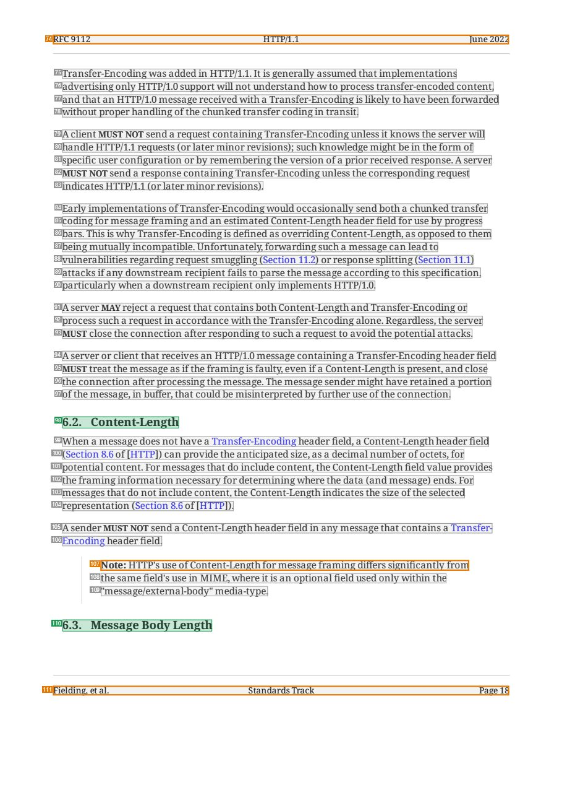
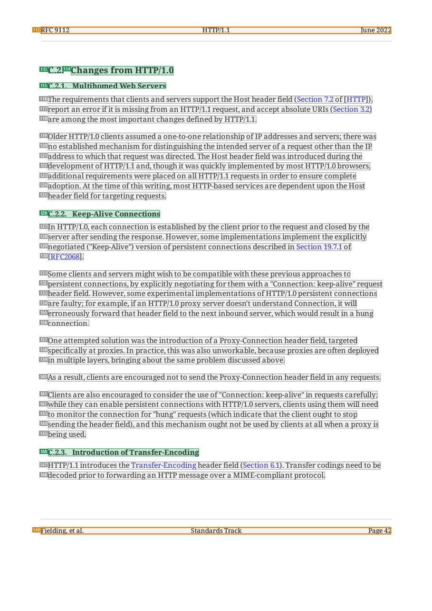

# 093 — `todo10_8/heading_corpus_100/07_system_generated/093_RFC9112_HTTP_1_1.pdf`

Draft status: `DRAFT_REVIEWER_A_NOT_APPROVED`. Source sha256 `b260bba790c2da55a7e0795f356fcd9b70743686c55250f0ef1cc993c4d1abac`. [Back to index](README.md)

## Page 1 (FIRST)

| # | alias | text | font | draft | flag | rationale |
|---:|---|---|---|---|---|---|
| 1 | L0000:S0 | Stream: | 9 | **OTHER** | REVIEW_FOCUS | Header metadata label &quot;Stream:&quot; |
| 2 | L0000:S1 | Internet Engineering Task Force (IETF) | 9 | **OTHER** | REVIEW_FOCUS | Header metadata value |
| 3 | L0001:S0 | RFC: | 9 | **OTHER** | REVIEW_FOCUS | Header metadata label &quot;RFC:&quot; |
| 4 | L0001:S1 | 9112 | 9 | **OTHER** |  | Default: body text, list item, table cell, page number or other non-heading content on this page |
| 5 | L0002:S0 | STD: | 9 | **OTHER** |  | Default: body text, list item, table cell, page number or other non-heading content on this page |
| 6 | L0002:S1 | 99 | 9 | **OTHER** |  | Default: body text, list item, table cell, page number or other non-heading content on this page |
| 7 | L0003:S0 | Obsoletes: | 9 | **OTHER** |  | Default: body text, list item, table cell, page number or other non-heading content on this page |
| 8 | L0003:S1 | 7230 | 9 | **OTHER** |  | Default: body text, list item, table cell, page number or other non-heading content on this page |
| 9 | L0004:S0 | Category: | 9 | **OTHER** |  | Default: body text, list item, table cell, page number or other non-heading content on this page |
| 10 | L0004:S1 | Standards Track | 9 | **OTHER** |  | Default: body text, list item, table cell, page number or other non-heading content on this page |
| 11 | L0005:S0 | Published: | 9 | **OTHER** |  | Default: body text, list item, table cell, page number or other non-heading content on this page |
| 12 | L0005:S1 | June 2022 | 9 | **OTHER** |  | Default: body text, list item, table cell, page number or other non-heading content on this page |
| 13 | L0006:S0 | ISSN: | 9 | **OTHER** |  | Default: body text, list item, table cell, page number or other non-heading content on this page |
| 14 | L0006:S1 | 2070-1721 | 9 | **OTHER** |  | Default: body text, list item, table cell, page number or other non-heading content on this page |
| 15 | L0007:S0 | Authors: | 9 | **OTHER** | REVIEW_FOCUS | Header metadata label &quot;Authors:&quot; |
| 16 | L0007:S1 | R. Fielding, Ed. | 9 | **OTHER** |  | Default: body text, list item, table cell, page number or other non-heading content on this page |
| 17 | L0007:S2 | M. Nottingham, Ed. | 9 | **OTHER** |  | Default: body text, list item, table cell, page number or other non-heading content on this page |
| 18 | L0007:S3 | J. Reschke, Ed. | 9 | **OTHER** |  | Default: body text, list item, table cell, page number or other non-heading content on this page |
| 19 | L0008:S0 | Adobe Fastly greenbytes | 9 | **OTHER** | REVIEW_FOCUS | Author affiliations |
| 20 | L0009:S0 | RFC 9112 | 17.2 B | **OTHER** | REVIEW_FOCUS | Document number &quot;RFC 9112&quot; above the title (bold 17.2) — drafted OTHER following the approved SRC-095 Gold convention (the RFC num… |
| 21 | L0010:S0 | HTTP/1. 1 | 17.2 B | **ESTABLISHES** |  | Document title &quot;HTTP/1.1&quot; (bold 17.2) |
| 22 | L0011:S0 | Abstract | 14.4 B | **ESTABLISHES** |  | Front-matter heading &quot;Abstract&quot; (bold 14.4) |
| 23 | L0012:S0 | The Hypertext Transfer Protocol (HTTP) is a stateless application-level protocol for distributed, | 10 | **OTHER** |  | Default: body text, list item, table cell, page number or other non-heading content on this page |
| 24 | L0013:S0 | collaborative, hypertext information systems. This document specifies the HTTP/1.1 message | 10 | **OTHER** |  | Default: body text, list item, table cell, page number or other non-heading content on this page |
| 25 | L0014:S0 | syntax, message parsing, connection management, and related security concerns. | 10 | **OTHER** |  | Default: body text, list item, table cell, page number or other non-heading content on this page |
| 26 | L0015:S0 | This document obsoletes portions ofRFC 7230. | 10 | **OTHER** |  | Default: body text, list item, table cell, page number or other non-heading content on this page |
| 27 | L0016:S0 | Status ofThis Memo | 14.4 B | **ESTABLISHES** |  | Front-matter heading &quot;Status of This Memo&quot; |
| 28 | L0017:S0 | This is an Internet Standards Track document. | 10 | **OTHER** |  | Default: body text, list item, table cell, page number or other non-heading content on this page |
| 29 | L0018:S0 | This document is a product ofthe Internet Engineering Task Force (IETF). It represents the | 10 | **OTHER** |  | Default: body text, list item, table cell, page number or other non-heading content on this page |
| 30 | L0019:S0 | consensus ofthe IETF community. It has received public review and has been approved for | 10 | **OTHER** |  | Default: body text, list item, table cell, page number or other non-heading content on this page |
| 31 | L0020:S0 | publication by the Internet Engineering Steering Group (IESG). Further information on Internet | 10 | **OTHER** |  | Default: body text, list item, table cell, page number or other non-heading content on this page |
| 32 | L0021:S0 | Standards is available in Section 2 ofRFC 7841. | 10 | **OTHER** |  | Default: body text, list item, table cell, page number or other non-heading content on this page |
| 33 | L0022:S0 | Information about the current status ofthis document, any errata, and how to provide feedback | 10 | **OTHER** |  | Default: body text, list item, table cell, page number or other non-heading content on this page |
| 34 | L0023:S0 | on it may be obtained at https://www.rfc-editor.org/info/rfc9112. | 10 | **OTHER** |  | Default: body text, list item, table cell, page number or other non-heading content on this page |
| 35 | L0024:S0 | Copyright Notice | 14.4 B | **ESTABLISHES** |  | Front-matter heading &quot;Copyright Notice&quot; |
| 36 | L0025:S0 | Copyright (c) 2022 IETF Trust and the persons identified as the document authors. All rights | 10 | **OTHER** |  | Default: body text, list item, table cell, page number or other non-heading content on this page |
| 37 | L0026:S0 | reserved. | 10 | **OTHER** |  | Default: body text, list item, table cell, page number or other non-heading content on this page |
| 38 | L0027:S0 | This document is subject to BCP 78 and the IETF Trust&#39;s Legal Provisions Relating to IETF | 10 | **OTHER** |  | Default: body text, list item, table cell, page number or other non-heading content on this page |
| 39 | L0028:S0 | Documents (https://trustee.ietf.org/license-info) in effect on the date ofpublication ofthis | 10 | **OTHER** |  | Default: body text, list item, table cell, page number or other non-heading content on this page |
| 40 | L0029:S0 | document. Please review these documents carefully, as they describe your rights and restrictions | 10 | **OTHER** |  | Default: body text, list item, table cell, page number or other non-heading content on this page |
| 41 | L0030:S0 | with respect to this document. Code Components extracted from this document must include | 10 | **OTHER** |  | Default: body text, list item, table cell, page number or other non-heading content on this page |
| 42 | L0031:S0 | Revised BSD License text as described in Section 4.e ofthe Trust Legal Provisions and are | 10 | **OTHER** |  | Default: body text, list item, table cell, page number or other non-heading content on this page |
| 43 | L0032:S0 | provided without warranty as described in the Revised BSD License. | 10 | **OTHER** |  | Default: body text, list item, table cell, page number or other non-heading content on this page |
| 44 | L0033:S0 | Fielding, et al. Standards Track Page 1 | 9 | **OTHER** | REVIEW_FOCUS | Running footer &quot;Fielding, et al. Standards Track Page 1&quot; |

## Page 12 (TARGETED_STRUCTURE)

| # | alias | text | font | draft | flag | rationale |
|---:|---|---|---|---|---|---|
| 45 | L0372:S0 | RFC 9112 HTTP/1.1 June 2022 | 9 | **OTHER** | REVIEW_FOCUS | Running header &quot;RFC 9112 HTTP/1.1 June 2022&quot; |
| 46 | L0373:S0 | When making a CONNECT request to establish a tunnel through one or more proxies, a client | 10 | **OTHER** |  | Default: body text, list item, table cell, page number or other non-heading content on this page |
| 47 | L0374:S0 | MUST send only the host and port ofthe tunnel destination as the request-target. The client | 10 | **OTHER** |  | Default: body text, list item, table cell, page number or other non-heading content on this page |
| 48 | L0375:S0 | obtains the host and port from the target URI&#39;s authority component, except that it sends the | 10 | **OTHER** |  | Default: body text, list item, table cell, page number or other non-heading content on this page |
| 49 | L0376:S0 | scheme&#39;s default port ifthe target URI elides the port. For example, a CONNECT request to &quot;http:// | 10 | **OTHER** |  | Default: body text, list item, table cell, page number or other non-heading content on this page |
| 50 | L0377:S0 | www.example.com&quot; looks like the following: | 10 | **OTHER** |  | Default: body text, list item, table cell, page number or other non-heading content on this page |
| 51 | L0378:S0 | CONNECT www . examp le . com : 80 HTTP / 1 . 1 | 9.5 | **OTHER** |  | Default: body text, list item, table cell, page number or other non-heading content on this page |
| 52 | L0379:S0 | Host : www . example . com | 9.5 | **OTHER** |  | Default: body text, list item, table cell, page number or other non-heading content on this page |
| 53 | L0380:S0 | 3.2.4. asterisk-form | 10 B | **ESTABLISHES** |  | Section heading &quot;3.2.4. asterisk-form&quot; (bold) |
| 54 | L0381:S0 | The &quot;asterisk-form&quot; ofrequest-target is only used for a server-wide OPTIONS request (Section 9.3.7 | 10 | **OTHER** |  | Default: body text, list item, table cell, page number or other non-heading content on this page |
| 55 | L0382:S0 | of [HTTP]). | 10 | **OTHER** |  | Default: body text, list item, table cell, page number or other non-heading content on this page |
| 56 | L0383:S0 | a ste r is k- fo rm = &quot; * &quot; | 9.5 | **OTHER** | REVIEW_FOCUS | ABNF code line |
| 57 | L0384:S0 | When a client wishes to request OPTIONS for the server as a whole, as opposed to a specific | 10 | **OTHER** |  | Default: body text, list item, table cell, page number or other non-heading content on this page |
| 58 | L0385:S0 | named resource ofthat server, the client MUST send only &quot;*&quot; (%x2A) as the request-target. For | 10 | **OTHER** |  | Default: body text, list item, table cell, page number or other non-heading content on this page |
| 59 | L0386:S0 | example, | 10 | **OTHER** |  | Default: body text, list item, table cell, page number or other non-heading content on this page |
| 60 | L0387:S0 | OPTIONS * HTTP / 1 . 1 | 9.5 | **OTHER** |  | Default: body text, list item, table cell, page number or other non-heading content on this page |
| 61 | L0388:S0 | If a proxy receives an OPTIONS request with an absolute-form ofrequest-target in which the URI | 10 | **OTHER** |  | Default: body text, list item, table cell, page number or other non-heading content on this page |
| 62 | L0389:S0 | has an empty path and no query component, then the last proxy on the request chain MUST send | 10 | **OTHER** |  | Default: body text, list item, table cell, page number or other non-heading content on this page |
| 63 | L0390:S0 | a request-target of &quot;*&quot; when it forwards the request to the indicated origin server. | 10 | **OTHER** |  | Default: body text, list item, table cell, page number or other non-heading content on this page |
| 64 | L0391:S0 | For example, the request | 10 | **OTHER** |  | Default: body text, list item, table cell, page number or other non-heading content on this page |
| 65 | L0392:S0 | OPTIONS htt p : / /www . example . o rg : 800 1 HTTP / 1 . 1 | 9.5 | **OTHER** |  | Default: body text, list item, table cell, page number or other non-heading content on this page |
| 66 | L0393:S0 | would be forwarded by the final proxy as | 10 | **OTHER** |  | Default: body text, list item, table cell, page number or other non-heading content on this page |
| 67 | L0394:S0 | OPTIONS * HTTP / 1 . 1 | 9.5 | **OTHER** |  | Default: body text, list item, table cell, page number or other non-heading content on this page |
| 68 | L0395:S0 | Host : www . example . o rg : 800 1 | 9.5 | **OTHER** |  | Default: body text, list item, table cell, page number or other non-heading content on this page |
| 69 | L0396:S0 | after connecting to port 8001 ofhost &quot;www.example.org&quot;. | 10 | **OTHER** |  | Default: body text, list item, table cell, page number or other non-heading content on this page |
| 70 | L0397:S0 | 3.3. Reconstructing the Target URI | 12 B | **ESTABLISHES** |  | Section heading &quot;3.3. Reconstructing the Target URI&quot; (bold 12) |
| 71 | L0398:S0 | The target URI is the request-target when the request-target is in absolute-form. In that case, a | 10 | **OTHER** |  | Default: body text, list item, table cell, page number or other non-heading content on this page |
| 72 | L0399:S0 | server will parse the URI into its generic components for further evaluation. | 10 | **OTHER** |  | Default: body text, list item, table cell, page number or other non-heading content on this page |
| 73 | L0400:S0 | Fielding, et al. Standards Track Page 12 | 9 | **OTHER** | REVIEW_FOCUS | Running footer |

## Page 18 (SEEDED_INTERIOR)

| # | alias | text | font | draft | flag | rationale |
|---:|---|---|---|---|---|---|
| 74 | L0579:S0 | RFC 9112 HTTP/1.1 June 2022 | 9 | **OTHER** | REVIEW_FOCUS | Running header |
| 75 | L0580:S0 | Transfer-Encoding was added in HTTP/1.1. It is generally assumed that implementations | 10 | **OTHER** |  | Default: body text, list item, table cell, page number or other non-heading content on this page |
| 76 | L0581:S0 | advertising only HTTP/1.0 support will not understand how to process transfer-encoded content, | 10 | **OTHER** |  | Default: body text, list item, table cell, page number or other non-heading content on this page |
| 77 | L0582:S0 | and that an HTTP/1.0 message received with a Transfer-Encoding is likely to have been forwarded | 10 | **OTHER** |  | Default: body text, list item, table cell, page number or other non-heading content on this page |
| 78 | L0583:S0 | without proper handling ofthe chunked transfer coding in transit. | 10 | **OTHER** |  | Default: body text, list item, table cell, page number or other non-heading content on this page |
| 79 | L0584:S0 | A client MUST NOT send a request containing Transfer-Encoding unless it knows the server will | 10 | **OTHER** |  | Default: body text, list item, table cell, page number or other non-heading content on this page |
| 80 | L0585:S0 | handle HTTP/1.1 requests (or later minor revisions); such knowledge might be in the form of | 10 | **OTHER** |  | Default: body text, list item, table cell, page number or other non-heading content on this page |
| 81 | L0586:S0 | specific user configuration or by remembering the version of a prior received response. A server | 10 | **OTHER** |  | Default: body text, list item, table cell, page number or other non-heading content on this page |
| 82 | L0587:S0 | MUST NOT send a response containing Transfer-Encoding unless the corresponding request | 10 | **OTHER** |  | Default: body text, list item, table cell, page number or other non-heading content on this page |
| 83 | L0588:S0 | indicates HTTP/1.1 (or later minor revisions). | 10 | **OTHER** |  | Default: body text, list item, table cell, page number or other non-heading content on this page |
| 84 | L0589:S0 | Early implementations ofTransfer-Encoding would occasionally send both a chunked transfer | 10 | **OTHER** |  | Default: body text, list item, table cell, page number or other non-heading content on this page |
| 85 | L0590:S0 | coding for message framing and an estimated Content-Length header field for use by progress | 10 | **OTHER** |  | Default: body text, list item, table cell, page number or other non-heading content on this page |
| 86 | L0591:S0 | bars. This is why Transfer-Encoding is defined as overriding Content-Length, as opposed to them | 10 | **OTHER** |  | Default: body text, list item, table cell, page number or other non-heading content on this page |
| 87 | L0592:S0 | being mutually incompatible. Unfortunately, forwarding such a message can lead to | 10 | **OTHER** |  | Default: body text, list item, table cell, page number or other non-heading content on this page |
| 88 | L0593:S0 | vulnerabilities regarding request smuggling (Section 11.2) or response splitting (Section 11.1) | 10 | **OTHER** |  | Default: body text, list item, table cell, page number or other non-heading content on this page |
| 89 | L0594:S0 | attacks if any downstream recipient fails to parse the message according to this specification, | 10 | **OTHER** |  | Default: body text, list item, table cell, page number or other non-heading content on this page |
| 90 | L0595:S0 | particularly when a downstream recipient only implements HTTP/1.0. | 10 | **OTHER** |  | Default: body text, list item, table cell, page number or other non-heading content on this page |
| 91 | L0596:S0 | A server MAY reject a request that contains both Content-Length and Transfer-Encoding or | 10 | **OTHER** |  | Default: body text, list item, table cell, page number or other non-heading content on this page |
| 92 | L0597:S0 | process such a request in accordance with the Transfer-Encoding alone. Regardless, the server | 10 | **OTHER** |  | Default: body text, list item, table cell, page number or other non-heading content on this page |
| 93 | L0598:S0 | MUST close the connection after responding to such a request to avoid the potential attacks. | 10 | **OTHER** |  | Default: body text, list item, table cell, page number or other non-heading content on this page |
| 94 | L0599:S0 | A server or client that receives an HTTP/1.0 message containing a Transfer-Encoding header field | 10 | **OTHER** |  | Default: body text, list item, table cell, page number or other non-heading content on this page |
| 95 | L0600:S0 | MUST treat the message as ifthe framing is faulty, even if a Content-Length is present, and close | 10 | **OTHER** |  | Default: body text, list item, table cell, page number or other non-heading content on this page |
| 96 | L0601:S0 | the connection after processing the message. The message sender might have retained a portion | 10 | **OTHER** |  | Default: body text, list item, table cell, page number or other non-heading content on this page |
| 97 | L0602:S0 | ofthe message, in buffer, that could be misinterpreted by further use ofthe connection. | 10 | **OTHER** |  | Default: body text, list item, table cell, page number or other non-heading content on this page |
| 98 | L0603:S0 | 6.2. Content-Length | 12 B | **ESTABLISHES** |  | Section heading &quot;6.2. Content-Length&quot; |
| 99 | L0604:S0 | When a message does not have a Transfer-Encoding header field, a Content-Length header field | 10 | **OTHER** |  | Default: body text, list item, table cell, page number or other non-heading content on this page |
| 100 | L0605:S0 | (Section 8.6 of [HTTP]) can provide the anticipated size, as a decimal number of octets, for | 10 | **OTHER** |  | Default: body text, list item, table cell, page number or other non-heading content on this page |
| 101 | L0606:S0 | potential content. For messages that do include content, the Content-Length field value provides | 10 | **OTHER** |  | Default: body text, list item, table cell, page number or other non-heading content on this page |
| 102 | L0607:S0 | the framing information necessary for determining where the data (and message) ends. For | 10 | **OTHER** |  | Default: body text, list item, table cell, page number or other non-heading content on this page |
| 103 | L0608:S0 | messages that do not include content, the Content-Length indicates the size ofthe selected | 10 | **OTHER** |  | Default: body text, list item, table cell, page number or other non-heading content on this page |
| 104 | L0609:S0 | representation (Section 8.6 of [HTTP]). | 10 | **OTHER** |  | Default: body text, list item, table cell, page number or other non-heading content on this page |
| 105 | L0610:S0 | A sender MUST NOT send a Content-Length header field in any message that contains a Transfer- | 10 | **OTHER** |  | Default: body text, list item, table cell, page number or other non-heading content on this page |
| 106 | L0611:S0 | Encoding header field. | 10 | **OTHER** |  | Default: body text, list item, table cell, page number or other non-heading content on this page |
| 107 | L0612:S0 | Note: HTTP&#39;s use of Content-Length for message framing differs significantly from | 10 | **OTHER** | REVIEW_FOCUS | Indented note &quot;Note: HTTP&#39;s use of Content-Length ...&quot; (body note) |
| 108 | L0613:S0 | the same field&#39;s use in MIME, where it is an optional field used only within the | 10 | **OTHER** |  | Default: body text, list item, table cell, page number or other non-heading content on this page |
| 109 | L0614:S0 | &quot;message/external-body&quot; media-type. | 10 | **OTHER** |  | Default: body text, list item, table cell, page number or other non-heading content on this page |
| 110 | L0615:S0 | 6.3. Message Body Length | 12 B | **ESTABLISHES** |  | Section heading &quot;6.3. Message Body Length&quot; |
| 111 | L0616:S0 | Fielding, et al. Standards Track Page 18 | 9 | **OTHER** | REVIEW_FOCUS | Running footer |

## Page 42 (SEEDED_INTERIOR)

| # | alias | text | font | draft | flag | rationale |
|---:|---|---|---|---|---|---|
| 112 | L1451:S0 | RFC 9112 HTTP/1.1 June 2022 | 9 | **OTHER** | REVIEW_FOCUS | Running header |
| 113 | L1452:S0 | C.2. | 12 B | **ESTABLISHES** |  | Appendix section number &quot;C.2.&quot; (part of the heading) |
| 114 | L1452:S1 | Changes from HTTP/1.0 | 12 B | **ESTABLISHES** |  | Appendix section title &quot;Changes from HTTP/1.0&quot; |
| 115 | L1453:S0 | C.2.1. Multihomed Web Servers | 10 B | **ESTABLISHES** |  | Subsection heading &quot;C.2.1. Multihomed Web Servers&quot; |
| 116 | L1454:S0 | The requirements that clients and servers support the Host header field (Section 7.2 of [HTTP]), | 10 | **OTHER** |  | Default: body text, list item, table cell, page number or other non-heading content on this page |
| 117 | L1455:S0 | report an error ifit is missing from an HTTP/1.1 request, and accept absolute URIs (Section 3.2) | 10 | **OTHER** |  | Default: body text, list item, table cell, page number or other non-heading content on this page |
| 118 | L1456:S0 | are among the most important changes defined by HTTP/1.1. | 10 | **OTHER** |  | Default: body text, list item, table cell, page number or other non-heading content on this page |
| 119 | L1457:S0 | Older HTTP/1.0 clients assumed a one-to-one relationship ofIP addresses and servers; there was | 10 | **OTHER** |  | Default: body text, list item, table cell, page number or other non-heading content on this page |
| 120 | L1458:S0 | no established mechanism for distinguishing the intended server of a request other than the IP | 10 | **OTHER** |  | Default: body text, list item, table cell, page number or other non-heading content on this page |
| 121 | L1459:S0 | address to which that request was directed. The Host header field was introduced during the | 10 | **OTHER** |  | Default: body text, list item, table cell, page number or other non-heading content on this page |
| 122 | L1460:S0 | development ofHTTP/1.1 and, though it was quickly implemented by most HTTP/1.0 browsers, | 10 | **OTHER** |  | Default: body text, list item, table cell, page number or other non-heading content on this page |
| 123 | L1461:S0 | additional requirements were placed on all HTTP/1.1 requests in order to ensure complete | 10 | **OTHER** |  | Default: body text, list item, table cell, page number or other non-heading content on this page |
| 124 | L1462:S0 | adoption. At the time ofthis writing, most HTTP-based services are dependent upon the Host | 10 | **OTHER** |  | Default: body text, list item, table cell, page number or other non-heading content on this page |
| 125 | L1463:S0 | header field for targeting requests. | 10 | **OTHER** |  | Default: body text, list item, table cell, page number or other non-heading content on this page |
| 126 | L1464:S0 | C.2.2. Keep-Alive Connections | 10 B | **ESTABLISHES** |  | Subsection heading &quot;C.2.2. Keep-Alive Connections&quot; |
| 127 | L1465:S0 | In HTTP/1.0, each connection is established by the client prior to the request and closed by the | 10 | **OTHER** |  | Default: body text, list item, table cell, page number or other non-heading content on this page |
| 128 | L1466:S0 | server after sending the response. However, some implementations implement the explicitly | 10 | **OTHER** |  | Default: body text, list item, table cell, page number or other non-heading content on this page |
| 129 | L1467:S0 | negotiated (&quot;Keep-Alive&quot;) version ofpersistent connections described in Section 19.7.1 of | 10 | **OTHER** |  | Default: body text, list item, table cell, page number or other non-heading content on this page |
| 130 | L1468:S0 | [RFC2068]. | 10 | **OTHER** |  | Default: body text, list item, table cell, page number or other non-heading content on this page |
| 131 | L1469:S0 | Some clients and servers might wish to be compatible with these previous approaches to | 10 | **OTHER** |  | Default: body text, list item, table cell, page number or other non-heading content on this page |
| 132 | L1470:S0 | persistent connections, by explicitly negotiating for them with a &quot;Connection: keep-alive&quot; request | 10 | **OTHER** |  | Default: body text, list item, table cell, page number or other non-heading content on this page |
| 133 | L1471:S0 | header field. However, some experimental implementations ofHTTP/1.0 persistent connections | 10 | **OTHER** |  | Default: body text, list item, table cell, page number or other non-heading content on this page |
| 134 | L1472:S0 | are faulty; for example, if an HTTP/1.0 proxy server doesn&#39;t understand Connection, it will | 10 | **OTHER** |  | Default: body text, list item, table cell, page number or other non-heading content on this page |
| 135 | L1473:S0 | erroneously forward that header field to the next inbound server, which would result in a hung | 10 | **OTHER** |  | Default: body text, list item, table cell, page number or other non-heading content on this page |
| 136 | L1474:S0 | connection. | 10 | **OTHER** |  | Default: body text, list item, table cell, page number or other non-heading content on this page |
| 137 | L1475:S0 | One attempted solution was the introduction of a Proxy-Connection header field, targeted | 10 | **OTHER** |  | Default: body text, list item, table cell, page number or other non-heading content on this page |
| 138 | L1476:S0 | specifically at proxies. In practice, this was also unworkable, because proxies are often deployed | 10 | **OTHER** |  | Default: body text, list item, table cell, page number or other non-heading content on this page |
| 139 | L1477:S0 | in multiple layers, bringing about the same problem discussed above. | 10 | **OTHER** |  | Default: body text, list item, table cell, page number or other non-heading content on this page |
| 140 | L1478:S0 | As a result, clients are encouraged not to send the Proxy-Connection header field in any requests. | 10 | **OTHER** |  | Default: body text, list item, table cell, page number or other non-heading content on this page |
| 141 | L1479:S0 | Clients are also encouraged to consider the use of &quot;Connection: keep-alive&quot; in requests carefully; | 10 | **OTHER** |  | Default: body text, list item, table cell, page number or other non-heading content on this page |
| 142 | L1480:S0 | while they can enable persistent connections with HTTP/1.0 servers, clients using them will need | 10 | **OTHER** |  | Default: body text, list item, table cell, page number or other non-heading content on this page |
| 143 | L1481:S0 | to monitor the connection for &quot;hung&quot; requests (which indicate that the client ought to stop | 10 | **OTHER** |  | Default: body text, list item, table cell, page number or other non-heading content on this page |
| 144 | L1482:S0 | sending the header field), and this mechanism ought not be used by clients at all when a proxy is | 10 | **OTHER** |  | Default: body text, list item, table cell, page number or other non-heading content on this page |
| 145 | L1483:S0 | being used. | 10 | **OTHER** |  | Default: body text, list item, table cell, page number or other non-heading content on this page |
| 146 | L1484:S0 | C.2.3. Introduction ofTransfer-Encoding | 10 B | **ESTABLISHES** |  | Subsection heading &quot;C.2.3. Introduction of Transfer-Encoding&quot; |
| 147 | L1485:S0 | HTTP/1.1 introduces the Transfer-Encoding header field (Section 6.1). Transfer codings need to be | 10 | **OTHER** |  | Default: body text, list item, table cell, page number or other non-heading content on this page |
| 148 | L1486:S0 | decoded prior to forwarding an HTTP message over a MIME-compliant protocol. | 10 | **OTHER** |  | Default: body text, list item, table cell, page number or other non-heading content on this page |
| 149 | L1487:S0 | Fielding, et al. Standards Track Page 42 | 9 | **OTHER** | REVIEW_FOCUS | Running footer |
