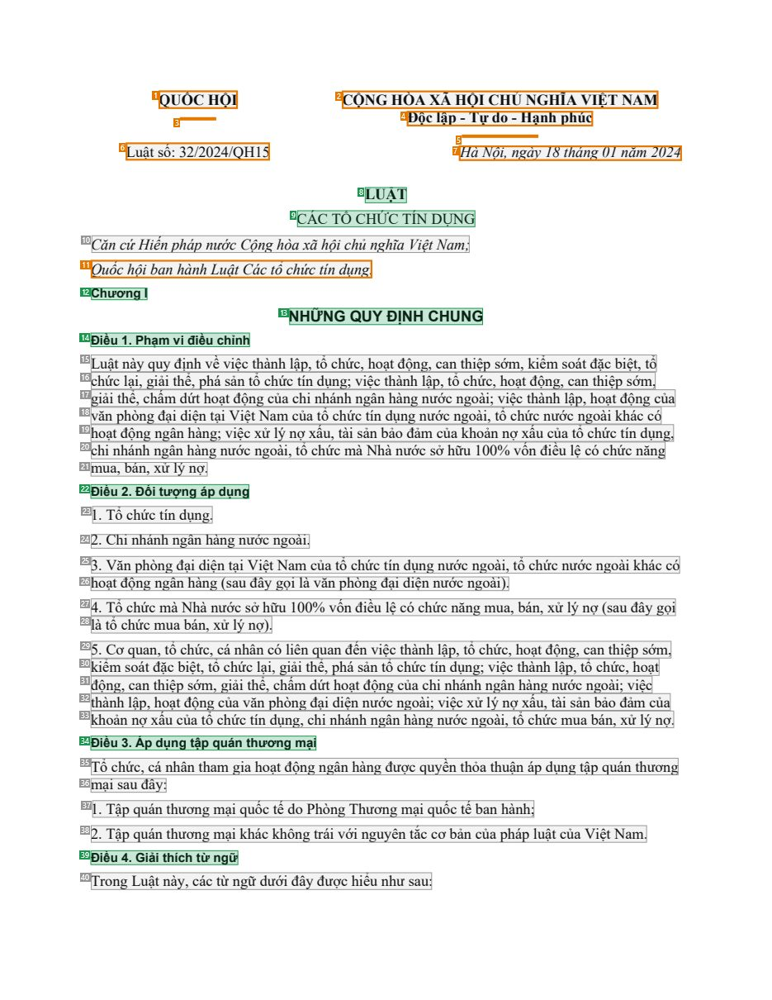
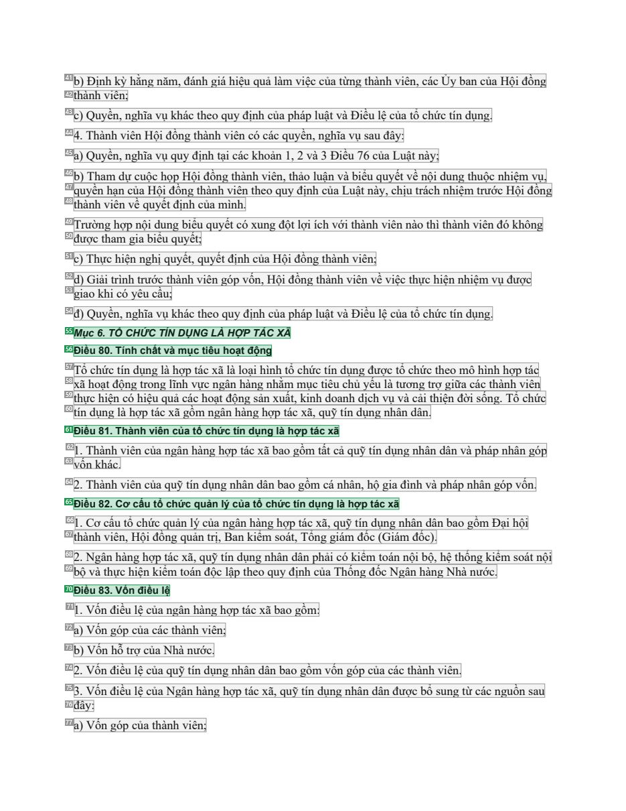
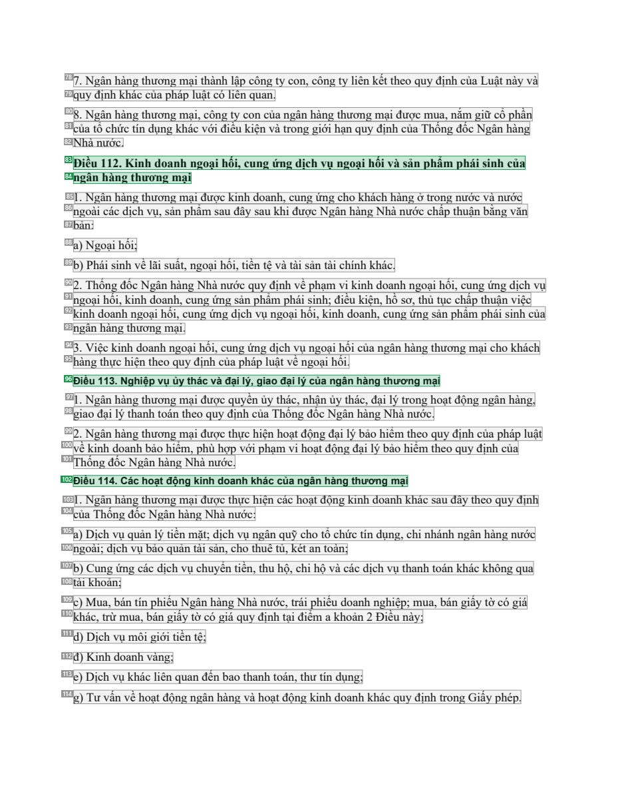

# 015 — `todo10_8/heading_corpus_100/01_phap_quy/015_Luat_Cac_to_chuc_tin_dung_32-2024-QH15.pdf`

Draft `P7_F1Q_HELDOUT_GOLD_DRAFT_V6`, status `DRAFT_USER_REVIEWED_NOT_APPROVED`, draft sha256 `dc86396dd9bf7a2829783bb3c0a1bf5e2e691ed5f613a5020e0c4d501d4e3f84`. Source sha256 `3b65217f835653754346d5a348cca13b2dc43396c089e9da443b05f58de9cc32`. [Back to index](README.md)

Approve or correct with `review-apply` lines: `APPROVE 015 by <reviewer> [because <note>]`, `015 <alias> -> E|R|O because <reason>`.

## Page 1 (FIRST)

| # | alias | text | font | draft | flag | rationale |
|---:|---|---|---|---|---|---|
| 1 | L0000:S0 | QUỐC HỘI | 12 B | **OTHER** | REVIEW_FOCUS | Issuer QUỐC HỘI (letterhead) |
| 2 | L0000:S1 | CỘNG H&#210;A X&#195; HỘI CHỦ NGHĨA VIỆT NAM | 12 B | **OTHER** | REVIEW_FOCUS | National name (letterhead) |
| 3 | L0001:S0 | ------- | 12 B | **OTHER** | REVIEW_FOCUS | Separator |
| 4 | L0001:S1 | Độc lập - Tự do - Hạnh ph&#250;c | 12 B | **OTHER** | REVIEW_FOCUS | National motto |
| 5 | L0002:S0 | --------------- | 12 B | **OTHER** | REVIEW_FOCUS | Separator |
| 6 | L0003:S0 | Luật số: 32/2024/QH15 | 12 | **OTHER** | REVIEW_FOCUS | Law number |
| 7 | L0003:S1 | H&#224; Nội, ng&#224;y 18 th&#225;ng 01 năm 2024 | 12 I | **OTHER** | REVIEW_FOCUS | Place and date |
| 8 | L0004:S0 | LUẬT | 12 B | **ESTABLISHES** |  | Document type title LUẬT |
| 9 | L0005:S0 | C&#193;C TỔ CHỨC T&#205;N DỤNG | 12 | **ESTABLISHES** |  | Document title C&#193;C TỔ CHỨC T&#205;N DỤNG (regular weight, centred under LUẬT) |
| 10 | L0006:S0 | Căn cứHiến ph&#225;p nước Cộng h&#242;a x&#227; hội chủ nghĩa Việt Nam; | 12 I | **OTHER** |  | Default: body text, list item, table cell, page number or other non-heading content on this page |
| 11 | L0007:S0 | Quốc hội ban h&#224;nh Luật C&#225;c tổ chức t&#237;n dụng. | 12 I | **OTHER** | REVIEW_FOCUS | Enactment formula (prose) |
| 12 | L0008:S0 | Chương I | 10 B | **ESTABLISHES** |  | Chapter label &quot;Chương I&quot; |
| 13 | L0009:S0 | NHỮNG QUY ĐỊNH CHUNG | 12 B | **ESTABLISHES** |  | Chapter title NHỮNG QUY ĐỊNH CHUNG |
| 14 | L0010:S0 | Điều 1 . Phạm vi điều chỉnh | 10 B | **ESTABLISHES** |  | Article heading &quot;Điều 1. Phạm vi điều chỉnh&quot; |
| 15 | L0011:S0 | Luật n&#224;y quy định về việc th&#224;nh lập, tổ chức, hoạt động, can thiệp sớm, kiểm so&#225;t đặc biệt, tổ | 12 | **OTHER** |  | Default: body text, list item, table cell, page number or other non-heading content on this page |
| 16 | L0012:S0 | chức lại, giải thể, ph&#225; sản tổ chức t&#237;n dụng; việc th&#224;nh lập, tổ chức, hoạt động, can thiệp sớm, | 12 | **OTHER** |  | Default: body text, list item, table cell, page number or other non-heading content on this page |
| 17 | L0013:S0 | giải thể, chấm dứt hoạt động của chi nh&#225;nh ng&#226;n h&#224;ng nước ngo&#224;i; việc th&#224;nh lập, hoạt động của | 12 | **OTHER** |  | Default: body text, list item, table cell, page number or other non-heading content on this page |
| 18 | L0014:S0 | văn ph&#242;ng đại diện tại Việt Nam của tổ chức t&#237;n dụng nước ngo&#224;i, tổ chức nước ngo&#224;i kh&#225;c c&#243… | 12 | **OTHER** |  | Default: body text, list item, table cell, page number or other non-heading content on this page |
| 19 | L0015:S0 | hoạt động ng&#226;n h&#224;ng; việc xử l&#253; nợ xấu, t&#224;i sản bảo đảm của khoản nợ xấu của tổ chức t&#237;n dụng, | 12 | **OTHER** |  | Default: body text, list item, table cell, page number or other non-heading content on this page |
| 20 | L0016:S0 | chi nh&#225;nh ng&#226;n h&#224;ng nước ngo&#224;i, tổ chức m&#224; Nh&#224; nước sở hữu 100% vốn điều lệ c&#243; chức n… | 12 | **OTHER** |  | Default: body text, list item, table cell, page number or other non-heading content on this page |
| 21 | L0017:S0 | mua, b&#225;n, xử l&#253; nợ. | 12 | **OTHER** |  | Default: body text, list item, table cell, page number or other non-heading content on this page |
| 22 | L0018:S0 | Điều 2. Đối tượng &#225;p dụng | 10 B | **ESTABLISHES** |  | Article heading &quot;Điều 2. Đối tượng &#225;p dụng&quot; |
| 23 | L0019:S0 | 1 . Tổ chức t&#237;n dụng. | 12 | **OTHER** |  | Default: body text, list item, table cell, page number or other non-heading content on this page |
| 24 | L0020:S0 | 2. Chi nh&#225;nh ng&#226;n h&#224;ng nước ngo&#224;i. | 12 | **OTHER** |  | Default: body text, list item, table cell, page number or other non-heading content on this page |
| 25 | L0021:S0 | 3. Văn ph&#242;ng đại diện tại Việt Nam của tổ chức t&#237;n dụng nước ngo&#224;i, tổ chức nước ngo&#224;i kh&#225;c c&#… | 12 | **OTHER** |  | Default: body text, list item, table cell, page number or other non-heading content on this page |
| 26 | L0022:S0 | hoạt động ng&#226;n h&#224;ng (sau đ&#226;y gọi l&#224; văn ph&#242;ng đại diện nước ngo&#224;i). | 12 | **OTHER** |  | Default: body text, list item, table cell, page number or other non-heading content on this page |
| 27 | L0023:S0 | 4. Tổ chức m&#224; Nh&#224; nước sở hữu 100% vốn điều lệ c&#243; chức năng mua, b&#225;n, xử l&#253; nợ (sau đ&#226;y gọ… | 12 | **OTHER** |  | Default: body text, list item, table cell, page number or other non-heading content on this page |
| 28 | L0024:S0 | l&#224; tổ chức mua b&#225;n, xử l&#253; nợ). | 12 | **OTHER** |  | Default: body text, list item, table cell, page number or other non-heading content on this page |
| 29 | L0025:S0 | 5. Cơ quan, tổ chức, c&#225; nh&#226;n c&#243; li&#234;n quan đến việc th&#224;nh lập, tổ chức, hoạt động, can thiệp sớm… | 12 | **OTHER** |  | Default: body text, list item, table cell, page number or other non-heading content on this page |
| 30 | L0026:S0 | kiểm so&#225;t đặc biệt, tổ chức lại, giải thể, ph&#225; sản tổ chức t&#237;n dụng; việc th&#224;nh lập, tổ chức, hoạt | 12 | **OTHER** |  | Default: body text, list item, table cell, page number or other non-heading content on this page |
| 31 | L0027:S0 | động, can thiệp sớm, giải thể, chấm dứt hoạt động của chi nh&#225;nh ng&#226;n h&#224;ng nước ngo&#224;i; việc | 12 | **OTHER** |  | Default: body text, list item, table cell, page number or other non-heading content on this page |
| 32 | L0028:S0 | th&#224;nh lập, hoạt động của văn ph&#242;ng đại diện nước ngo&#224;i; việc xử l&#253; nợ xấu, t&#224;i sản bảo đảm của | 12 | **OTHER** |  | Default: body text, list item, table cell, page number or other non-heading content on this page |
| 33 | L0029:S0 | khoản nợ xấu của tổ chức t&#237;n dụng, chi nh&#225;nh ng&#226;n h&#224;ng nước ngo&#224;i, tổ chức mua b&#225;n, xử l&#… | 12 | **OTHER** |  | Default: body text, list item, table cell, page number or other non-heading content on this page |
| 34 | L0030:S0 | Điều 3. &#193;p dụng tập qu&#225;n thương mại | 10 B | **ESTABLISHES** |  | Article heading &quot;Điều 3. ...&quot; |
| 35 | L0031:S0 | Tổ chức, c&#225; nh&#226;n tham gia hoạt động ng&#226;n h&#224;ng được quyền thỏa thuận &#225;p dụng tập qu&#225;n thươn… | 12 | **OTHER** |  | Default: body text, list item, table cell, page number or other non-heading content on this page |
| 36 | L0032:S0 | mại sau đ&#226;y: | 12 | **OTHER** |  | Default: body text, list item, table cell, page number or other non-heading content on this page |
| 37 | L0033:S0 | 1 . Tập qu&#225;n thương mại quốc tế do Ph&#242;ng Thương mại quốc tế ban h&#224;nh; | 12 | **OTHER** |  | Default: body text, list item, table cell, page number or other non-heading content on this page |
| 38 | L0034:S0 | 2. Tập qu&#225;n thương mại kh&#225;c kh&#244;ng tr&#225;i với nguy&#234;n tắc cơ bản của ph&#225;p luật của Việt Nam. | 12 | **OTHER** |  | Default: body text, list item, table cell, page number or other non-heading content on this page |
| 39 | L0035:S0 | Điều 4. Giải th&#237;ch từ ngữ | 10 B | **ESTABLISHES** |  | Article heading &quot;Điều 4. Giải th&#237;ch từ ngữ&quot; |
| 40 | L0036:S0 | Trong Luật n&#224;y, c&#225;c từ ngữ dưới đ&#226;y được hiểu như sau: | 12 | **OTHER** |  | Default: body text, list item, table cell, page number or other non-heading content on this page |

**OTHER rows to check for a missed heading on page 1** (body size 12pt; bold or ≥ body+1pt, ≤ 12 words): #1 `L0000:S0` QUỐC HỘI (12 B), #2 `L0000:S1` CỘNG H&#210;A X&#195; HỘI CHỦ NGHĨA VIỆT NAM (12 B), #3 `L0001:S0` ------- (12 B), #4 `L0001:S1` Độc lập - Tự do - Hạnh ph&#250;c (12 B), #5 `L0002:S0` --------------- (12 B).

## Page 44 (SEEDED_INTERIOR)

| # | alias | text | font | draft | flag | rationale |
|---:|---|---|---|---|---|---|
| 41 | L1674:S0 | b) Định kỳ hằng năm, đ&#225;nh gi&#225; hiệu quả l&#224;m việc của từng th&#224;nh vi&#234;n, c&#225;c Ủy ban của Hội đồ… | 12 | **OTHER** |  | Default: body text, list item, table cell, page number or other non-heading content on this page |
| 42 | L1675:S0 | th&#224;nh vi&#234;n; | 12 | **OTHER** |  | Default: body text, list item, table cell, page number or other non-heading content on this page |
| 43 | L1676:S0 | c) Quyền, nghĩa vụ kh&#225;c theo quy định của ph&#225;p luật v&#224; Điều lệ của tổ chức t&#237;n dụng. | 12 | **OTHER** |  | Default: body text, list item, table cell, page number or other non-heading content on this page |
| 44 | L1677:S0 | 4. Th&#224;nh vi&#234;n Hội đồng th&#224;nh vi&#234;n c&#243; c&#225;c quyền, nghĩa vụ sau đ&#226;y: | 12 | **OTHER** |  | Default: body text, list item, table cell, page number or other non-heading content on this page |
| 45 | L1678:S0 | a) Quyền, nghĩa vụ quy định tại c&#225;c khoản 1, 2 v&#224; 3 Điều 76 của Luật n&#224;y; | 12 | **OTHER** |  | Default: body text, list item, table cell, page number or other non-heading content on this page |
| 46 | L1679:S0 | b) Tham dự cuộc họp Hội đồng th&#224;nh vi&#234;n, thảo luận v&#224; biểu quyết về nội dung thuộc nhiệm vụ, | 12 | **OTHER** |  | Default: body text, list item, table cell, page number or other non-heading content on this page |
| 47 | L1680:S0 | quyền hạn của Hội đồng th&#224;nh vi&#234;n theo quy định của Luật n&#224;y, chịu tr&#225;ch nhiệm trước Hội đồng | 12 | **OTHER** |  | Default: body text, list item, table cell, page number or other non-heading content on this page |
| 48 | L1681:S0 | th&#224;nh vi&#234;n về quyết định của m&#236;nh. | 12 | **OTHER** |  | Default: body text, list item, table cell, page number or other non-heading content on this page |
| 49 | L1682:S0 | Trường hợp nội dung biểu quyết c&#243; xung đột lợi &#237;ch với th&#224;nh vi&#234;n n&#224;o th&#236; th&#224;nh vi&#2… | 12 | **OTHER** |  | Default: body text, list item, table cell, page number or other non-heading content on this page |
| 50 | L1683:S0 | được tham gia biểu quyết; | 12 | **OTHER** |  | Default: body text, list item, table cell, page number or other non-heading content on this page |
| 51 | L1684:S0 | c) Thực hiện nghị quyết, quyết định của Hội đồng th&#224;nh vi&#234;n; | 12 | **OTHER** |  | Default: body text, list item, table cell, page number or other non-heading content on this page |
| 52 | L1685:S0 | d) Giải tr&#236;nh trước th&#224;nh vi&#234;n g&#243;p vốn, Hội đồng th&#224;nh vi&#234;n về việc thực hiện nhiệm vụ đượ… | 12 | **OTHER** |  | Default: body text, list item, table cell, page number or other non-heading content on this page |
| 53 | L1686:S0 | giao khi c&#243; y&#234;u cầu; | 12 | **OTHER** |  | Default: body text, list item, table cell, page number or other non-heading content on this page |
| 54 | L1687:S0 | đ) Quyền, nghĩa vụ kh&#225;c theo quy định của ph&#225;p luật v&#224; Điều lệ của tổ chức t&#237;n dụng. | 12 | **OTHER** |  | Default: body text, list item, table cell, page number or other non-heading content on this page |
| 55 | L1688:S0 | Mục 6. TỔ CHỨC T&#205;N DỤNG L&#192; HỢP T&#193;C X&#195; | 10 B I | **ESTABLISHES** |  | Section heading &quot;Mục 6. TỔ CHỨC T&#205;N DỤNG L&#192; HỢP T&#193;C X&#195;&quot; |
| 56 | L1689:S0 | Điều 80. T&#237;nh chất v&#224; mục ti&#234;u hoạt động | 10 B | **ESTABLISHES** |  | Article heading &quot;Điều 80. ...&quot; |
| 57 | L1690:S0 | Tổ chức t&#237;n dụng l&#224; hợp t&#225;c x&#227; l&#224; loại h&#236;nh tổ chức t&#237;n dụng được tổ chức theo m&#244… | 12 | **OTHER** |  | Default: body text, list item, table cell, page number or other non-heading content on this page |
| 58 | L1691:S0 | x&#227; hoạt động trong lĩnh vực ng&#226;n h&#224;ng nhằm mục ti&#234;u chủ yếu l&#224; tương trợ giữa c&#225;c th&#224;… | 12 | **OTHER** |  | Default: body text, list item, table cell, page number or other non-heading content on this page |
| 59 | L1692:S0 | thực hiện c&#243; hiệu quả c&#225;c hoạt động sản xuất, kinh doanh dịch vụ v&#224; cải thiện đời sống. Tổ chức | 12 | **OTHER** |  | Default: body text, list item, table cell, page number or other non-heading content on this page |
| 60 | L1693:S0 | t&#237;n dụng l&#224; hợp t&#225;c x&#227; gồm ng&#226;n h&#224;ng hợp t&#225;c x&#227;, quỹ t&#237;n dụng nh&#226;n d&#… | 12 | **OTHER** |  | Default: body text, list item, table cell, page number or other non-heading content on this page |
| 61 | L1694:S0 | Điều 81 . Th&#224;nh vi&#234;n của tổ chức t&#237;n dụng l&#224; hợp t&#225;c x&#227; | 10 B | **ESTABLISHES** |  | Article heading &quot;Điều 81. ...&quot; |
| 62 | L1695:S0 | 1 . Th&#224;nh vi&#234;n của ng&#226;n h&#224;ng hợp t&#225;c x&#227; bao gồm tất cả quỹ t&#237;n dụng nh&#226;n d&#226;… | 12 | **OTHER** |  | Default: body text, list item, table cell, page number or other non-heading content on this page |
| 63 | L1696:S0 | vốn kh&#225;c. | 12 | **OTHER** |  | Default: body text, list item, table cell, page number or other non-heading content on this page |
| 64 | L1697:S0 | 2. Th&#224;nh vi&#234;n của quỹ t&#237;n dụng nh&#226;n d&#226;n bao gồm c&#225; nh&#226;n, hộ gia đ&#236;nh v&#224; ph&… | 12 | **OTHER** |  | Default: body text, list item, table cell, page number or other non-heading content on this page |
| 65 | L1698:S0 | Điều 82. Cơ cấu tổ chức quản l&#253; của tổ chức t&#237;n dụng l&#224; hợp t&#225;c x&#227; | 10 B | **ESTABLISHES** |  | Article heading &quot;Điều 82. ...&quot; |
| 66 | L1699:S0 | 1 . Cơ cấu tổ chức quản l&#253; của ng&#226;n h&#224;ng hợp t&#225;c x&#227;, quỹ t&#237;n dụng nh&#226;n d&#226;n bao g… | 12 | **OTHER** |  | Default: body text, list item, table cell, page number or other non-heading content on this page |
| 67 | L1700:S0 | th&#224;nh vi&#234;n, Hội đồng quản trị, Ban kiểm so&#225;t, Tổng gi&#225;m đốc (Gi&#225;m đốc). | 12 | **OTHER** |  | Default: body text, list item, table cell, page number or other non-heading content on this page |
| 68 | L1701:S0 | 2. Ng&#226;n h&#224;ng hợp t&#225;c x&#227;, quỹ t&#237;n dụng nh&#226;n d&#226;n phải c&#243; kiểm to&#225;n nội bộ, hệ… | 12 | **OTHER** |  | Default: body text, list item, table cell, page number or other non-heading content on this page |
| 69 | L1702:S0 | bộ v&#224; thực hiện kiểm to&#225;n độc lập theo quy định của Thống đốc Ng&#226;n h&#224;ng Nh&#224; nước. | 12 | **OTHER** |  | Default: body text, list item, table cell, page number or other non-heading content on this page |
| 70 | L1703:S0 | Điều 83. Vốn điều lệ | 10 B | **ESTABLISHES** |  | Article heading &quot;Điều 83. Vốn điều lệ&quot; |
| 71 | L1704:S0 | 1 . Vốn điều lệ của ng&#226;n h&#224;ng hợp t&#225;c x&#227; bao gồm: | 12 | **OTHER** |  | Default: body text, list item, table cell, page number or other non-heading content on this page |
| 72 | L1705:S0 | a) Vốn g&#243;p của c&#225;c th&#224;nh vi&#234;n; | 12 | **OTHER** |  | Default: body text, list item, table cell, page number or other non-heading content on this page |
| 73 | L1706:S0 | b) Vốn hỗ trợ của Nh&#224; nước. | 12 | **OTHER** |  | Default: body text, list item, table cell, page number or other non-heading content on this page |
| 74 | L1707:S0 | 2. Vốn điều lệ của quỹ t&#237;n dụng nh&#226;n d&#226;n bao gồm vốn g&#243;p của c&#225;c th&#224;nh vi&#234;n. | 12 | **OTHER** |  | Default: body text, list item, table cell, page number or other non-heading content on this page |
| 75 | L1708:S0 | 3. Vốn điều lệ của Ng&#226;n h&#224;ng hợp t&#225;c x&#227;, quỹ t&#237;n dụng nh&#226;n d&#226;n được bổ sung từ c&#225… | 12 | **OTHER** |  | Default: body text, list item, table cell, page number or other non-heading content on this page |
| 76 | L1709:S0 | đ&#226;y: | 12 | **OTHER** |  | Default: body text, list item, table cell, page number or other non-heading content on this page |
| 77 | L1710:S0 | a) Vốn g&#243;p của th&#224;nh vi&#234;n; | 12 | **OTHER** |  | Default: body text, list item, table cell, page number or other non-heading content on this page |

**OTHER rows to check for a missed heading on page 44** (body size 12pt; bold or ≥ body+1pt, ≤ 12 words): none.

## Page 58 (SEEDED_INTERIOR)

| # | alias | text | font | draft | flag | rationale |
|---:|---|---|---|---|---|---|
| 78 | L2214:S0 | 7. Ng&#226;n h&#224;ng thương mại th&#224;nh lập c&#244;ng ty con, c&#244;ng ty li&#234;n kết theo quy định của Luật n&#… | 12 | **OTHER** |  | Default: body text, list item, table cell, page number or other non-heading content on this page |
| 79 | L2215:S0 | quy định kh&#225;c của ph&#225;p luật c&#243; li&#234;n quan. | 12 | **OTHER** |  | Default: body text, list item, table cell, page number or other non-heading content on this page |
| 80 | L2216:S0 | 8. Ng&#226;n h&#224;ng thương mại, c&#244;ng ty con của ng&#226;n h&#224;ng thương mại được mua, nắm giữ cổ phần | 12 | **OTHER** |  | Default: body text, list item, table cell, page number or other non-heading content on this page |
| 81 | L2217:S0 | của tổ chức t&#237;n dụng kh&#225;c với điều kiện v&#224; trong giới hạn quy định của Thống đốc Ng&#226;n h&#224;ng | 12 | **OTHER** |  | Default: body text, list item, table cell, page number or other non-heading content on this page |
| 82 | L2218:S0 | Nh&#224; nước. | 12 | **OTHER** |  | Default: body text, list item, table cell, page number or other non-heading content on this page |
| 83 | L2219:S0 | Điều 112. Kinh doanh ngoại hối, cung ứng dịch vụ ngoại hối v&#224; sản phẩm ph&#225;i sinh của | 12 B | **ESTABLISHES** |  | Article heading &quot;Điều 112. ...&quot; (line 1) |
| 84 | L2220:S0 | ng&#226;n h&#224;ng thương mại | 12 B | **ESTABLISHES** |  | Article heading &quot;Điều 112. ...&quot; (line 2, title continuation) |
| 85 | L2221:S0 | 1 . Ng&#226;n h&#224;ng thương mại được kinh doanh, cung ứng cho kh&#225;ch h&#224;ng ở trong nước v&#224; nước | 12 | **OTHER** |  | Default: body text, list item, table cell, page number or other non-heading content on this page |
| 86 | L2222:S0 | ngo&#224;i c&#225;c dịch vụ, sản phẩm sau đ&#226;y sau khi được Ng&#226;n h&#224;ng Nh&#224; nước chấp thuận bằng văn | 12 | **OTHER** |  | Default: body text, list item, table cell, page number or other non-heading content on this page |
| 87 | L2223:S0 | bản: | 12 | **OTHER** |  | Default: body text, list item, table cell, page number or other non-heading content on this page |
| 88 | L2224:S0 | a) Ngoại hối; | 12 | **OTHER** |  | Default: body text, list item, table cell, page number or other non-heading content on this page |
| 89 | L2225:S0 | b) Ph&#225;i sinh về l&#227;i suất, ngoại hối, tiền tệ v&#224; t&#224;i sản t&#224;i ch&#237;nh kh&#225;c. | 12 | **OTHER** |  | Default: body text, list item, table cell, page number or other non-heading content on this page |
| 90 | L2226:S0 | 2. Thống đốc Ng&#226;n h&#224;ng Nh&#224; nước quy định về phạm vi kinh doanh ngoại hối, cung ứng dịch vụ | 12 | **OTHER** |  | Default: body text, list item, table cell, page number or other non-heading content on this page |
| 91 | L2227:S0 | ngoại hối, kinh doanh, cung ứng sản phẩm ph&#225;i sinh; điều kiện, hồ sơ, thủ tục chấp thuận việc | 12 | **OTHER** |  | Default: body text, list item, table cell, page number or other non-heading content on this page |
| 92 | L2228:S0 | kinh doanh ngoại hối, cung ứng dịch vụ ngoại hối, kinh doanh, cung ứng sản phẩm ph&#225;i sinh của | 12 | **OTHER** |  | Default: body text, list item, table cell, page number or other non-heading content on this page |
| 93 | L2229:S0 | ng&#226;n h&#224;ng thương mại. | 12 | **OTHER** |  | Default: body text, list item, table cell, page number or other non-heading content on this page |
| 94 | L2230:S0 | 3. Việc kinh doanh ngoại hối, cung ứng dịch vụ ngoại hối của ng&#226;n h&#224;ng thương mại cho kh&#225;ch | 12 | **OTHER** |  | Default: body text, list item, table cell, page number or other non-heading content on this page |
| 95 | L2231:S0 | h&#224;ng thực hiện theo quy định của ph&#225;p luật về ngoại hối. | 12 | **OTHER** |  | Default: body text, list item, table cell, page number or other non-heading content on this page |
| 96 | L2232:S0 | Điều 1 1 3. Nghiệp vụ ủy th&#225;c v&#224; đại l&#253;, giao đại l&#253; của ng&#226;n h&#224;ng thương mại | 10 B | **ESTABLISHES** |  | Article heading &quot;Điều 113. ...&quot; |
| 97 | L2233:S0 | 1 . Ng&#226;n h&#224;ng thương mại được quyền ủy th&#225;c, nhận ủy th&#225;c, đại l&#253; trong hoạt động ng&#226;n h&#… | 12 | **OTHER** |  | Default: body text, list item, table cell, page number or other non-heading content on this page |
| 98 | L2234:S0 | giao đại l&#253; thanh to&#225;n theo quy định của Thống đốc Ng&#226;n h&#224;ng Nh&#224; nước. | 12 | **OTHER** |  | Default: body text, list item, table cell, page number or other non-heading content on this page |
| 99 | L2235:S0 | 2. Ng&#226;n h&#224;ng thương mại được thực hiện hoạt động đại l&#253; bảo hiểm theo quy định của ph&#225;p luật | 12 | **OTHER** |  | Default: body text, list item, table cell, page number or other non-heading content on this page |
| 100 | L2236:S0 | về kinh doanh bảo hiểm, ph&#249; hợp với phạm vi hoạt động đại l&#253; bảo hiểm theo quy định của | 12 | **OTHER** |  | Default: body text, list item, table cell, page number or other non-heading content on this page |
| 101 | L2237:S0 | Thống đốc Ng&#226;n h&#224;ng Nh&#224; nước. | 12 | **OTHER** |  | Default: body text, list item, table cell, page number or other non-heading content on this page |
| 102 | L2238:S0 | Điều 1 14. C&#225;c hoạt động kinh doanh kh&#225;c của ng&#226;n h&#224;ng thương mại | 10 B | **ESTABLISHES** |  | Article heading &quot;Điều 114. ...&quot; |
| 103 | L2239:S0 | 1 . Ng&#226;n h&#224;ng thương mại được thực hiện c&#225;c hoạt động kinh doanh kh&#225;c sau đ&#226;y theo quy định | 12 | **OTHER** |  | Default: body text, list item, table cell, page number or other non-heading content on this page |
| 104 | L2240:S0 | của Thống đốc Ng&#226;n h&#224;ng Nh&#224; nước: | 12 | **OTHER** |  | Default: body text, list item, table cell, page number or other non-heading content on this page |
| 105 | L2241:S0 | a) Dịch vụ quản l&#253; tiền mặt; dịch vụ ng&#226;n quỹ cho tổ chức t&#237;n dụng, chi nh&#225;nh ng&#226;n h&#224;ng nư… | 12 | **OTHER** |  | Default: body text, list item, table cell, page number or other non-heading content on this page |
| 106 | L2242:S0 | ngo&#224;i; dịch vụ bảo quản t&#224;i sản, cho thu&#234; tủ, k&#233;t an to&#224;n; | 12 | **OTHER** |  | Default: body text, list item, table cell, page number or other non-heading content on this page |
| 107 | L2243:S0 | b) Cung ứng c&#225;c dịch vụ chuyển tiền, thu hộ, chi hộ v&#224; c&#225;c dịch vụ thanh to&#225;n kh&#225;c kh&#244;ng q… | 12 | **OTHER** |  | Default: body text, list item, table cell, page number or other non-heading content on this page |
| 108 | L2244:S0 | t&#224;i khoản; | 12 | **OTHER** |  | Default: body text, list item, table cell, page number or other non-heading content on this page |
| 109 | L2245:S0 | c) Mua, b&#225;n t&#237;n phiếu Ng&#226;n h&#224;ng Nh&#224; nước, tr&#225;i phiếu doanh nghiệp; mua, b&#225;n giấy tờ c… | 12 | **OTHER** |  | Default: body text, list item, table cell, page number or other non-heading content on this page |
| 110 | L2246:S0 | kh&#225;c, trừ mua, b&#225;n giấy tờ c&#243; gi&#225; quy định tại điểm a khoản 2 Điều n&#224;y; | 12 | **OTHER** |  | Default: body text, list item, table cell, page number or other non-heading content on this page |
| 111 | L2247:S0 | d) Dịch vụ m&#244;i giới tiền tệ; | 12 | **OTHER** |  | Default: body text, list item, table cell, page number or other non-heading content on this page |
| 112 | L2248:S0 | đ) Kinh doanh v&#224;ng; | 12 | **OTHER** |  | Default: body text, list item, table cell, page number or other non-heading content on this page |
| 113 | L2249:S0 | e) Dịch vụ kh&#225;c li&#234;n quan đến bao thanh to&#225;n, thư t&#237;n dụng; | 12 | **OTHER** |  | Default: body text, list item, table cell, page number or other non-heading content on this page |
| 114 | L2250:S0 | g) Tư vấn về hoạt động ng&#226;n h&#224;ng v&#224; hoạt động kinh doanh kh&#225;c quy định trong Giấy ph&#233;p. | 12 | **OTHER** |  | Default: body text, list item, table cell, page number or other non-heading content on this page |

**OTHER rows to check for a missed heading on page 58** (body size 12pt; bold or ≥ body+1pt, ≤ 12 words): none.
