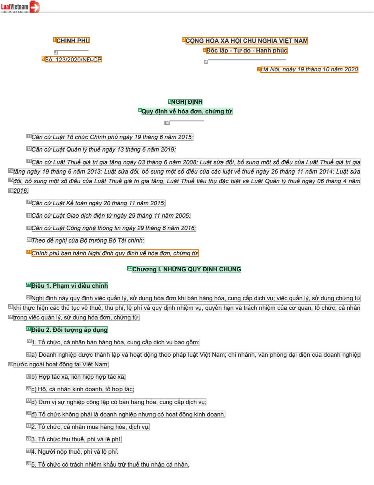
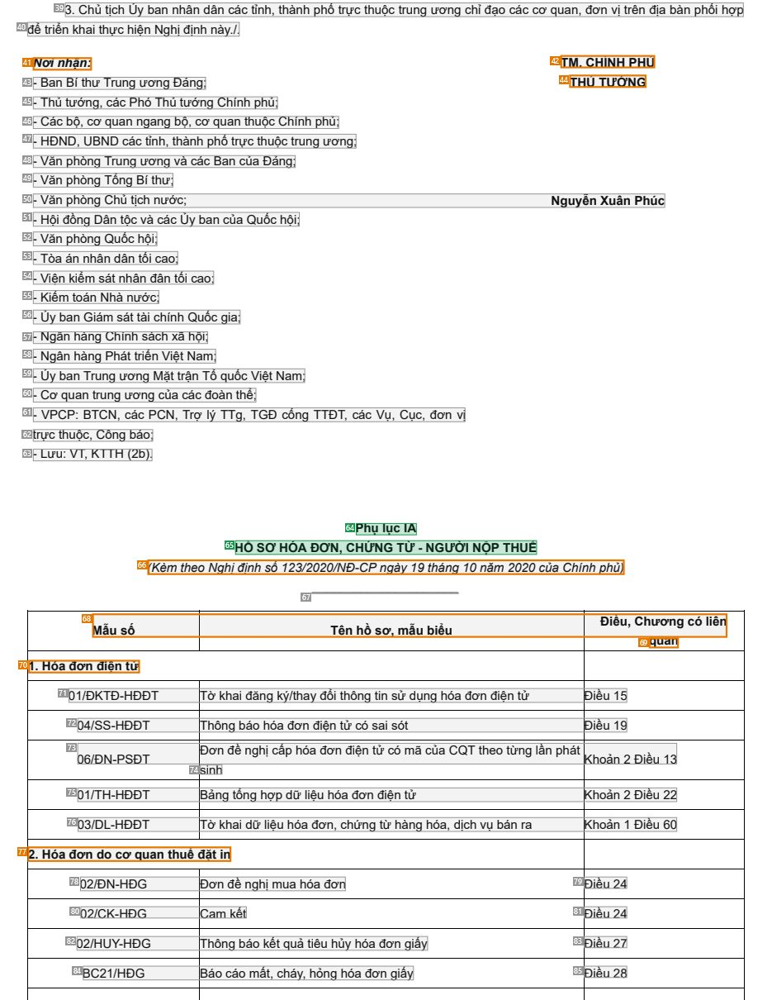
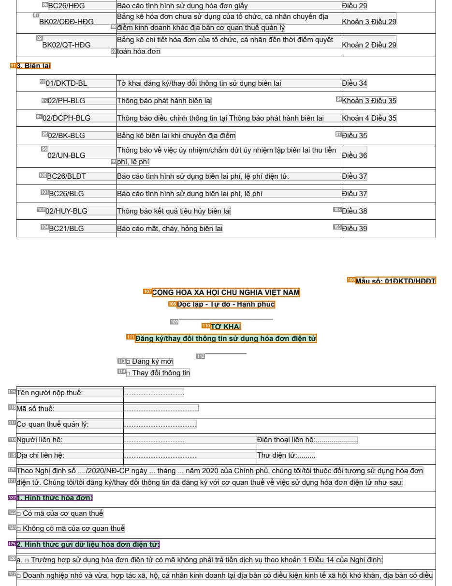
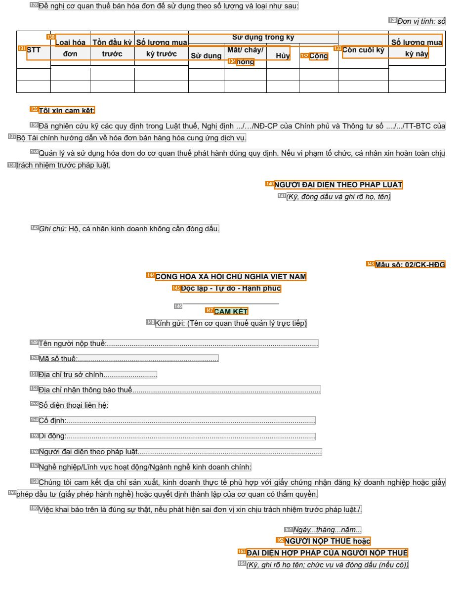

# 017 — `todo10_8/heading_corpus_100/01_phap_quy/017_ND_123-2020_Hoa_don_chung_tu.pdf`

Draft `P7_F1Q_HELDOUT_GOLD_DRAFT_V6`, status `DRAFT_USER_REVIEWED_NOT_APPROVED`, draft sha256 `bf34865f620f3292c22da06fd81999e29df5e07faf111d1ee765f56e5a6f37cb`. Source sha256 `cd567da7976beb9fea822c075fa147f5d4d16ba02c4b4c57eac05255a3ba1145`. [Back to index](README.md)

Approve or correct with `review-apply` lines: `APPROVE 017 by <reviewer> [because <note>]`, `017 <alias> -> E|R|O because <reason>`.

## Page 1 (FIRST)

| # | alias | text | font | draft | flag | rationale |
|---:|---|---|---|---|---|---|
| 1 | L0000:S0 | CH&#205;NHPHỦ | 9.9 B | **OTHER** | REVIEW_FOCUS | Issuer CH&#205;NH PHỦ (letterhead) |
| 2 | L0000:S1 | CỘNGH&#210;AX&#195;HỘICHỦNGHĨAVIỆTNAM | 9.9 B | **OTHER** | REVIEW_FOCUS | National name (letterhead) |
| 3 | L0001:S0 | _________ | 9.9 | **OTHER** |  | Default: body text, list item, table cell, page number or other non-heading content on this page |
| 4 | L0001:S1 | Độclập-Tựdo-Hạnhph&#250;c | 9.9 B | **OTHER** | REVIEW_FOCUS | National motto |
| 5 | L0002:S0 | Số: 123/2020/NĐ-CP | 9.9 | **OTHER** | REVIEW_FOCUS | Decree number |
| 6 | L0002:S1 | _______________________ | 9.9 | **OTHER** |  | Default: body text, list item, table cell, page number or other non-heading content on this page |
| 7 | L0003:S0 | H&#224;Nội,ng&#224;y19th&#225;ng10năm2020 | 9.9 I | **OTHER** | REVIEW_FOCUS | Place and date |
| 8 | L0004:S0 | NGHỊĐỊNH | 9.9 B | **ESTABLISHES** |  | Document type title NGHỊ ĐỊNH |
| 9 | L0005:S0 | Quyđịnhvềh&#243;ađơn,chứngtừ | 9.9 B | **ESTABLISHES** |  | Document title &quot;Quy định về h&#243;a đơn, chứng từ&quot; |
| 10 | L0006:S0 | __________ | 9.9 | **OTHER** |  | Default: body text, list item, table cell, page number or other non-heading content on this page |
| 11 | L0007:S0 | CăncứLuậtTổchứcCh&#237;nhphủng&#224;y19th&#225;ng6năm2015; | 9.9 I | **OTHER** |  | Default: body text, list item, table cell, page number or other non-heading content on this page |
| 12 | L0008:S0 | CăncứLuậtQuảnl&#253;thuếng&#224;y13th&#225;ng6năm2019; | 9.9 I | **OTHER** |  | Default: body text, list item, table cell, page number or other non-heading content on this page |
| 13 | L0009:S0 | CăncứLuậtThuếgi&#225;trịgiatăngng&#224;y03th&#225;ng6năm2008;Luậtsửađổi, bổsungmộtsốđiềucủaLuậtThuếgi&#225;trịgia | 9.9 I | **OTHER** |  | Default: body text, list item, table cell, page number or other non-heading content on this page |
| 14 | L0010:S0 | tăngng&#224;y19th&#225;ng6năm2013;Luậtsửađổi, bổsungmộtsốđiềucủac&#225;cluậtvềthuếng&#224;y26th&#225;ng 11 năm2014;Luậts… | 9.9 I | **OTHER** |  | Default: body text, list item, table cell, page number or other non-heading content on this page |
| 15 | L0011:S0 | đổi, bổsungmộtsốđiềucủaLuậtThuếgi&#225;trịgiatăng, LuậtThuếti&#234;uthụđặcbiệtv&#224;LuậtQuảnl&#253;thuếng&#224;y06th&#2… | 9.9 I | **OTHER** |  | Default: body text, list item, table cell, page number or other non-heading content on this page |
| 16 | L0012:S0 | 2016; | 9.9 I | **OTHER** |  | Default: body text, list item, table cell, page number or other non-heading content on this page |
| 17 | L0013:S0 | CăncứLuậtKếto&#225;nng&#224;y20th&#225;ng11năm2015; | 9.9 I | **OTHER** |  | Default: body text, list item, table cell, page number or other non-heading content on this page |
| 18 | L0014:S0 | CăncứLuậtGiaodịchđiệntửng&#224;y29th&#225;ng11năm2005; | 9.9 I | **OTHER** |  | Default: body text, list item, table cell, page number or other non-heading content on this page |
| 19 | L0015:S0 | CăncứLuậtC&#244;ngnghệth&#244;ngtinng&#224;y29th&#225;ng6năm2016; | 9.9 I | **OTHER** |  | Default: body text, list item, table cell, page number or other non-heading content on this page |
| 20 | L0016:S0 | TheođềnghịcủaBộtrưởngBộT&#224;ich&#237;nh; | 9.9 I | **OTHER** |  | Default: body text, list item, table cell, page number or other non-heading content on this page |
| 21 | L0017:S0 | Ch&#237;nhphủbanh&#224;nhNghịđịnhquyđịnhvềh&#243;ađơn, chứngtừ. | 9.9 I | **OTHER** | REVIEW_FOCUS | Enactment formula restating the title in prose |
| 22 | L0018:S0 | ChươngI.NHỮNGQUYĐỊNHCHUNG | 9.9 B | **ESTABLISHES** |  | Chapter heading &quot;Chương I. NHỮNG QUY ĐỊNH CHUNG&quot; |
| 23 | L0019:S0 | Điều1.Phạmviđiềuchỉnh | 9.9 B | **ESTABLISHES** |  | Article heading &quot;Điều 1. Phạm vi điều chỉnh&quot; |
| 24 | L0020:S0 | Nghịđịnhn&#224;yquyđịnhviệcquảnl&#253;,sửdụngh&#243;ađơnkhib&#225;nh&#224;ngh&#243;a,cungcấpdịchvụ;việcquảnl&#253;,sửdụn… | 9.9 | **OTHER** |  | Default: body text, list item, table cell, page number or other non-heading content on this page |
| 25 | L0021:S0 | khithựchiệnc&#225;cthủtụcvềthuế,thu ph&#237;, lệph&#237;v&#224;quyđịnh nhiệmvụ,quyền hạnv&#224;tr&#225;ch nhiệmcủacơquan… | 9.9 | **OTHER** |  | Default: body text, list item, table cell, page number or other non-heading content on this page |
| 26 | L0022:S0 | trongviệcquảnl&#253;,sửdụngh&#243;ađơn,chứngtừ. | 9.9 | **OTHER** |  | Default: body text, list item, table cell, page number or other non-heading content on this page |
| 27 | L0023:S0 | Điều2.Đốitượng&#225;pdụng | 9.9 B | **ESTABLISHES** |  | Article heading &quot;Điều 2. Đối tượng &#225;p dụng&quot; |
| 28 | L0024:S0 | 1.Tổchức,c&#225;nh&#226;nb&#225;nh&#224;ngh&#243;a,cungcấpdịchvụbaogồm: | 9.9 | **OTHER** |  | Default: body text, list item, table cell, page number or other non-heading content on this page |
| 29 | L0025:S0 | a)Doanh nghiệpđượcth&#224;nh lậpv&#224;hoạtđộngtheoph&#225;pluậtViệtNam; chi nh&#225;nh,văn ph&#242;ngđạidiệncủadoanh ng… | 9.9 | **OTHER** |  | Default: body text, list item, table cell, page number or other non-heading content on this page |
| 30 | L0026:S0 | nướcngo&#224;ihoạtđộngtạiViệtNam; | 9.9 | **OTHER** |  | Default: body text, list item, table cell, page number or other non-heading content on this page |
| 31 | L0027:S0 | b)Hợpt&#225;cx&#227;,li&#234;nhiệphợpt&#225;cx&#227;; | 9.9 | **OTHER** |  | Default: body text, list item, table cell, page number or other non-heading content on this page |
| 32 | L0028:S0 | c)Hộ,c&#225;nh&#226;nkinhdoanh,tổhợpt&#225;c; | 9.9 | **OTHER** |  | Default: body text, list item, table cell, page number or other non-heading content on this page |
| 33 | L0029:S0 | d)Đơnvịsựnghiệpc&#244;nglậpc&#243;b&#225;nh&#224;ngh&#243;a,cungcấpdịchvụ; | 9.9 | **OTHER** |  | Default: body text, list item, table cell, page number or other non-heading content on this page |
| 34 | L0030:S0 | đ)Tổchứckh&#244;ngphảil&#224;doanhnghiệpnhưngc&#243;hoạtđộngkinhdoanh. | 9.9 | **OTHER** |  | Default: body text, list item, table cell, page number or other non-heading content on this page |
| 35 | L0031:S0 | 2.Tổchức,c&#225;nh&#226;nmuah&#224;ngh&#243;a,dịchvụ. | 9.9 | **OTHER** |  | Default: body text, list item, table cell, page number or other non-heading content on this page |
| 36 | L0032:S0 | 3.Tổchứcthuthuế,ph&#237;v&#224;lệph&#237;. | 9.9 | **OTHER** |  | Default: body text, list item, table cell, page number or other non-heading content on this page |
| 37 | L0033:S0 | 4. Ngườinộpthuế,ph&#237;v&#224;lệph&#237;. | 9.9 | **OTHER** |  | Default: body text, list item, table cell, page number or other non-heading content on this page |
| 38 | L0034:S0 | 5.Tổchứcc&#243;tr&#225;chnhiệmkhấutrừthuếthunhậpc&#225;nh&#226;n. | 9.9 | **OTHER** |  | Default: body text, list item, table cell, page number or other non-heading content on this page |

**OTHER rows to check for a missed heading on page 1** (body size 10pt; bold or ≥ body+1pt, ≤ 12 words): #1 `L0000:S0` CH&#205;NHPHỦ (9.9 B), #2 `L0000:S1` CỘNGH&#210;AX&#195;HỘICHỦNGHĨAVIỆTNAM (9.9 B), #4 `L0001:S1` Độclập-Tựdo-Hạnhph&#250;c (9.9 B).

## Page 38 (SEEDED_INTERIOR)

| # | alias | text | font | draft | flag | rationale |
|---:|---|---|---|---|---|---|
| 39 | L1615:S0 | 3.Chủtịch Ủybannh&#226;nd&#226;nc&#225;ctỉnh,th&#224;nhphốtrựcthuộctrungươngchỉđạoc&#225;ccơquan,đơnvịtr&#234;nđịab&#224… | 9.9 | **OTHER** |  | Default: body text, list item, table cell, page number or other non-heading content on this page |
| 40 | L1616:S0 | đểtriểnkhaithựchiệnNghịđịnhn&#224;y./. | 9.9 | **OTHER** |  | Default: body text, list item, table cell, page number or other non-heading content on this page |
| 41 | L1617:S0 | Nơinhận: | 9.9 B I | **OTHER** | REVIEW_FOCUS | &quot;Nơi nhận:&quot; distribution list label |
| 42 | L1617:S1 | TM.CH&#205;NHPHỦ | 9.9 B | **OTHER** | REVIEW_FOCUS | Signature block &quot;TM. CH&#205;NH PHỦ&quot; |
| 43 | L1618:S0 | -BanB&#237;thưTrungươngĐảng; | 9.9 | **OTHER** |  | Default: body text, list item, table cell, page number or other non-heading content on this page |
| 44 | L1618:S1 | THỦTƯỚNG | 9.9 B | **OTHER** | REVIEW_FOCUS | Signature block &quot;THỦ TƯỚNG&quot; |
| 45 | L1619:S0 | -Thủtướng,c&#225;cPh&#243;ThủtướngCh&#237;nhphủ; | 9.9 | **OTHER** |  | Default: body text, list item, table cell, page number or other non-heading content on this page |
| 46 | L1620:S0 | -C&#225;cbộ,cơquanngangbộ,cơquanthuộcCh&#237;nhphủ; | 9.9 | **OTHER** |  | Default: body text, list item, table cell, page number or other non-heading content on this page |
| 47 | L1621:S0 | -HĐND, UBNDc&#225;ctỉnh,th&#224;nhphốtrựcthuộctrungương; | 9.9 | **OTHER** |  | Default: body text, list item, table cell, page number or other non-heading content on this page |
| 48 | L1622:S0 | -Vănph&#242;ngTrungươngv&#224;c&#225;cBancủaĐảng; | 9.9 | **OTHER** |  | Default: body text, list item, table cell, page number or other non-heading content on this page |
| 49 | L1623:S0 | -Vănph&#242;ngTổngB&#237;thư; | 9.9 | **OTHER** |  | Default: body text, list item, table cell, page number or other non-heading content on this page |
| 50 | L1624:S0 | -Vănph&#242;ngChủtịchnước; NguyễnXu&#226;nPh&#250;c | 9.9 | **OTHER** |  | Default: body text, list item, table cell, page number or other non-heading content on this page |
| 51 | L1625:S0 | -HộiđồngD&#226;ntộcv&#224;c&#225;cỦybancủaQuốchội; | 9.9 | **OTHER** |  | Default: body text, list item, table cell, page number or other non-heading content on this page |
| 52 | L1626:S0 | -Vănph&#242;ngQuốchội; | 9.9 | **OTHER** |  | Default: body text, list item, table cell, page number or other non-heading content on this page |
| 53 | L1627:S0 | -T&#242;a&#225;nnh&#226;nd&#226;ntốicao; | 9.9 | **OTHER** |  | Default: body text, list item, table cell, page number or other non-heading content on this page |
| 54 | L1628:S0 | -Việnkiểms&#225;tnh&#226;nđ&#226;ntốicao; | 9.9 | **OTHER** |  | Default: body text, list item, table cell, page number or other non-heading content on this page |
| 55 | L1629:S0 | -Kiểmto&#225;nNh&#224;nước; | 9.9 | **OTHER** |  | Default: body text, list item, table cell, page number or other non-heading content on this page |
| 56 | L1630:S0 | -ỦybanGi&#225;ms&#225;tt&#224;ich&#237;nhQuốcgia; | 9.9 | **OTHER** |  | Default: body text, list item, table cell, page number or other non-heading content on this page |
| 57 | L1631:S0 | -Ng&#226;nh&#224;ngCh&#237;nhs&#225;chx&#227;hội; | 9.9 | **OTHER** |  | Default: body text, list item, table cell, page number or other non-heading content on this page |
| 58 | L1632:S0 | -Ng&#226;nh&#224;ngPh&#225;ttriểnViệtNam; | 9.9 | **OTHER** |  | Default: body text, list item, table cell, page number or other non-heading content on this page |
| 59 | L1633:S0 | -ỦybanTrungươngMặttrậnTổquốcViệtNam; | 9.9 | **OTHER** |  | Default: body text, list item, table cell, page number or other non-heading content on this page |
| 60 | L1634:S0 | -Cơquantrungươngcủac&#225;cđo&#224;nthể; | 9.9 | **OTHER** |  | Default: body text, list item, table cell, page number or other non-heading content on this page |
| 61 | L1635:S0 | -VPCP: BTCN, c&#225;cPCN, Trợ l&#253;TTg, TGĐ cổng TTĐT, c&#225;cVụ, Cục, đơn vị | 9.9 | **OTHER** |  | Default: body text, list item, table cell, page number or other non-heading content on this page |
| 62 | L1636:S0 | trựcthuộc,C&#244;ngb&#225;o; | 9.9 | **OTHER** |  | Default: body text, list item, table cell, page number or other non-heading content on this page |
| 63 | L1637:S0 | -Lưu:VT, KTTH(2b). | 9.9 | **OTHER** |  | Default: body text, list item, table cell, page number or other non-heading content on this page |
| 64 | L1638:S0 | PhụlụcIA | 9.9 B | **ESTABLISHES** |  | Appendix label &quot;Phụ lục IA&quot; (bold, centred) |
| 65 | L1639:S0 | HỒSƠH&#211;AĐƠN,CHỨNGTỪ-NGƯỜINỘPTHUẾ | 9.9 B | **ESTABLISHES** |  | Appendix title (bold caps, centred) |
| 66 | L1640:S0 | (K&#232;mtheoNghịđịnhsố 123/2020/NĐ-CPng&#224;y19th&#225;ng10năm2020củaCh&#237;nhphủ) | 9.9 I | **OTHER** | REVIEW_FOCUS | Attachment note &quot;(K&#232;m theo Nghị định ...)&quot; under the appendix title |
| 67 | L1641:S0 | _____________________ | 9.9 I | **OTHER** |  | Default: body text, list item, table cell, page number or other non-heading content on this page |
| 68 | L1642:S0 | Mẫusố T&#234;nhồsơ,mẫubiểu Điều,Chươngc&#243;li&#234;n | 9.9 B | **OTHER** | REVIEW_FOCUS | Table column labels of the appendix list |
| 69 | L1643:S0 | quan | 9.9 B | **OTHER** | REVIEW_FOCUS | Table column label continuation |
| 70 | L1644:S0 | 1.H&#243;ađơnđiệntử | 9.9 B | **OTHER** | REVIEW_FOCUS | Group label &quot;1. H&#243;a đơn điện tử&quot; inside the appendix table (local list grouping) |
| 71 | L1645:S0 | 01/ĐKTĐ-HĐĐT Tờkhaiđăngk&#253;/thayđổith&#244;ngtinsửdụngh&#243;ađơnđiệntử Điều 15 | 9.9 | **OTHER** |  | Default: body text, list item, table cell, page number or other non-heading content on this page |
| 72 | L1646:S0 | 04/SS-HĐĐT Th&#244;ngb&#225;oh&#243;ađơnđiệntửc&#243;sais&#243;t Điều 19 | 9.9 | **OTHER** |  | Default: body text, list item, table cell, page number or other non-heading content on this page |
| 73 | L1647:S0 | 06/ĐN-PSĐT Đơnđềnghịcấph&#243;ađơnđiệntửc&#243;m&#227;củaCQTtheotừnglầnph&#225;tKhoản2Điều 13 | 9.9 | **OTHER** |  | Default: body text, list item, table cell, page number or other non-heading content on this page |
| 74 | L1648:S0 | sinh | 9.9 | **OTHER** |  | Default: body text, list item, table cell, page number or other non-heading content on this page |
| 75 | L1649:S0 | 01/TH-HĐĐT Bảngtổnghợpdữliệuh&#243;ađơnđiệntử Khoản2Điều22 | 9.9 | **OTHER** |  | Default: body text, list item, table cell, page number or other non-heading content on this page |
| 76 | L1650:S0 | 03/DL-HĐĐT Tờkhaidữliệuh&#243;ađơn,chứngtừh&#224;ngh&#243;a,dịchvụb&#225;nra Khoản 1 Điều60 | 9.9 | **OTHER** |  | Default: body text, list item, table cell, page number or other non-heading content on this page |
| 77 | L1651:S0 | 2.H&#243;ađơndocơquanthuếđặtin | 9.9 B | **OTHER** | REVIEW_FOCUS | Group label &quot;2. H&#243;a đơn do cơ quan thuế đặt in&quot; inside the appendix table |
| 78 | L1652:S0 | 02/ĐN-HĐG Đơnđềnghịmuah&#243;ađơn | 9.9 | **OTHER** |  | Default: body text, list item, table cell, page number or other non-heading content on this page |
| 79 | L1652:S1 | Điều24 | 9.9 | **OTHER** |  | Default: body text, list item, table cell, page number or other non-heading content on this page |
| 80 | L1653:S0 | 02/CK-HĐG Camkết | 9.9 | **OTHER** |  | Default: body text, list item, table cell, page number or other non-heading content on this page |
| 81 | L1653:S1 | Điều24 | 9.9 | **OTHER** |  | Default: body text, list item, table cell, page number or other non-heading content on this page |
| 82 | L1654:S0 | 02/HUY-HĐG Th&#244;ngb&#225;okếtquảti&#234;uhủyh&#243;ađơngiấy | 9.9 | **OTHER** |  | Default: body text, list item, table cell, page number or other non-heading content on this page |
| 83 | L1654:S1 | Điều27 | 9.9 | **OTHER** |  | Default: body text, list item, table cell, page number or other non-heading content on this page |
| 84 | L1655:S0 | BC21/HĐG B&#225;oc&#225;omất,ch&#225;y,hỏngh&#243;ađơngiấy | 9.9 | **OTHER** |  | Default: body text, list item, table cell, page number or other non-heading content on this page |
| 85 | L1655:S1 | Điều28 | 9.9 | **OTHER** |  | Default: body text, list item, table cell, page number or other non-heading content on this page |

**OTHER rows to check for a missed heading on page 38** (body size 10pt; bold or ≥ body+1pt, ≤ 12 words): #41 `L1617:S0` Nơinhận: (9.9 B I), #42 `L1617:S1` TM.CH&#205;NHPHỦ (9.9 B), #44 `L1618:S1` THỦTƯỚNG (9.9 B), #68 `L1642:S0` Mẫusố T&#234;nhồsơ,mẫubiểu Điều,Chươngc&#243;li&#234;n (9.9 B), #69 `L1643:S0` quan (9.9 B), #70 `L1644:S0` 1.H&#243;ađơnđiệntử (9.9 B), #77 `L1651:S0` 2.H&#243;ađơndocơquanthuếđặtin (9.9 B).

## Page 39 (TARGETED_STRUCTURE)

| # | alias | text | font | draft | flag | rationale |
|---:|---|---|---|---|---|---|
| 86 | L1656:S0 | BC26/HĐG B&#225;oc&#225;ot&#236;nhh&#236;nhsửdụngh&#243;ađơngiấy Điều29 | 9.9 | **OTHER** |  | Default: body text, list item, table cell, page number or other non-heading content on this page |
| 87 | L1657:S0 | BK02/CĐĐ-HĐG Bảngk&#234;h&#243;ađơnchưasửdụngcủatổchức,c&#225;nh&#226;nchuyểnđịa Khoản3Điều29 | 9.9 | **OTHER** |  | Default: body text, list item, table cell, page number or other non-heading content on this page |
| 88 | L1658:S0 | điểmkinhdoanhkh&#225;cđịab&#224;ncơquanthuếquảnl&#253; | 9.9 | **OTHER** |  | Default: body text, list item, table cell, page number or other non-heading content on this page |
| 89 | L1659:S0 | BK02/QT-HĐG Bảngk&#234;chitiếth&#243;ađơncủatổchức,c&#225;nh&#226;nđếnthờiđiểmquyết Khoản2Điều29 | 9.9 | **OTHER** |  | Default: body text, list item, table cell, page number or other non-heading content on this page |
| 90 | L1660:S0 | to&#225;nh&#243;ađơn | 9.9 | **OTHER** |  | Default: body text, list item, table cell, page number or other non-heading content on this page |
| 91 | L1661:S0 | 3.Bi&#234;nlai | 9.9 B | **OTHER** | REVIEW_FOCUS | Group label &quot;3. Bi&#234;n lai&quot; inside the appendix table |
| 92 | L1662:S0 | 01/ĐKTĐ-BL Tờkhaiđăngk&#253;/thayđổith&#244;ngtinsửdụngbi&#234;nlai Điều34 | 9.9 | **OTHER** |  | Default: body text, list item, table cell, page number or other non-heading content on this page |
| 93 | L1663:S0 | 02/PH-BLG Th&#244;ngb&#225;oph&#225;th&#224;nhbi&#234;nlai | 9.9 | **OTHER** |  | Default: body text, list item, table cell, page number or other non-heading content on this page |
| 94 | L1663:S1 | Khoản3Điều35 | 9.9 | **OTHER** |  | Default: body text, list item, table cell, page number or other non-heading content on this page |
| 95 | L1664:S0 | 02/ĐCPH-BLG Th&#244;ngb&#225;ođiềuchỉnhth&#244;ngtintạiTh&#244;ngb&#225;oph&#225;th&#224;nhbi&#234;nlai Khoản4Điều35 | 9.9 | **OTHER** |  | Default: body text, list item, table cell, page number or other non-heading content on this page |
| 96 | L1665:S0 | 02/BK-BLG Bảngk&#234;bi&#234;nlaikhichuyểnđịađiểm | 9.9 | **OTHER** |  | Default: body text, list item, table cell, page number or other non-heading content on this page |
| 97 | L1665:S1 | Điều35 | 9.9 | **OTHER** |  | Default: body text, list item, table cell, page number or other non-heading content on this page |
| 98 | L1666:S0 | 02/UN-BLG Th&#244;ngb&#225;ovềviệcủynhiệm/chấmdứtủynhiệmlậpbi&#234;nlaithutiền Điều36 | 9.9 | **OTHER** |  | Default: body text, list item, table cell, page number or other non-heading content on this page |
| 99 | L1667:S0 | ph&#237;,lệph&#237; | 9.9 | **OTHER** |  | Default: body text, list item, table cell, page number or other non-heading content on this page |
| 100 | L1668:S0 | BC26/BLĐT B&#225;oc&#225;ot&#236;nhh&#236;nhsửdụngbi&#234;nlaiph&#237;,lệph&#237;điệntử. Điều37 | 9.9 | **OTHER** |  | Default: body text, list item, table cell, page number or other non-heading content on this page |
| 101 | L1669:S0 | BC26/BLG B&#225;oc&#225;ot&#236;nhh&#236;nhsửdụngbi&#234;nlaiph&#237;,lệph&#237; Điều37 | 9.9 | **OTHER** |  | Default: body text, list item, table cell, page number or other non-heading content on this page |
| 102 | L1670:S0 | 02/HUY-BLG Th&#244;ngb&#225;okếtquảti&#234;uhủybi&#234;nlai | 9.9 | **OTHER** |  | Default: body text, list item, table cell, page number or other non-heading content on this page |
| 103 | L1670:S1 | Điều38 | 9.9 | **OTHER** |  | Default: body text, list item, table cell, page number or other non-heading content on this page |
| 104 | L1671:S0 | BC21/BLG B&#225;oc&#225;omất,ch&#225;y,hỏngbi&#234;nlai | 9.9 | **OTHER** |  | Default: body text, list item, table cell, page number or other non-heading content on this page |
| 105 | L1671:S1 | Điều39 | 9.9 | **OTHER** |  | Default: body text, list item, table cell, page number or other non-heading content on this page |
| 106 | L1672:S0 | Mẫusố:01ĐKTĐ/HĐĐT | 9.9 B | **OTHER** | REVIEW_FOCUS | Form number &quot;Mẫu số: 01ĐKTĐ/HĐĐT&quot; (form furniture) |
| 107 | L1673:S0 | CỘNGH&#210;AX&#195;HỘICHỦNGHĨAVIỆTNAM | 9.9 B | **OTHER** | REVIEW_FOCUS | National name inside the form template |
| 108 | L1674:S0 | Độclập-Tựdo-Hạnhph&#250;c | 9.9 B | **OTHER** | REVIEW_FOCUS | National motto inside the form template |
| 109 | L1675:S0 | _______________________ | 9.9 | **OTHER** |  | Default: body text, list item, table cell, page number or other non-heading content on this page |
| 110 | L1676:S0 | TỜKHAI | 9.9 B | **ESTABLISHES** | REVIEW_FOCUS | Title &quot;TỜ KHAI&quot; of the embedded form template (region title inside the appendix) |
| 111 | L1677:S0 | Đăngk&#253;/thayđổith&#244;ngtinsửdụngh&#243;ađơnđiệntử | 9.9 B | **ESTABLISHES** | REVIEW_FOCUS | Subtitle of the embedded form template naming the form |
| 112 | L1678:S0 | __________ | 9.9 | **OTHER** |  | Default: body text, list item, table cell, page number or other non-heading content on this page |
| 113 | L1679:S0 | □Đăngk&#253;mới | 9.9 | **OTHER** |  | Default: body text, list item, table cell, page number or other non-heading content on this page |
| 114 | L1680:S0 | □Thayđổith&#244;ngtin | 9.9 | **OTHER** |  | Default: body text, list item, table cell, page number or other non-heading content on this page |
| 115 | L1681:S0 | T&#234;nngườinộpthuế: ……………………. | 9.9 | **OTHER** |  | Default: body text, list item, table cell, page number or other non-heading content on this page |
| 116 | L1682:S0 | M&#227;sốthuế: …………………………. | 9.9 | **OTHER** |  | Default: body text, list item, table cell, page number or other non-heading content on this page |
| 117 | L1683:S0 | Cơquanthuếquảnl&#253;: ………………………… | 9.9 | **OTHER** |  | Default: body text, list item, table cell, page number or other non-heading content on this page |
| 118 | L1684:S0 | Ngườili&#234;nhệ: ……………………. Điệnthoạili&#234;nhệ:..................... | 9.9 | **OTHER** |  | Default: body text, list item, table cell, page number or other non-heading content on this page |
| 119 | L1685:S0 | Địachỉli&#234;nhệ: ………………………… Thưđiệntử:......... | 9.9 | **OTHER** |  | Default: body text, list item, table cell, page number or other non-heading content on this page |
| 120 | L1686:S0 | TheoNghịđịnhsố..../2020/NĐ-CPng&#224;y...th&#225;ng...năm2020củaCh&#237;nhphủ,ch&#250;ngt&#244;i/t&#244;ithuộcđốitượngsử… | 9.9 | **OTHER** |  | Default: body text, list item, table cell, page number or other non-heading content on this page |
| 121 | L1687:S0 | điệntử.Ch&#250;ngt&#244;i/t&#244;iđăngk&#253;/thayđổith&#244;ngtinđ&#227;đăngk&#253;vớicơquanthuếvềviệcsửdụngh&#243;ađơn… | 9.9 | **OTHER** |  | Default: body text, list item, table cell, page number or other non-heading content on this page |
| 122 | L1688:S0 | 1.H&#236;nhthứch&#243;ađơn: | 9.9 B | **ESTABLISHES** | USER_DECIDED (USER_CHECKPOINT_2026_10_10B_ISSUE_6) | USER DECISION (USER_CHECKPOINT_2026_10_10B_ISSUE_6): numbered form heading &quot;1. H&#236;nh thức h&#243;a đơn&quot; opens its own content … |
| 123 | L1689:S0 | □C&#243;m&#227;củacơquanthuế | 9.9 | **OTHER** |  | Default: body text, list item, table cell, page number or other non-heading content on this page |
| 124 | L1690:S0 | □Kh&#244;ngc&#243;m&#227;củacơquanthuế | 9.9 | **OTHER** |  | Default: body text, list item, table cell, page number or other non-heading content on this page |
| 125 | L1691:S0 | 2.H&#236;nhthứcgửidữliệuh&#243;ađơnđiệntử: | 9.9 B | **ESTABLISHES** | USER_DECIDED (USER_CHECKPOINT_2026_10_10B_ISSUE_6) | USER DECISION (USER_CHECKPOINT_2026_10_10B_ISSUE_6): numbered form heading &quot;2. H&#236;nh thức gửi dữ liệu h&#243;a đơn điện tử&quot; op… |
| 126 | L1692:S0 | a. □Trườnghợpsửdụngh&#243;ađơnđiệntửc&#243;m&#227;kh&#244;ngphảitrảtiềndịchvụtheokhoản 1 Điều 14củaNghịđịnh: | 9.9 | **OTHER** |  | Default: body text, list item, table cell, page number or other non-heading content on this page |
| 127 | L1693:S0 | □Doanhnghiệpnhỏv&#224;vừa,hợpt&#225;cx&#227;,hộ,c&#225;nh&#226;nkinhdoanhtạiđịab&#224;nc&#243;điềukiệnkinhtếx&#227;hộikh… | 9.9 | **OTHER** |  | Default: body text, list item, table cell, page number or other non-heading content on this page |

**OTHER rows to check for a missed heading on page 39** (body size 10pt; bold or ≥ body+1pt, ≤ 12 words): #91 `L1661:S0` 3.Bi&#234;nlai (9.9 B), #106 `L1672:S0` Mẫusố:01ĐKTĐ/HĐĐT (9.9 B), #107 `L1673:S0` CỘNGH&#210;AX&#195;HỘICHỦNGHĨAVIỆTNAM (9.9 B), #108 `L1674:S0` Độclập-Tựdo-Hạnhph&#250;c (9.9 B).

## Page 45 (SEEDED_INTERIOR)

| # | alias | text | font | draft | flag | rationale |
|---:|---|---|---|---|---|---|
| 128 | L1879:S0 | Đềnghịcơquanthuếb&#225;nh&#243;ađơnđểsửdụngtheosốlượngv&#224;loạinhưsau: | 9.9 | **OTHER** |  | Default: body text, list item, table cell, page number or other non-heading content on this page |
| 129 | L1880:S0 | Đơnvịt&#237;nh:số | 9.9 I | **OTHER** |  | Default: body text, list item, table cell, page number or other non-heading content on this page |
| 130 | L1881:S0 | Loạih&#243;a Tồnđầukỳ Sốlượngmua Sửdụngtrongkỳ Sốlượngmua | 9.9 B | **OTHER** | REVIEW_FOCUS | Table column labels of the form&#39;s quantity table |
| 131 | L1882:S0 | STT đơn trước kỳtrước Sửdụng Mất/ch&#225;y/ Hủy | 9.9 B | **OTHER** | REVIEW_FOCUS | Table column labels |
| 132 | L1882:S1 | Cộng | 9.9 B | **OTHER** | REVIEW_FOCUS | Table column label |
| 133 | L1882:S2 | C&#242;ncuốikỳ kỳn&#224;y | 9.9 B | **OTHER** | REVIEW_FOCUS | Table column labels |
| 134 | L1883:S0 | hỏng | 9.9 B | **OTHER** | REVIEW_FOCUS | Table column label continuation |
| 135 | L1884:S0 | T&#244;ixincamkết: | 9.9 B | **OTHER** | REVIEW_FOCUS | Form commitment lead &quot;T&#244;i xin cam kết:&quot; |
| 136 | L1885:S0 | Đ&#227; nghi&#234;n cứu kỹc&#225;cquyđịnhtrong Luậtthuế, Nghịđịnh .../…/NĐ-CPcủaCh&#237;nh phủv&#224;Th&#244;ngtưsố ....… | 9.9 | **OTHER** |  | Default: body text, list item, table cell, page number or other non-heading content on this page |
| 137 | L1886:S0 | BộT&#224;ich&#237;nhhướngdẫnvềh&#243;ađơnb&#225;nh&#224;ngh&#243;acungứngdịchvụ. | 9.9 | **OTHER** |  | Default: body text, list item, table cell, page number or other non-heading content on this page |
| 138 | L1887:S0 | Quảnl&#253;v&#224;sửdụngh&#243;ađơndocơquanthuếph&#225;th&#224;nhđ&#250;ngquyđịnh. Nếuviphạmtổchức,c&#225;nh&#226;nxinho… | 9.9 | **OTHER** |  | Default: body text, list item, table cell, page number or other non-heading content on this page |
| 139 | L1888:S0 | tr&#225;chnhiệmtrướcph&#225;pluật. | 9.9 | **OTHER** |  | Default: body text, list item, table cell, page number or other non-heading content on this page |
| 140 | L1889:S0 | NGƯỜIĐẠIDIỆNTHEOPH&#193;PLUẬT | 9.9 B | **OTHER** | REVIEW_FOCUS | Signature block label |
| 141 | L1890:S0 | (K&#253;,đ&#243;ngdấuv&#224;ghir&#245;họ, t&#234;n) | 9.9 I | **OTHER** |  | Default: body text, list item, table cell, page number or other non-heading content on this page |
| 142 | L1891:S0 | Ghich&#250;:Hộ,c&#225;nh&#226;nkinhdoanhkh&#244;ngcầnđ&#243;ngdấu. | 9.9 | **OTHER** |  | Default: body text, list item, table cell, page number or other non-heading content on this page |
| 143 | L1892:S0 | Mẫusố:02/CK-HĐG | 9.9 B | **OTHER** | REVIEW_FOCUS | Form number &quot;Mẫu số: 02/CK-HĐG&quot; |
| 144 | L1893:S0 | CỘNGH&#210;AX&#195;HỘICHỦNGHĨAVIỆTNAM | 9.9 B | **OTHER** | REVIEW_FOCUS | National name inside the form template |
| 145 | L1894:S0 | Độclập-Tựdo-Hạnhph&#250;c | 9.9 B | **OTHER** | REVIEW_FOCUS | National motto inside the form template |
| 146 | L1895:S0 | _______________________ | 9.9 | **OTHER** |  | Default: body text, list item, table cell, page number or other non-heading content on this page |
| 147 | L1896:S0 | CAMKẾT | 9.9 B | **ESTABLISHES** | REVIEW_FOCUS | Title &quot;CAM KẾT&quot; of the embedded form template |
| 148 | L1897:S0 | K&#237;nhgửi:(T&#234;ncơquanthuếquảnl&#253;trựctiếp) | 9.9 | **OTHER** |  | Default: body text, list item, table cell, page number or other non-heading content on this page |
| 149 | L1898:S0 | T&#234;nngườinộpthuế:...................................................................................................… | 9.9 | **OTHER** |  | Default: body text, list item, table cell, page number or other non-heading content on this page |
| 150 | L1899:S0 | M&#227;sốthuế:.................................................................... | 9.9 | **OTHER** |  | Default: body text, list item, table cell, page number or other non-heading content on this page |
| 151 | L1900:S0 | Địachỉtrụsởch&#237;nh.......................... | 9.9 | **OTHER** |  | Default: body text, list item, table cell, page number or other non-heading content on this page |
| 152 | L1901:S0 | Địachỉnhậnth&#244;ngb&#225;othuế........................................................................................… | 9.9 | **OTHER** |  | Default: body text, list item, table cell, page number or other non-heading content on this page |
| 153 | L1902:S0 | Sốđiệnthoạili&#234;nhệ: | 9.9 | **OTHER** |  | Default: body text, list item, table cell, page number or other non-heading content on this page |
| 154 | L1903:S0 | Cốđịnh:.................................................................................................................… | 9.9 | **OTHER** |  | Default: body text, list item, table cell, page number or other non-heading content on this page |
| 155 | L1904:S0 | Diđộng:.................................................................................................................… | 9.9 | **OTHER** |  | Default: body text, list item, table cell, page number or other non-heading content on this page |
| 156 | L1905:S0 | Ngườiđạidiệntheoph&#225;pluật......................................................................................... | 9.9 | **OTHER** |  | Default: body text, list item, table cell, page number or other non-heading content on this page |
| 157 | L1906:S0 | Nghềnghiệp/Lĩnhvựchoạtđộng/Ng&#224;nhnghềkinhdoanhch&#237;nh: | 9.9 | **OTHER** |  | Default: body text, list item, table cell, page number or other non-heading content on this page |
| 158 | L1907:S0 | Ch&#250;ng t&#244;i cam kếtđịa chỉsản xuất, kinh doanh thựctế ph&#249; hợpvới giấychứng nhận đăng k&#253;doanh nghiệp ho… | 9.9 | **OTHER** |  | Default: body text, list item, table cell, page number or other non-heading content on this page |
| 159 | L1908:S0 | ph&#233;pđầutư(giấyph&#233;ph&#224;nhnghề)hoặcquyếtđịnhth&#224;nhlậpcủacơquanc&#243;thẩmquyền. | 9.9 | **OTHER** |  | Default: body text, list item, table cell, page number or other non-heading content on this page |
| 160 | L1909:S0 | Việckhaib&#225;otr&#234;nl&#224;đ&#250;ngsựthật,nếuph&#225;thiệnsaiđơnvịxinchịutr&#225;chnhiệmtrướcph&#225;pluật./. | 9.9 | **OTHER** |  | Default: body text, list item, table cell, page number or other non-heading content on this page |
| 161 | L1910:S0 | Ng&#224;y...th&#225;ng...năm... | 9.9 I | **OTHER** |  | Default: body text, list item, table cell, page number or other non-heading content on this page |
| 162 | L1911:S0 | NGƯỜINỘPTHUẾhoặc | 9.9 B | **OTHER** | REVIEW_FOCUS | Signature block label |
| 163 | L1912:S0 | ĐẠIDIỆNHỢPPH&#193;PCỦANGƯỜINỘPTHUẾ | 9.9 B | **OTHER** | REVIEW_FOCUS | Signature block label |
| 164 | L1913:S0 | (K&#253;,ghir&#245;họt&#234;n;chứcvụv&#224;đ&#243;ngdấu(nếuc&#243;)) | 9.9 I | **OTHER** |  | Default: body text, list item, table cell, page number or other non-heading content on this page |

**OTHER rows to check for a missed heading on page 45** (body size 10pt; bold or ≥ body+1pt, ≤ 12 words): #130 `L1881:S0` Loạih&#243;a Tồnđầukỳ Sốlượngmua Sửdụngtrongkỳ Sốlượngmua (9.9 B), #131 `L1882:S0` STT đơn trước kỳtrước Sửdụng Mất/ch&#225;y/ Hủy (9.9 B), #132 `L1882:S1` Cộng (9.9 B), #133 `L1882:S2` C&#242;ncuốikỳ kỳn&#224;y (9.9 B), #134 `L1883:S0` hỏng (9.9 B), #135 `L1884:S0` T&#244;ixincamkết: (9.9 B), #140 `L1889:S0` NGƯỜIĐẠIDIỆNTHEOPH&#193;PLUẬT (9.9 B), #143 `L1892:S0` Mẫusố:02/CK-HĐG (9.9 B), #144 `L1893:S0` CỘNGH&#210;AX&#195;HỘICHỦNGHĨAVIỆTNAM (9.9 B), #145 `L1894:S0` Độclập-Tựdo-Hạnhph&#250;c (9.9 B), #162 `L1911:S0` NGƯỜINỘPTHUẾhoặc (9.9 B), #163 `L1912:S0` ĐẠIDIỆNHỢPPH&#193;PCỦANGƯỜINỘPTHUẾ (9.9 B).
