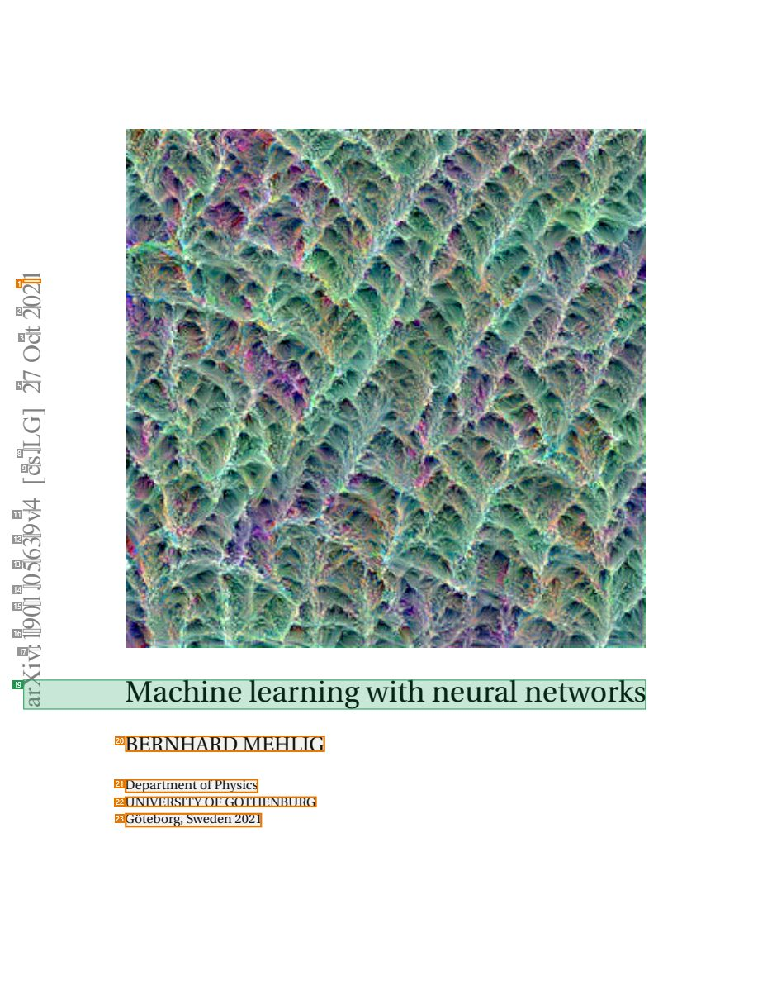
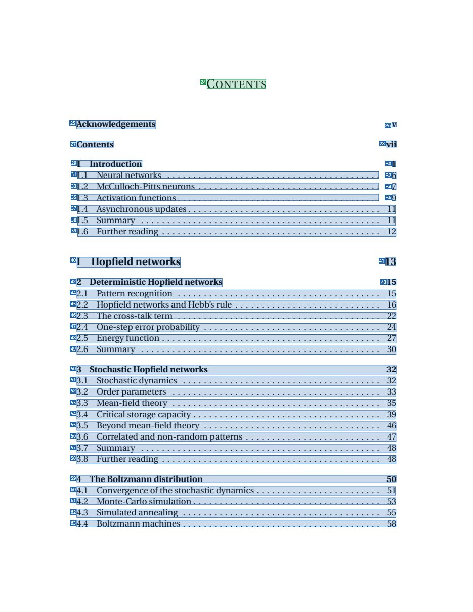
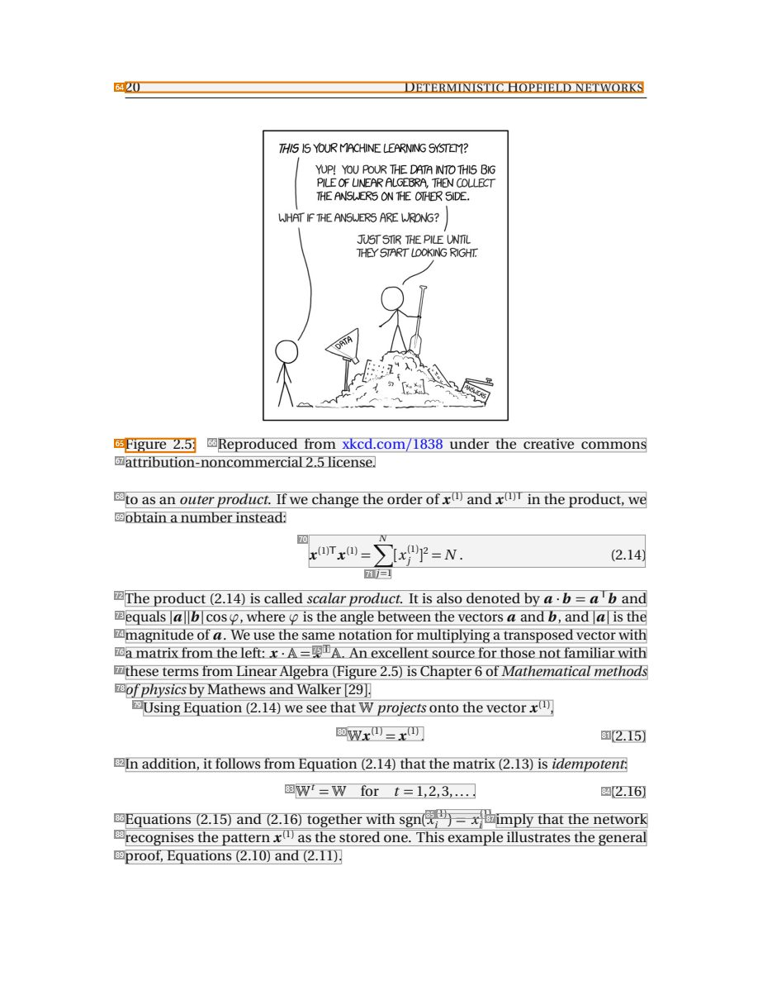
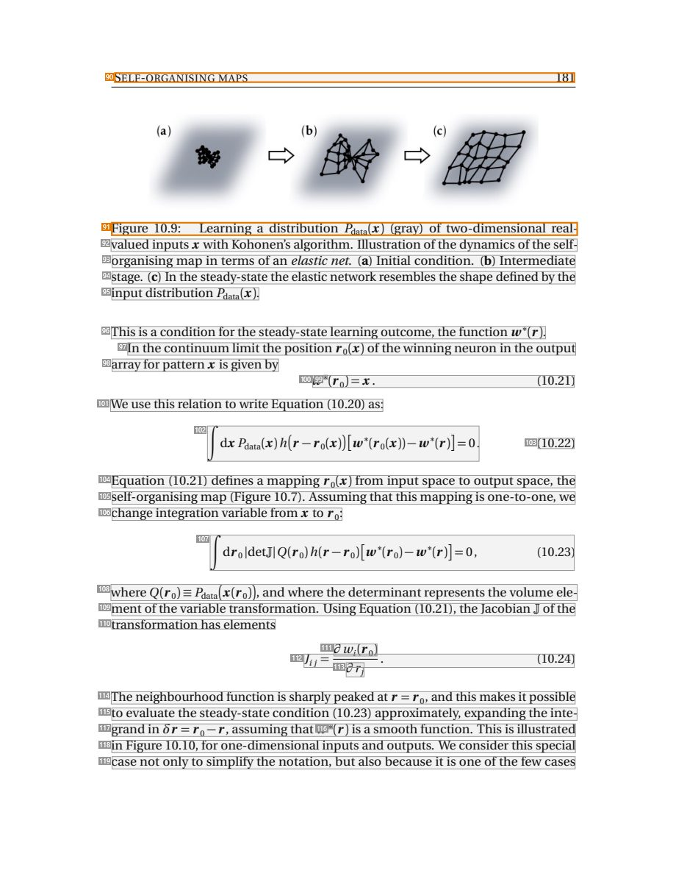

# 064 — `todo10_8/heading_corpus_100/04_giao_trinh/064_Machine_Learning_with_Neural_Networks.pdf`

Draft `P7_F1Q_HELDOUT_GOLD_DRAFT_V6`, status `DRAFT_USER_REVIEWED_NOT_APPROVED`, draft sha256 `70bcdd08f3548ec9b0e516a858a6b3de83697be4652fc8c1ecbe924a1e952988`. Source sha256 `1488210d01f56e8a1fcc21e6a5bf2dbd0b4d84e2cac016a3cee02895f4f69053`. [Back to index](README.md)

Approve or correct with `review-apply` lines: `APPROVE 064 by <reviewer> [because <note>]`, `064 <alias> -> E|R|O because <reason>`.

## Page 1 (FIRST)

| # | alias | text | font | draft | flag | rationale |
|---:|---|---|---|---|---|---|
| 1 | L0000:S0 | 12 | 20 | **OTHER** | REVIEW_FOCUS | Fragment of the vertical arXiv identifier stamp in the margin (page furniture) |
| 2 | L0001:S0 | 02 | 20 | **OTHER** |  | Default: body text, list item, table cell, page number or other non-heading content on this page |
| 3 | L0002:S0 | tc | 20 | **OTHER** |  | Default: body text, list item, table cell, page number or other non-heading content on this page |
| 4 | L0003:S0 | O | 20 | **OTHER** |  | Default: body text, list item, table cell, page number or other non-heading content on this page |
| 5 | L0004:S0 | 27 | 20 | **OTHER** |  | Default: body text, list item, table cell, page number or other non-heading content on this page |
| 6 | L0005:S0 | ] | 20 | **OTHER** |  | Default: body text, list item, table cell, page number or other non-heading content on this page |
| 7 | L0006:S0 | G | 20 | **OTHER** |  | Default: body text, list item, table cell, page number or other non-heading content on this page |
| 8 | L0007:S0 | L. | 20 | **OTHER** |  | Default: body text, list item, table cell, page number or other non-heading content on this page |
| 9 | L0008:S0 | sc | 20 | **OTHER** |  | Default: body text, list item, table cell, page number or other non-heading content on this page |
| 10 | L0009:S0 | [ | 20 | **OTHER** |  | Default: body text, list item, table cell, page number or other non-heading content on this page |
| 11 | L0010:S0 | 4v | 20 | **OTHER** |  | Default: body text, list item, table cell, page number or other non-heading content on this page |
| 12 | L0011:S0 | 93 | 20 | **OTHER** |  | Default: body text, list item, table cell, page number or other non-heading content on this page |
| 13 | L0012:S0 | 56 | 20 | **OTHER** |  | Default: body text, list item, table cell, page number or other non-heading content on this page |
| 14 | L0013:S0 | 0. | 20 | **OTHER** |  | Default: body text, list item, table cell, page number or other non-heading content on this page |
| 15 | L0014:S0 | 10 | 20 | **OTHER** |  | Default: body text, list item, table cell, page number or other non-heading content on this page |
| 16 | L0015:S0 | 91 | 20 | **OTHER** |  | Default: body text, list item, table cell, page number or other non-heading content on this page |
| 17 | L0016:S0 | :v | 20 | **OTHER** |  | Default: body text, list item, table cell, page number or other non-heading content on this page |
| 18 | L0017:S0 | i | 20 | **OTHER** |  | Default: body text, list item, table cell, page number or other non-heading content on this page |
| 19 | L0018:S0 | Xra Machine learningwith neural networks | 23.3 | **ESTABLISHES** |  | Book title &quot;Machine learning with neural networks&quot; (23pt) merged by the parser with stray stamp characters; contributes title word… |
| 20 | L0019:S0 | BERNHARD MEHLIG | 16.2 | **OTHER** | REVIEW_FOCUS | Author name |
| 21 | L0020:S0 | Department ofPhysics | 10.2 | **OTHER** | REVIEW_FOCUS | Author affiliation |
| 22 | L0021:S0 | UNIVERSITYOF GOTHENBURG | 10.2 | **OTHER** | REVIEW_FOCUS | Author affiliation |
| 23 | L0022:S0 | G&#246;teborg, Sweden2021 | 10.2 | **OTHER** | REVIEW_FOCUS | Place and year |

**OTHER rows to check for a missed heading on page 1** (body size 20pt; bold or ≥ body+1pt, ≤ 12 words): none.

## Page 7 (TARGETED_STRUCTURE)

| # | alias | text | font | draft | flag | rationale |
|---:|---|---|---|---|---|---|
| 24 | L0055:S0 | CONTENTS | 13 | **ESTABLISHES** |  | Heading &quot;CONTENTS&quot; |
| 25 | L0056:S0 | Acknowledgements | 11.2 B | **REPRESENTS** |  | Contents entry (or its page-number segment) |
| 26 | L0056:S1 | v | 11.2 B | **REPRESENTS** |  | Contents entry (or its page-number segment) |
| 27 | L0057:S0 | Contents | 11.2 B | **REPRESENTS** |  | Contents entry (or its page-number segment) |
| 28 | L0057:S1 | vii | 11.2 B | **REPRESENTS** |  | Contents entry (or its page-number segment) |
| 29 | L0058:S0 | 1 Introduction | 11.2 B | **REPRESENTS** |  | Contents entry (or its page-number segment) |
| 30 | L0058:S1 | 1 | 11.2 B | **REPRESENTS** |  | Contents entry (or its page-number segment) |
| 31 | L0059:S0 | 1.1 Neural networks . . . . . . . . . . . . . . . . . . . . . . . . . . . . . . . . . . . . . . . . . | 11.2 | **REPRESENTS** |  | Contents entry |
| 32 | L0059:S1 | 6 | 11.2 | **REPRESENTS** |  | Contents entry page-number segment |
| 33 | L0060:S0 | 1.2 McCulloch-Pitts neurons . . . . . . . . . . . . . . . . . . . . . . . . . . . . . . . . . . . | 11.2 | **REPRESENTS** |  | Contents entry |
| 34 | L0060:S1 | 7 | 11.2 | **REPRESENTS** |  | Contents entry page-number segment |
| 35 | L0061:S0 | 1.3 Activation functions . . . . . . . . . . . . . . . . . . . . . . . . . . . . . . . . . . . . . . . | 11.2 | **REPRESENTS** |  | Contents entry |
| 36 | L0061:S1 | 9 | 11.2 | **REPRESENTS** |  | Contents entry page-number segment |
| 37 | L0062:S0 | 1.4 Asynchronous updates . . . . . . . . . . . . . . . . . . . . . . . . . . . . . . . . . . . . . 11 | 11.2 | **REPRESENTS** |  | Contents entry |
| 38 | L0063:S0 | 1.5 Summary . . . . . . . . . . . . . . . . . . . . . . . . . . . . . . . . . . . . . . . . . . . . . . 11 | 11.2 | **REPRESENTS** |  | Contents entry |
| 39 | L0064:S0 | 1.6 Furtherreading . . . . . . . . . . . . . . . . . . . . . . . . . . . . . . . . . . . . . . . . . . 12 | 11.2 | **REPRESENTS** |  | Contents entry |
| 40 | L0065:S0 | I Hopfieldnetworks | 13.5 B | **REPRESENTS** |  | Contents entry |
| 41 | L0065:S1 | 13 | 13.5 B | **REPRESENTS** |  | Contents entry page-number segment |
| 42 | L0066:S0 | 2 DeterministicHopfieldnetworks | 11.2 B | **REPRESENTS** |  | Contents entry |
| 43 | L0066:S1 | 15 | 11.2 B | **REPRESENTS** |  | Contents entry page-number segment |
| 44 | L0067:S0 | 2.1 Pattern recognition . . . . . . . . . . . . . . . . . . . . . . . . . . . . . . . . . . . . . . . 15 | 11.2 | **REPRESENTS** |  | Contents entry |
| 45 | L0068:S0 | 2.2 Hopfield networks and Hebb’s rule . . . . . . . . . . . . . . . . . . . . . . . . . . . . 16 | 11.2 | **REPRESENTS** |  | Contents entry |
| 46 | L0069:S0 | 2.3 The cross-talkterm . . . . . . . . . . . . . . . . . . . . . . . . . . . . . . . . . . . . . . . 22 | 11.2 | **REPRESENTS** |  | Contents entry |
| 47 | L0070:S0 | 2.4 One-step errorprobability . . . . . . . . . . . . . . . . . . . . . . . . . . . . . . . . . . 24 | 11.2 | **REPRESENTS** |  | Contents entry |
| 48 | L0071:S0 | 2.5 Energyfunction . . . . . . . . . . . . . . . . . . . . . . . . . . . . . . . . . . . . . . . . . . 27 | 11.2 | **REPRESENTS** |  | Contents entry |
| 49 | L0072:S0 | 2.6 Summary . . . . . . . . . . . . . . . . . . . . . . . . . . . . . . . . . . . . . . . . . . . . . . 30 | 11.2 | **REPRESENTS** |  | Contents entry |
| 50 | L0073:S0 | 3 StochasticHopfieldnetworks 32 | 11.2 B | **REPRESENTS** |  | Contents entry |
| 51 | L0074:S0 | 3.1 Stochastic dynamics . . . . . . . . . . . . . . . . . . . . . . . . . . . . . . . . . . . . . . 32 | 11.2 | **REPRESENTS** |  | Contents entry |
| 52 | L0075:S0 | 3.2 Orderparameters . . . . . . . . . . . . . . . . . . . . . . . . . . . . . . . . . . . . . . . . 33 | 11.2 | **REPRESENTS** |  | Contents entry |
| 53 | L0076:S0 | 3.3 Mean-field theory . . . . . . . . . . . . . . . . . . . . . . . . . . . . . . . . . . . . . . . . 35 | 11.2 | **REPRESENTS** |  | Contents entry |
| 54 | L0077:S0 | 3.4 Critical storage capacity . . . . . . . . . . . . . . . . . . . . . . . . . . . . . . . . . . . . 39 | 11.2 | **REPRESENTS** |  | Contents entry |
| 55 | L0078:S0 | 3.5 Beyond mean-field theory . . . . . . . . . . . . . . . . . . . . . . . . . . . . . . . . . . 46 | 11.2 | **REPRESENTS** |  | Contents entry |
| 56 | L0079:S0 | 3.6 Correlated and non-randompatterns . . . . . . . . . . . . . . . . . . . . . . . . . . 47 | 11.2 | **REPRESENTS** |  | Contents entry |
| 57 | L0080:S0 | 3.7 Summary . . . . . . . . . . . . . . . . . . . . . . . . . . . . . . . . . . . . . . . . . . . . . . 48 | 11.2 | **REPRESENTS** |  | Contents entry |
| 58 | L0081:S0 | 3.8 Furtherreading . . . . . . . . . . . . . . . . . . . . . . . . . . . . . . . . . . . . . . . . . . 48 | 11.2 | **REPRESENTS** |  | Contents entry |
| 59 | L0082:S0 | 4 TheBoltzmanndistribution 50 | 11.2 B | **REPRESENTS** |  | Contents entry |
| 60 | L0083:S0 | 4.1 Convergence ofthe stochastic dynamics . . . . . . . . . . . . . . . . . . . . . . . . 51 | 11.2 | **REPRESENTS** |  | Contents entry |
| 61 | L0084:S0 | 4.2 Monte-Carlo simulation . . . . . . . . . . . . . . . . . . . . . . . . . . . . . . . . . . . . 53 | 11.2 | **REPRESENTS** |  | Contents entry |
| 62 | L0085:S0 | 4.3 Simulated annealing . . . . . . . . . . . . . . . . . . . . . . . . . . . . . . . . . . . . . . 55 | 11.2 | **REPRESENTS** |  | Contents entry |
| 63 | L0086:S0 | 4.4 Boltzmann machines . . . . . . . . . . . . . . . . . . . . . . . . . . . . . . . . . . . . . . 58 | 11.2 | **REPRESENTS** |  | Contents entry |

**OTHER rows to check for a missed heading on page 7** (body size 11pt; bold or ≥ body+1pt, ≤ 12 words): none.

## Page 30 (SEEDED_INTERIOR)

| # | alias | text | font | draft | flag | rationale |
|---:|---|---|---|---|---|---|
| 64 | L0687:S0 | 20 DETERMINISTIC HOPFIELD NETWORKS | 9 | **OTHER** | REVIEW_FOCUS | Running header &quot;20 DETERMINISTIC HOPFIELD NETWORKS&quot; |
| 65 | L0688:S0 | Figure 2.5: | 11.2 | **OTHER** | REVIEW_FOCUS | Figure caption label (object caption) |
| 66 | L0688:S1 | Reproduced from xkcd.com/1838 under the creative commons | 11.2 | **OTHER** |  | Default: body text, list item, table cell, page number or other non-heading content on this page |
| 67 | L0689:S0 | attribution-noncommercial2.5 license. | 11.2 | **OTHER** |  | Default: body text, list item, table cell, page number or other non-heading content on this page |
| 68 | L0690:S0 | to as an outerproduct. Ifwe change the order ofx(1) and x(1)T in the product, we | 11.2 | **OTHER** |  | Default: body text, list item, table cell, page number or other non-heading content on this page |
| 69 | L0691:S0 | obtain anumberinstead: | 11.2 | **OTHER** |  | Default: body text, list item, table cell, page number or other non-heading content on this page |
| 70 | L0692:S0 | x(1)Tx(1) =∑N [xj(1)]2 =N. (2.14) | 11.2 | **OTHER** |  | Default: body text, list item, table cell, page number or other non-heading content on this page |
| 71 | L0693:S0 | j=1 | 7.5 | **OTHER** |  | Default: body text, list item, table cell, page number or other non-heading content on this page |
| 72 | L0694:S0 | The product (2.14) is called scalarproduct. It is also denoted by a &#183; b = aTb and | 11.2 | **OTHER** |  | Default: body text, list item, table cell, page number or other non-heading content on this page |
| 73 | L0695:S0 | equals \|a\|\|b\|cosϕ, where ϕ is the angle between thevectors a and b, and \|a\| is the | 11.2 | **OTHER** |  | Default: body text, list item, table cell, page number or other non-heading content on this page |
| 74 | L0696:S0 | magnitude ofa. We use the same notationformultiplyingatransposedvectorwith | 11.2 | **OTHER** |  | Default: body text, list item, table cell, page number or other non-heading content on this page |
| 75 | L0697:S0 | T | 8.3 | **OTHER** |  | Default: body text, list item, table cell, page number or other non-heading content on this page |
| 76 | L0698:S0 | amatrixfrom the left: x &#183;A=x A. An excellent source forthose notfamiliarwith | 11.2 | **OTHER** |  | Default: body text, list item, table cell, page number or other non-heading content on this page |
| 77 | L0699:S0 | these terms from LinearAlgebra (Figure 2.5) is Chapter 6 ofMathematicalmethods | 11.2 | **OTHER** |  | Default: body text, list item, table cell, page number or other non-heading content on this page |
| 78 | L0700:S0 | ofphysicsbyMathews andWalker [29]. | 11.2 | **OTHER** |  | Default: body text, list item, table cell, page number or other non-heading content on this page |
| 79 | L0701:S0 | UsingEquation (2.14) we see thatW projectsonto thevectorx(1), | 11.2 | **OTHER** |  | Default: body text, list item, table cell, page number or other non-heading content on this page |
| 80 | L0702:S0 | Wx(1) =x(1) . | 7.5 | **OTHER** |  | Default: body text, list item, table cell, page number or other non-heading content on this page |
| 81 | L0702:S1 | (2.15) | 11.2 | **OTHER** |  | Default: body text, list item, table cell, page number or other non-heading content on this page |
| 82 | L0703:S0 | In addition, itfollows from Equation (2.14) thatthe matrix (2.13) is idempotent: | 11.2 | **OTHER** |  | Default: body text, list item, table cell, page number or other non-heading content on this page |
| 83 | L0704:S0 | Wt =W for t = 1,2,3,... . | 11.2 | **OTHER** |  | Default: body text, list item, table cell, page number or other non-heading content on this page |
| 84 | L0704:S1 | (2.16) | 11.2 | **OTHER** |  | Default: body text, list item, table cell, page number or other non-heading content on this page |
| 85 | L0705:S0 | (1) (1) | 7.5 | **OTHER** |  | Default: body text, list item, table cell, page number or other non-heading content on this page |
| 86 | L0706:S0 | Equations (2.15) and (2.16) together with sgn(xi ) = xi | 11.2 | **OTHER** |  | Default: body text, list item, table cell, page number or other non-heading content on this page |
| 87 | L0706:S1 | imply that the network | 11.2 | **OTHER** |  | Default: body text, list item, table cell, page number or other non-heading content on this page |
| 88 | L0707:S0 | recognises the patternx(1) as the stored one. This example illustrates the general | 11.2 | **OTHER** |  | Default: body text, list item, table cell, page number or other non-heading content on this page |
| 89 | L0708:S0 | proof, Equations (2.10) and (2.11). | 11.2 | **OTHER** |  | Default: body text, list item, table cell, page number or other non-heading content on this page |

**OTHER rows to check for a missed heading on page 30** (body size 11pt; bold or ≥ body+1pt, ≤ 12 words): none.

## Page 191 (SEEDED_INTERIOR)

| # | alias | text | font | draft | flag | rationale |
|---:|---|---|---|---|---|---|
| 90 | L5489:S0 | SELF-ORGANISING MAPS 181 | 9 | **OTHER** | REVIEW_FOCUS | Running header &quot;SELF-ORGANISING MAPS 181&quot; |
| 91 | L5490:S0 | Figure 10.9: Learning a distribution Pdata(x) (gray) of two-dimensional real- | 11.2 | **OTHER** | REVIEW_FOCUS | Figure caption (object caption) |
| 92 | L5491:S0 | valued inputs x with Kohonen’s algorithm. Illustration ofthe dynamics ofthe self- | 11.2 | **OTHER** |  | Default: body text, list item, table cell, page number or other non-heading content on this page |
| 93 | L5492:S0 | organising map in terms ofan elastic net. (a) Initial condition. (b) Intermediate | 11.2 | **OTHER** |  | Default: body text, list item, table cell, page number or other non-heading content on this page |
| 94 | L5493:S0 | stage. (c) In the steady-state the elastic networkresembles the shape definedbythe | 11.2 | **OTHER** |  | Default: body text, list item, table cell, page number or other non-heading content on this page |
| 95 | L5494:S0 | input distribution Pdata(x). | 11.2 | **OTHER** |  | Default: body text, list item, table cell, page number or other non-heading content on this page |
| 96 | L5495:S0 | This is a condition forthe steady-state learning outcome, the function w∗(r). | 11.2 | **OTHER** |  | Default: body text, list item, table cell, page number or other non-heading content on this page |
| 97 | L5496:S0 | In the continuumlimitthe position r0(x) ofthewinningneuron in the output | 11.2 | **OTHER** |  | Default: body text, list item, table cell, page number or other non-heading content on this page |
| 98 | L5497:S0 | arrayforpatternx is givenby | 11.2 | **OTHER** |  | Default: body text, list item, table cell, page number or other non-heading content on this page |
| 99 | L5498:S0 | ∗ | 7.5 I | **OTHER** |  | Default: body text, list item, table cell, page number or other non-heading content on this page |
| 100 | L5499:S0 | w (r0) =x . (10.21) | 11.2 | **OTHER** |  | Default: body text, list item, table cell, page number or other non-heading content on this page |
| 101 | L5500:S0 | We use this relation to write Equation (10.20) as: | 11.2 | **OTHER** |  | Default: body text, list item, table cell, page number or other non-heading content on this page |
| 102 | L5501:S0 | ∫dxPdata(x)hr−r0(x)w∗(r0(x))−w∗(r)= 0. | 11.2 | **OTHER** |  | Default: body text, list item, table cell, page number or other non-heading content on this page |
| 103 | L5501:S1 | (10.22) | 11.2 | **OTHER** |  | Default: body text, list item, table cell, page number or other non-heading content on this page |
| 104 | L5502:S0 | Equation (10.21) defines a mapping r0(x) from input space to output space, the | 11.2 | **OTHER** |  | Default: body text, list item, table cell, page number or other non-heading content on this page |
| 105 | L5503:S0 | self-organisingmap (Figure 10.7). Assumingthatthis mappingis one-to-one, we | 11.2 | **OTHER** |  | Default: body text, list item, table cell, page number or other non-heading content on this page |
| 106 | L5504:S0 | change integrationvariable fromx to r0: | 11.2 | **OTHER** |  | Default: body text, list item, table cell, page number or other non-heading content on this page |
| 107 | L5505:S0 | ∫dr0 \|detJ\| Q(r0)h(r−r0)w∗(r0)−w∗(r)= 0, (10.23) | 11.2 | **OTHER** |  | Default: body text, list item, table cell, page number or other non-heading content on this page |
| 108 | L5506:S0 | where Q(r0) ≡ Pdatax(r0), andwhere the determinantrepresents thevolume ele- | 11.2 | **OTHER** |  | Default: body text, list item, table cell, page number or other non-heading content on this page |
| 109 | L5507:S0 | ment ofthevariable transformation. UsingEquation (10.21), theJacobianJ ofthe | 11.2 | **OTHER** |  | Default: body text, list item, table cell, page number or other non-heading content on this page |
| 110 | L5508:S0 | transformationhas elements | 11.2 | **OTHER** |  | Default: body text, list item, table cell, page number or other non-heading content on this page |
| 111 | L5509:S0 | ∂ wi(r0) | 11.2 I | **OTHER** |  | Default: body text, list item, table cell, page number or other non-heading content on this page |
| 112 | L5510:S0 | Jij = . (10.24) | 11.2 | **OTHER** |  | Default: body text, list item, table cell, page number or other non-heading content on this page |
| 113 | L5511:S0 | ∂rj | 11.2 I | **OTHER** |  | Default: body text, list item, table cell, page number or other non-heading content on this page |
| 114 | L5512:S0 | The neighbourhoodfunction is sharplypeaked at r = r0, and this makes itpossible | 11.2 | **OTHER** |  | Default: body text, list item, table cell, page number or other non-heading content on this page |
| 115 | L5513:S0 | to evaluate the steady-state condition (10.23) approximately, expandingthe inte- | 11.2 | **OTHER** |  | Default: body text, list item, table cell, page number or other non-heading content on this page |
| 116 | L5514:S0 | ∗ | 7.5 I | **OTHER** |  | Default: body text, list item, table cell, page number or other non-heading content on this page |
| 117 | L5515:S0 | grand in δr = r0 −r, assumingthat w (r) is a smooth function. This is illustrated | 11.2 | **OTHER** |  | Default: body text, list item, table cell, page number or other non-heading content on this page |
| 118 | L5516:S0 | in Figure 10.10, for one-dimensional inputs and outputs. We considerthis special | 11.2 | **OTHER** |  | Default: body text, list item, table cell, page number or other non-heading content on this page |
| 119 | L5517:S0 | case not onlyto simplifythe notation, but also because it is one ofthe few cases | 11.2 | **OTHER** |  | Default: body text, list item, table cell, page number or other non-heading content on this page |

**OTHER rows to check for a missed heading on page 191** (body size 11pt; bold or ≥ body+1pt, ≤ 12 words): none.
