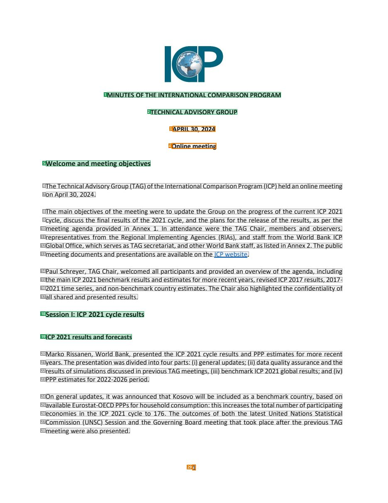
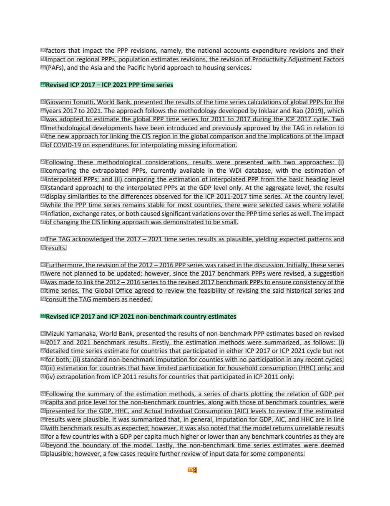
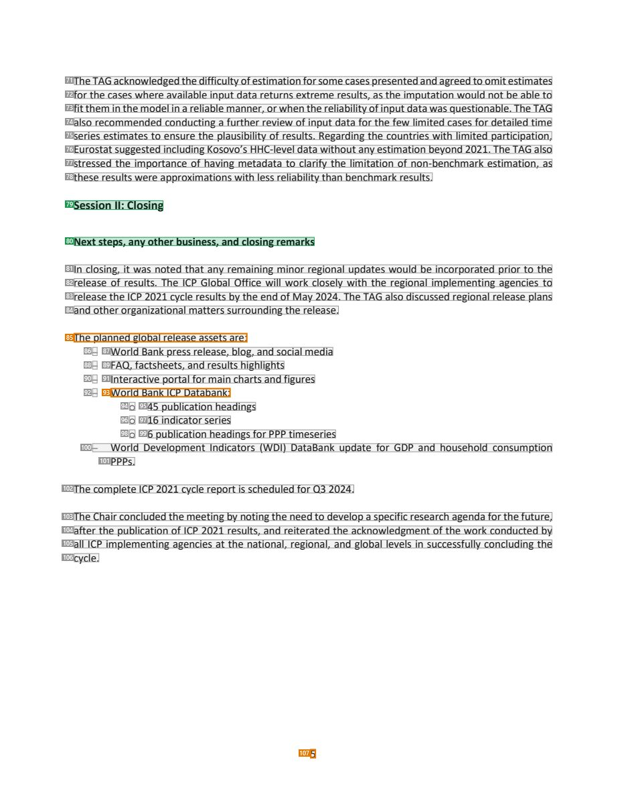

# 079 — `todo10_8/heading_corpus_100/05_bien_ban_hop/079_ICP_TAG_Minutes_Apr_2024.pdf`

Draft `P7_F1Q_HELDOUT_GOLD_DRAFT_V6`, status `DRAFT_USER_REVIEWED_NOT_APPROVED`, draft sha256 `626011c98f95c84f58b31b9c3f12af5c0d8ed18b261d71c18bca9bf339a98d7c`. Source sha256 `68b7a89f3955e52e047f0741bbfc0d9581d508a74eff3ec40e08bbab69248d00`. [Back to index](README.md)

Approve or correct with `review-apply` lines: `APPROVE 079 by <reviewer> [because <note>]`, `079 <alias> -> E|R|O because <reason>`.

## Page 1 (FIRST)

| # | alias | text | font | draft | flag | rationale |
|---:|---|---|---|---|---|---|
| 1 | L0000:S0 | MINUTES OF THE INTERNATIONAL COMPARISON PROGRAM | 11 B | **ESTABLISHES** |  | Minutes title line 1 (bold caps, centred) |
| 2 | L0001:S0 | TECHNICAL ADVISORY GROUP | 11 B | **ESTABLISHES** |  | Minutes title line 2 &quot;TECHNICAL ADVISORY GROUP&quot; |
| 3 | L0002:S0 | APRIL 30, 2024 | 11 B | **OTHER** | REVIEW_FOCUS | Meeting date in the masthead (metadata) |
| 4 | L0003:S0 | Online meeting | 11 B | **OTHER** | REVIEW_FOCUS | Meeting mode &quot;Online meeting&quot; in the masthead (metadata) |
| 5 | L0004:S0 | Welcome and meeting objectives | 12 B | **ESTABLISHES** |  | Agenda heading &quot;Welcome and meeting objectives&quot; (bold 12) |
| 6 | L0005:S0 | The Technical AdvisoryGroup (TAG)of the International ComparisonProgram (ICP) held anonlinemeeting | 11 | **OTHER** |  | Default: body text, list item, table cell, page number or other non-heading content on this page |
| 7 | L0006:S0 | on April 30, 2024. | 11 | **OTHER** |  | Default: body text, list item, table cell, page number or other non-heading content on this page |
| 8 | L0007:S0 | The main objectives of the meeting were to update the Group on the progress of the current ICP 2021 | 11 | **OTHER** |  | Default: body text, list item, table cell, page number or other non-heading content on this page |
| 9 | L0008:S0 | cycle, discuss the final results of the 2021 cycle, and the plans for the release of the results, as per the | 11 | **OTHER** |  | Default: body text, list item, table cell, page number or other non-heading content on this page |
| 10 | L0009:S0 | meeting agenda provided in Annex 1. In attendance were the TAG Chair, members and observers, | 11 | **OTHER** |  | Default: body text, list item, table cell, page number or other non-heading content on this page |
| 11 | L0010:S0 | representatives from the Regional Implementing Agencies (RIAs), and staff from the World Bank ICP | 11 | **OTHER** |  | Default: body text, list item, table cell, page number or other non-heading content on this page |
| 12 | L0011:S0 | Global Office, which serves as TAG secretariat, and other World Bank staff, as listed in Annex 2. The public | 11 | **OTHER** |  | Default: body text, list item, table cell, page number or other non-heading content on this page |
| 13 | L0012:S0 | meeting documents and presentations are available on the ICP website. | 11 | **OTHER** |  | Default: body text, list item, table cell, page number or other non-heading content on this page |
| 14 | L0013:S0 | Paul Schreyer, TAG Chair, welcomed all participants and provided an overview of the agenda, including | 11 | **OTHER** |  | Default: body text, list item, table cell, page number or other non-heading content on this page |
| 15 | L0014:S0 | the main ICP 2021 benchmark results and estimates for more recent years, revised ICP 2017 results, 2017- | 11 | **OTHER** |  | Default: body text, list item, table cell, page number or other non-heading content on this page |
| 16 | L0015:S0 | 2021 time series, and non-benchmark country estimates. The Chair also highlighted the confidentiality of | 11 | **OTHER** |  | Default: body text, list item, table cell, page number or other non-heading content on this page |
| 17 | L0016:S0 | all shared and presented results. | 11 | **OTHER** |  | Default: body text, list item, table cell, page number or other non-heading content on this page |
| 18 | L0017:S0 | Session I: ICP 2021 cycle results | 12 B | **ESTABLISHES** |  | Session heading &quot;Session I: ICP 2021 cycle results&quot; (bold 12) |
| 19 | L0018:S0 | ICP 2021 results and forecasts | 11 B | **ESTABLISHES** |  | Item heading &quot;ICP 2021 results and forecasts&quot; (bold 11) |
| 20 | L0019:S0 | Marko Rissanen, World Bank, presented the ICP 2021 cycle results and PPP estimates for more recent | 11 | **OTHER** |  | Default: body text, list item, table cell, page number or other non-heading content on this page |
| 21 | L0020:S0 | years. The presentation was divided into four parts: (i) general updates; (ii) data quality assurance and the | 11 | **OTHER** |  | Default: body text, list item, table cell, page number or other non-heading content on this page |
| 22 | L0021:S0 | results of simulations discussed in previous TAG meetings, (iii) benchmark ICP 2021 global results; and (iv) | 11 | **OTHER** |  | Default: body text, list item, table cell, page number or other non-heading content on this page |
| 23 | L0022:S0 | PPP estimates for 2022-2026 period. | 11 | **OTHER** |  | Default: body text, list item, table cell, page number or other non-heading content on this page |
| 24 | L0023:S0 | On general updates, it was announced that Kosovo will be included as a benchmark country, based on | 11 | **OTHER** |  | Default: body text, list item, table cell, page number or other non-heading content on this page |
| 25 | L0024:S0 | available Eurostat-OECD PPPs for householdconsumption: this increases the total number of participating | 11 | **OTHER** |  | Default: body text, list item, table cell, page number or other non-heading content on this page |
| 26 | L0025:S0 | economies in the ICP 2021 cycle to 176. The outcomes of both the latest United Nations Statistical | 11 | **OTHER** |  | Default: body text, list item, table cell, page number or other non-heading content on this page |
| 27 | L0026:S0 | Commission (UNSC) Session and the Governing Board meeting that took place after the previous TAG | 11 | **OTHER** |  | Default: body text, list item, table cell, page number or other non-heading content on this page |
| 28 | L0027:S0 | meeting were also presented. | 11 | **OTHER** |  | Default: body text, list item, table cell, page number or other non-heading content on this page |
| 29 | L0028:S0 | 1 | 11 | **OTHER** | REVIEW_FOCUS | Page number |

**OTHER rows to check for a missed heading on page 1** (body size 11pt; bold or ≥ body+1pt, ≤ 12 words): #3 `L0002:S0` APRIL 30, 2024 (11 B), #4 `L0003:S0` Online meeting (11 B).

## Page 4 (SEEDED_INTERIOR)

| # | alias | text | font | draft | flag | rationale |
|---:|---|---|---|---|---|---|
| 30 | L0112:S0 | factors that impact the PPP revisions, namely, the national accounts expenditure revisions and their | 11 | **OTHER** |  | Default: body text, list item, table cell, page number or other non-heading content on this page |
| 31 | L0113:S0 | impact on regional PPPs, population estimates revisions, the revision of Productivity Adjustment Factors | 11 | **OTHER** |  | Default: body text, list item, table cell, page number or other non-heading content on this page |
| 32 | L0114:S0 | (PAFs), and the Asia and the Pacific hybrid approach to housing services. | 11 | **OTHER** |  | Default: body text, list item, table cell, page number or other non-heading content on this page |
| 33 | L0115:S0 | Revised ICP 2017 – ICP 2021 PPP time series | 11 B | **ESTABLISHES** |  | Item heading &quot;Revised ICP 2017 – ICP 2021 PPP time series&quot; |
| 34 | L0116:S0 | Giovanni Tonutti, World Bank, presented the results of the time series calculations of global PPPs for the | 11 | **OTHER** |  | Default: body text, list item, table cell, page number or other non-heading content on this page |
| 35 | L0117:S0 | years 2017 to 2021. The approach follows the methodology developed by Inklaar and Rao (2019), which | 11 | **OTHER** |  | Default: body text, list item, table cell, page number or other non-heading content on this page |
| 36 | L0118:S0 | was adopted to estimate the global PPP time series for 2011 to 2017 during the ICP 2017 cycle. Two | 11 | **OTHER** |  | Default: body text, list item, table cell, page number or other non-heading content on this page |
| 37 | L0119:S0 | methodological developments have been introduced and previously approved by the TAG in relation to | 11 | **OTHER** |  | Default: body text, list item, table cell, page number or other non-heading content on this page |
| 38 | L0120:S0 | the new approach for linking the CIS region in the global comparison and the implications of the impact | 11 | **OTHER** |  | Default: body text, list item, table cell, page number or other non-heading content on this page |
| 39 | L0121:S0 | of COVID-19 on expenditures for interpolating missing information. | 11 | **OTHER** |  | Default: body text, list item, table cell, page number or other non-heading content on this page |
| 40 | L0122:S0 | Following these methodological considerations, results were presented with two approaches: (i) | 11 | **OTHER** |  | Default: body text, list item, table cell, page number or other non-heading content on this page |
| 41 | L0123:S0 | comparing the extrapolated PPPs, currently available in the WDI database, with the estimation of | 11 | **OTHER** |  | Default: body text, list item, table cell, page number or other non-heading content on this page |
| 42 | L0124:S0 | interpolated PPPs; and (ii) comparing the estimation of interpolated PPP from the basic heading level | 11 | **OTHER** |  | Default: body text, list item, table cell, page number or other non-heading content on this page |
| 43 | L0125:S0 | (standard approach) to the interpolated PPPs at the GDP level only. At the aggregate level, the results | 11 | **OTHER** |  | Default: body text, list item, table cell, page number or other non-heading content on this page |
| 44 | L0126:S0 | display similarities to the differences observed for the ICP 2011-2017 time series. At the country level, | 11 | **OTHER** |  | Default: body text, list item, table cell, page number or other non-heading content on this page |
| 45 | L0127:S0 | while the PPP time series remains stable for most countries, there were selected cases where volatile | 11 | **OTHER** |  | Default: body text, list item, table cell, page number or other non-heading content on this page |
| 46 | L0128:S0 | inflation, exchange rates, or both caused significant variations over the PPP time series as well. The impact | 11 | **OTHER** |  | Default: body text, list item, table cell, page number or other non-heading content on this page |
| 47 | L0129:S0 | of changing the CIS linking approach was demonstrated to be small. | 11 | **OTHER** |  | Default: body text, list item, table cell, page number or other non-heading content on this page |
| 48 | L0130:S0 | The TAG acknowledged the 2017 – 2021 time series results as plausible, yielding expected patterns and | 11 | **OTHER** |  | Default: body text, list item, table cell, page number or other non-heading content on this page |
| 49 | L0131:S0 | results. | 11 | **OTHER** |  | Default: body text, list item, table cell, page number or other non-heading content on this page |
| 50 | L0132:S0 | Furthermore, the revision of the 2012 – 2016 PPP series was raised in the discussion. Initially, these series | 11 | **OTHER** |  | Default: body text, list item, table cell, page number or other non-heading content on this page |
| 51 | L0133:S0 | were not planned to be updated; however, since the 2017 benchmark PPPs were revised, a suggestion | 11 | **OTHER** |  | Default: body text, list item, table cell, page number or other non-heading content on this page |
| 52 | L0134:S0 | was made to link the 2012 – 2016 series to the revised 2017 benchmark PPPs to ensure consistency of the | 11 | **OTHER** |  | Default: body text, list item, table cell, page number or other non-heading content on this page |
| 53 | L0135:S0 | time series. The Global Office agreed to review the feasibility of revising the said historical series and | 11 | **OTHER** |  | Default: body text, list item, table cell, page number or other non-heading content on this page |
| 54 | L0136:S0 | consult the TAG members as needed. | 11 | **OTHER** |  | Default: body text, list item, table cell, page number or other non-heading content on this page |
| 55 | L0137:S0 | Revised ICP 2017 and ICP 2021 non-benchmark country estimates | 11 B | **ESTABLISHES** |  | Item heading &quot;Revised ICP 2017 and ICP 2021 non-benchmark country estimates&quot; |
| 56 | L0138:S0 | Mizuki Yamanaka, World Bank, presented the results of non-benchmark PPP estimates based on revised | 11 | **OTHER** |  | Default: body text, list item, table cell, page number or other non-heading content on this page |
| 57 | L0139:S0 | 2017 and 2021 benchmark results. Firstly, the estimation methods were summarized, as follows: (i) | 11 | **OTHER** |  | Default: body text, list item, table cell, page number or other non-heading content on this page |
| 58 | L0140:S0 | detailed time series estimate for countries that participated in either ICP 2017 or ICP 2021 cycle but not | 11 | **OTHER** |  | Default: body text, list item, table cell, page number or other non-heading content on this page |
| 59 | L0141:S0 | for both; (ii) standard non-benchmark imputation for counties with no participation in any recent cycles; | 11 | **OTHER** |  | Default: body text, list item, table cell, page number or other non-heading content on this page |
| 60 | L0142:S0 | (iii) estimation for countries that have limited participation for household consumption (HHC) only; and | 11 | **OTHER** |  | Default: body text, list item, table cell, page number or other non-heading content on this page |
| 61 | L0143:S0 | (iv) extrapolation from ICP 2011 results for countries that participated in ICP 2011 only. | 11 | **OTHER** |  | Default: body text, list item, table cell, page number or other non-heading content on this page |
| 62 | L0144:S0 | Following the summary of the estimation methods, a series of charts plotting the relation of GDP per | 11 | **OTHER** |  | Default: body text, list item, table cell, page number or other non-heading content on this page |
| 63 | L0145:S0 | capita and price level for the non-benchmark countries, along with those of benchmark countries, were | 11 | **OTHER** |  | Default: body text, list item, table cell, page number or other non-heading content on this page |
| 64 | L0146:S0 | presented for the GDP, HHC, and Actual Individual Consumption (AIC) levels to review if the estimated | 11 | **OTHER** |  | Default: body text, list item, table cell, page number or other non-heading content on this page |
| 65 | L0147:S0 | results were plausible. It was summarized that, in general, imputation for GDP, AIC, and HHC are in line | 11 | **OTHER** |  | Default: body text, list item, table cell, page number or other non-heading content on this page |
| 66 | L0148:S0 | with benchmark results as expected; however, it was also noted that the model returns unreliable results | 11 | **OTHER** |  | Default: body text, list item, table cell, page number or other non-heading content on this page |
| 67 | L0149:S0 | for a few countries with a GDP per capita much higher or lower than any benchmark countries as they are | 11 | **OTHER** |  | Default: body text, list item, table cell, page number or other non-heading content on this page |
| 68 | L0150:S0 | beyond the boundary of the model. Lastly, the non-benchmark time series estimates were deemed | 11 | **OTHER** |  | Default: body text, list item, table cell, page number or other non-heading content on this page |
| 69 | L0151:S0 | plausible; however, a few cases require further review of input data for some components. | 11 | **OTHER** |  | Default: body text, list item, table cell, page number or other non-heading content on this page |
| 70 | L0152:S0 | 4 | 11 | **OTHER** | REVIEW_FOCUS | Page number |

**OTHER rows to check for a missed heading on page 4** (body size 11pt; bold or ≥ body+1pt, ≤ 12 words): none.

## Page 5 (SEEDED_INTERIOR)

| # | alias | text | font | draft | flag | rationale |
|---:|---|---|---|---|---|---|
| 71 | L0153:S0 | The TAG acknowledgedthedifficulty ofestimation for some cases presentedand agreed to omitestimates | 11 | **OTHER** |  | Default: body text, list item, table cell, page number or other non-heading content on this page |
| 72 | L0154:S0 | for the cases where available input data returns extreme results, as the imputation would not be able to | 11 | **OTHER** |  | Default: body text, list item, table cell, page number or other non-heading content on this page |
| 73 | L0155:S0 | fit them in the model in a reliable manner, or when the reliability of input data was questionable. The TAG | 11 | **OTHER** |  | Default: body text, list item, table cell, page number or other non-heading content on this page |
| 74 | L0156:S0 | also recommended conducting a further review of input data for the few limited cases for detailed time | 11 | **OTHER** |  | Default: body text, list item, table cell, page number or other non-heading content on this page |
| 75 | L0157:S0 | series estimates to ensure the plausibility of results. Regarding the countries with limited participation, | 11 | **OTHER** |  | Default: body text, list item, table cell, page number or other non-heading content on this page |
| 76 | L0158:S0 | Eurostat suggested including Kosovo’s HHC-level data without any estimation beyond 2021. The TAG also | 11 | **OTHER** |  | Default: body text, list item, table cell, page number or other non-heading content on this page |
| 77 | L0159:S0 | stressed the importance of having metadata to clarify the limitation of non-benchmark estimation, as | 11 | **OTHER** |  | Default: body text, list item, table cell, page number or other non-heading content on this page |
| 78 | L0160:S0 | these results were approximations with less reliability than benchmark results. | 11 | **OTHER** |  | Default: body text, list item, table cell, page number or other non-heading content on this page |
| 79 | L0161:S0 | Session II: Closing | 12 B | **ESTABLISHES** |  | Session heading &quot;Session II: Closing&quot; |
| 80 | L0162:S0 | Next steps, any other business, and closing remarks | 11 B | **ESTABLISHES** |  | Item heading &quot;Next steps, any other business, and closing remarks&quot; |
| 81 | L0163:S0 | In closing, it was noted that any remaining minor regional updates would be incorporated prior to the | 11 | **OTHER** |  | Default: body text, list item, table cell, page number or other non-heading content on this page |
| 82 | L0164:S0 | release of results. The ICP Global Office will work closely with the regional implementing agencies to | 11 | **OTHER** |  | Default: body text, list item, table cell, page number or other non-heading content on this page |
| 83 | L0165:S0 | release the ICP 2021 cycle results by the end of May 2024. The TAG also discussed regional release plans | 11 | **OTHER** |  | Default: body text, list item, table cell, page number or other non-heading content on this page |
| 84 | L0166:S0 | and other organizational matters surrounding the release. | 11 | **OTHER** |  | Default: body text, list item, table cell, page number or other non-heading content on this page |
| 85 | L0167:S0 | The planned global release assets are: | 11 | **OTHER** | REVIEW_FOCUS | List lead-in &quot;The planned global release assets are:&quot; |
| 86 | L0168:S0 | – | 11 | **OTHER** |  | Default: body text, list item, table cell, page number or other non-heading content on this page |
| 87 | L0168:S1 | World Bank press release, blog, and social media | 11 | **OTHER** |  | Default: body text, list item, table cell, page number or other non-heading content on this page |
| 88 | L0169:S0 | – | 11 | **OTHER** |  | Default: body text, list item, table cell, page number or other non-heading content on this page |
| 89 | L0169:S1 | FAQ, factsheets, and results highlights | 11 | **OTHER** |  | Default: body text, list item, table cell, page number or other non-heading content on this page |
| 90 | L0170:S0 | – | 11 | **OTHER** |  | Default: body text, list item, table cell, page number or other non-heading content on this page |
| 91 | L0170:S1 | Interactive portal for main charts and figures | 11 | **OTHER** |  | Default: body text, list item, table cell, page number or other non-heading content on this page |
| 92 | L0171:S0 | – | 11 | **OTHER** |  | Default: body text, list item, table cell, page number or other non-heading content on this page |
| 93 | L0171:S1 | World Bank ICP Databank: | 11 | **OTHER** | REVIEW_FOCUS | List item &quot;World Bank ICP Databank:&quot; (list content) |
| 94 | L0172:S0 | o | 11 | **OTHER** |  | Default: body text, list item, table cell, page number or other non-heading content on this page |
| 95 | L0172:S1 | 45 publication headings | 11 | **OTHER** |  | Default: body text, list item, table cell, page number or other non-heading content on this page |
| 96 | L0173:S0 | o | 11 | **OTHER** |  | Default: body text, list item, table cell, page number or other non-heading content on this page |
| 97 | L0173:S1 | 16 indicator series | 11 | **OTHER** |  | Default: body text, list item, table cell, page number or other non-heading content on this page |
| 98 | L0174:S0 | o | 11 | **OTHER** |  | Default: body text, list item, table cell, page number or other non-heading content on this page |
| 99 | L0174:S1 | 6 publication headings for PPP timeseries | 11 | **OTHER** |  | Default: body text, list item, table cell, page number or other non-heading content on this page |
| 100 | L0175:S0 | – World Development Indicators (WDI) DataBank update for GDP and household consumption | 11 | **OTHER** |  | Default: body text, list item, table cell, page number or other non-heading content on this page |
| 101 | L0176:S0 | PPPs. | 11 | **OTHER** |  | Default: body text, list item, table cell, page number or other non-heading content on this page |
| 102 | L0177:S0 | The complete ICP 2021 cycle report is scheduled for Q3 2024. | 11 | **OTHER** |  | Default: body text, list item, table cell, page number or other non-heading content on this page |
| 103 | L0178:S0 | The Chair concluded the meeting by noting the need to develop a specific research agenda for the future, | 11 | **OTHER** |  | Default: body text, list item, table cell, page number or other non-heading content on this page |
| 104 | L0179:S0 | after the publication of ICP 2021 results, and reiterated the acknowledgment of the work conducted by | 11 | **OTHER** |  | Default: body text, list item, table cell, page number or other non-heading content on this page |
| 105 | L0180:S0 | all ICP implementing agencies at the national, regional, and global levels in successfully concluding the | 11 | **OTHER** |  | Default: body text, list item, table cell, page number or other non-heading content on this page |
| 106 | L0181:S0 | cycle. | 11 | **OTHER** |  | Default: body text, list item, table cell, page number or other non-heading content on this page |
| 107 | L0182:S0 | 5 | 11 | **OTHER** | REVIEW_FOCUS | Page number |

**OTHER rows to check for a missed heading on page 5** (body size 11pt; bold or ≥ body+1pt, ≤ 12 words): none.
