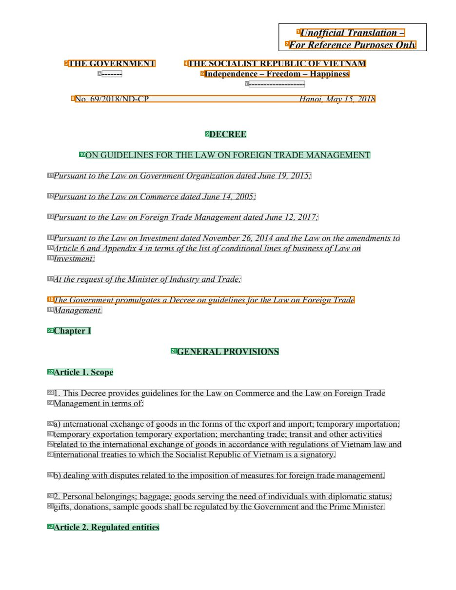
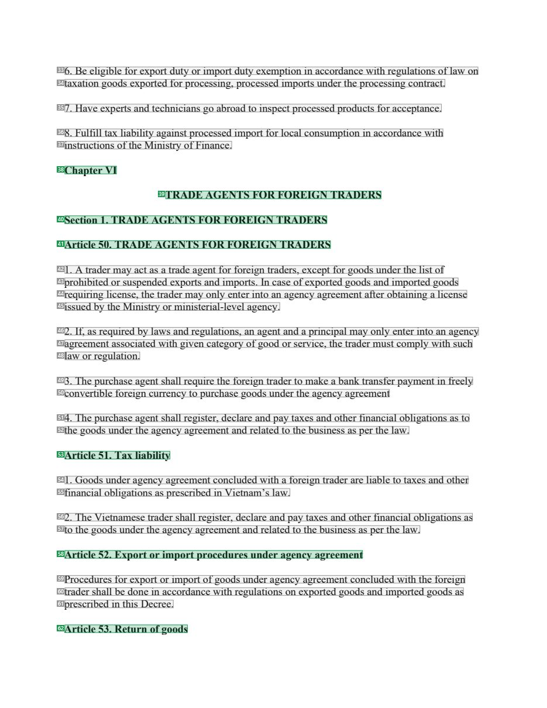
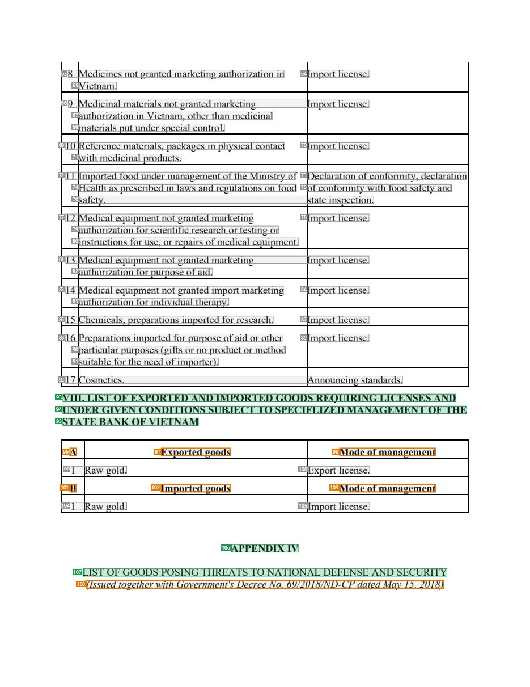
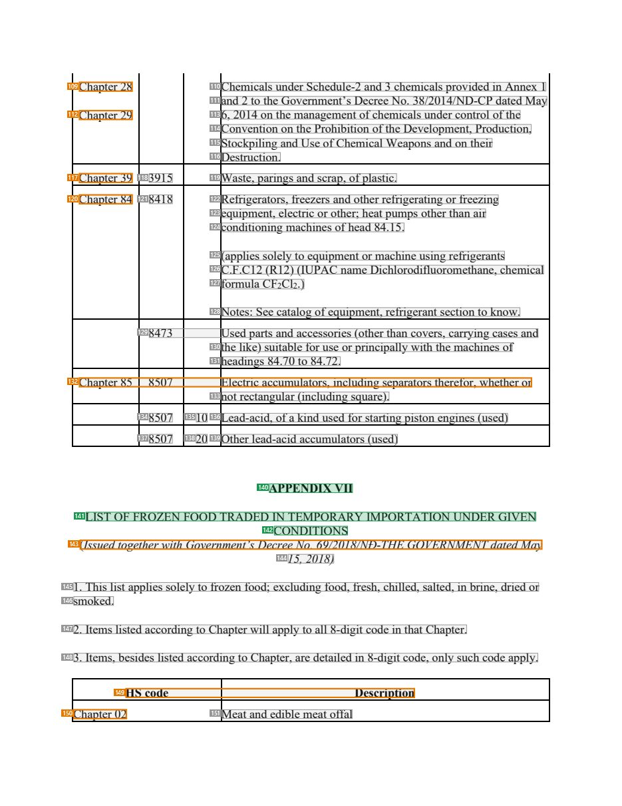

# 088 — `todo10_8/heading_corpus_100/06_dich_song_ngu/088_ND_69-2018_Ngoai_thuong_EN.pdf`

Draft `P7_F1Q_HELDOUT_GOLD_DRAFT_V6`, status `DRAFT_USER_REVIEWED_NOT_APPROVED`, draft sha256 `85eee4faab2f4cc29ac3984ddcf4e1bb6e7a416eb5c097b60762510c8381c82d`. Source sha256 `85e261f79c5e9360f3ca15f32929705b6635d66348d258e25de4287905ffe385`. [Back to index](README.md)

Approve or correct with `review-apply` lines: `APPROVE 088 by <reviewer> [because <note>]`, `088 <alias> -> E|R|O because <reason>`.

## Page 1 (FIRST)

| # | alias | text | font | draft | flag | rationale |
|---:|---|---|---|---|---|---|
| 1 | L0000:S0 | Unofficial Translation – | 14 B I | **OTHER** | REVIEW_FOCUS | Translation disclaimer &quot;Unofficial Translation –&quot; |
| 2 | L0001:S0 | For Reference Purposes Only | 14 B I | **OTHER** | REVIEW_FOCUS | Translation disclaimer &quot;For Reference Purposes Only&quot; |
| 3 | L0002:S0 | THE GOVERNMENT | 12 B | **OTHER** | REVIEW_FOCUS | Issuer &quot;THE GOVERNMENT&quot; |
| 4 | L0002:S1 | THE SOCIALIST REPUBLIC OF VIETNAM | 12 B | **OTHER** | REVIEW_FOCUS | National name |
| 5 | L0003:S0 | ------- | 12 B | **OTHER** |  | Default: body text, list item, table cell, page number or other non-heading content on this page |
| 6 | L0003:S1 | Independence – Freedom – Happiness | 12 B | **OTHER** | REVIEW_FOCUS | National motto |
| 7 | L0004:S0 | ------------------- | 12 B | **OTHER** |  | Default: body text, list item, table cell, page number or other non-heading content on this page |
| 8 | L0005:S0 | No. 69/2018/ND-CP Hanoi, May 15, 2018 | 12 I | **OTHER** | REVIEW_FOCUS | Decree number, place and date |
| 9 | L0006:S0 | DECREE | 12 B | **ESTABLISHES** |  | Document type title &quot;DECREE&quot; |
| 10 | L0007:S0 | ON GUIDELINES FOR THE LAW ON FOREIGN TRADE MANAGEMENT | 12 | **ESTABLISHES** |  | Document title &quot;ON GUIDELINES FOR THE LAW ON FOREIGN TRADE MANAGEMENT&quot; |
| 11 | L0008:S0 | Pursuant to the Law on Government Organization dated June 19, 2015; | 12 I | **OTHER** |  | Default: body text, list item, table cell, page number or other non-heading content on this page |
| 12 | L0009:S0 | Pursuant to the Law on Commerce dated June 14, 2005; | 12 I | **OTHER** |  | Default: body text, list item, table cell, page number or other non-heading content on this page |
| 13 | L0010:S0 | Pursuant to the Law on Foreign Trade Management dated June 12, 2017; | 12 I | **OTHER** |  | Default: body text, list item, table cell, page number or other non-heading content on this page |
| 14 | L0011:S0 | Pursuant to the Law on Investment dated November 26, 2014 and the Law on the amendments to | 12 I | **OTHER** |  | Default: body text, list item, table cell, page number or other non-heading content on this page |
| 15 | L0012:S0 | Article 6 and Appendix 4 in terms of the list of conditional lines of business of Law on | 12 I | **OTHER** |  | Default: body text, list item, table cell, page number or other non-heading content on this page |
| 16 | L0013:S0 | Investment; | 12 I | **OTHER** |  | Default: body text, list item, table cell, page number or other non-heading content on this page |
| 17 | L0014:S0 | At the request of the Minister of Industry and Trade; | 12 I | **OTHER** |  | Default: body text, list item, table cell, page number or other non-heading content on this page |
| 18 | L0015:S0 | The Government promulgates a Decree on guidelines for the Law on Foreign Trade | 12 I | **OTHER** | REVIEW_FOCUS | Promulgation formula restating the title in prose |
| 19 | L0016:S0 | Management. | 12 I | **OTHER** |  | Default: body text, list item, table cell, page number or other non-heading content on this page |
| 20 | L0017:S0 | Chapter I | 12 B | **ESTABLISHES** |  | Chapter label &quot;Chapter I&quot; |
| 21 | L0018:S0 | GENERAL PROVISIONS | 12 B | **ESTABLISHES** |  | Chapter title &quot;GENERAL PROVISIONS&quot; |
| 22 | L0019:S0 | Article 1. Scope | 12 B | **ESTABLISHES** |  | Article heading &quot;Article 1. Scope&quot; |
| 23 | L0020:S0 | 1. This Decree provides guidelines for the Law on Commerce and the Law on Foreign Trade | 12 | **OTHER** |  | Default: body text, list item, table cell, page number or other non-heading content on this page |
| 24 | L0021:S0 | Management in terms of: | 12 | **OTHER** |  | Default: body text, list item, table cell, page number or other non-heading content on this page |
| 25 | L0022:S0 | a) international exchange of goods in the forms of the export and import; temporary importation; | 12 | **OTHER** |  | Default: body text, list item, table cell, page number or other non-heading content on this page |
| 26 | L0023:S0 | temporary exportation temporary exportation; merchanting trade; transit and other activities | 12 | **OTHER** |  | Default: body text, list item, table cell, page number or other non-heading content on this page |
| 27 | L0024:S0 | related to the international exchange of goods in accordance with regulations of Vietnam law and | 12 | **OTHER** |  | Default: body text, list item, table cell, page number or other non-heading content on this page |
| 28 | L0025:S0 | international treaties to which the Socialist Republic of Vietnam is a signatory. | 12 | **OTHER** |  | Default: body text, list item, table cell, page number or other non-heading content on this page |
| 29 | L0026:S0 | b) dealing with disputes related to the imposition of measures for foreign trade management. | 12 | **OTHER** |  | Default: body text, list item, table cell, page number or other non-heading content on this page |
| 30 | L0027:S0 | 2. Personal belongings; baggage; goods serving the need of individuals with diplomatic status; | 12 | **OTHER** |  | Default: body text, list item, table cell, page number or other non-heading content on this page |
| 31 | L0028:S0 | gifts, donations, sample goods shall be regulated by the Government and the Prime Minister. | 12 | **OTHER** |  | Default: body text, list item, table cell, page number or other non-heading content on this page |
| 32 | L0029:S0 | Article 2. Regulated entities | 12 B | **ESTABLISHES** |  | Article heading &quot;Article 2. Regulated entities&quot; |

**OTHER rows to check for a missed heading on page 1** (body size 12pt; bold or ≥ body+1pt, ≤ 12 words): #1 `L0000:S0` Unofficial Translation – (14 B I), #2 `L0001:S0` For Reference Purposes Only (14 B I), #3 `L0002:S0` THE GOVERNMENT (12 B), #4 `L0002:S1` THE SOCIALIST REPUBLIC OF VIETNAM (12 B), #5 `L0003:S0` ------- (12 B), #6 `L0003:S1` Independence – Freedom – Happiness (12 B), #7 `L0004:S0` ------------------- (12 B).

## Page 35 (SEEDED_INTERIOR)

| # | alias | text | font | draft | flag | rationale |
|---:|---|---|---|---|---|---|
| 33 | L1096:S0 | 6. Be eligible for export duty or import duty exemption in accordance with regulations of law on | 12 | **OTHER** |  | Default: body text, list item, table cell, page number or other non-heading content on this page |
| 34 | L1097:S0 | taxation goods exported for processing, processed imports under the processing contract. | 12 | **OTHER** |  | Default: body text, list item, table cell, page number or other non-heading content on this page |
| 35 | L1098:S0 | 7. Have experts and technicians go abroad to inspect processed products for acceptance. | 12 | **OTHER** |  | Default: body text, list item, table cell, page number or other non-heading content on this page |
| 36 | L1099:S0 | 8. Fulfill tax liability against processed import for local consumption in accordance with | 12 | **OTHER** |  | Default: body text, list item, table cell, page number or other non-heading content on this page |
| 37 | L1100:S0 | instructions of the Ministry of Finance. | 12 | **OTHER** |  | Default: body text, list item, table cell, page number or other non-heading content on this page |
| 38 | L1101:S0 | Chapter VI | 12 B | **ESTABLISHES** |  | Chapter label &quot;Chapter VI&quot; |
| 39 | L1102:S0 | TRADE AGENTS FOR FOREIGN TRADERS | 12 B | **ESTABLISHES** |  | Chapter title &quot;TRADE AGENTS FOR FOREIGN TRADERS&quot; |
| 40 | L1103:S0 | Section 1. TRADE AGENTS FOR FOREIGN TRADERS | 12 B | **ESTABLISHES** |  | Section heading &quot;Section 1. TRADE AGENTS FOR FOREIGN TRADERS&quot; |
| 41 | L1104:S0 | Article 50. TRADE AGENTS FOR FOREIGN TRADERS | 12 B | **ESTABLISHES** |  | Article heading &quot;Article 50. ...&quot; |
| 42 | L1105:S0 | 1. A trader may act as a trade agent for foreign traders, except for goods under the list of | 12 | **OTHER** |  | Default: body text, list item, table cell, page number or other non-heading content on this page |
| 43 | L1106:S0 | prohibited or suspended exports and imports. In case of exported goods and imported goods | 12 | **OTHER** |  | Default: body text, list item, table cell, page number or other non-heading content on this page |
| 44 | L1107:S0 | requiring license, the trader may only enter into an agency agreement after obtaining a license | 12 | **OTHER** |  | Default: body text, list item, table cell, page number or other non-heading content on this page |
| 45 | L1108:S0 | issued by the Ministry or ministerial-level agency. | 12 | **OTHER** |  | Default: body text, list item, table cell, page number or other non-heading content on this page |
| 46 | L1109:S0 | 2. If, as required by laws and regulations, an agent and a principal may only enter into an agency | 12 | **OTHER** |  | Default: body text, list item, table cell, page number or other non-heading content on this page |
| 47 | L1110:S0 | agreement associated with given category of good or service, the trader must comply with such | 12 | **OTHER** |  | Default: body text, list item, table cell, page number or other non-heading content on this page |
| 48 | L1111:S0 | law or regulation. | 12 | **OTHER** |  | Default: body text, list item, table cell, page number or other non-heading content on this page |
| 49 | L1112:S0 | 3. The purchase agent shall require the foreign trader to make a bank transfer payment in freely | 12 | **OTHER** |  | Default: body text, list item, table cell, page number or other non-heading content on this page |
| 50 | L1113:S0 | convertible foreign currency to purchase goods under the agency agreement | 12 | **OTHER** |  | Default: body text, list item, table cell, page number or other non-heading content on this page |
| 51 | L1114:S0 | 4. The purchase agent shall register, declare and pay taxes and other financial obligations as to | 12 | **OTHER** |  | Default: body text, list item, table cell, page number or other non-heading content on this page |
| 52 | L1115:S0 | the goods under the agency agreement and related to the business as per the law. | 12 | **OTHER** |  | Default: body text, list item, table cell, page number or other non-heading content on this page |
| 53 | L1116:S0 | Article 51. Tax liability | 12 B | **ESTABLISHES** |  | Article heading &quot;Article 51. Tax liability&quot; |
| 54 | L1117:S0 | 1. Goods under agency agreement concluded with a foreign trader are liable to taxes and other | 12 | **OTHER** |  | Default: body text, list item, table cell, page number or other non-heading content on this page |
| 55 | L1118:S0 | financial obligations as prescribed in Vietnam’s law. | 12 | **OTHER** |  | Default: body text, list item, table cell, page number or other non-heading content on this page |
| 56 | L1119:S0 | 2. The Vietnamese trader shall register, declare and pay taxes and other financial obligations as | 12 | **OTHER** |  | Default: body text, list item, table cell, page number or other non-heading content on this page |
| 57 | L1120:S0 | to the goods under the agency agreement and related to the business as per the law. | 12 | **OTHER** |  | Default: body text, list item, table cell, page number or other non-heading content on this page |
| 58 | L1121:S0 | Article 52. Export or import procedures under agency agreement | 12 B | **ESTABLISHES** |  | Article heading &quot;Article 52. ...&quot; |
| 59 | L1122:S0 | Procedures for export or import of goods under agency agreement concluded with the foreign | 12 | **OTHER** |  | Default: body text, list item, table cell, page number or other non-heading content on this page |
| 60 | L1123:S0 | trader shall be done in accordance with regulations on exported goods and imported goods as | 12 | **OTHER** |  | Default: body text, list item, table cell, page number or other non-heading content on this page |
| 61 | L1124:S0 | prescribed in this Decree. | 12 | **OTHER** |  | Default: body text, list item, table cell, page number or other non-heading content on this page |
| 62 | L1125:S0 | Article 53. Return of goods | 12 B | **ESTABLISHES** |  | Article heading &quot;Article 53. Return of goods&quot; |

**OTHER rows to check for a missed heading on page 35** (body size 12pt; bold or ≥ body+1pt, ≤ 12 words): none.

## Page 60 (SEEDED_INTERIOR)

| # | alias | text | font | draft | flag | rationale |
|---:|---|---|---|---|---|---|
| 63 | L1952:S0 | 8 Medicines not granted marketing authorization in | 12 | **OTHER** |  | Default: body text, list item, table cell, page number or other non-heading content on this page |
| 64 | L1952:S1 | Import license. | 12 | **OTHER** |  | Default: body text, list item, table cell, page number or other non-heading content on this page |
| 65 | L1953:S0 | Vietnam. | 12 | **OTHER** |  | Default: body text, list item, table cell, page number or other non-heading content on this page |
| 66 | L1954:S0 | 9 Medicinal materials not granted marketing Import license. | 12 | **OTHER** |  | Default: body text, list item, table cell, page number or other non-heading content on this page |
| 67 | L1955:S0 | authorization in Vietnam, other than medicinal | 12 | **OTHER** |  | Default: body text, list item, table cell, page number or other non-heading content on this page |
| 68 | L1956:S0 | materials put under special control. | 12 | **OTHER** |  | Default: body text, list item, table cell, page number or other non-heading content on this page |
| 69 | L1957:S0 | 10 Reference materials, packages in physical contact | 12 | **OTHER** |  | Default: body text, list item, table cell, page number or other non-heading content on this page |
| 70 | L1957:S1 | Import license. | 12 | **OTHER** |  | Default: body text, list item, table cell, page number or other non-heading content on this page |
| 71 | L1958:S0 | with medicinal products. | 12 | **OTHER** |  | Default: body text, list item, table cell, page number or other non-heading content on this page |
| 72 | L1959:S0 | 11 Imported food under management of the Ministry of | 12 | **OTHER** |  | Default: body text, list item, table cell, page number or other non-heading content on this page |
| 73 | L1959:S1 | Declaration of conformity, declaration | 12 | **OTHER** |  | Default: body text, list item, table cell, page number or other non-heading content on this page |
| 74 | L1960:S0 | Health as prescribed in laws and regulations on food | 12 | **OTHER** |  | Default: body text, list item, table cell, page number or other non-heading content on this page |
| 75 | L1960:S1 | of conformity with food safety and | 12 | **OTHER** |  | Default: body text, list item, table cell, page number or other non-heading content on this page |
| 76 | L1961:S0 | safety. state inspection. | 12 | **OTHER** |  | Default: body text, list item, table cell, page number or other non-heading content on this page |
| 77 | L1962:S0 | 12 Medical equipment not granted marketing | 12 | **OTHER** |  | Default: body text, list item, table cell, page number or other non-heading content on this page |
| 78 | L1962:S1 | Import license. | 12 | **OTHER** |  | Default: body text, list item, table cell, page number or other non-heading content on this page |
| 79 | L1963:S0 | authorization for scientific research or testing or | 12 | **OTHER** |  | Default: body text, list item, table cell, page number or other non-heading content on this page |
| 80 | L1964:S0 | instructions for use, or repairs of medical equipment. | 12 | **OTHER** |  | Default: body text, list item, table cell, page number or other non-heading content on this page |
| 81 | L1965:S0 | 13 Medical equipment not granted marketing Import license. | 12 | **OTHER** |  | Default: body text, list item, table cell, page number or other non-heading content on this page |
| 82 | L1966:S0 | authorization for purpose of aid. | 12 | **OTHER** |  | Default: body text, list item, table cell, page number or other non-heading content on this page |
| 83 | L1967:S0 | 14 Medical equipment not granted import marketing | 12 | **OTHER** |  | Default: body text, list item, table cell, page number or other non-heading content on this page |
| 84 | L1967:S1 | Import license. | 12 | **OTHER** |  | Default: body text, list item, table cell, page number or other non-heading content on this page |
| 85 | L1968:S0 | authorization for individual therapy. | 12 | **OTHER** |  | Default: body text, list item, table cell, page number or other non-heading content on this page |
| 86 | L1969:S0 | 15 Chemicals, preparations imported for research. | 12 | **OTHER** |  | Default: body text, list item, table cell, page number or other non-heading content on this page |
| 87 | L1969:S1 | Import license. | 12 | **OTHER** |  | Default: body text, list item, table cell, page number or other non-heading content on this page |
| 88 | L1970:S0 | 16 Preparations imported for purpose of aid or other | 12 | **OTHER** |  | Default: body text, list item, table cell, page number or other non-heading content on this page |
| 89 | L1970:S1 | Import license. | 12 | **OTHER** |  | Default: body text, list item, table cell, page number or other non-heading content on this page |
| 90 | L1971:S0 | particular purposes (gifts or no product or method | 12 | **OTHER** |  | Default: body text, list item, table cell, page number or other non-heading content on this page |
| 91 | L1972:S0 | suitable for the need of importer). | 12 | **OTHER** |  | Default: body text, list item, table cell, page number or other non-heading content on this page |
| 92 | L1973:S0 | 17 Cosmetics. Announcing standards. | 12 | **OTHER** |  | Default: body text, list item, table cell, page number or other non-heading content on this page |
| 93 | L1974:S0 | VIII. LIST OF EXPORTED AND IMPORTED GOODS REQUIRING LICENSES AND | 12 B | **ESTABLISHES** |  | Appendix part heading &quot;VIII. LIST OF EXPORTED AND IMPORTED GOODS ...&quot; line 1 (bold) |
| 94 | L1975:S0 | UNDER GIVEN CONDITIONS SUBJECT TO SPECIFLIZED MANAGEMENT OF THE | 12 B | **ESTABLISHES** |  | Appendix part heading line 2 |
| 95 | L1976:S0 | STATE BANK OF VIETNAM | 12 B | **ESTABLISHES** |  | Appendix part heading line 3 |
| 96 | L1977:S0 | A | 12 B | **OTHER** | REVIEW_FOCUS | Table group label &quot;A&quot; |
| 97 | L1977:S1 | Exported goods | 12 B | **OTHER** | REVIEW_FOCUS | Table column label &quot;Exported goods&quot; |
| 98 | L1977:S2 | Mode of management | 12 B | **OTHER** | REVIEW_FOCUS | Table column label &quot;Mode of management&quot; |
| 99 | L1978:S0 | 1 Raw gold. | 12 | **OTHER** |  | Default: body text, list item, table cell, page number or other non-heading content on this page |
| 100 | L1978:S1 | Export license. | 12 | **OTHER** |  | Default: body text, list item, table cell, page number or other non-heading content on this page |
| 101 | L1979:S0 | B | 12 B | **OTHER** | REVIEW_FOCUS | Table group label &quot;B&quot; |
| 102 | L1979:S1 | Imported goods | 12 B | **OTHER** | REVIEW_FOCUS | Table column label &quot;Imported goods&quot; |
| 103 | L1979:S2 | Mode of management | 12 B | **OTHER** | REVIEW_FOCUS | Table column label |
| 104 | L1980:S0 | 1 Raw gold. | 12 | **OTHER** |  | Default: body text, list item, table cell, page number or other non-heading content on this page |
| 105 | L1980:S1 | Import license. | 12 | **OTHER** |  | Default: body text, list item, table cell, page number or other non-heading content on this page |
| 106 | L1981:S0 | APPENDIX IV | 12 B | **ESTABLISHES** |  | Appendix label &quot;APPENDIX IV&quot; (bold, centred) |
| 107 | L1982:S0 | LIST OF GOODS POSING THREATS TO NATIONAL DEFENSE AND SECURITY | 12 | **ESTABLISHES** |  | Appendix title &quot;LIST OF GOODS POSING THREATS TO NATIONAL DEFENSE AND SECURITY&quot; |
| 108 | L1983:S0 | (Issued together with Government&#39;s Decree No. 69/2018/ND-CP dated May 15, 2018) | 12 I | **OTHER** | REVIEW_FOCUS | Attachment note &quot;(Issued together with ...)&quot; |

**OTHER rows to check for a missed heading on page 60** (body size 12pt; bold or ≥ body+1pt, ≤ 12 words): #96 `L1977:S0` A (12 B), #97 `L1977:S1` Exported goods (12 B), #98 `L1977:S2` Mode of management (12 B), #101 `L1979:S0` B (12 B), #102 `L1979:S1` Imported goods (12 B), #103 `L1979:S2` Mode of management (12 B).

## Page 64 (TARGETED_STRUCTURE)

| # | alias | text | font | draft | flag | rationale |
|---:|---|---|---|---|---|---|
| 109 | L2088:S0 | Chapter 28 | 12 | **OTHER** | REVIEW_FOCUS | Table cell &quot;Chapter 28&quot; (HS chapter code in a goods table, not a document chapter) |
| 110 | L2088:S1 | Chemicals under Schedule-2 and 3 chemicals provided in Annex 1 | 12 | **OTHER** |  | Default: body text, list item, table cell, page number or other non-heading content on this page |
| 111 | L2089:S0 | and 2 to the Government’s Decree No. 38/2014/ND-CP dated May | 12 | **OTHER** |  | Default: body text, list item, table cell, page number or other non-heading content on this page |
| 112 | L2090:S0 | Chapter 29 | 12 | **OTHER** | REVIEW_FOCUS | Table cell &quot;Chapter 29&quot; |
| 113 | L2090:S1 | 6, 2014 on the management of chemicals under control of the | 12 | **OTHER** |  | Default: body text, list item, table cell, page number or other non-heading content on this page |
| 114 | L2091:S0 | Convention on the Prohibition of the Development, Production, | 12 | **OTHER** |  | Default: body text, list item, table cell, page number or other non-heading content on this page |
| 115 | L2092:S0 | Stockpiling and Use of Chemical Weapons and on their | 12 | **OTHER** |  | Default: body text, list item, table cell, page number or other non-heading content on this page |
| 116 | L2093:S0 | Destruction. | 12 | **OTHER** |  | Default: body text, list item, table cell, page number or other non-heading content on this page |
| 117 | L2094:S0 | Chapter 39 | 12 | **OTHER** | REVIEW_FOCUS | Table cell &quot;Chapter 39&quot; |
| 118 | L2094:S1 | 3915 | 12 | **OTHER** |  | Default: body text, list item, table cell, page number or other non-heading content on this page |
| 119 | L2094:S2 | Waste, parings and scrap, of plastic. | 12 | **OTHER** |  | Default: body text, list item, table cell, page number or other non-heading content on this page |
| 120 | L2095:S0 | Chapter 84 | 12 | **OTHER** | REVIEW_FOCUS | Table cell &quot;Chapter 84&quot; |
| 121 | L2095:S1 | 8418 | 12 | **OTHER** |  | Default: body text, list item, table cell, page number or other non-heading content on this page |
| 122 | L2095:S2 | Refrigerators, freezers and other refrigerating or freezing | 12 | **OTHER** |  | Default: body text, list item, table cell, page number or other non-heading content on this page |
| 123 | L2096:S0 | equipment, electric or other; heat pumps other than air | 12 | **OTHER** |  | Default: body text, list item, table cell, page number or other non-heading content on this page |
| 124 | L2097:S0 | conditioning machines of head 84.15. | 12 | **OTHER** |  | Default: body text, list item, table cell, page number or other non-heading content on this page |
| 125 | L2098:S0 | (applies solely to equipment or machine using refrigerants | 12 | **OTHER** |  | Default: body text, list item, table cell, page number or other non-heading content on this page |
| 126 | L2099:S0 | C.F.C12 (R12) (IUPAC name Dichlorodifluoromethane, chemical | 12 | **OTHER** |  | Default: body text, list item, table cell, page number or other non-heading content on this page |
| 127 | L2100:S0 | formula CF2Cl2.) | 12 | **OTHER** |  | Default: body text, list item, table cell, page number or other non-heading content on this page |
| 128 | L2101:S0 | Notes: See catalog of equipment, refrigerant section to know. | 12 | **OTHER** |  | Default: body text, list item, table cell, page number or other non-heading content on this page |
| 129 | L2102:S0 | 8473 Used parts and accessories (other than covers, carrying cases and | 12 | **OTHER** |  | Default: body text, list item, table cell, page number or other non-heading content on this page |
| 130 | L2103:S0 | the like) suitable for use or principally with the machines of | 12 | **OTHER** |  | Default: body text, list item, table cell, page number or other non-heading content on this page |
| 131 | L2104:S0 | headings 84.70 to 84.72. | 12 | **OTHER** |  | Default: body text, list item, table cell, page number or other non-heading content on this page |
| 132 | L2105:S0 | Chapter 85 8507 Electric accumulators, including separators therefor, whether or | 12 | **OTHER** | REVIEW_FOCUS | Table row &quot;Chapter 85 8507 ...&quot; |
| 133 | L2106:S0 | not rectangular (including square). | 12 | **OTHER** |  | Default: body text, list item, table cell, page number or other non-heading content on this page |
| 134 | L2107:S0 | 8507 | 12 | **OTHER** |  | Default: body text, list item, table cell, page number or other non-heading content on this page |
| 135 | L2107:S1 | 10 | 12 | **OTHER** |  | Default: body text, list item, table cell, page number or other non-heading content on this page |
| 136 | L2107:S2 | Lead-acid, of a kind used for starting piston engines (used) | 12 | **OTHER** |  | Default: body text, list item, table cell, page number or other non-heading content on this page |
| 137 | L2108:S0 | 8507 | 12 | **OTHER** |  | Default: body text, list item, table cell, page number or other non-heading content on this page |
| 138 | L2108:S1 | 20 | 12 | **OTHER** |  | Default: body text, list item, table cell, page number or other non-heading content on this page |
| 139 | L2108:S2 | Other lead-acid accumulators (used) | 12 | **OTHER** |  | Default: body text, list item, table cell, page number or other non-heading content on this page |
| 140 | L2109:S0 | APPENDIX VII | 12 B | **ESTABLISHES** |  | Appendix label &quot;APPENDIX VII&quot; |
| 141 | L2110:S0 | LIST OF FROZEN FOOD TRADED IN TEMPORARY IMPORTATION UNDER GIVEN | 12 | **ESTABLISHES** |  | Appendix title line 1 |
| 142 | L2111:S0 | CONDITIONS | 12 | **ESTABLISHES** |  | Appendix title line 2 &quot;CONDITIONS&quot; |
| 143 | L2112:S0 | (Issued together with Government’s Decree No. 69/2018/NĐ-THE GOVERNMENT dated May | 12 I | **OTHER** | REVIEW_FOCUS | Attachment note &quot;(Issued together with ...)&quot; |
| 144 | L2113:S0 | 15, 2018) | 12 I | **OTHER** |  | Default: body text, list item, table cell, page number or other non-heading content on this page |
| 145 | L2114:S0 | 1. This list applies solely to frozen food; excluding food, fresh, chilled, salted, in brine, dried or | 12 | **OTHER** |  | Default: body text, list item, table cell, page number or other non-heading content on this page |
| 146 | L2115:S0 | smoked. | 12 | **OTHER** |  | Default: body text, list item, table cell, page number or other non-heading content on this page |
| 147 | L2116:S0 | 2. Items listed according to Chapter will apply to all 8-digit code in that Chapter. | 12 | **OTHER** |  | Default: body text, list item, table cell, page number or other non-heading content on this page |
| 148 | L2117:S0 | 3. Items, besides listed according to Chapter, are detailed in 8-digit code, only such code apply. | 12 | **OTHER** |  | Default: body text, list item, table cell, page number or other non-heading content on this page |
| 149 | L2118:S0 | HS code Description | 12 B | **OTHER** | REVIEW_FOCUS | Table column labels &quot;HS code Description&quot; |
| 150 | L2119:S0 | Chapter 02 | 12 | **OTHER** | REVIEW_FOCUS | Table cell &quot;Chapter 02&quot; (HS chapter code) |
| 151 | L2119:S1 | Meat and edible meat offal | 12 | **OTHER** |  | Default: body text, list item, table cell, page number or other non-heading content on this page |

**OTHER rows to check for a missed heading on page 64** (body size 12pt; bold or ≥ body+1pt, ≤ 12 words): #149 `L2118:S0` HS code Description (12 B).
