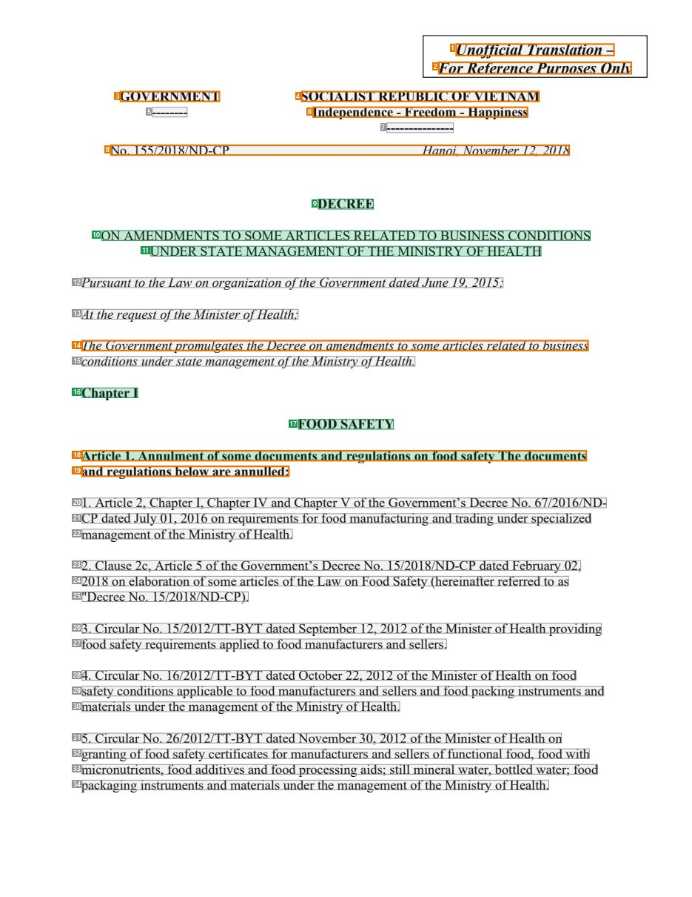
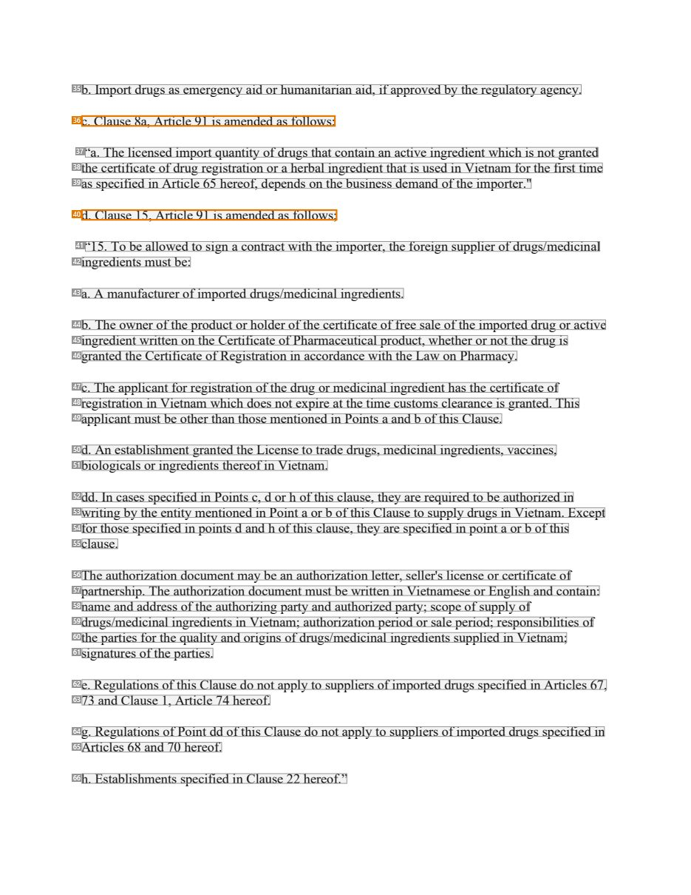
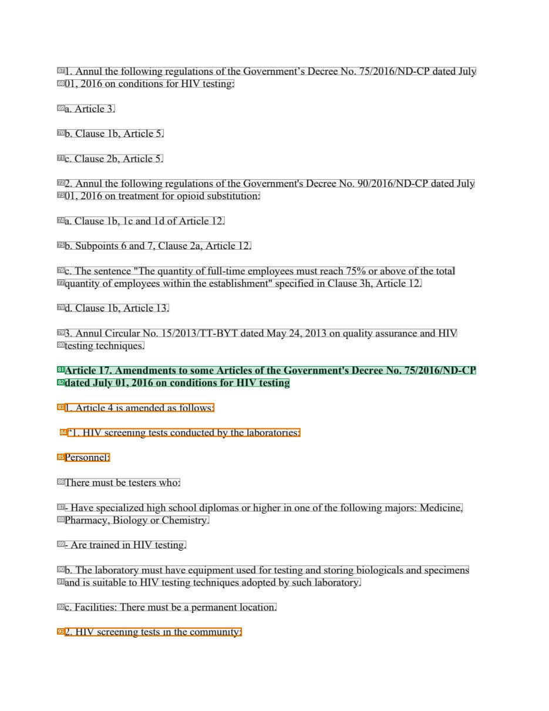

# 090 — `todo10_8/heading_corpus_100/06_dich_song_ngu/090_ND_155-2018_Sua_doi_Bo_Y_te_EN.pdf`

Draft `P7_F1Q_HELDOUT_GOLD_DRAFT_V6`, status `DRAFT_USER_REVIEWED_NOT_APPROVED`, draft sha256 `d8a48e8a00741aa0d141d6f2f1aff0fdaba9c218d27331ba799d8d57cb1c5fe4`. Source sha256 `b1c648b8e97e629a3add667293b467a77f008603b389791633a3454aaa816644`. [Back to index](README.md)

Approve or correct with `review-apply` lines: `APPROVE 090 by <reviewer> [because <note>]`, `090 <alias> -> E|R|O because <reason>`.

## Page 1 (FIRST)

| # | alias | text | font | draft | flag | rationale |
|---:|---|---|---|---|---|---|
| 1 | L0000:S0 | Unofficial Translation – | 14 B I | **OTHER** | REVIEW_FOCUS | Translation disclaimer |
| 2 | L0001:S0 | For Reference Purposes Only | 14 B I | **OTHER** | REVIEW_FOCUS | Translation disclaimer |
| 3 | L0002:S0 | GOVERNMENT | 12 B | **OTHER** | REVIEW_FOCUS | Issuer &quot;GOVERNMENT&quot; |
| 4 | L0002:S1 | SOCIALIST REPUBLIC OF VIETNAM | 12 B | **OTHER** | REVIEW_FOCUS | National name |
| 5 | L0003:S0 | -------- | 12 B | **OTHER** |  | Default: body text, list item, table cell, page number or other non-heading content on this page |
| 6 | L0003:S1 | Independence - Freedom - Happiness | 12 B | **OTHER** | REVIEW_FOCUS | National motto |
| 7 | L0004:S0 | --------------- | 12 B | **OTHER** |  | Default: body text, list item, table cell, page number or other non-heading content on this page |
| 8 | L0005:S0 | No. 155/2018/ND-CP Hanoi, November 12, 2018 | 12 I | **OTHER** | REVIEW_FOCUS | Decree number, place and date |
| 9 | L0006:S0 | DECREE | 12 B | **ESTABLISHES** |  | Document type title &quot;DECREE&quot; |
| 10 | L0007:S0 | ON AMENDMENTS TO SOME ARTICLES RELATED TO BUSINESS CONDITIONS | 12 | **ESTABLISHES** |  | Document title line 1 &quot;ON AMENDMENTS TO SOME ARTICLES RELATED TO BUSINESS CONDITIONS&quot; |
| 11 | L0008:S0 | UNDER STATE MANAGEMENT OF THE MINISTRY OF HEALTH | 12 | **ESTABLISHES** |  | Document title line 2 &quot;UNDER STATE MANAGEMENT OF THE MINISTRY OF HEALTH&quot; |
| 12 | L0009:S0 | Pursuant to the Law on organization of the Government dated June 19, 2015; | 12 I | **OTHER** |  | Default: body text, list item, table cell, page number or other non-heading content on this page |
| 13 | L0010:S0 | At the request of the Minister of Health; | 12 I | **OTHER** |  | Default: body text, list item, table cell, page number or other non-heading content on this page |
| 14 | L0011:S0 | The Government promulgates the Decree on amendments to some articles related to business | 12 I | **OTHER** | REVIEW_FOCUS | Promulgation formula restating the title in prose |
| 15 | L0012:S0 | conditions under state management of the Ministry of Health. | 12 I | **OTHER** |  | Default: body text, list item, table cell, page number or other non-heading content on this page |
| 16 | L0013:S0 | Chapter I | 12 B | **ESTABLISHES** |  | Chapter label &quot;Chapter I&quot; |
| 17 | L0014:S0 | FOOD SAFETY | 12 B | **ESTABLISHES** |  | Chapter title &quot;FOOD SAFETY&quot; |
| 18 | L0015:S0 | Article 1. Annulment of some documents and regulations on food safety The documents | 12 B | **ESTABLISHES** | REVIEW_FOCUS | Article heading &quot;Article 1. Annulment of some documents and regulations on food safety&quot; merged with the bold lead sentence &quot;T… |
| 19 | L0016:S0 | and regulations below are annulled: | 12 B | **OTHER** | REVIEW_FOCUS | Bold lead sentence continuation &quot;and regulations below are annulled:&quot; (article body, not heading wording) |
| 20 | L0017:S0 | 1. Article 2, Chapter I, Chapter IV and Chapter V of the Government’s Decree No. 67/2016/ND- | 12 | **OTHER** |  | Default: body text, list item, table cell, page number or other non-heading content on this page |
| 21 | L0018:S0 | CP dated July 01, 2016 on requirements for food manufacturing and trading under specialized | 12 | **OTHER** |  | Default: body text, list item, table cell, page number or other non-heading content on this page |
| 22 | L0019:S0 | management of the Ministry of Health. | 12 | **OTHER** |  | Default: body text, list item, table cell, page number or other non-heading content on this page |
| 23 | L0020:S0 | 2. Clause 2c, Article 5 of the Government’s Decree No. 15/2018/ND-CP dated February 02, | 12 | **OTHER** |  | Default: body text, list item, table cell, page number or other non-heading content on this page |
| 24 | L0021:S0 | 2018 on elaboration of some articles of the Law on Food Safety (hereinafter referred to as | 12 | **OTHER** |  | Default: body text, list item, table cell, page number or other non-heading content on this page |
| 25 | L0022:S0 | &quot;Decree No. 15/2018/ND-CP). | 12 | **OTHER** |  | Default: body text, list item, table cell, page number or other non-heading content on this page |
| 26 | L0023:S0 | 3. Circular No. 15/2012/TT-BYT dated September 12, 2012 of the Minister of Health providing | 12 | **OTHER** |  | Default: body text, list item, table cell, page number or other non-heading content on this page |
| 27 | L0024:S0 | food safety requirements applied to food manufacturers and sellers. | 12 | **OTHER** |  | Default: body text, list item, table cell, page number or other non-heading content on this page |
| 28 | L0025:S0 | 4. Circular No. 16/2012/TT-BYT dated October 22, 2012 of the Minister of Health on food | 12 | **OTHER** |  | Default: body text, list item, table cell, page number or other non-heading content on this page |
| 29 | L0026:S0 | safety conditions applicable to food manufacturers and sellers and food packing instruments and | 12 | **OTHER** |  | Default: body text, list item, table cell, page number or other non-heading content on this page |
| 30 | L0027:S0 | materials under the management of the Ministry of Health. | 12 | **OTHER** |  | Default: body text, list item, table cell, page number or other non-heading content on this page |
| 31 | L0028:S0 | 5. Circular No. 26/2012/TT-BYT dated November 30, 2012 of the Minister of Health on | 12 | **OTHER** |  | Default: body text, list item, table cell, page number or other non-heading content on this page |
| 32 | L0029:S0 | granting of food safety certificates for manufacturers and sellers of functional food, food with | 12 | **OTHER** |  | Default: body text, list item, table cell, page number or other non-heading content on this page |
| 33 | L0030:S0 | micronutrients, food additives and food processing aids; still mineral water, bottled water; food | 12 | **OTHER** |  | Default: body text, list item, table cell, page number or other non-heading content on this page |
| 34 | L0031:S0 | packaging instruments and materials under the management of the Ministry of Health. | 12 | **OTHER** |  | Default: body text, list item, table cell, page number or other non-heading content on this page |

**OTHER rows to check for a missed heading on page 1** (body size 12pt; bold or ≥ body+1pt, ≤ 12 words): #1 `L0000:S0` Unofficial Translation – (14 B I), #2 `L0001:S0` For Reference Purposes Only (14 B I), #3 `L0002:S0` GOVERNMENT (12 B), #4 `L0002:S1` SOCIALIST REPUBLIC OF VIETNAM (12 B), #5 `L0003:S0` -------- (12 B), #6 `L0003:S1` Independence - Freedom - Happiness (12 B), #7 `L0004:S0` --------------- (12 B), #19 `L0016:S0` and regulations below are annulled: (12 B).

## Page 24 (SEEDED_INTERIOR)

| # | alias | text | font | draft | flag | rationale |
|---:|---|---|---|---|---|---|
| 35 | L0709:S0 | b. Import drugs as emergency aid or humanitarian aid, if approved by the regulatory agency. | 12 | **OTHER** |  | Default: body text, list item, table cell, page number or other non-heading content on this page |
| 36 | L0710:S0 | c. Clause 8a, Article 91 is amended as follows: | 12 | **OTHER** | REVIEW_FOCUS | Amendment instruction &quot;c. Clause 8a, Article 91 is amended as follows:&quot; (body) |
| 37 | L0711:S0 | “a. The licensed import quantity of drugs that contain an active ingredient which is not granted | 12 | **OTHER** |  | Default: body text, list item, table cell, page number or other non-heading content on this page |
| 38 | L0712:S0 | the certificate of drug registration or a herbal ingredient that is used in Vietnam for the first time | 12 | **OTHER** |  | Default: body text, list item, table cell, page number or other non-heading content on this page |
| 39 | L0713:S0 | as specified in Article 65 hereof, depends on the business demand of the importer.&quot; | 12 | **OTHER** |  | Default: body text, list item, table cell, page number or other non-heading content on this page |
| 40 | L0714:S0 | d. Clause 15, Article 91 is amended as follows; | 12 | **OTHER** | REVIEW_FOCUS | Amendment instruction (body) |
| 41 | L0715:S0 | “15. To be allowed to sign a contract with the importer, the foreign supplier of drugs/medicinal | 12 | **OTHER** |  | Default: body text, list item, table cell, page number or other non-heading content on this page |
| 42 | L0716:S0 | ingredients must be: | 12 | **OTHER** |  | Default: body text, list item, table cell, page number or other non-heading content on this page |
| 43 | L0717:S0 | a. A manufacturer of imported drugs/medicinal ingredients. | 12 | **OTHER** |  | Default: body text, list item, table cell, page number or other non-heading content on this page |
| 44 | L0718:S0 | b. The owner of the product or holder of the certificate of free sale of the imported drug or active | 12 | **OTHER** |  | Default: body text, list item, table cell, page number or other non-heading content on this page |
| 45 | L0719:S0 | ingredient written on the Certificate of Pharmaceutical product, whether or not the drug is | 12 | **OTHER** |  | Default: body text, list item, table cell, page number or other non-heading content on this page |
| 46 | L0720:S0 | granted the Certificate of Registration in accordance with the Law on Pharmacy. | 12 | **OTHER** |  | Default: body text, list item, table cell, page number or other non-heading content on this page |
| 47 | L0721:S0 | c. The applicant for registration of the drug or medicinal ingredient has the certificate of | 12 | **OTHER** |  | Default: body text, list item, table cell, page number or other non-heading content on this page |
| 48 | L0722:S0 | registration in Vietnam which does not expire at the time customs clearance is granted. This | 12 | **OTHER** |  | Default: body text, list item, table cell, page number or other non-heading content on this page |
| 49 | L0723:S0 | applicant must be other than those mentioned in Points a and b of this Clause. | 12 | **OTHER** |  | Default: body text, list item, table cell, page number or other non-heading content on this page |
| 50 | L0724:S0 | d. An establishment granted the License to trade drugs, medicinal ingredients, vaccines, | 12 | **OTHER** |  | Default: body text, list item, table cell, page number or other non-heading content on this page |
| 51 | L0725:S0 | biologicals or ingredients thereof in Vietnam. | 12 | **OTHER** |  | Default: body text, list item, table cell, page number or other non-heading content on this page |
| 52 | L0726:S0 | dd. In cases specified in Points c, d or h of this clause, they are required to be authorized in | 12 | **OTHER** |  | Default: body text, list item, table cell, page number or other non-heading content on this page |
| 53 | L0727:S0 | writing by the entity mentioned in Point a or b of this Clause to supply drugs in Vietnam. Except | 12 | **OTHER** |  | Default: body text, list item, table cell, page number or other non-heading content on this page |
| 54 | L0728:S0 | for those specified in points d and h of this clause, they are specified in point a or b of this | 12 | **OTHER** |  | Default: body text, list item, table cell, page number or other non-heading content on this page |
| 55 | L0729:S0 | clause. | 12 | **OTHER** |  | Default: body text, list item, table cell, page number or other non-heading content on this page |
| 56 | L0730:S0 | The authorization document may be an authorization letter, seller&#39;s license or certificate of | 12 | **OTHER** |  | Default: body text, list item, table cell, page number or other non-heading content on this page |
| 57 | L0731:S0 | partnership. The authorization document must be written in Vietnamese or English and contain: | 12 | **OTHER** |  | Default: body text, list item, table cell, page number or other non-heading content on this page |
| 58 | L0732:S0 | name and address of the authorizing party and authorized party; scope of supply of | 12 | **OTHER** |  | Default: body text, list item, table cell, page number or other non-heading content on this page |
| 59 | L0733:S0 | drugs/medicinal ingredients in Vietnam; authorization period or sale period; responsibilities of | 12 | **OTHER** |  | Default: body text, list item, table cell, page number or other non-heading content on this page |
| 60 | L0734:S0 | the parties for the quality and origins of drugs/medicinal ingredients supplied in Vietnam; | 12 | **OTHER** |  | Default: body text, list item, table cell, page number or other non-heading content on this page |
| 61 | L0735:S0 | signatures of the parties. | 12 | **OTHER** |  | Default: body text, list item, table cell, page number or other non-heading content on this page |
| 62 | L0736:S0 | e. Regulations of this Clause do not apply to suppliers of imported drugs specified in Articles 67, | 12 | **OTHER** |  | Default: body text, list item, table cell, page number or other non-heading content on this page |
| 63 | L0737:S0 | 73 and Clause 1, Article 74 hereof. | 12 | **OTHER** |  | Default: body text, list item, table cell, page number or other non-heading content on this page |
| 64 | L0738:S0 | g. Regulations of Point dd of this Clause do not apply to suppliers of imported drugs specified in | 12 | **OTHER** |  | Default: body text, list item, table cell, page number or other non-heading content on this page |
| 65 | L0739:S0 | Articles 68 and 70 hereof. | 12 | **OTHER** |  | Default: body text, list item, table cell, page number or other non-heading content on this page |
| 66 | L0740:S0 | h. Establishments specified in Clause 22 hereof.” | 12 | **OTHER** |  | Default: body text, list item, table cell, page number or other non-heading content on this page |

**OTHER rows to check for a missed heading on page 24** (body size 12pt; bold or ≥ body+1pt, ≤ 12 words): none.

## Page 62 (SEEDED_INTERIOR)

| # | alias | text | font | draft | flag | rationale |
|---:|---|---|---|---|---|---|
| 67 | L1867:S0 | 1. Annul the following regulations of the Government’s Decree No. 75/2016/ND-CP dated July | 12 | **OTHER** |  | Default: body text, list item, table cell, page number or other non-heading content on this page |
| 68 | L1868:S0 | 01, 2016 on conditions for HIV testing: | 12 | **OTHER** |  | Default: body text, list item, table cell, page number or other non-heading content on this page |
| 69 | L1869:S0 | a. Article 3. | 12 | **OTHER** |  | Default: body text, list item, table cell, page number or other non-heading content on this page |
| 70 | L1870:S0 | b. Clause 1b, Article 5. | 12 | **OTHER** |  | Default: body text, list item, table cell, page number or other non-heading content on this page |
| 71 | L1871:S0 | c. Clause 2b, Article 5. | 12 | **OTHER** |  | Default: body text, list item, table cell, page number or other non-heading content on this page |
| 72 | L1872:S0 | 2. Annul the following regulations of the Government&#39;s Decree No. 90/2016/ND-CP dated July | 12 | **OTHER** |  | Default: body text, list item, table cell, page number or other non-heading content on this page |
| 73 | L1873:S0 | 01, 2016 on treatment for opioid substitution: | 12 | **OTHER** |  | Default: body text, list item, table cell, page number or other non-heading content on this page |
| 74 | L1874:S0 | a. Clause 1b, 1c and 1d of Article 12. | 12 | **OTHER** |  | Default: body text, list item, table cell, page number or other non-heading content on this page |
| 75 | L1875:S0 | b. Subpoints 6 and 7, Clause 2a, Article 12. | 12 | **OTHER** |  | Default: body text, list item, table cell, page number or other non-heading content on this page |
| 76 | L1876:S0 | c. The sentence &quot;The quantity of full-time employees must reach 75% or above of the total | 12 | **OTHER** |  | Default: body text, list item, table cell, page number or other non-heading content on this page |
| 77 | L1877:S0 | quantity of employees within the establishment&quot; specified in Clause 3h, Article 12. | 12 | **OTHER** |  | Default: body text, list item, table cell, page number or other non-heading content on this page |
| 78 | L1878:S0 | d. Clause 1b, Article 13. | 12 | **OTHER** |  | Default: body text, list item, table cell, page number or other non-heading content on this page |
| 79 | L1879:S0 | 3. Annul Circular No. 15/2013/TT-BYT dated May 24, 2013 on quality assurance and HIV | 12 | **OTHER** |  | Default: body text, list item, table cell, page number or other non-heading content on this page |
| 80 | L1880:S0 | testing techniques. | 12 | **OTHER** |  | Default: body text, list item, table cell, page number or other non-heading content on this page |
| 81 | L1881:S0 | Article 17. Amendments to some Articles of the Government&#39;s Decree No. 75/2016/ND-CP | 12 B | **ESTABLISHES** |  | Article heading &quot;Article 17. Amendments to some Articles of the Government&#39;s Decree No. 75/2016/ND-CP&quot; line 1 |
| 82 | L1882:S0 | dated July 01, 2016 on conditions for HIV testing | 12 B | **ESTABLISHES** |  | Article heading line 2 &quot;dated July 01, 2016 on conditions for HIV testing&quot; |
| 83 | L1883:S0 | 1. Article 4 is amended as follows: | 12 | **OTHER** | REVIEW_FOCUS | Amendment instruction &quot;1. Article 4 is amended as follows:&quot; (body) |
| 84 | L1884:S0 | “1. HIV screening tests conducted by the laboratories: | 12 | **OTHER** | REVIEW_FOCUS | Quoted amended clause &quot;1. HIV screening tests conducted by the laboratories:&quot; (quoted content) |
| 85 | L1885:S0 | Personnel: | 12 | **OTHER** | REVIEW_FOCUS | Quoted label &quot;Personnel:&quot; inside the amended clause |
| 86 | L1886:S0 | There must be testers who: | 12 | **OTHER** |  | Default: body text, list item, table cell, page number or other non-heading content on this page |
| 87 | L1887:S0 | - Have specialized high school diplomas or higher in one of the following majors: Medicine, | 12 | **OTHER** |  | Default: body text, list item, table cell, page number or other non-heading content on this page |
| 88 | L1888:S0 | Pharmacy, Biology or Chemistry. | 12 | **OTHER** |  | Default: body text, list item, table cell, page number or other non-heading content on this page |
| 89 | L1889:S0 | - Are trained in HIV testing. | 12 | **OTHER** |  | Default: body text, list item, table cell, page number or other non-heading content on this page |
| 90 | L1890:S0 | b. The laboratory must have equipment used for testing and storing biologicals and specimens | 12 | **OTHER** |  | Default: body text, list item, table cell, page number or other non-heading content on this page |
| 91 | L1891:S0 | and is suitable to HIV testing techniques adopted by such laboratory. | 12 | **OTHER** |  | Default: body text, list item, table cell, page number or other non-heading content on this page |
| 92 | L1892:S0 | c. Facilities: There must be a permanent location. | 12 | **OTHER** |  | Default: body text, list item, table cell, page number or other non-heading content on this page |
| 93 | L1893:S0 | 2. HIV screening tests in the community: | 12 | **OTHER** | REVIEW_FOCUS | Quoted clause &quot;2. HIV screening tests in the community:&quot; |

**OTHER rows to check for a missed heading on page 62** (body size 12pt; bold or ≥ body+1pt, ≤ 12 words): none.
