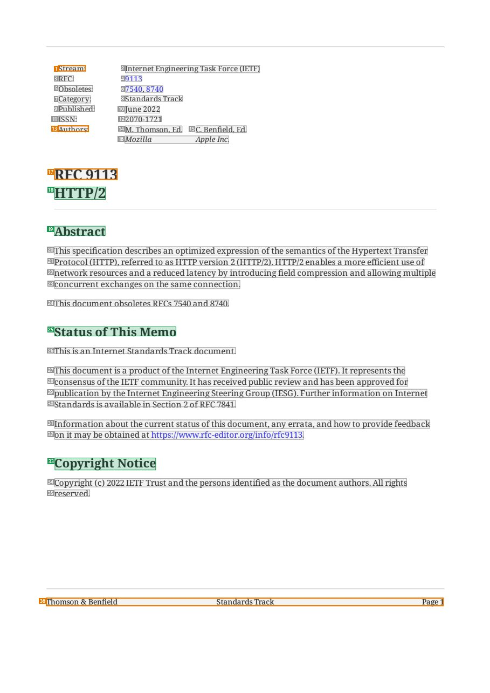
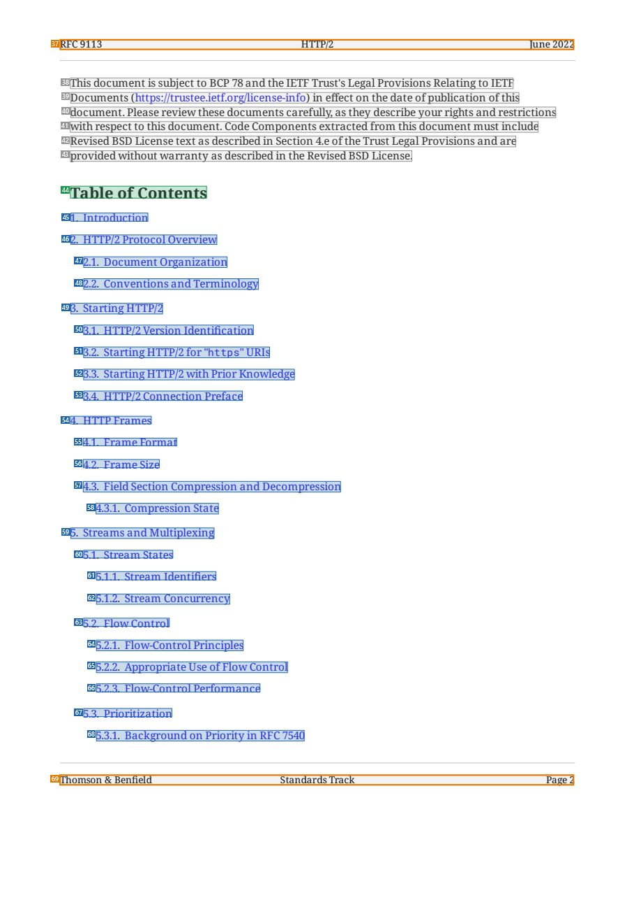
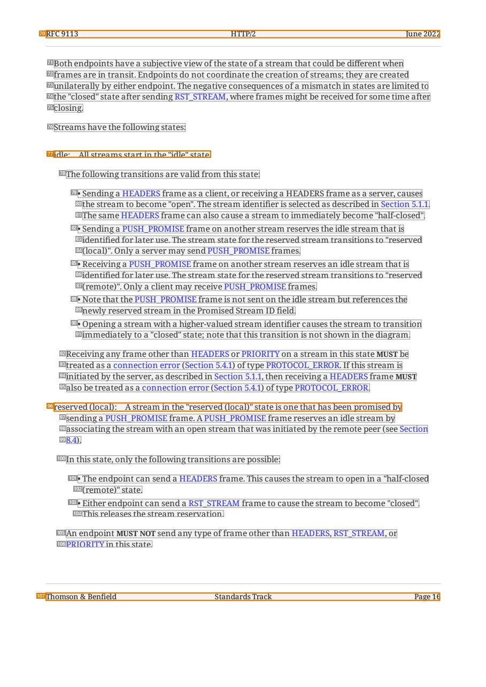
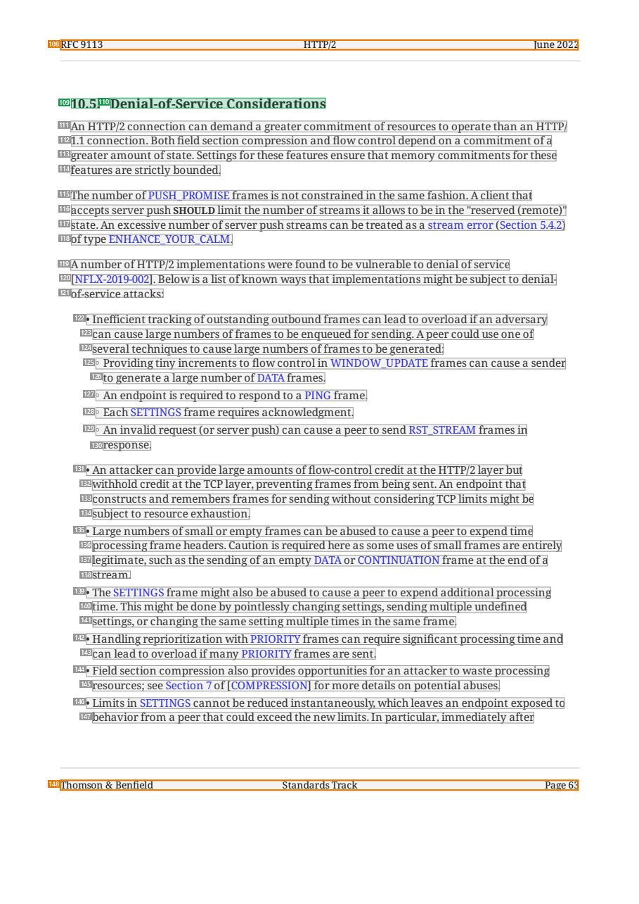

# 094 — `todo10_8/heading_corpus_100/07_system_generated/094_RFC9113_HTTP_2.pdf`

Draft `P7_F1Q_HELDOUT_GOLD_DRAFT_V6`, status `DRAFT_USER_REVIEWED_NOT_APPROVED`, draft sha256 `4d872270e3289effe6f845b09e1cb3e7204a83aebfd75ad3548cdd9aad0330f5`. Source sha256 `8314f1034854548baf26f9912f79c6207299cb0520b31ed25af64889bd1500bc`. [Back to index](README.md)

Approve or correct with `review-apply` lines: `APPROVE 094 by <reviewer> [because <note>]`, `094 <alias> -> E|R|O because <reason>`.

## Page 1 (FIRST)

| # | alias | text | font | draft | flag | rationale |
|---:|---|---|---|---|---|---|
| 1 | L0000:S0 | Stream: | 9 | **OTHER** | REVIEW_FOCUS | Header metadata label &quot;Stream:&quot; |
| 2 | L0000:S1 | Internet Engineering Task Force (IETF) | 9 | **OTHER** |  | Default: body text, list item, table cell, page number or other non-heading content on this page |
| 3 | L0001:S0 | RFC: | 9 | **OTHER** |  | Default: body text, list item, table cell, page number or other non-heading content on this page |
| 4 | L0001:S1 | 9113 | 9 | **OTHER** |  | Default: body text, list item, table cell, page number or other non-heading content on this page |
| 5 | L0002:S0 | Obsoletes: | 9 | **OTHER** |  | Default: body text, list item, table cell, page number or other non-heading content on this page |
| 6 | L0002:S1 | 7540, 8740 | 9 | **OTHER** |  | Default: body text, list item, table cell, page number or other non-heading content on this page |
| 7 | L0003:S0 | Category: | 9 | **OTHER** |  | Default: body text, list item, table cell, page number or other non-heading content on this page |
| 8 | L0003:S1 | Standards Track | 9 | **OTHER** |  | Default: body text, list item, table cell, page number or other non-heading content on this page |
| 9 | L0004:S0 | Published: | 9 | **OTHER** |  | Default: body text, list item, table cell, page number or other non-heading content on this page |
| 10 | L0004:S1 | June 2022 | 9 | **OTHER** |  | Default: body text, list item, table cell, page number or other non-heading content on this page |
| 11 | L0005:S0 | ISSN: | 9 | **OTHER** |  | Default: body text, list item, table cell, page number or other non-heading content on this page |
| 12 | L0005:S1 | 2070-1721 | 9 | **OTHER** |  | Default: body text, list item, table cell, page number or other non-heading content on this page |
| 13 | L0006:S0 | Authors: | 9 | **OTHER** | REVIEW_FOCUS | Header metadata label &quot;Authors:&quot; |
| 14 | L0006:S1 | M. Thomson, Ed. | 9 | **OTHER** |  | Default: body text, list item, table cell, page number or other non-heading content on this page |
| 15 | L0006:S2 | C. Benfield, Ed. | 9 | **OTHER** |  | Default: body text, list item, table cell, page number or other non-heading content on this page |
| 16 | L0007:S0 | Mozilla Apple Inc. | 9 | **OTHER** |  | Default: body text, list item, table cell, page number or other non-heading content on this page |
| 17 | L0008:S0 | RFC 9113 | 17.2 B | **OTHER** | REVIEW_FOCUS | Document number &quot;RFC 9113&quot; above the title — drafted OTHER following the approved SRC-095 Gold convention |
| 18 | L0009:S0 | HTTP/2 | 17.2 B | **ESTABLISHES** |  | Document title &quot;HTTP/2&quot; (bold 17.2) |
| 19 | L0010:S0 | Abstract | 14.4 B | **ESTABLISHES** |  | Front-matter heading &quot;Abstract&quot; |
| 20 | L0011:S0 | This specification describes an optimized expression ofthe semantics ofthe Hypertext Transfer | 10 | **OTHER** |  | Default: body text, list item, table cell, page number or other non-heading content on this page |
| 21 | L0012:S0 | Protocol (HTTP), referred to as HTTP version 2 (HTTP/2). HTTP/2 enables a more efficient use of | 10 | **OTHER** |  | Default: body text, list item, table cell, page number or other non-heading content on this page |
| 22 | L0013:S0 | network resources and a reduced latency by introducing field compression and allowing multiple | 10 | **OTHER** |  | Default: body text, list item, table cell, page number or other non-heading content on this page |
| 23 | L0014:S0 | concurrent exchanges on the same connection. | 10 | **OTHER** |  | Default: body text, list item, table cell, page number or other non-heading content on this page |
| 24 | L0015:S0 | This document obsoletes RFCs 7540 and 8740. | 10 | **OTHER** |  | Default: body text, list item, table cell, page number or other non-heading content on this page |
| 25 | L0016:S0 | Status ofThis Memo | 14.4 B | **ESTABLISHES** |  | Front-matter heading &quot;Status of This Memo&quot; |
| 26 | L0017:S0 | This is an Internet Standards Track document. | 10 | **OTHER** |  | Default: body text, list item, table cell, page number or other non-heading content on this page |
| 27 | L0018:S0 | This document is a product ofthe Internet Engineering Task Force (IETF). It represents the | 10 | **OTHER** |  | Default: body text, list item, table cell, page number or other non-heading content on this page |
| 28 | L0019:S0 | consensus ofthe IETF community. It has received public review and has been approved for | 10 | **OTHER** |  | Default: body text, list item, table cell, page number or other non-heading content on this page |
| 29 | L0020:S0 | publication by the Internet Engineering Steering Group (IESG). Further information on Internet | 10 | **OTHER** |  | Default: body text, list item, table cell, page number or other non-heading content on this page |
| 30 | L0021:S0 | Standards is available in Section 2 ofRFC 7841. | 10 | **OTHER** |  | Default: body text, list item, table cell, page number or other non-heading content on this page |
| 31 | L0022:S0 | Information about the current status ofthis document, any errata, and how to provide feedback | 10 | **OTHER** |  | Default: body text, list item, table cell, page number or other non-heading content on this page |
| 32 | L0023:S0 | on it may be obtained at https://www.rfc-editor.org/info/rfc9113. | 10 | **OTHER** |  | Default: body text, list item, table cell, page number or other non-heading content on this page |
| 33 | L0024:S0 | Copyright Notice | 14.4 B | **ESTABLISHES** |  | Front-matter heading &quot;Copyright Notice&quot; |
| 34 | L0025:S0 | Copyright (c) 2022 IETF Trust and the persons identified as the document authors. All rights | 10 | **OTHER** |  | Default: body text, list item, table cell, page number or other non-heading content on this page |
| 35 | L0026:S0 | reserved. | 10 | **OTHER** |  | Default: body text, list item, table cell, page number or other non-heading content on this page |
| 36 | L0027:S0 | Thomson &amp; Benfield Standards Track Page 1 | 9 | **OTHER** | REVIEW_FOCUS | Running footer |

**OTHER rows to check for a missed heading on page 1** (body size 9pt; bold or ≥ body+1pt, ≤ 12 words): #17 `L0008:S0` RFC 9113 (17.2 B), #20 `L0011:S0` This specification describes an optimized expression ofthe se… (10), #23 `L0014:S0` concurrent exchanges on the same connection. (10), #24 `L0015:S0` This document obsoletes RFCs 7540 and 8740. (10), #26 `L0017:S0` This is an Internet Standards Track document. (10), #29 `L0020:S0` publication by the Internet Engineering Steering Group (IESG… (10), #30 `L0021:S0` Standards is available in Section 2 ofRFC 7841. (10), #32 `L0023:S0` on it may be obtained at https://www.rfc-editor.org/info/rfc… (10), #35 `L0026:S0` reserved. (10).

## Page 2 (TARGETED_STRUCTURE)

| # | alias | text | font | draft | flag | rationale |
|---:|---|---|---|---|---|---|
| 37 | L0028:S0 | RFC 9113 HTTP/2 June 2022 | 9 | **OTHER** | REVIEW_FOCUS | Running header &quot;RFC 9113 HTTP/2 June 2022&quot; |
| 38 | L0029:S0 | This document is subject to BCP 78 and the IETF Trust&#39;s Legal Provisions Relating to IETF | 10 | **OTHER** |  | Default: body text, list item, table cell, page number or other non-heading content on this page |
| 39 | L0030:S0 | Documents (https://trustee.ietf.org/license-info) in effect on the date ofpublication ofthis | 10 | **OTHER** |  | Default: body text, list item, table cell, page number or other non-heading content on this page |
| 40 | L0031:S0 | document. Please review these documents carefully, as they describe your rights and restrictions | 10 | **OTHER** |  | Default: body text, list item, table cell, page number or other non-heading content on this page |
| 41 | L0032:S0 | with respect to this document. Code Components extracted from this document must include | 10 | **OTHER** |  | Default: body text, list item, table cell, page number or other non-heading content on this page |
| 42 | L0033:S0 | Revised BSD License text as described in Section 4.e ofthe Trust Legal Provisions and are | 10 | **OTHER** |  | Default: body text, list item, table cell, page number or other non-heading content on this page |
| 43 | L0034:S0 | provided without warranty as described in the Revised BSD License. | 10 | **OTHER** |  | Default: body text, list item, table cell, page number or other non-heading content on this page |
| 44 | L0035:S0 | Table of Contents | 14.4 B | **ESTABLISHES** |  | Heading &quot;Table of Contents&quot; (bold 14.4) |
| 45 | L0036:S0 | 1. Introduction | 10 | **REPRESENTS** |  | Contents entry (refers to a section heading elsewhere) |
| 46 | L0037:S0 | 2. HTTP/2 Protocol Overview | 10 | **REPRESENTS** |  | Contents entry (refers to a section heading elsewhere) |
| 47 | L0038:S0 | 2.1. Document Organization | 10 | **REPRESENTS** |  | Contents entry (refers to a section heading elsewhere) |
| 48 | L0039:S0 | 2.2. Conventions and Terminology | 10 | **REPRESENTS** |  | Contents entry (refers to a section heading elsewhere) |
| 49 | L0040:S0 | 3. Starting HTTP/2 | 10 | **REPRESENTS** |  | Contents entry (refers to a section heading elsewhere) |
| 50 | L0041:S0 | 3.1. HTTP/2 Version Identification | 10 | **REPRESENTS** |  | Contents entry (refers to a section heading elsewhere) |
| 51 | L0042:S0 | 3.2. Starting HTTP/2 for &quot;htt ps&quot; URIs | 10 | **REPRESENTS** |  | Contents entry (refers to a section heading elsewhere) |
| 52 | L0043:S0 | 3.3. Starting HTTP/2 with Prior Knowledge | 10 | **REPRESENTS** |  | Contents entry (refers to a section heading elsewhere) |
| 53 | L0044:S0 | 3.4. HTTP/2 Connection Preface | 10 | **REPRESENTS** |  | Contents entry (refers to a section heading elsewhere) |
| 54 | L0045:S0 | 4. HTTP Frames | 10 | **REPRESENTS** |  | Contents entry (refers to a section heading elsewhere) |
| 55 | L0046:S0 | 4.1. Frame Format | 10 | **REPRESENTS** |  | Contents entry (refers to a section heading elsewhere) |
| 56 | L0047:S0 | 4.2. Frame Size | 10 | **REPRESENTS** |  | Contents entry (refers to a section heading elsewhere) |
| 57 | L0048:S0 | 4.3. Field Section Compression and Decompression | 10 | **REPRESENTS** |  | Contents entry (refers to a section heading elsewhere) |
| 58 | L0049:S0 | 4.3.1. Compression State | 10 | **REPRESENTS** |  | Contents entry (refers to a section heading elsewhere) |
| 59 | L0050:S0 | 5. Streams and Multiplexing | 10 | **REPRESENTS** |  | Contents entry (refers to a section heading elsewhere) |
| 60 | L0051:S0 | 5.1. Stream States | 10 | **REPRESENTS** |  | Contents entry (refers to a section heading elsewhere) |
| 61 | L0052:S0 | 5.1.1. Stream Identifiers | 10 | **REPRESENTS** |  | Contents entry (refers to a section heading elsewhere) |
| 62 | L0053:S0 | 5.1.2. Stream Concurrency | 10 | **REPRESENTS** |  | Contents entry (refers to a section heading elsewhere) |
| 63 | L0054:S0 | 5.2. Flow Control | 10 | **REPRESENTS** |  | Contents entry (refers to a section heading elsewhere) |
| 64 | L0055:S0 | 5.2.1. Flow-Control Principles | 10 | **REPRESENTS** |  | Contents entry (refers to a section heading elsewhere) |
| 65 | L0056:S0 | 5.2.2. Appropriate Use ofFlow Control | 10 | **REPRESENTS** |  | Contents entry (refers to a section heading elsewhere) |
| 66 | L0057:S0 | 5.2.3. Flow-Control Performance | 10 | **REPRESENTS** |  | Contents entry (refers to a section heading elsewhere) |
| 67 | L0058:S0 | 5.3. Prioritization | 10 | **REPRESENTS** |  | Contents entry (refers to a section heading elsewhere) |
| 68 | L0059:S0 | 5.3.1. Background on Priority in RFC 7540 | 10 | **REPRESENTS** |  | Contents entry (refers to a section heading elsewhere) |
| 69 | L0060:S0 | Thomson &amp; Benfield Standards Track Page 2 | 9 | **OTHER** | REVIEW_FOCUS | Running footer |

**OTHER rows to check for a missed heading on page 2** (body size 10pt; bold or ≥ body+1pt, ≤ 12 words): none.

## Page 16 (SEEDED_INTERIOR)

| # | alias | text | font | draft | flag | rationale |
|---:|---|---|---|---|---|---|
| 70 | L0486:S0 | RFC 9113 HTTP/2 June 2022 | 9 | **OTHER** | REVIEW_FOCUS | Running header |
| 71 | L0487:S0 | Both endpoints have a subjective view ofthe state of a stream that could be different when | 10 | **OTHER** |  | Default: body text, list item, table cell, page number or other non-heading content on this page |
| 72 | L0488:S0 | frames are in transit. Endpoints do not coordinate the creation ofstreams; they are created | 10 | **OTHER** |  | Default: body text, list item, table cell, page number or other non-heading content on this page |
| 73 | L0489:S0 | unilaterally by either endpoint. The negative consequences of a mismatch in states are limited to | 10 | **OTHER** |  | Default: body text, list item, table cell, page number or other non-heading content on this page |
| 74 | L0490:S0 | the &quot;closed&quot; state after sending RST_STREAM, where frames might be received for some time after | 10 | **OTHER** |  | Default: body text, list item, table cell, page number or other non-heading content on this page |
| 75 | L0491:S0 | closing. | 10 | **OTHER** |  | Default: body text, list item, table cell, page number or other non-heading content on this page |
| 76 | L0492:S0 | Streams have the following states: | 10 | **OTHER** |  | Default: body text, list item, table cell, page number or other non-heading content on this page |
| 77 | L0493:S0 | idle: All streams start in the &quot;idle&quot; state. | 10 | **OTHER** | REVIEW_FOCUS | Definition-list term &quot;idle:&quot; run into its definition (state description, not a heading) |
| 78 | L0494:S0 | The following transitions are valid from this state: | 10 | **OTHER** |  | Default: body text, list item, table cell, page number or other non-heading content on this page |
| 79 | L0495:S0 | • Sending a HEADERS frame as a client, or receiving a HEADERS frame as a server, causes | 10 | **OTHER** |  | Default: body text, list item, table cell, page number or other non-heading content on this page |
| 80 | L0496:S0 | the stream to become &quot;open&quot;. The stream identifier is selected as described in Section 5.1.1. | 10 | **OTHER** |  | Default: body text, list item, table cell, page number or other non-heading content on this page |
| 81 | L0497:S0 | The same HEADERS frame can also cause a stream to immediately become &quot;half-closed&quot;. | 10 | **OTHER** |  | Default: body text, list item, table cell, page number or other non-heading content on this page |
| 82 | L0498:S0 | • Sending a PUSH_PROMISE frame on another stream reserves the idle stream that is | 10 | **OTHER** |  | Default: body text, list item, table cell, page number or other non-heading content on this page |
| 83 | L0499:S0 | identified for later use. The stream state for the reserved stream transitions to &quot;reserved | 10 | **OTHER** |  | Default: body text, list item, table cell, page number or other non-heading content on this page |
| 84 | L0500:S0 | (local)&quot;. Only a server may send PUSH_PROMISE frames. | 10 | **OTHER** |  | Default: body text, list item, table cell, page number or other non-heading content on this page |
| 85 | L0501:S0 | • Receiving a PUSH_PROMISE frame on another stream reserves an idle stream that is | 10 | **OTHER** |  | Default: body text, list item, table cell, page number or other non-heading content on this page |
| 86 | L0502:S0 | identified for later use. The stream state for the reserved stream transitions to &quot;reserved | 10 | **OTHER** |  | Default: body text, list item, table cell, page number or other non-heading content on this page |
| 87 | L0503:S0 | (remote)&quot;. Only a client may receive PUSH_PROMISE frames. | 10 | **OTHER** |  | Default: body text, list item, table cell, page number or other non-heading content on this page |
| 88 | L0504:S0 | • Note that the PUSH_PROMISE frame is not sent on the idle stream but references the | 10 | **OTHER** |  | Default: body text, list item, table cell, page number or other non-heading content on this page |
| 89 | L0505:S0 | newly reserved stream in the Promised Stream ID field. | 10 | **OTHER** |  | Default: body text, list item, table cell, page number or other non-heading content on this page |
| 90 | L0506:S0 | • Opening a stream with a higher-valued stream identifier causes the stream to transition | 10 | **OTHER** |  | Default: body text, list item, table cell, page number or other non-heading content on this page |
| 91 | L0507:S0 | immediately to a &quot;closed&quot; state; note that this transition is not shown in the diagram. | 10 | **OTHER** |  | Default: body text, list item, table cell, page number or other non-heading content on this page |
| 92 | L0508:S0 | Receiving any frame other than HEADERS or PRIORITY on a stream in this state MUST be | 10 | **OTHER** |  | Default: body text, list item, table cell, page number or other non-heading content on this page |
| 93 | L0509:S0 | treated as a connection error (Section 5.4.1) oftype PROTOCOL_ERROR. Ifthis stream is | 10 | **OTHER** |  | Default: body text, list item, table cell, page number or other non-heading content on this page |
| 94 | L0510:S0 | initiated by the server, as described in Section 5.1.1, then receiving a HEADERS frame MUST | 10 | **OTHER** |  | Default: body text, list item, table cell, page number or other non-heading content on this page |
| 95 | L0511:S0 | also be treated as a connection error (Section 5.4.1) oftype PROTOCOL_ERROR. | 10 | **OTHER** |  | Default: body text, list item, table cell, page number or other non-heading content on this page |
| 96 | L0512:S0 | reserved (local): A stream in the &quot;reserved (local)&quot; state is one that has been promised by | 10 | **OTHER** | REVIEW_FOCUS | Definition-list term &quot;reserved (local):&quot; run into its definition |
| 97 | L0513:S0 | sending a PUSH_PROMISE frame. A PUSH_PROMISE frame reserves an idle stream by | 10 | **OTHER** |  | Default: body text, list item, table cell, page number or other non-heading content on this page |
| 98 | L0514:S0 | associating the stream with an open stream that was initiated by the remote peer (see Section | 10 | **OTHER** |  | Default: body text, list item, table cell, page number or other non-heading content on this page |
| 99 | L0515:S0 | 8.4). | 10 | **OTHER** |  | Default: body text, list item, table cell, page number or other non-heading content on this page |
| 100 | L0516:S0 | In this state, only the following transitions are possible: | 10 | **OTHER** |  | Default: body text, list item, table cell, page number or other non-heading content on this page |
| 101 | L0517:S0 | • The endpoint can send a HEADERS frame. This causes the stream to open in a &quot;half-closed | 10 | **OTHER** |  | Default: body text, list item, table cell, page number or other non-heading content on this page |
| 102 | L0518:S0 | (remote)&quot; state. | 10 | **OTHER** |  | Default: body text, list item, table cell, page number or other non-heading content on this page |
| 103 | L0519:S0 | • Either endpoint can send a RST_STREAM frame to cause the stream to become &quot;closed&quot;. | 10 | **OTHER** |  | Default: body text, list item, table cell, page number or other non-heading content on this page |
| 104 | L0520:S0 | This releases the stream reservation. | 10 | **OTHER** |  | Default: body text, list item, table cell, page number or other non-heading content on this page |
| 105 | L0521:S0 | An endpoint MUST NOT send any type offrame other than HEADERS, RST_STREAM, or | 10 | **OTHER** |  | Default: body text, list item, table cell, page number or other non-heading content on this page |
| 106 | L0522:S0 | PRIORITY in this state. | 10 | **OTHER** |  | Default: body text, list item, table cell, page number or other non-heading content on this page |
| 107 | L0523:S0 | Thomson &amp; Benfield Standards Track Page 16 | 9 | **OTHER** | REVIEW_FOCUS | Running footer |

**OTHER rows to check for a missed heading on page 16** (body size 10pt; bold or ≥ body+1pt, ≤ 12 words): none.

## Page 63 (SEEDED_INTERIOR)

| # | alias | text | font | draft | flag | rationale |
|---:|---|---|---|---|---|---|
| 108 | L2240:S0 | RFC 9113 HTTP/2 June 2022 | 9 | **OTHER** | REVIEW_FOCUS | Running header |
| 109 | L2241:S0 | 10.5. | 12 B | **ESTABLISHES** |  | Section number &quot;10.5.&quot; (part of the heading) |
| 110 | L2241:S1 | Denial-of-Service Considerations | 12 B | **ESTABLISHES** |  | Section title &quot;Denial-of-Service Considerations&quot; |
| 111 | L2242:S0 | An HTTP/2 connection can demand a greater commitment ofresources to operate than an HTTP/ | 10 | **OTHER** |  | Default: body text, list item, table cell, page number or other non-heading content on this page |
| 112 | L2243:S0 | 1.1 connection. Both field section compression and flow control depend on a commitment of a | 10 | **OTHER** |  | Default: body text, list item, table cell, page number or other non-heading content on this page |
| 113 | L2244:S0 | greater amount ofstate. Settings for these features ensure that memory commitments for these | 10 | **OTHER** |  | Default: body text, list item, table cell, page number or other non-heading content on this page |
| 114 | L2245:S0 | features are strictly bounded. | 10 | **OTHER** |  | Default: body text, list item, table cell, page number or other non-heading content on this page |
| 115 | L2246:S0 | The number ofPUSH_PROMISE frames is not constrained in the same fashion. A client that | 10 | **OTHER** |  | Default: body text, list item, table cell, page number or other non-heading content on this page |
| 116 | L2247:S0 | accepts server push SHOULD limit the number ofstreams it allows to be in the &quot;reserved (remote)&quot; | 10 | **OTHER** |  | Default: body text, list item, table cell, page number or other non-heading content on this page |
| 117 | L2248:S0 | state. An excessive number ofserver push streams can be treated as a stream error (Section 5.4.2) | 10 | **OTHER** |  | Default: body text, list item, table cell, page number or other non-heading content on this page |
| 118 | L2249:S0 | oftype ENHANCE_YOUR_CALM. | 10 | **OTHER** |  | Default: body text, list item, table cell, page number or other non-heading content on this page |
| 119 | L2250:S0 | A number ofHTTP/2 implementations were found to be vulnerable to denial ofservice | 10 | **OTHER** |  | Default: body text, list item, table cell, page number or other non-heading content on this page |
| 120 | L2251:S0 | [NFLX-2019-002]. Below is a list ofknown ways that implementations might be subject to denial- | 10 | **OTHER** |  | Default: body text, list item, table cell, page number or other non-heading content on this page |
| 121 | L2252:S0 | of-service attacks: | 10 | **OTHER** |  | Default: body text, list item, table cell, page number or other non-heading content on this page |
| 122 | L2253:S0 | • Inefficient tracking of outstanding outbound frames can lead to overload if an adversary | 10 | **OTHER** |  | Default: body text, list item, table cell, page number or other non-heading content on this page |
| 123 | L2254:S0 | can cause large numbers offrames to be enqueued for sending. A peer could use one of | 10 | **OTHER** |  | Default: body text, list item, table cell, page number or other non-heading content on this page |
| 124 | L2255:S0 | several techniques to cause large numbers offrames to be generated: | 10 | **OTHER** |  | Default: body text, list item, table cell, page number or other non-heading content on this page |
| 125 | L2256:S0 | ◦ Providing tiny increments to flow control in WINDOW_UPDATE frames can cause a sender | 10 | **OTHER** |  | Default: body text, list item, table cell, page number or other non-heading content on this page |
| 126 | L2257:S0 | to generate a large number ofDATA frames. | 10 | **OTHER** |  | Default: body text, list item, table cell, page number or other non-heading content on this page |
| 127 | L2258:S0 | ◦ An endpoint is required to respond to a PING frame. | 10 | **OTHER** |  | Default: body text, list item, table cell, page number or other non-heading content on this page |
| 128 | L2259:S0 | ◦ Each SETTINGS frame requires acknowledgment. | 10 | **OTHER** |  | Default: body text, list item, table cell, page number or other non-heading content on this page |
| 129 | L2260:S0 | ◦ An invalid request (or server push) can cause a peer to send RST_STREAM frames in | 10 | **OTHER** |  | Default: body text, list item, table cell, page number or other non-heading content on this page |
| 130 | L2261:S0 | response. | 10 | **OTHER** |  | Default: body text, list item, table cell, page number or other non-heading content on this page |
| 131 | L2262:S0 | • An attacker can provide large amounts offlow-control credit at the HTTP/2 layer but | 10 | **OTHER** |  | Default: body text, list item, table cell, page number or other non-heading content on this page |
| 132 | L2263:S0 | withhold credit at the TCP layer, preventing frames from being sent. An endpoint that | 10 | **OTHER** |  | Default: body text, list item, table cell, page number or other non-heading content on this page |
| 133 | L2264:S0 | constructs and remembers frames for sending without considering TCP limits might be | 10 | **OTHER** |  | Default: body text, list item, table cell, page number or other non-heading content on this page |
| 134 | L2265:S0 | subject to resource exhaustion. | 10 | **OTHER** |  | Default: body text, list item, table cell, page number or other non-heading content on this page |
| 135 | L2266:S0 | • Large numbers ofsmall or empty frames can be abused to cause a peer to expend time | 10 | **OTHER** |  | Default: body text, list item, table cell, page number or other non-heading content on this page |
| 136 | L2267:S0 | processing frame headers. Caution is required here as some uses ofsmall frames are entirely | 10 | **OTHER** |  | Default: body text, list item, table cell, page number or other non-heading content on this page |
| 137 | L2268:S0 | legitimate, such as the sending of an empty DATA or CONTINUATION frame at the end of a | 10 | **OTHER** |  | Default: body text, list item, table cell, page number or other non-heading content on this page |
| 138 | L2269:S0 | stream. | 10 | **OTHER** |  | Default: body text, list item, table cell, page number or other non-heading content on this page |
| 139 | L2270:S0 | • The SETTINGS frame might also be abused to cause a peer to expend additional processing | 10 | **OTHER** |  | Default: body text, list item, table cell, page number or other non-heading content on this page |
| 140 | L2271:S0 | time. This might be done by pointlessly changing settings, sending multiple undefined | 10 | **OTHER** |  | Default: body text, list item, table cell, page number or other non-heading content on this page |
| 141 | L2272:S0 | settings, or changing the same setting multiple times in the same frame. | 10 | **OTHER** |  | Default: body text, list item, table cell, page number or other non-heading content on this page |
| 142 | L2273:S0 | • Handling reprioritization with PRIORITY frames can require significant processing time and | 10 | **OTHER** |  | Default: body text, list item, table cell, page number or other non-heading content on this page |
| 143 | L2274:S0 | can lead to overload ifmany PRIORITY frames are sent. | 10 | **OTHER** |  | Default: body text, list item, table cell, page number or other non-heading content on this page |
| 144 | L2275:S0 | • Field section compression also provides opportunities for an attacker to waste processing | 10 | **OTHER** |  | Default: body text, list item, table cell, page number or other non-heading content on this page |
| 145 | L2276:S0 | resources; see Section 7 of [COMPRESSION] for more details on potential abuses. | 10 | **OTHER** |  | Default: body text, list item, table cell, page number or other non-heading content on this page |
| 146 | L2277:S0 | • Limits in SETTINGS cannot be reduced instantaneously, which leaves an endpoint exposed to | 10 | **OTHER** |  | Default: body text, list item, table cell, page number or other non-heading content on this page |
| 147 | L2278:S0 | behavior from a peer that could exceed the new limits. In particular, immediately after | 10 | **OTHER** |  | Default: body text, list item, table cell, page number or other non-heading content on this page |
| 148 | L2279:S0 | Thomson &amp; Benfield Standards Track Page 63 | 9 | **OTHER** | REVIEW_FOCUS | Running footer |

**OTHER rows to check for a missed heading on page 63** (body size 10pt; bold or ≥ body+1pt, ≤ 12 words): none.
